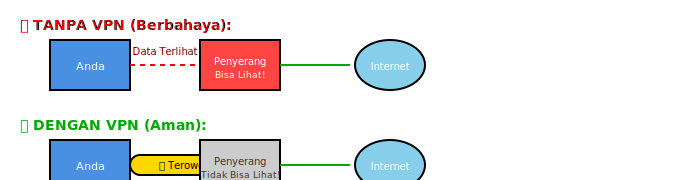

# MODUL PERTEMUAN 9
# SNIFFING DAN MAN-IN-THE-MIDDLE ATTACK

## INFORMASI MATA KULIAH
- **Mata Kuliah**: Pengantar Keamanan Siber
- **Pertemuan**: 9
- **Topik**: Sniffing dan Man-in-the-Middle Attack
- **Durasi**: 3 x 50 menit

---

## CAPAIAN PEMBELAJARAN

### CPMK (Capaian Pembelajaran Mata Kuliah)
**CPMK 5**: Mahasiswa mampu menganalisis serangan umum pada sistem, jaringan, dan aplikasi web serta merumuskan strategi mitigasinya.

### Sub-CPMK
- **Sub-CPMK 5.7**: Mahasiswa mampu menjelaskan konsep network sniffing
- **Sub-CPMK 5.8**: Mahasiswa mampu mendemonstrasikan teknik ARP poisoning
- **Sub-CPMK 5.9**: Mahasiswa mampu menjelaskan strategi mitigasi serangan sniffing

### Tujuan Pembelajaran
Setelah mempelajari modul ini, Anda diharapkan mampu:
1. Memahami apa itu network sniffing dengan analogi sederhana
2. Menjelaskan mengapa sniffing berbahaya
3. Memahami cara kerja ARP poisoning dengan contoh nyata
4. Menjelaskan serangan Man-in-the-Middle (MITM)
5. Mengenal tools dasar untuk sniffing
6. Memahami cara melindungi diri dari serangan sniffing

---

## BAGIAN 1: PENGENALAN NETWORK SNIFFING

### 1.1 Apa itu Network Sniffing?

Mari kita mulai dengan analogi sederhana. Bayangkan Anda sedang di dalam bus. Di dalam bus, banyak orang berbicara satu sama lain. Dalam kondisi normal, Anda hanya mendengarkan pembicaraan yang ditujukan kepada Anda atau pembicaraan teman Anda. Tetapi, jika Anda diam-diam menguping, Anda bisa mendengar pembicaraan orang lain juga.

**Network sniffing** adalah seperti menguping di jaringan komputer. Seseorang menangkap dan membaca data yang seharusnya tidak untuk dia. Data di jaringan komputer berjalan dalam bentuk "paket" - seperti amplop-amplop kecil yang membawa pesan. Dengan sniffing, seseorang bisa membuka amplop-amplop ini dan membaca isinya.

### 1.2 Mengapa Sniffing Berbahaya?

Bayangkan jika seseorang bisa membaca semua SMS atau pesan WhatsApp Anda. Berbahaya, bukan? Sniffing di jaringan komputer sama berbahayanya karena:

**Pencurian Password**: Ketika Anda login ke website, username dan password Anda dikirim melalui jaringan. Jika tidak ada perlindungan, orang yang melakukan sniffing bisa melihat dan mencuri password Anda. Ini seperti menulis password Anda di kartu pos yang bisa dibaca siapa saja.

**Membaca Email Pribadi**: Email yang Anda kirim dan terima bisa dibaca oleh orang lain. Bayangkan semua surat pribadi Anda dibuka dan dibaca orang asing.

**Mencuri Informasi Kartu Kredit**: Saat berbelanja online, jika tidak ada pengamanan, nomor kartu kredit Anda bisa dicuri. Ini seperti memberikan fotokopi kartu kredit Anda kepada orang tidak dikenal.

**Mengambil Alih Akun**: Penyerang bisa mencuri "kunci" yang membuat Anda tetap login di website (disebut cookie). Dengan kunci ini, mereka bisa masuk ke akun Anda tanpa perlu password.

### 1.3 Dua Jenis Sniffing

Ada dua cara melakukan sniffing:

**Sniffing Pasif - Hanya Mendengarkan**

Ini seperti Anda diam-diam mendengarkan pembicaraan orang lain tanpa ikut campur. Anda tidak mengubah atau mengganggu pembicaraan mereka, hanya mendengarkan. Di jaringan komputer, penyerang hanya menangkap data yang lewat tanpa mengubah apapun.

Contoh: Di WiFi cafe, seseorang diam-diam merekam semua data yang lewat.

**Sniffing Aktif - Ikut Campur**

Ini seperti Anda tidak hanya mendengarkan, tetapi juga mengalihkan pembicaraan orang lain ke diri Anda sendiri. Di jaringan komputer, penyerang melakukan trik agar data orang lain melewati komputer mereka terlebih dahulu.

Contoh: Penyerang membuat semua data Anda harus lewat komputernya dulu sebelum ke internet.

### 1.4 Protokol yang Tidak Aman

Beberapa cara berkomunikasi di internet tidak aman karena tidak menggunakan enkripsi (pengacakan data). Ini seperti mengirim surat dengan kartu pos, bukan amplop tertutup.

**HTTP** - Untuk browsing website tanpa pengamanan. Semua yang Anda kirim bisa dibaca. Anda harus mencari yang ada tulisan "HTTPS" dengan icon gembok.

**FTP** - Untuk mengirim file. Semua file dan password terkirim tanpa pengamanan.

**Telnet** - Untuk mengakses komputer dari jauh. Semua perintah dan password bisa dibaca.

Protokol aman menggunakan enkripsi, seperti:
- **HTTPS** (ada gembok di browser)
- **SFTP** (FTP yang aman)
- **SSH** (Telnet yang aman)

---

## BAGIAN 2: MEMAHAMI DASAR JARINGAN

### 2.1 Alamat MAC dan Alamat IP - Seperti NIK dan Alamat Rumah

Untuk memahami serangan sniffing, kita perlu tahu dua jenis "alamat" di jaringan:

**Alamat MAC (Media Access Control Address)**

Ini seperti Nomor Induk Kependudukan (NIK) yang unik untuk setiap orang. Setiap perangkat jaringan (laptop, HP, komputer) punya nomor unik yang diberikan pabrik. Contoh alamat MAC: `00:1A:2B:3C:4D:5E`

Alamat MAC:
- Diberikan oleh pabrik pembuat perangkat
- Bersifat tetap (tidak berubah)
- Digunakan untuk komunikasi di jaringan lokal (dalam satu gedung/kantor)

**Alamat IP (Internet Protocol Address)**

Ini seperti alamat rumah Anda. Alamat IP bisa berubah-ubah, tidak seperti NIK. Contoh alamat IP: `192.168.1.100`

Alamat IP:
- Diberikan oleh router/server
- Bisa berubah-ubah
- Digunakan untuk komunikasi antar jaringan (ke internet)

**Analogi Sederhana:**
- Alamat MAC = NIK Anda (tetap, dari lahir)
- Alamat IP = Alamat rumah Anda (bisa pindah)

### 2.2 Apa itu ARP?

**ARP (Address Resolution Protocol)** adalah cara komputer mencari tahu alamat MAC dari alamat IP. Ini seperti mencari NIK seseorang kalau Anda hanya tahu alamat rumahnya.

**Cara Kerja ARP - Analogi Sederhana:**

Bayangkan Anda di kompleks perumahan ingin mengirim paket ke rumah nomor 10, tapi Anda tidak tahu siapa yang tinggal di sana (tidak tahu NIK-nya).

1. **Anda Bertanya ke Semua Orang**: Anda berteriak di kompleks: "Siapa yang tinggal di rumah nomor 10? Tolong kasih tahu NIK-nya!"

2. **Penghuni Rumah 10 Menjawab**: Orang di rumah 10 menjawab: "Saya yang tinggal di nomor 10, NIK saya 1234567890"

3. **Anda Mencatat**: Anda catat informasi ini agar lain kali tidak perlu tanya lagi.

Begitu juga di komputer:
1. Komputer A bertanya ke semua: "Siapa yang punya IP 192.168.1.50? Kasih tahu MAC address-nya!"
2. Komputer B yang punya IP itu jawab: "Saya, MAC address saya AA:BB:CC:DD:EE:FF"
3. Komputer A simpan informasi ini dalam "catatan" (ARP cache)

**Masalahnya:** ARP terlalu percaya! Siapa saja bisa menjawab dan mengaku sebagai rumah nomor 10, meskipun bohong. Ini yang dimanfaatkan dalam serangan.

### 2.3 Hub vs Switch - Bedanya Apa?

**Hub - Seperti Pengeras Suara**

Hub adalah perangkat jaringan lama yang sangat sederhana. Ketika menerima data, hub mengirimnya ke SEMUA komputer yang terhubung. Ini seperti pengeras suara - semua orang mendengar.

Contoh: Jika komputer A kirim pesan ke komputer B, komputer C, D, dan E juga menerima pesan itu (walaupun bukan untuk mereka).

**Switch - Seperti Kurir yang Pintar**

Switch adalah perangkat jaringan modern yang lebih cerdas. Switch tahu komputer mana terhubung di port mana, jadi dia hanya kirim data ke komputer yang dituju saja.

Contoh: Jika komputer A kirim pesan ke komputer B, hanya komputer B yang menerima. Komputer C, D, E tidak menerima apapun.

**Dari Sisi Keamanan:**

- **Hub**: Sangat tidak aman! Semua orang bisa lihat data semua orang. Sniffing sangat mudah.
- **Switch**: Lebih aman. Data hanya ke tujuannya. Tapi masih bisa diserang dengan trik tertentu.

---

## BAGIAN 3: ARP POISONING - SERANGAN UTAMA

### 3.1 Apa itu ARP Poisoning?

ARP Poisoning adalah serangan dimana penyerang berbohong tentang alamat MAC-nya. Ingat, ARP itu terlalu percaya dan tidak cek kebenaran.

**Analogi Sederhana:**

Di kompleks perumahan:
- Anda ingin kirim paket ke Kantor Pos (gateway/router)
- Anda tanya: "Dimana Kantor Pos? Kasih tahu NIK-nya!"
- **Orang jahat** menjawab duluan (sebelum Kantor Pos yang asli): "Saya Kantor Pos! NIK saya XXX" (padahal bohong)
- Anda percaya dan kirim semua paket ke orang jahat itu
- Orang jahat baca semua paket Anda, terus baru diteruskan ke Kantor Pos yang asli
- Anda tidak sadar karena paket tetap sampai ke tujuan, hanya lewat orang jahat dulu

**Di Jaringan Komputer:**

1. **Kondisi Normal:**
   ```
   Komputer Anda → Router → Internet
   ```

2. **Setelah ARP Poisoning:**
   ```
   Komputer Anda → Komputer Penyerang → Router → Internet
                        ↓
                  (Membaca semua data)
   ```

### 3.2 Cara Kerja ARP Poisoning - Langkah demi Langkah

**Langkah 1 - Penyerang Bergabung ke Jaringan**

Penyerang masuk ke jaringan yang sama dengan Anda. Misalnya, di WiFi cafe yang sama.

**Langkah 2 - Penyerang Mencari Target**

Penyerang mencari tahu:
- IP address Anda (target/korban)
- IP address router (gateway)
- MAC address keduanya

**Langkah 3 - Penyerang Mengirim Pesan Bohong**

Penyerang kirim pesan palsu ke komputer Anda:
- "Hei, saya router! IP saya 192.168.1.1, MAC address saya adalah [MAC penyerang]"
- Padahal dia bukan router, dia bohong tentang MAC address-nya

**Langkah 4 - Komputer Anda Tertipu**

Komputer Anda percaya dan update catatannya:
- "Oh, ternyata router punya MAC address [MAC penyerang]"
- Sekarang semua data yang mau ke router, Anda kirim ke penyerang

**Langkah 5 - Penyerang Juga Tipu Router**

Penyerang juga kirim pesan palsu ke router:
- "Hei router, saya komputer dengan IP 192.168.1.100, MAC saya [MAC penyerang]"
- Router juga tertipu

**Langkah 6 - Penyerang di Tengah**

Sekarang penyerang ada di tengah-tengah. Semua data dari Anda ke internet (dan sebaliknya) lewat komputer penyerang dulu.

**Langkah 7 - Penyerang Membaca Data**

Penyerang baca semua data yang lewat (password, email, dll), lalu teruskan ke tujuan asli agar Anda tidak curiga.

### 3.3 Diagram ARP Poisoning

**Kondisi Normal:**


**Setelah ARP Poisoning:**


### 3.4 Man-in-the-Middle (MITM) Attack

**Man-in-the-Middle** artinya "orang di tengah". Setelah berhasil melakukan ARP Poisoning, penyerang berada di tengah-tengah komunikasi Anda. Ini seperti ada orang yang berdiri di antara Anda dan teman Anda saat berbicara, mendengarkan semua pembicaraan.

**Apa yang Bisa Dilakukan Penyerang:**

**Membaca Semua Data** - Seperti membaca surat Anda sebelum dikirim. Penyerang bisa lihat:
- Username dan password
- Isi email
- Pesan chat
- Nomor kartu kredit

**Mengubah Data** - Seperti mengubah isi surat Anda. Penyerang bisa:
- Mengubah nomor rekening dalam email
- Menyisipkan virus ke dalam download
- Mengubah informasi di website

**Mencuri Session** - Seperti mencuri kunci rumah Anda. Penyerang bisa:
- Masuk ke akun Anda tanpa password
- Mengambil alih akun media sosial
- Mengakses email Anda

---

## BAGIAN 4: SERANGAN LAINNYA

### 4.1 MAC Flooding - Membanjiri Switch

Ingat switch itu pintar karena dia punya "buku catatan" yang mencatat komputer mana di port mana? Nah, buku itu ada batasnya. MAC Flooding adalah serangan yang mengisi buku catatan itu sampai penuh.

**Analogi:**

Bayangkan sebuah kantor dengan resepsionis yang mencatat nama tamu. Buku catatannya hanya muat 100 nama. Seseorang jahat datang dengan 1000 tamu palsu dan memaksa resepsionis mencatat semua. Bukunya penuh! 

Akhirnya resepsionis bingung dan mulai memberitahu SEMUA pesan ke SEMUA tamu (seperti hub). Nah, orang jahat itu sekarang bisa dengar semua pembicaraan.

**Di Jaringan:**

Penyerang kirim ribuan alamat MAC palsu ke switch. Catatan switch penuh. Switch bingung dan mulai kirim semua data ke semua port. Sekarang penyerang bisa sniffing dengan mudah.

### 4.2 MAC Spoofing - Pura-pura Jadi Orang Lain

MAC Spoofing adalah mengubah alamat MAC Anda menjadi alamat MAC orang lain. Ini seperti Anda menggunakan NIK orang lain untuk berpura-pura jadi dia.

**Tujuannya:**

- **Bypass Keamanan**: Jika hanya komputer tertentu boleh masuk jaringan, penyerang pura-pura jadi komputer itu
- **Menyembunyikan Identitas**: Agar susah dilacak
- **Mendapat Akses Gratis**: Di hotel yang kasih internet gratis per perangkat, ganti MAC untuk dapat akses lagi

### 4.3 DHCP Starvation - Menghabiskan Alamat IP

DHCP adalah "pembagi alamat IP otomatis". Ketika Anda konek WiFi, DHCP kasih Anda alamat IP. Tapi, DHCP punya alamat IP terbatas, misalnya hanya punya 100 alamat.

**Analogi:**

Seperti parkir mall yang hanya punya 100 tempat parkir. Seseorang jahat datang dengan 100 mobil palsu dan isi semua tempat parkir. Pengunjung asli tidak dapat tempat parkir.

**Di Jaringan:**

Penyerang minta alamat IP berkali-kali dengan identitas palsu sampai habis semua. Orang yang datang kemudian tidak dapat alamat IP dan tidak bisa konek internet.

**Setelah itu, penyerang bisa:**
- Bikin DHCP server palsu sendiri
- Kasih alamat IP palsu ke orang
- Arahkan semua data lewat komputer penyerang

---

## BAGIAN 5: TOOLS UNTUK SNIFFING

### 5.1 Wireshark - Seperti Kamera CCTV Jaringan

**Wireshark** adalah program untuk melihat semua data yang lewat di jaringan. Ini seperti CCTV yang merekam semua "kendaraan" (paket data) yang lewat.

**Apa yang Bisa Dilakukan:**

- Melihat semua paket data yang lewat
- Membaca isi paket (jika tidak dienkripsi)
- Mencari password yang dikirim
- Menganalisis masalah jaringan

**Tampilan Wireshark:**

Wireshark menampilkan:
- **Waktu**: Kapan paket lewat
- **Sumber**: Dari komputer mana
- **Tujuan**: Ke komputer mana
- **Protokol**: Jenis komunikasi (HTTP, FTP, dll)
- **Isi**: Apa yang ada di dalam paket

**Cara Pakai (Simpel):**

1. Buka Wireshark
2. Pilih jaringan yang mau dipantau (WiFi atau kabel)
3. Klik "Start" untuk mulai merekam
4. Lihat semua data yang lewat
5. Klik "Stop" untuk berhenti

**Filter** membantu fokus pada data tertentu:
- `http` - Hanya tampilkan data website
- `ftp` - Hanya tampilkan transfer file
- `ip.addr == 192.168.1.100` - Hanya dari/ke IP tertentu

**Kegunaan Legal:**
- Troubleshooting jaringan
- Belajar cara kerja protokol
- Testing keamanan (dengan izin)

### 5.2 Ettercap - Tool untuk MITM Attack

**Ettercap** adalah program khusus untuk melakukan Man-in-the-Middle attack. Ini bukan untuk digunakan sembarangan, hanya untuk security testing dengan izin.

**Apa yang Bisa Dilakukan:**

- ARP Poisoning otomatis
- Menangkap password dari berbagai layanan
- Mengubah data yang lewat
- Membuat laporan hasil serangan

**Cara Kerja Sederhana:**

1. Scan jaringan untuk cari korban dan router
2. Pilih target
3. Aktifkan ARP Poisoning
4. Ettercap otomatis tangkap password dan data

### 5.3 TCPDump - Perekam Paket Simple

**TCPDump** adalah program command-line (pakai ketikan) untuk merekam paket. Ini lebih sederhana dari Wireshark, cocok untuk server.

**Contoh Perintah:**

```bash
tcpdump -i wlan0
```
Artinya: Rekam semua paket di WiFi

```bash
tcpdump port 80
```
Artinya: Rekam hanya paket website (port 80)

```bash
tcpdump -w hasil.pcap
```
Artinya: Simpan hasil rekaman ke file

---

## BAGIAN 6: CARA MENDETEKSI SERANGAN

### 6.1 Tanda-Tanda Ada ARP Poisoning

**Tanda 1 - Internet Jadi Lambat**

Jika tiba-tiba internet jadi lambat tanpa alasan jelas, bisa jadi ada serangan. Data yang harus lewat komputer penyerang dulu jadi lebih lama.

**Tanda 2 - Putus-Putus**

Koneksi yang sering putus-sambung bisa tanda ada yang mengganggu jaringan.

**Tanda 3 - Peringatan Keamanan Browser**

Jika browser tiba-tiba kasih peringatan tentang sertifikat website yang tidak aman (padahal website itu biasanya aman), bisa jadi ada MITM.

**Tanda 4 - Alamat MAC Berubah**

Cara cek di Windows (buka Command Prompt):
```
arp -a
```

Perintah ini tampilkan daftar alamat IP dan MAC. Jika banyak IP punya MAC yang sama, bisa jadi ada ARP Poisoning.

**Contoh Normal:**
```
192.168.1.1    00-11-22-33-44-55   (Router)
192.168.1.10   AA-BB-CC-DD-EE-FF   (Komputer A)
192.168.1.20   11-22-33-44-55-66   (Komputer B)
```

**Contoh Ada Serangan:**
```
192.168.1.1    XX-XX-XX-XX-XX-XX   (Harusnya MAC router)
192.168.1.10   XX-XX-XX-XX-XX-XX   (Sama! Mencurigakan!)
192.168.1.20   XX-XX-XX-XX-XX-XX   (Sama lagi!)
```

Jika banyak alamat IP punya MAC yang sama, itu tanda kuat ada ARP Poisoning!

### 6.2 Tools untuk Deteksi

**XArp** - Program yang otomatis kasih tahu jika ada ARP Poisoning. Seperti alarm pencuri untuk jaringan.

**Arpwatch** - Program di Linux yang catat semua perubahan alamat MAC dan kasih tahu via email jika ada yang aneh.

---

## BAGIAN 7: CARA MELINDUNGI DIRI

### 7.1 Gunakan VPN - Perlindungan Paling Ampuh

**VPN (Virtual Private Network)** adalah terowongan aman untuk data Anda. Bayangkan data Anda masuk ke dalam pipa baja yang tidak tembus pandang. Meskipun ada yang sadap, mereka tidak bisa lihat isinya.

**Cara Kerja VPN:**



**Mengapa VPN Ampuh:**

- Semua data dienkripsi (diacak) sehingga tidak bisa dibaca
- Penyerang hanya lihat "sampah" yang tidak berguna
- Bekerja untuk SEMUA aplikasi (browser, email, chat, dll)
- Melindungi dari sniffing, MITM, dan serangan lainnya

**Cara Pakai VPN:**

1. Daftar layanan VPN (contoh: NordVPN, ExpressVPN, ProtonVPN)
2. Download dan install aplikasi VPN
3. Login dengan akun Anda
4. Klik "Connect" sebelum pakai internet
5. Selesai! Sekarang data Anda aman

**Kapan Harus Pakai VPN:**

- ✅ Saat pakai WiFi publik (cafe, mall, airport)
- ✅ Saat akses data sensitif (banking, email penting)
- ✅ Saat traveling
- ✅ Sebenarnya... sepanjang waktu lebih baik!

### 7.2 Selalu Pakai HTTPS

**HTTPS** adalah versi aman dari HTTP. Lihat ikon gembok di browser Anda.

```svg
<svg width="500" height="100" xmlns="http://www.w3.org/2000/svg">
  <!-- HTTP - Tidak Aman -->
  <rect x="20" y="20" width="200" height="30" fill="#FFCCCC" stroke="#FF0000" stroke-width="2"/>
  <text x="30" y="40" fill="#000" font-size="12">❌ http://website.com</text>
  <text x="120" y="65" text-anchor="middle" fill="#FF0000" font-size="10">TIDAK AMAN!</text>
  
  <!-- HTTPS - Aman -->
  <rect x="280" y="20" width="200" height="30" fill="#CCFFCC" stroke="#00AA00" stroke-width="2"/>
  <text x="290" y="40" fill="#000" font-size="12">✅ 🔒 https://website.com</text>
  <text x="380" y="65" text-anchor="middle" fill="#00AA00" font-size="10">AMAN!</text>
</svg>
```

**Tips:**

- Jangan masukkan password di situs HTTP (tanpa gembok)
- Install extension "HTTPS Everywhere" di browser
- Jika browser kasih peringatan keamanan, JANGAN abaikan!

### 7.3 Hindari WiFi Publik untuk Hal Sensitif

**WiFi Publik = Berbahaya**

WiFi di cafe, mall, hotel itu seperti jalan umum. Siapa saja bisa "lewat" dan "lihat-lihat".

**Aturan Aman WiFi Publik:**

**JANGAN di WiFi Publik:**
- ❌ Internet banking
- ❌ Belanja online (kasih nomor kartu kredit)
- ❌ Login ke email penting
- ❌ Akses data kerja rahasia
- ❌ Isi formulir dengan data pribadi

**BOLEH di WiFi Publik (dengan VPN):**
- ✅ Browsing berita
- ✅ Baca artikel
- ✅ Nonton video
- ✅ Main game
- ✅ Chat biasa (bukan yang sensitif)

**Lebih Baik:**
- Gunakan data seluler (4G/5G) untuk hal penting
- Atau pakai VPN dulu baru akses WiFi publik

### 7.4 Matikan File Sharing

Saat di WiFi publik, matikan file sharing agar komputer Anda tidak kelihatan oleh orang lain.

**Di Windows:**

1. Buka "Control Panel"
2. Pilih "Network and Sharing Center"
3. Klik "Change advanced sharing settings"
4. Pilih "Turn off file and printer sharing"
5. Klik "Save changes"

**Di Mac:**

1. Buka "System Preferences"
2. Pilih "Sharing"
3. Uncheck semua option yang ada

### 7.5 Aktifkan Firewall

Firewall seperti satpam komputer Anda. Dia cegah orang lain masuk tanpa izin.

**Cara Cek Firewall di Windows:**

1. Buka "Settings"
2. Pilih "Update & Security"
3. Pilih "Windows Security"
4. Klik "Firewall & network protection"
5. Pastikan status "On"

### 7.6 Gunakan 2FA (Two-Factor Authentication)

**2FA** adalah keamanan ganda. Selain password, butuh kode tambahan dari HP.

**Cara Kerja:**

1. Anda login dengan username dan password
2. Website kirim kode ke HP Anda (via SMS atau app)
3. Anda masukkan kode itu
4. Baru bisa masuk

**Keuntungan:**

Meskipun password dicuri, penyerang tidak bisa masuk karena tidak punya HP Anda.

**Aktifkan 2FA di:**
- Email (Gmail, Yahoo, dll)
- Media sosial (Facebook, Instagram, Twitter)
- Banking online
- Aplikasi penting lainnya

### 7.7 Verifikasi Nama WiFi

Sebelum connect WiFi publik:

1. **Tanya Petugas**: "Nama WiFi yang resmi apa?"
2. **Jangan Asal Connect**: Banyak WiFi palsu dengan nama mirip
3. **Hati-hati Evil Twin**: 
   - WiFi asli: "Starbucks_WiFi"
   - WiFi palsu: "Starbucks_Free_WiFi"

### 7.8 Forget Network Setelah Pakai

Setelah selesai pakai WiFi publik, "lupakan" network tersebut agar HP/laptop tidak otomatis connect lagi.

**Di HP Android:**
1. Buka WiFi settings
2. Tap network yang tadi dipakai
3. Pilih "Forget"

**Di iPhone:**
1. Settings → WiFi
2. Tap (i) di sebelah network
3. Pilih "Forget This Network"

---

## BAGIAN 8: PERLINDUNGAN UNTUK JARINGAN

### 8.1 Client Isolation pada WiFi

**Client Isolation** membuat pengguna WiFi tidak bisa "lihat" pengguna lain. Ini seperti partisi di ruangan - setiap orang di bilik sendiri.

**Keuntungan:**
- Mencegah ARP Poisoning antar pengguna
- User A tidak bisa sniffing User B
- Lebih aman untuk WiFi publik

**Cara Aktifkan:**
- Setting di router/access point
- Cari option "Client Isolation" atau "AP Isolation"
- Set ke "Enable"

### 8.2 DHCP Snooping

**DHCP Snooping** adalah fitur switch yang melindungi dari DHCP palsu.

**Cara Kerja:**

Switch membedakan port:
- **Trusted Port**: Untuk DHCP server asli
- **Untrusted Port**: Untuk user biasa

Jika ada DHCP palsu dari untrusted port, langsung diblock!

### 8.3 Dynamic ARP Inspection (DAI)

**DAI** adalah fitur yang cek kebenaran ARP packet.

**Cara Kerja:**

1. Switch punya catatan: IP berapa dapat MAC apa (dari DHCP)
2. Kalau ada ARP packet yang bilang IP X punya MAC Y
3. Switch cek: Apakah sesuai catatan?
4. Kalau tidak sesuai → BLOCK!

Ini mencegah ARP Poisoning.

### 8.4 Port Security

**Port Security** membatasi berapa banyak perangkat bisa connect di satu port.

**Contoh:**

Port untuk user dibatasi cuma bisa 1 MAC address. Kalau tiba-tiba ada 1000 MAC (MAC flooding), port langsung dimatikan otomatis!

---

## BAGIAN 9: HAL PENTING YANG HARUS DIINGAT

### 9.1 Etika dan Hukum

**PENTING SEKALI:**

Semua teknik yang dipelajari di sini HANYA untuk:
- ✅ Belajar (di lab sendiri)
- ✅ Testing keamanan DENGAN IZIN tertulis
- ✅ Melindungi diri dan organisasi

**JANGAN PERNAH:**
- ❌ Sniffing jaringan orang lain tanpa izin
- ❌ Mencuri password orang
- ❌ Melakukan MITM attack ke orang lain
- ❌ Menggunakan ilmu ini untuk kejahatan

**Ingat:**
- Sniffing tanpa izin = ILLEGAL
- Bisa kena hukuman pidana
- Bisa dipecat dari kerja
- Merusak reputasi dan masa depan

**Gunakan Ilmu untuk Kebaikan:**
- Bantu organisasi lebih aman
- Jadi security professional
- Edukasi orang lain tentang keamanan
- Lindungi data pribadi dan perusahaan

### 9.2 Ringkasan Poin Penting

**Apa itu Sniffing:**
- Menangkap dan membaca data di jaringan
- Seperti menguping pembicaraan orang
- Bisa mencuri password, email, data pribadi

**ARP Poisoning:**
- Serangan dengan berbohong tentang alamat MAC
- Menempatkan penyerang di tengah komunikasi
- Memungkinkan membaca dan mengubah data

**MITM (Man-in-the-Middle):**
- Penyerang berada di antara Anda dan tujuan
- Bisa membaca, mengubah, mencuri data
- Sangat berbahaya untuk data sensitif

**Cara Melindungi Diri:**
- **Gunakan VPN** - Perlindungan terbaik!
- **Cek HTTPS** - Pastikan ada gembok
- **Hindari WiFi Publik** untuk hal sensitif
- **Aktifkan 2FA** di semua akun penting
- **Matikan file sharing** di jaringan publik

**Tanda-Tanda Serangan:**
- Internet tiba-tiba lambat
- Koneksi putus-putus
- Peringatan keamanan browser
- Banyak IP dengan MAC yang sama

**Tools (untuk belajar saja):**
- Wireshark - Melihat paket data
- Ettercap - MITM attack
- TCPDump - Rekam paket

**Perlindungan Jaringan:**
- Client Isolation
- DHCP Snooping
- Dynamic ARP Inspection
- Port Security

### 9.3 Kesimpulan

Network sniffing dan MITM attack adalah ancaman nyata di dunia digital. Setiap kali Anda connect ke internet, terutama WiFi publik, ada risiko data Anda disadap.

**Yang Harus Selalu Anda Lakukan:**

1. **Pakai VPN** saat di WiFi publik
2. **Cek HTTPS** sebelum login
3. **Aktifkan 2FA** di semua akun
4. **Waspada** terhadap tanda-tanda serangan
5. **Jangan asal connect** ke WiFi
6. **Update software** secara rutin
7. **Edukasi** keluarga dan teman

**Ingat:**

Keamanan cyber bukan hanya tugas IT, tapi tanggung jawab kita semua. Dengan memahami ancaman dan cara melindungi diri, Anda sudah selangkah lebih aman di dunia digital.

Ilmu ini untuk melindungi, bukan untuk menyerang. Gunakan dengan bijak dan etis!

---

## DAFTAR ISTILAH SEDERHANA

**ARP (Address Resolution Protocol)**: Cara komputer mencari alamat MAC dari alamat IP. Seperti mencari NIK dari alamat rumah.

**ARP Cache**: Catatan di komputer yang simpan hubungan antara IP dan MAC address.

**ARP Poisoning**: Serangan dengan bohong tentang alamat MAC agar data lewat komputer penyerang.

**Enkripsi**: Mengacak data agar tidak bisa dibaca orang lain. Seperti menulis dengan kode rahasia.

**Gateway**: Pintu gerbang jaringan lokal ke internet. Biasanya router.

**HTTPS**: Versi aman dari HTTP. Ada ikon gembok di browser.

**Hub**: Perangkat jaringan lama yang kirim data ke semua komputer (tidak aman).

**MAC Address**: Alamat unik setiap perangkat jaringan. Seperti NIK yang tidak berubah.

**MITM (Man-in-the-Middle)**: Serangan dimana penyerang ada di tengah komunikasi untuk sadap data.

**Paket**: Unit kecil data yang dikirim melalui jaringan. Seperti amplop berisi pesan.

**Protokol**: Aturan komunikasi di jaringan. Seperti bahasa yang dipakai komputer untuk bicara.

**Router**: Alat yang hubungkan jaringan lokal ke internet.

**Sniffing**: Menyadap dan membaca data yang lewat di jaringan.

**Switch**: Perangkat jaringan modern yang kirim data hanya ke tujuan (lebih aman dari hub).

**VPN (Virtual Private Network)**: Terowongan aman untuk data. Semua data dienkripsi.

**WiFi Publik**: WiFi di tempat umum (cafe, mall) yang bisa dipakai siapa saja. Tidak aman.

---

## REFERENSI BELAJAR 

### Untuk Pemula:
- Video YouTube: "How HTTPS Works" (cari yang animasi)
- Website: "How-To Geek" - Artikel tentang keamanan WiFi
- Aplikasi: Download VPN gratis untuk praktek (ProtonVPN, Windscribe)

### Untuk Praktik (Lab):
- Download Wireshark (gratis) untuk belajar lihat paket
- Setup virtual machine dengan VirtualBox
- Install Kali Linux di VM untuk belajar tools security
- JANGAN praktik di jaringan orang lain!

### Bacaan Tambahan:
- Blog: "Krebs on Security" - Berita keamanan cyber
- Website: "Have I Been Pwned" - Cek apakah email Anda pernah bocor
- Course: Coursera "Introduction to Cyber Security"

---

**Selamat Belajar! Gunakan Ilmu Ini untuk Kebaikan! 🔒**
