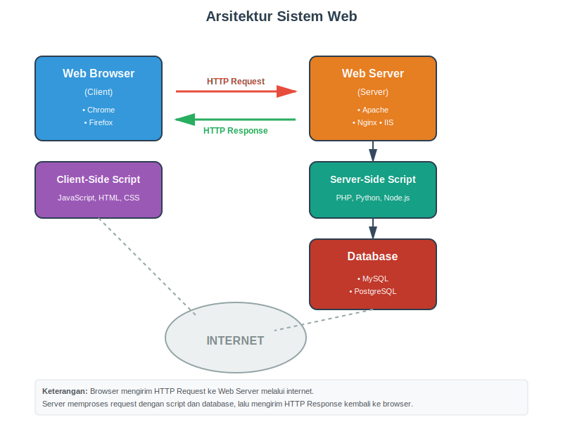
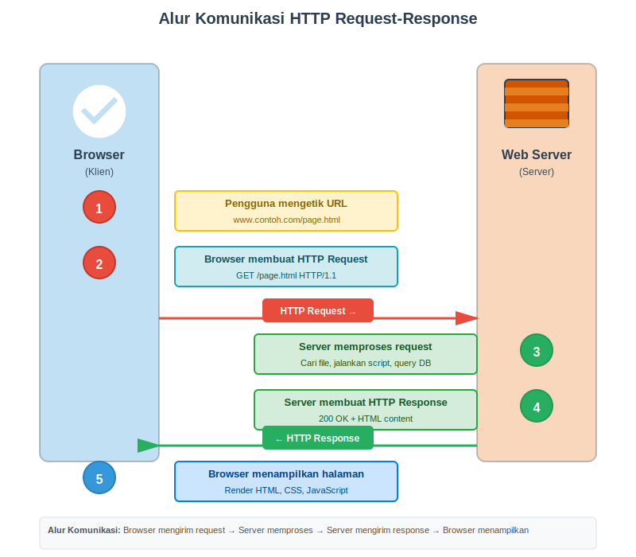
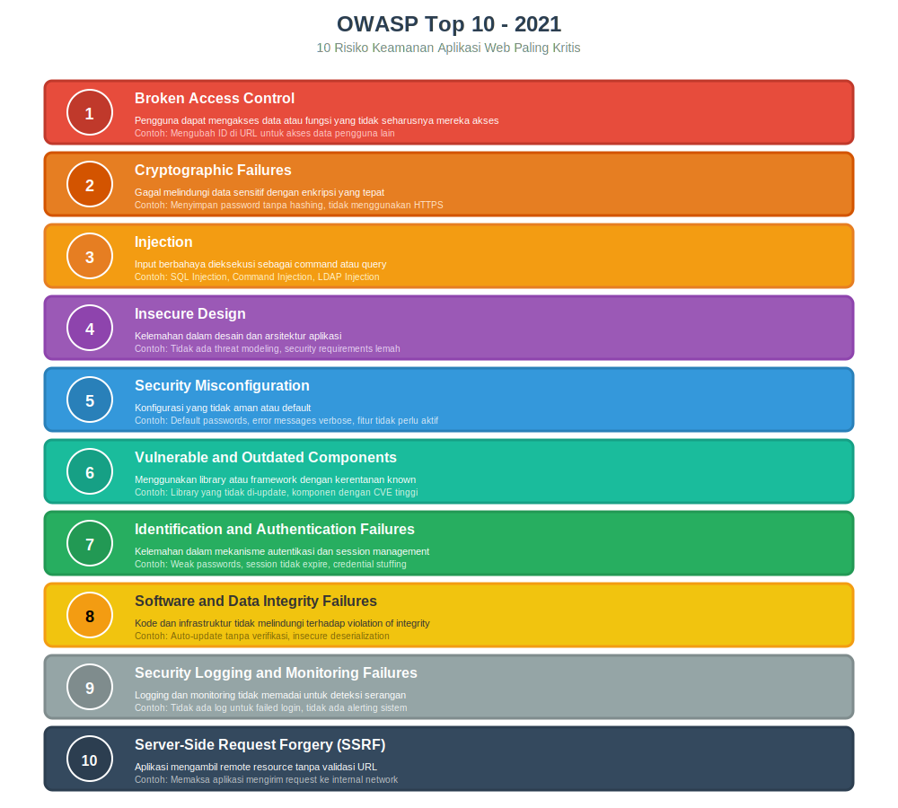
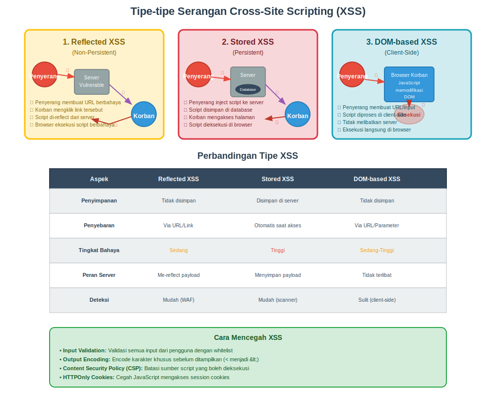
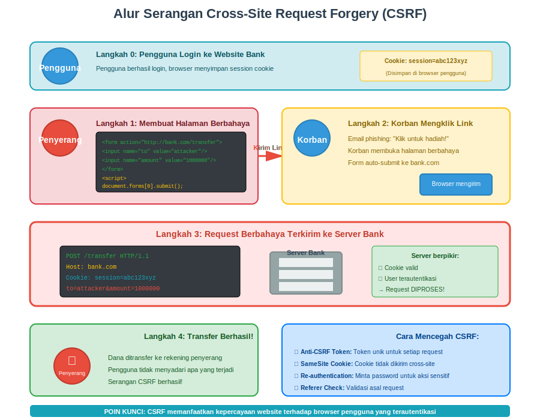
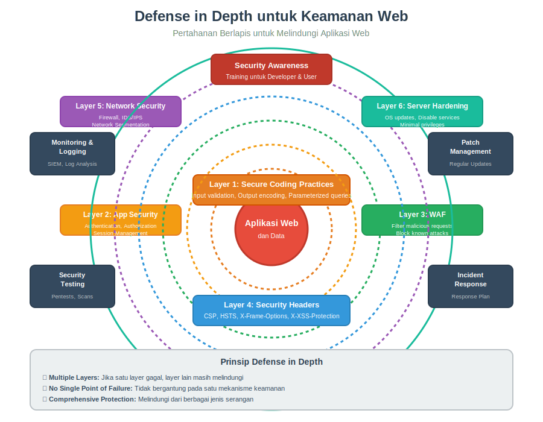

# MODUL 11: WEB SERVER DAN WEB APPLICATION HACKING

## INFORMASI MATA KULIAH
**Mata Kuliah:** Pengantar Keamanan Siber  
**Kode:** TBD  
**Program Studi:** Teknik Informatika  
**Pertemuan ke:** 11

[Slide untuk Pertemuan Ini](https://anindito.github.io/intro/11/)

## CAPAIAN PEMBELAJARAN

### CPMK yang Dicapai
**CPMK 5:** Mahasiswa mampu menganalisis serangan umum pada sistem, jaringan, dan aplikasi web serta merumuskan strategi mitigasinya.

### Sub-CPMK
- **Sub-CPMK 5.13:** Mahasiswa mampu mengidentifikasi kerentanan pada web server.
- **Sub-CPMK 5.14:** Mahasiswa mampu menjelaskan serangan umum pada aplikasi web.
- **Sub-CPMK 5.15:** Mahasiswa mampu menjelaskan strategi pengamanan web server dan aplikasi web.

### Tujuan Pembelajaran
Setelah mempelajari modul ini, mahasiswa diharapkan mampu:
1. Memahami arsitektur dan komponen web server beserta fungsinya
2. Mengidentifikasi kerentanan umum yang terdapat pada web server
3. Menjelaskan teknik serangan yang menargetkan web server
4. Memahami OWASP Top 10 sebagai panduan kerentanan aplikasi web
5. Menjelaskan mekanisme serangan Cross-Site Scripting (XSS) dan Cross-Site Request Forgery (CSRF)
6. Merumuskan strategi mitigasi untuk mengamankan web server dan aplikasi web

---

## 11.1 PENGENALAN WEB SERVER DAN KEAMANANNYA

### 11.1.1 Apa Itu Web Server?

Web server adalah sebuah perangkat lunak yang berjalan pada komputer server dan bertugas melayani permintaan dari pengguna internet. Ketika kita mengetikkan alamat website di browser seperti www.contoh.com, sebenarnya browser kita sedang mengirimkan permintaan kepada web server yang menyimpan halaman website tersebut. Web server kemudian akan merespons dengan mengirimkan halaman yang diminta kembali ke browser kita sehingga kita bisa melihat dan berinteraksi dengan website tersebut.

Bayangkan web server seperti seorang pelayan restoran. Ketika pelanggan (browser) datang dan memesan makanan (halaman web), pelayan (web server) akan mengambil makanan dari dapur (database atau file sistem) dan mengantarkannya kepada pelanggan. Proses ini terjadi jutaan kali setiap detik di seluruh dunia, membuat internet berfungsi seperti yang kita kenal sekarang.

### 11.1.2 Komponen Utama Sistem Web

Sistem web modern terdiri dari beberapa komponen yang bekerja sama untuk menampilkan halaman web kepada pengguna. Komponen pertama adalah web browser atau peramban web yang berfungsi sebagai klien. Browser inilah yang digunakan pengguna untuk mengakses internet, seperti Google Chrome, Mozilla Firefox, atau Microsoft Edge. Browser bertugas mengirimkan permintaan ke web server dan menampilkan respons yang diterima dalam bentuk halaman web yang dapat dilihat dan digunakan oleh pengguna.

Komponen kedua adalah web server itu sendiri. Web server yang populer digunakan antara lain Apache HTTP Server, Nginx, Microsoft Internet Information Services (IIS), dan LiteSpeed. Setiap web server memiliki karakteristik dan konfigurasi yang berbeda, namun fungsi dasarnya sama yaitu melayani permintaan HTTP dari klien. Web server bertanggung jawab untuk memproses permintaan, menentukan halaman mana yang harus dikirimkan, dan mengirimkan respons kembali ke browser.

Komponen ketiga adalah server-side scripting atau bahasa pemrograman sisi server. Ini adalah kode program yang berjalan di server untuk menghasilkan konten dinamis. Bahasa pemrograman yang umum digunakan meliputi PHP, Python, Ruby, JavaScript (Node.js), dan Java. Script ini memungkinkan website untuk menampilkan konten yang berbeda untuk setiap pengguna atau situasi, misalnya menampilkan nama pengguna setelah login atau menampilkan produk yang sesuai dengan pencarian.

Komponen keempat adalah database atau basis data. Database menyimpan informasi yang dibutuhkan oleh website seperti data pengguna, artikel, produk, dan lain-lain. Database yang populer digunakan meliputi MySQL, PostgreSQL, MongoDB, dan Microsoft SQL Server. Ketika pengguna meminta informasi tertentu, server-side script akan mengambil data dari database dan mengolahnya menjadi halaman web yang dapat ditampilkan.

Komponen kelima adalah client-side scripting atau script yang berjalan di browser pengguna. Yang paling umum adalah JavaScript yang memungkinkan halaman web menjadi interaktif dan responsif tanpa perlu memuat ulang seluruh halaman. Teknologi modern seperti React, Vue.js, dan Angular adalah contoh framework JavaScript yang membuat aplikasi web menjadi lebih dinamis dan mirip dengan aplikasi desktop.

*Gambar 11.1: Arsitektur Sistem Web menampilkan komponen client-side (browser, JavaScript) dan server-side (web server, script, database) beserta alur komunikasi HTTP.*

### 11.1.3 Bagaimana Web Server Bekerja

Proses komunikasi antara browser dan web server mengikuti protokol HTTP (Hypertext Transfer Protocol) atau HTTPS (HTTP Secure). Ketika pengguna mengetikkan alamat website atau mengklik sebuah link, browser akan membuat permintaan HTTP yang disebut HTTP Request. Permintaan ini berisi berbagai informasi seperti metode permintaan (GET, POST, PUT, DELETE), alamat halaman yang diminta, dan informasi tambahan lainnya.

Permintaan HTTP kemudian dikirim melalui internet menuju web server yang alamatnya tertera dalam URL. Server menerima permintaan tersebut dan memprosesnya berdasarkan konfigurasi yang telah ditetapkan. Jika halaman yang diminta adalah file statis seperti gambar atau file HTML biasa, server akan langsung mengirimkan file tersebut. Namun jika halaman memerlukan pemrosesan dinamis, server akan menjalankan script yang sesuai, mengambil data dari database jika diperlukan, dan menghasilkan halaman HTML yang kemudian dikirimkan kembali.

Respons dari server disebut HTTP Response yang berisi kode status (seperti 200 untuk berhasil, 404 untuk halaman tidak ditemukan, atau 500 untuk error server), header yang berisi informasi tambahan, dan body yang berisi konten halaman web. Browser kemudian menerima respons ini dan menampilkannya kepada pengguna dalam bentuk halaman web yang dapat dilihat dan digunakan.

*Gambar 11.2: Alur komunikasi HTTP menampilkan 5 langkah dari pengguna mengetik URL hingga halaman ditampilkan di browser, termasuk proses pembuatan request, pemrosesan di server, dan pengiriman response.*

### 11.1.4 Mengapa Keamanan Web Server Penting

Web server menjadi target utama serangan siber karena beberapa alasan mendasar. Pertama, web server secara inheren harus dapat diakses dari internet agar dapat melayani pengguna. Sifat keterbukaan ini membuat web server terekspos kepada siapa saja di internet, termasuk penyerang yang berniat jahat. Tidak seperti sistem internal yang dapat dilindungi dengan firewall dan akses terbatas, web server harus selalu siap menerima koneksi dari luar.

Kedua, web server sering kali menyimpan atau memiliki akses ke informasi sensitif seperti data pribadi pengguna, informasi pembayaran, kredensial login, dan data bisnis penting lainnya. Jika web server berhasil disusupi, penyerang dapat mencuri data-data berharga ini untuk dijual, digunakan untuk penipuan, atau dipublikasikan untuk merusak reputasi organisasi. Kebocoran data besar yang sering kita dengar di berita biasanya dimulai dari kerentanan pada web server atau aplikasi web.

Ketiga, kompleksitas sistem web modern menciptakan banyak celah keamanan potensial. Sebuah website modern biasanya melibatkan berbagai teknologi seperti web server, bahasa pemrograman, framework, library pihak ketiga, database, dan sistem operasi. Setiap komponen ini memiliki potensi kerentanan. Bahkan jika server utama sudah aman, kerentanan pada salah satu komponen pendukung dapat menjadi pintu masuk bagi penyerang.

Keempat, banyak aplikasi web dikembangkan dengan fokus pada fungsionalitas dan kecepatan deployment, sering kali mengorbankan aspek keamanan. Developer yang kurang berpengalaman dalam keamanan aplikasi web mungkin tidak menyadari berbagai ancaman yang ada dan tidak mengimplementasikan praktik coding yang aman. Hal ini menghasilkan aplikasi dengan kerentanan yang dapat dieksploitasi oleh penyerang.

Dampak dari serangan terhadap web server bisa sangat serius. Dari sisi bisnis, serangan dapat menyebabkan downtime yang mengakibatkan hilangnya pendapatan, terutama untuk e-commerce atau layanan online. Kehilangan data pelanggan dapat merusak reputasi perusahaan dan menyebabkan hilangnya kepercayaan konsumen. Dari sisi hukum, kebocoran data pribadi dapat melanggar regulasi seperti GDPR atau UU PDP Indonesia, yang berakibat pada denda besar dan tuntutan hukum. Dari sisi operasional, pemulihan dari serangan membutuhkan waktu dan biaya yang tidak sedikit.

---

## 11.2 KERENTANAN UMUM WEB SERVER

### 11.2.1 Misconfiguration atau Kesalahan Konfigurasi

Salah satu kerentanan paling umum pada web server adalah kesalahan konfigurasi. Banyak web server dipasang dengan konfigurasi default yang sebenarnya tidak aman untuk lingkungan produksi. Konfigurasi default biasanya dirancang untuk kemudahan penggunaan dan pembelajaran, bukan untuk keamanan maksimal. Misalnya, web server mungkin memiliki direktori default yang dapat diakses publik, modul yang tidak diperlukan tetap aktif, atau pesan error yang terlalu detail dan mengungkapkan informasi sensitif tentang struktur sistem.

Kesalahan konfigurasi dapat berupa berbagai hal. Salah satunya adalah directory listing yang masih aktif, yang memungkinkan siapa saja melihat daftar file dalam sebuah folder pada web server. Penyerang dapat menggunakan informasi ini untuk menemukan file backup, file konfigurasi, atau file lain yang seharusnya tidak dapat diakses publik. Contoh lainnya adalah file backup atau file temporary yang tertinggal di web server seperti file dengan ekstensi .bak, .old, atau .tmp yang mungkin berisi kode sumber atau informasi konfigurasi yang sensitif.

Kesalahan konfigurasi lainnya termasuk default credentials yang tidak diubah untuk panel administrasi, permission file yang terlalu longgar sehingga memungkinkan modifikasi tidak sah, dan informasi verbose dalam error message yang mengungkapkan detail sistem seperti versi software, struktur database, atau path file internal. Semua informasi ini sangat berguna bagi penyerang dalam merencanakan serangan lebih lanjut.

### 11.2.2 Outdated Software dan Patch Management

Web server, seperti software lainnya, memiliki bug dan kerentanan yang ditemukan dari waktu ke waktu. Vendor software secara rutin merilis patch atau pembaruan keamanan untuk memperbaiki kerentanan yang telah ditemukan. Namun, banyak organisasi yang lalai atau lambat dalam menerapkan patch ini, meninggalkan sistem mereka rentan terhadap serangan yang sudah memiliki exploit publik.

Ketika sebuah kerentanan ditemukan dan dipublikasikan, biasanya disertai dengan CVE (Common Vulnerabilities and Exposures) number dan detail teknis tentang bagaimana kerentanan tersebut dapat dieksploitasi. Penyerang yang membaca publikasi ini dapat dengan mudah mengembangkan atau menggunakan exploit yang sudah tersedia untuk menyerang sistem yang belum di-patch. Bahkan tools scanning otomatis dapat dengan mudah mengidentifikasi versi software yang rentan dan melakukan serangan massal.

Masalah patch management sering kali terjadi karena beberapa alasan. Pertama, administrator mungkin takut bahwa patch akan menyebabkan masalah kompatibilitas atau downtime pada sistem produksi. Kedua, proses testing dan deployment patch memerlukan waktu dan sumber daya yang tidak selalu tersedia. Ketiga, organisasi mungkin tidak memiliki sistem yang baik untuk monitoring kerentanan baru dan mengelola proses patching secara sistematis.

### 11.2.3 Inadequate Authentication dan Authorization

Kelemahan dalam mekanisme autentikasi dan otorisasi merupakan pintu masuk umum bagi penyerang. Autentikasi adalah proses memverifikasi identitas pengguna, sedangkan otorisasi adalah proses menentukan apa yang boleh dilakukan oleh pengguna tersebut setelah identitasnya terverifikasi. Kedua mekanisme ini harus diimplementasikan dengan benar untuk menjaga keamanan sistem.

Kelemahan autentikasi dapat berupa berbagai hal. Password yang lemah atau mudah ditebak memudahkan serangan brute force atau dictionary attack. Sistem yang tidak menerapkan rate limiting memungkinkan penyerang mencoba ribuan kombinasi password tanpa hambatan. Kurangnya mekanisme multi-factor authentication (MFA) membuat akun lebih rentan karena hanya bergantung pada satu faktor keamanan yaitu password.

Masalah otorisasi sering kali berupa privilege escalation di mana pengguna biasa dapat mengakses fungsi yang seharusnya hanya dapat diakses oleh administrator. Ini bisa terjadi karena validasi yang tidak memadai pada sisi server, dimana aplikasi hanya menyembunyikan menu atau tombol tertentu di interface tetapi tidak benar-benar membatasi akses di backend. Penyerang yang cukup cerdik dapat memanipulasi request untuk mengakses fungsi administratif meskipun mereka hanya memiliki akun pengguna biasa.

### 11.2.4 Information Disclosure

Information disclosure atau kebocoran informasi terjadi ketika web server atau aplikasi web mengungkapkan informasi yang seharusnya bersifat internal atau rahasia. Informasi ini mungkin terlihat tidak berbahaya sendiri, tetapi dapat digunakan oleh penyerang untuk memahami sistem lebih baik dan merencanakan serangan yang lebih efektif. Ini sering disebut sebagai information gathering atau reconnaissance dalam konteks ethical hacking.

Salah satu bentuk information disclosure yang umum adalah error message yang terlalu detail. Ketika terjadi kesalahan, aplikasi web mungkin menampilkan stack trace lengkap, query database yang gagal, atau path file internal. Informasi ini sangat berguna bagi penyerang karena mengungkapkan teknologi yang digunakan, struktur database, dan potensi kerentanan lainnya. Misalnya, pesan error yang menunjukkan query SQL dapat memberikan petunjuk tentang struktur database dan membuka peluang untuk SQL injection.

Bentuk lain dari information disclosure termasuk banner grabbing dimana web server mengungkapkan versi software dalam HTTP response header, comments dalam source code HTML yang berisi informasi sensitif tentang fungsi internal atau struktur sistem, dan robots.txt file yang mengungkapkan direktori atau halaman yang ingin disembunyikan dari search engine tetapi justru menarik perhatian penyerang.

Metadata dalam file yang dipublikasikan juga dapat menjadi sumber kebocoran informasi. File dokumen, gambar, atau PDF mungkin mengandung metadata seperti nama penulis, lokasi, software yang digunakan, atau bahkan informasi GPS. Informasi ini dapat digunakan untuk social engineering atau untuk memahami tools dan proses yang digunakan oleh organisasi.

### 11.2.5 Directory Traversal

Directory traversal adalah kerentanan yang memungkinkan penyerang mengakses file dan direktori yang berada di luar web root directory. Web root adalah direktori yang ditentukan sebagai lokasi dari mana web server akan melayani file. Dalam kondisi normal, pengguna hanya boleh mengakses file dalam web root dan subdirektorinya. Namun jika aplikasi tidak memvalidasi input dengan benar, penyerang dapat menggunakan karakter khusus untuk "naik" ke direktori parent dan mengakses file di luar web root.

Teknik directory traversal biasanya menggunakan sequence seperti ../ atau ..\ untuk naik satu level direktori. Dengan menggabungkan beberapa sequence ini, penyerang dapat mencapai direktori mana pun dalam sistem file yang dapat diakses oleh proses web server. Misalnya, request seperti http://target.com/download.php?file=../../../../etc/passwd dapat digunakan untuk mencoba mengakses file password sistem pada server Linux.

Dampak dari directory traversal bisa sangat serius. Penyerang dapat membaca file konfigurasi yang berisi kredensial database, membaca source code aplikasi untuk mencari kerentanan lain, mengakses file log yang mungkin berisi informasi sensitif, atau bahkan membaca file sistem operasi yang mengandung informasi tentang pengguna dan konfigurasi sistem. Dalam kasus terburuk, jika ada kerentanan lain yang memungkinkan file upload, kombinasi directory traversal dan file upload dapat memungkinkan penyerang menulis file berbahaya ke lokasi yang tidak seharusnya dapat diakses.

---

## 11.3 OWASP TOP 10: PANDUAN KERENTANAN APLIKASI WEB

### 11.3.1 Apa Itu OWASP dan OWASP Top 10

OWASP (Open Web Application Security Project) adalah organisasi nonprofit internasional yang berfokus pada peningkatan keamanan software, khususnya aplikasi web. OWASP menyediakan berbagai sumber daya gratis untuk komunitas keamanan siber termasuk dokumentasi, tools, dan training materials. Salah satu kontribusi paling terkenal dari OWASP adalah OWASP Top 10, sebuah dokumen yang dipublikasikan secara berkala berisi daftar sepuluh risiko keamanan paling kritis pada aplikasi web.

OWASP Top 10 pertama kali dipublikasikan pada tahun 2003 dan diperbarui setiap tiga sampai empat tahun untuk mencerminkan evolusi ancaman keamanan web. Dokumen ini disusun berdasarkan data dari berbagai organisasi keamanan, vendor security tools, dan konsultan yang melakukan assessment pada ribuan aplikasi web. Dengan menganalisis kerentanan yang paling sering ditemukan dan memiliki dampak paling besar, OWASP menyusun prioritas risiko yang harus diperhatikan oleh developer dan security professional.

Tujuan dari OWASP Top 10 adalah memberikan kesadaran tentang risiko keamanan yang paling penting kepada developer, designer, architect, manager, dan organisasi. Dokumen ini bukan hanya mendaftar kerentanan tetapi juga menjelaskan cara mencegahnya, memberikan contoh skenario serangan, dan mereferensikan sumber daya tambahan. OWASP Top 10 telah menjadi standar industri dan banyak organisasi menggunakannya sebagai baseline untuk secure coding practice dan security testing.

### 11.3.2 OWASP Top 10 Versi 2021

Versi terbaru OWASP Top 10 yang dirilis pada tahun 2021 mengalami beberapa perubahan signifikan dibandingkan versi sebelumnya. Perubahan ini mencerminkan evolusi teknologi web, peningkatan kesadaran keamanan pada beberapa area, dan munculnya ancaman baru. Sepuluh risiko dalam OWASP Top 10:2021 adalah sebagai berikut.

Broken Access Control menempati posisi pertama, naik dari posisi kelima di tahun 2017. Broken Access Control terjadi ketika aplikasi tidak dengan benar memberlakukan batasan tentang apa yang dapat dilakukan pengguna yang terautentikasi. Penyerang dapat memanfaatkan kerentanan ini untuk mengakses data atau fungsi yang tidak sah, seperti mengakses akun pengguna lain, melihat file sensitif, memodifikasi data orang lain, atau mengubah hak akses. Contoh umum termasuk URL manipulation dimana penyerang mengubah ID dalam URL untuk mengakses resource milik pengguna lain, atau elevation of privilege dimana pengguna biasa dapat mengakses fungsi administratif.

Cryptographic Failures (sebelumnya dikenal sebagai Sensitive Data Exposure) ada di posisi kedua. Kategori ini mencakup kegagalan dalam melindungi data sensitif melalui kriptografi yang tepat. Banyak aplikasi web tidak mengenkripsi data sensitif secara memadai, baik saat data tersebut tersimpan (data at rest) maupun saat ditransmisikan (data in transit). Contohnya termasuk penggunaan protokol tidak aman seperti HTTP instead of HTTPS, menyimpan password dalam plaintext atau menggunakan hashing algorithm yang lemah, atau tidak mengenkripsi data pribadi pengguna dalam database.

Injection tetap bertahan di posisi ketiga meskipun prevalensinya menurun. Injection terjadi ketika data yang tidak terpercaya dikirim ke interpreter sebagai bagian dari command atau query. Data berbahaya penyerang dapat menipu interpreter untuk mengeksekusi command yang tidak diinginkan atau mengakses data tanpa otorisasi yang tepat. SQL Injection, yang akan kita bahas secara mendalam di pertemuan berikutnya, adalah contoh paling terkenal. Selain itu ada juga OS Command Injection, LDAP Injection, dan expression language injection.

Insecure Design adalah kategori baru di tahun 2021 yang berfokus pada kelemahan dalam design dan arsitektur aplikasi. Berbeda dengan implementasi yang buruk dari design yang baik, insecure design mencerminkan kontrol keamanan yang hilang atau tidak efektif dalam fase design. Misalnya, aplikasi yang tidak dirancang dengan threat modeling, tidak memiliki security requirements yang jelas, atau menggunakan arsitektur yang inherently tidak aman. Tidak ada coding yang sempurna yang dapat memperbaiki insecure design.

Security Misconfiguration berada di posisi kelima. Seperti yang sudah kita bahas sebelumnya, misconfiguration bisa terjadi di level mana pun dalam application stack termasuk network services, platform, web server, application server, database, frameworks, custom code, dan pre-installed virtual machines atau containers. Contohnya termasuk default accounts yang aktif, error handling yang mengungkapkan stack traces, fitur yang tidak dibutuhkan yang diaktifkan atau diinstal, atau missing security patches.

Vulnerable and Outdated Components menempati posisi keenam. Kategori ini mencakup penggunaan komponen library, frameworks, dan software modules lainnya yang memiliki kerentanan, sudah tidak didukung, atau out of date. Banyak developer tidak aware tentang komponen yang mereka gunakan dalam aplikasi mereka, apalagi tracking kerentanan pada komponen tersebut. Tools seperti Dependency Check atau Software Composition Analysis dapat membantu mengidentifikasi komponen dengan kerentanan known.

Identification and Authentication Failures (sebelumnya dikenal sebagai Broken Authentication) berada di posisi ketujuh. Fungsi aplikasi yang terkait dengan autentikasi dan session management sering diimplementasikan dengan tidak benar, memungkinkan penyerang untuk mengkompromikan password, keys, atau session tokens, atau mengeksploitasi kelemahan implementasi lainnya untuk mengambil alih identitas pengguna lain sementara atau permanen.

Software and Data Integrity Failures adalah kategori baru yang fokus pada code dan infrastructure yang tidak melindungi terhadap violation of integrity. Ini termasuk penggunaan plugin, libraries, atau modules dari untrusted sources atau repositories tanpa verifikasi integrity. Contohnya adalah aplikasi yang menggunakan auto-update tanpa verifikasi yang memadai, atau insecure deserialization yang memungkinkan penyerang melakukan remote code execution.

Security Logging and Monitoring Failures ada di posisi kesembilan. Tanpa logging dan monitoring yang memadai, breach tidak dapat terdeteksi. Insufficient logging, ineffective integration dengan incident response systems, atau tidak ada alerting yang tepat waktu memungkinkan penyerang untuk mencapai tujuan mereka tanpa terdeteksi. Kebanyakan breach memerlukan waktu berbulan-bulan untuk terdeteksi, dan seringkali ditemukan oleh pihak eksternal bukan oleh proses internal.

Server-Side Request Forgery (SSRF) menempati posisi kesepuluh sebagai kategori baru di tahun 2021. SSRF terjadi ketika aplikasi web mengambil remote resource tanpa memvalidasi URL yang disediakan pengguna. Ini memungkinkan penyerang untuk memaksa aplikasi mengirim crafted request ke tujuan yang tidak terduga, bahkan ketika dilindungi oleh firewall atau VPN. Dengan meningkatnya arsitektur cloud yang kompleks, SSRF menjadi semakin umum dan berbahaya.

*Gambar 11.3: OWASP Top 10 versi 2021 menampilkan sepuluh risiko keamanan aplikasi web paling kritis dengan deskripsi dan contoh untuk masing-masing risiko. Warna yang berbeda menunjukkan tingkat prioritas dan kategori risiko.*

### 11.3.3 Mengapa OWASP Top 10 Penting untuk Developer dan Security Professional

OWASP Top 10 penting karena memberikan awareness dan common language tentang risiko keamanan aplikasi web. Untuk developer, dokumen ini berfungsi sebagai checklist minimum tentang apa yang harus diperhatikan dalam mengembangkan aplikasi yang secure. Dengan memahami Top 10 ini, developer dapat mengadopsi secure coding practices yang mengurangi kemungkinan memperkenalkan kerentanan umum ini dalam code mereka.

Untuk security professional dan penetration tester, OWASP Top 10 menyediakan framework untuk assessment keamanan aplikasi. Ketika melakukan security testing, dimulai dengan mengecek kerentanan-kerentanan ini adalah pendekatan yang efisien karena mereka adalah yang paling umum dan paling berisiko. OWASP Top 10 juga menyediakan bahasa umum yang memudahkan komunikasi tentang risiko keamanan antara technical team dan business stakeholder.

Untuk organisasi, menggunakan OWASP Top 10 sebagai baseline untuk security requirement membantu memastikan bahwa aspek keamanan minimum telah dipertimbangkan. Banyak standar dan framework keamanan mereferensikan OWASP Top 10, termasuk PCI DSS yang mengharuskan aplikasi yang menangani data kartu kredit untuk diproteksi terhadap kerentanan dalam OWASP Top 10. Dengan demikian, compliance terhadap OWASP Top 10 sering menjadi requirement regulasi atau kontraktual.

---

## 11.4 CROSS-SITE SCRIPTING (XSS)

### 11.4.1 Apa Itu Cross-Site Scripting

Cross-Site Scripting, biasa disingkat XSS, adalah kerentanan keamanan yang memungkinkan penyerang menyuntikkan script berbahaya (biasanya JavaScript) ke dalam halaman web yang dilihat oleh pengguna lain. XSS terjadi ketika aplikasi web menerima data yang tidak terpercaya dan mengirimkannya ke browser pengguna tanpa validasi atau escaping yang tepat. Browser pengguna kemudian mengeksekusi script berbahaya ini karena browser menganggapnya sebagai bagian legitimate dari halaman web.

XSS adalah salah satu kerentanan paling umum dalam aplikasi web. Menurut berbagai penelitian, sekitar 50-80 persen aplikasi web memiliki setidaknya satu kerentanan XSS. Popularitas XSS di kalangan penyerang disebabkan oleh dampaknya yang signifikan dan kemudahan eksploitasinya. Tidak diperlukan privilege khusus untuk melakukan serangan XSS, dan banyak tools otomatis tersedia yang dapat mengidentifikasi dan mengeksploitasi kerentanan XSS.

Nama "Cross-Site Scripting" berasal dari fakta bahwa script berbahaya dieksekusi dalam konteks site yang vulnerable, tetapi script tersebut sebenarnya berasal dari attacker's site atau input. Huruf "X" digunakan dalam singkatan "XSS" untuk membedakannya dari CSS (Cascading Style Sheets). Meskipun namanya menyebutkan "scripting", XSS tidak terbatas pada JavaScript saja tetapi bisa juga melibatkan VBScript, Flash, atau teknologi client-side lainnya.

### 11.4.2 Tipe-tipe Cross-Site Scripting

XSS diklasifikasikan menjadi tiga tipe utama berdasarkan cara script berbahaya tersebut disimpan dan disampaikan kepada korban. Setiap tipe memiliki karakteristik, metode serangan, dan dampak yang berbeda.

**Reflected XSS (Non-Persistent XSS)** adalah tipe paling umum dari XSS. Dalam reflected XSS, script berbahaya adalah bagian dari request yang dikirim ke server dan di-reflect kembali dalam response. Script tidak disimpan di server, sehingga serangan ini memerlukan korban untuk mengklik link berbahaya yang sudah disiapkan penyerang. Contoh sederhananya adalah pada fitur pencarian website dimana input pencarian ditampilkan kembali ke pengguna. Jika aplikasi menampilkan "Hasil pencarian untuk: [input pengguna]" tanpa sanitasi, penyerang dapat membuat URL seperti http://target.com/search?q= dan mengirimkannya ke korban melalui phishing email atau social engineering.

**Stored XSS (Persistent XSS)** adalah tipe yang paling berbahaya. Dalam stored XSS, script berbahaya disimpan secara permanen di server target, misalnya dalam database, comment field, visitor log, atau message forum. Setiap kali pengguna mengakses halaman yang mengandung script berbahaya tersebut, script akan dieksekusi di browser mereka. Stored XSS tidak memerlukan interaction khusus dari korban selain mengunjungi halaman yang terinfeksi, membuatnya lebih berbahaya karena dapat menginfeksi banyak pengguna secara otomatis. Contohnya adalah pada forum diskusi dimana penyerang memasukkan script berbahaya dalam postingan mereka, dan setiap pengguna yang membaca postingan tersebut akan terinfeksi.

**DOM-based XSS** adalah tipe yang berbeda karena kerentanannya ada di client-side code bukan server-side code. Dalam DOM-based XSS, payload berbahaya tidak pernah dikirim ke server tetapi dieksekusi sebagai hasil dari memodifikasi Document Object Model (DOM) environment di browser victim. Kerentanan terjadi ketika client-side script membaca data dari untrusted source (seperti URL, document.referrer, atau web storage) dan menggunakannya dalam "dangerous sink" seperti eval(), document.write(), atau innerHTML tanpa sanitasi yang tepat. Karena tidak melibatkan server, DOM-based XSS bisa lebih sulit dideteksi oleh Web Application Firewall atau security scanning tools tradisional.

*Gambar 11.4: Diagram menunjukkan tiga tipe XSS (Reflected, Stored, dan DOM-based) dengan alur serangan masing-masing, tabel perbandingan karakteristik, dan metode pencegahan yang efektif.*

### 11.4.3 Dampak Serangan XSS

Dampak dari serangan XSS bervariasi tergantung pada konteks dan kreativitas penyerang, tetapi dapat sangat serius. Yang paling umum, XSS dapat digunakan untuk session hijacking atau cookie theft. Penyerang dapat menyuntikkan script yang mencuri session cookie korban dan mengirimkannya ke server yang dikontrol penyerang. Dengan session cookie ini, penyerang dapat mengambil alih session pengguna dan mengakses akun mereka tanpa perlu mengetahui username atau password. Ini sangat berbahaya terutama untuk akun dengan privilege tinggi seperti administrator.

XSS juga dapat digunakan untuk phishing yang sangat meyakinkan. Karena script dieksekusi dalam konteks site yang legitimate, penyerang dapat menampilkan fake login form yang terlihat sepenuhnya authentic. Pengguna yang memasukkan kredensial mereka ke form tersebut akan mengirimkannya langsung ke penyerang. Karena halaman phishing ini muncul dalam domain yang benar dan dengan HTTPS certificate yang valid, pengguna akan sangat sulit membedakannya dari login form yang genuine.

Serangan XSS dapat digunakan untuk keylogging, merekam setiap keystroke yang dilakukan pengguna pada halaman tersebut. Ini memungkinkan penyerang mencuri tidak hanya password tetapi juga informasi sensitif lain yang diketik pengguna seperti nomor kartu kredit atau informasi pribadi. XSS juga dapat digunakan untuk browser exploitation, dimana penyerang mengeksploitasi kerentanan dalam browser itu sendiri untuk menginstall malware atau mendapatkan kontrol lebih luas atas sistem korban.

Dalam konteks aplikasi enterprise, XSS dapat digunakan untuk internal network scanning atau port scanning. Script yang dieksekusi dalam browser korban dapat membuat request ke internal network addresses yang mungkin tidak dapat diakses langsung oleh penyerang dari internet. Ini dapat mengungkapkan informasi tentang topologi jaringan internal dan membuka jalan untuk serangan lebih lanjut. XSS juga dapat digunakan untuk deface website dari perspective pengguna atau menyebarkan worm yang menginfeksi pengguna lain secara otomatis dalam kasus stored XSS.

### 11.4.4 Mencegah Cross-Site Scripting

Pencegahan XSS memerlukan pendekatan berlapis yang mencakup secure coding practices, validasi input, output encoding, dan penggunaan security headers. Prinsip fundamental adalah never trust user input dan always encode output. Setiap data yang berasal dari pengguna atau sumber eksternal harus diperlakukan sebagai potentially malicious dan harus di-sanitize atau di-encode sebelum ditampilkan atau digunakan.

Input validation adalah garis pertahanan pertama. Aplikasi harus memvalidasi semua input dari pengguna berdasarkan whitelist dari karakter atau pattern yang diizinkan. Untuk field yang hanya boleh berisi angka, aplikasi harus reject input yang mengandung karakter non-numeric. Untuk field seperti email, aplikasi harus memvalidasi format menggunakan regular expression yang tepat. Namun penting untuk dicatat bahwa input validation alone tidak cukup untuk mencegah XSS karena ada banyak cara untuk encoding dan obfuscation yang dapat bypass validation.

Output encoding atau escaping adalah pertahanan paling efektif terhadap XSS. Ketika menampilkan user-supplied data dalam HTML page, semua karakter special HTML harus di-encode. Misalnya, < harus di-encode menjadi &lt;, > menjadi &gt;, " menjadi &quot;, dan & menjadi &amp;. Dengan encoding ini, browser akan menampilkan karakter tersebut sebagai text biasa bukan sebagai HTML tags atau script. Penting untuk menggunakan context-appropriate encoding karena encoding untuk HTML context berbeda dengan encoding untuk JavaScript context atau URL context.

Penggunaan Content Security Policy (CSP) adalah pertahanan berlapis yang sangat efektif. CSP adalah security header yang memberitahu browser tentang sumber valid untuk berbagai jenis resource. Dengan CSP, administrator dapat menentukan bahwa JavaScript hanya boleh diload dari domain tertentu, inline JavaScript tidak diizinkan, atau eval() tidak boleh digunakan. Meskipun ada kerentanan XSS dalam aplikasi, CSP dapat mencegah eksploitasi dengan membatasi apa yang dapat dilakukan oleh script yang disuntikkan.

Framework dan library modern banyak yang memiliki built-in XSS protection. Misalnya, template engines seperti Angular, React, dan Vue.js secara default akan auto-escape output, mengurangi risiko XSS jika digunakan dengan benar. Namun developer harus berhati-hati dengan fungsi-fungsi yang mem-bypass protection ini seperti dangerouslySetInnerHTML dalam React atau v-html dalam Vue, yang hanya boleh digunakan dengan data yang benar-benar trusted.

Selain technical controls, security awareness training untuk developer sangat penting. Developer harus memahami risiko XSS dan bagaimana mencegahnya sejak fase design dan development. Regular security testing termasuk automated scanning dan manual penetration testing harus dilakukan untuk mengidentifikasi dan memperbaiki kerentanan XSS sebelum aplikasi diproduksi.

---

## 11.5 CROSS-SITE REQUEST FORGERY (CSRF)

### 11.5.1 Apa Itu Cross-Site Request Forgery

Cross-Site Request Forgery, disingkat CSRF (dibaca "sea-surf"), adalah serangan yang memaksa pengguna yang terautentikasi untuk menjalankan aksi yang tidak diinginkan pada aplikasi web dimana mereka sedang terautentikasi. CSRF memanfaatkan kepercayaan yang dimiliki web application terhadap browser pengguna. Ketika pengguna sudah login ke sebuah aplikasi, browser mereka menyimpan session cookie atau authentication token yang secara otomatis dikirim dengan setiap request ke aplikasi tersebut. Penyerang memanfaatkan mekanisme ini dengan membuat korban mengirim request berbahaya tanpa sepengetahuan mereka.

Berbeda dengan XSS yang mengeksekusi script dalam context dari vulnerable site, CSRF memanfaatkan authenticated session pengguna untuk melakukan action atas nama mereka. Penyerang tidak perlu mendapatkan akses ke account korban atau melihat response dari request yang dilakukan. Yang penting bagi penyerang adalah membuat korban melakukan action tertentu yang menguntungkan penyerang atau merugikan korban.

CSRF sering disalahpahami sebagai kurang serius dibanding XSS atau SQL Injection, tetapi dampaknya bisa sangat signifikan tergantung pada privilege korban dan aksi yang dapat dilakukan. CSRF terhadap administrator dapat mengakibatkan full compromise dari aplikasi. CSRF terhadap pengguna biasa dapat mengakibatkan transfer dana, perubahan password atau email, atau aksi tidak diinginkan lainnya atas nama pengguna.

### 11.5.2 Bagaimana CSRF Bekerja

Untuk memahami CSRF, kita perlu memahami bagaimana web application mengenali pengguna yang terautentikasi. Ketika pengguna login, server memberikan session identifier (biasanya dalam bentuk cookie) yang disimpan di browser. Pada setiap request selanjutnya, browser secara otomatis mengirim cookie ini ke server, dan server menggunakannya untuk mengenali pengguna. Masalahnya adalah browser mengirim cookie untuk semua request ke domain tersebut, regardless dari mana request tersebut berasal.

Serangan CSRF bekerja dengan cara penyerang membuat korban (yang sudah terautentikasi) mengirim HTTP request ke aplikasi target. Request ini dibuat oleh penyerang dengan parameter yang sudah ditentukan untuk melakukan aksi berbahaya. Karena request berasal dari browser korban yang memiliki valid session, aplikasi akan memproses request tersebut sebagai legitimate action dari pengguna.

Contoh sederhana adalah aplikasi banking yang memiliki URL untuk transfer dana: http://bank.com/transfer?to=attacker&amount=1000. Jika pengguna yang sudah login ke bank mengunjungi halaman yang dibuat penyerang yang berisi , browser akan otomatis membuat GET request ke URL tersebut sambil mengirim session cookie pengguna. Server bank akan melihat ini sebagai request legitimate dari pengguna dan memproses transfer. Pengguna bahkan tidak menyadari bahwa transfer telah terjadi.

Untuk POST request yang lebih kompleks, penyerang dapat membuat form HTML yang auto-submit menggunakan JavaScript. Ketika korban membuka halaman berbahaya, form akan otomatis submit ke aplikasi target dengan parameter yang telah ditentukan penyerang. Karena browser mengirim session cookie dengan POST request tersebut, server akan memprosesnya sebagai action legitimate dari pengguna.

*Gambar 11.5: Diagram menampilkan alur lengkap serangan CSRF mulai dari pengguna login, penyerang membuat halaman berbahaya, korban mengklik link, hingga transfer berhasil tanpa sepengetahuan korban. Juga menunjukkan metode pencegahan CSRF yang efektif.*

### 11.5.3 Dampak Serangan CSRF

Dampak serangan CSRF bervariasi tergantung pada fungsi yang dapat dieksploitasi dan privilege pengguna yang menjadi korban. Untuk aplikasi banking atau financial, CSRF dapat mengakibatkan unauthorized fund transfer dari account korban ke account penyerang. Meskipun transaksi mungkin dapat di-trace, fund recovery bisa rumit dan memakan waktu, dan reputasi financial institution bisa terdampak.

Untuk aplikasi e-commerce, CSRF dapat digunakan untuk membuat unauthorized purchases menggunakan stored payment method korban, mengubah shipping address untuk order yang akan datang, atau menambahkan item ke cart dan melakukan checkout. Untuk social media applications, CSRF dapat memaksa pengguna untuk post content, send friend requests, change privacy settings, atau perform actions lain yang dapat mengakibatkan embarrassment atau security risk.

Dalam konteks enterprise applications, dampak CSRF bisa sangat serius jika korban adalah administrator. CSRF terhadap administrator dapat digunakan untuk create new admin accounts, modify system configurations, disable security controls, atau bahkan execute commands pada server. Full application compromise sering dimulai dari CSRF attack terhadap privileged user.

CSRF juga dapat digunakan dalam combination dengan kerentanan lain untuk amplified impact. Misalnya, CSRF untuk change email address bisa menjadi stepping stone untuk account takeover dengan melakukan password reset. CSRF untuk modify content bisa digunakan untuk inject XSS payload yang kemudian menginfeksi pengguna lain. Chain of attacks seperti ini menunjukkan mengapa defense in depth penting dalam web security.

### 11.5.4 Mencegah Cross-Site Request Forgery

Pencegahan CSRF yang efektif memerlukan implementasi anti-CSRF tokens, juga dikenal sebagai synchronizer tokens atau CSRF tokens. Konsep dasarnya adalah server generate unique, unpredictable token untuk setiap user session (atau bahkan setiap request). Token ini embedded dalam form atau included dalam request header. Ketika form di-submit atau request dibuat, server memvalidasi bahwa token yang diterima match dengan yang di-generate. Karena penyerang tidak dapat mengetahui atau men-guess token yang valid, mereka tidak dapat membuat valid CSRF request.

CSRF token harus memiliki karakteristik tertentu untuk efektif. Pertama, token harus unpredictable atau random dengan entropy yang cukup tinggi sehingga tidak dapat di-guess. Kedua, token harus tied ke user session sehingga token yang di-generate untuk satu pengguna tidak valid untuk pengguna lain. Ketiga, token harus di-validate di server side, tidak hanya di-check di client side. Keempat, untuk security maksimal, token dapat di-regenerate untuk setiap request atau setelah action sensitif dilakukan.

Implementasi CSRF token bervariasi tergantung framework yang digunakan. Banyak modern web frameworks memiliki built-in CSRF protection. Misalnya, Django secara default mengaktifkan CSRF protection dan menyediakan template tag untuk include CSRF token dalam form. Laravel juga memiliki middleware CSRF yang otomatis verify token pada POST, PUT, PATCH, dan DELETE requests. Developer harus memastikan bahwa protection ini tidak di-disable dan dikonfigurasi dengan benar.

Selain CSRF tokens, ada beberapa defense mechanisms lain yang dapat digunakan. SameSite cookie attribute adalah defense yang relatif baru yang memberitahu browser untuk tidak mengirim cookie dalam cross-site requests. Dengan setting SameSite=Strict atau SameSite=Lax, cookie session tidak akan dikirim ketika request berasal dari site lain, effectively blocking CSRF attacks. Namun SameSite attribute tidak didukung oleh semua browser lama, sehingga tidak boleh dijadikan sole defense.

Double Submit Cookie adalah teknik dimana CSRF token disimpan dalam cookie dan juga dikirim sebagai request parameter. Server kemudian memverifikasi bahwa kedua nilai match. Karena penyerang tidak dapat membaca atau mengset cookie untuk domain target (due to Same-Origin Policy), mereka tidak dapat membuat valid request. Teknik ini lebih sederhana untuk implement dibanding stateful token karena tidak memerlukan session storage di server side.

Untuk highly sensitive actions, implementasi re-authentication atau step-up authentication dapat memberikan protection tambahan. Misalnya, untuk fund transfer yang besar atau perubahan security settings, aplikasi dapat meminta pengguna memasukkan password mereka lagi atau memasukkan OTP yang dikirim ke mobile mereka. Ini memberikan assurance tambahan bahwa action benar-benar diinginkan oleh pengguna.

Penting juga untuk menerapkan proper HTTP method usage. GET requests seharusnya tidak pernah digunakan untuk state-changing operations. GET harus idempotent dan read-only, sementara POST, PUT, DELETE harus digunakan untuk operations yang modify data. Ini tidak hanya good practice secara architectural tetapi juga mengurangi attack surface untuk CSRF karena GET requests lebih mudah di-trigger oleh penyerang (misalnya melalui image tag atau link).

---

## 11.6 STRATEGI PENGAMANAN WEB SERVER DAN APLIKASI WEB

Mengamankan web server dan aplikasi web memerlukan pendekatan berlapis yang komprehensif. Strategi Defense in Depth mengakui bahwa tidak ada satu mekanisme keamanan yang sempurna, sehingga multiple layers of protection diperlukan untuk memberikan security posture yang kuat.

*Gambar 11.6: Diagram Defense in Depth menampilkan 6 layer pertahanan berlapis mulai dari secure coding practices (innermost) hingga server hardening (outermost), plus komponen pendukung seperti monitoring, patch management, security testing, dan incident response.*

### 11.6.1 Secure Configuration Management

Langkah pertama dalam mengamankan web server adalah memastikan konfigurasi yang secure sejak awal. Server hardening adalah proses mengkonfigurasi server dengan cara yang meminimalkan attack surface dan mengurangi risiko kompromi. Ini dimulai dengan principle of least privilege dimana setiap service, application, dan user hanya diberikan minimum permissions yang dibutuhkan untuk fungsinya.

Semua default credentials harus diubah segera setelah instalasi. Vendor software sering menyertakan default username dan password yang well-known dan mudah ditemukan dengan simple Google search. Penyerang sering mencoba default credentials sebagai langkah pertama dalam attacking system. Selain credentials, default configurations lain yang tidak secure juga harus diubah, seperti default ports jika memungkinkan, default paths untuk administrative interfaces, dan default sample content yang sering mengandung kerentanan.

Unnecessary services dan features harus disabled atau uninstalled. Setiap service yang berjalan adalah potential attack vector. Web server yang hanya perlu serve HTTP dan HTTPS seharusnya tidak menjalankan FTP, Telnet, atau services lain yang tidak diperlukan. Features yang tidak digunakan seperti directory listing, server-side includes, atau certain HTTP methods (TRACE, OPTIONS) seharusnya di-disable. Modules yang tidak diperlukan juga sebaiknya di-unload atau uninstall untuk mengurangi code yang mungkin mengandung vulnerabilities.

File dan directory permissions harus diset dengan proper restrictions. Web server process seharusnya berjalan dengan dedicated user account yang memiliki limited privileges, bukan sebagai root atau administrator. Web content files seharusnya readable oleh web server user tetapi tidak writable kecuali absolutely necessary. Configuration files dan log files seharusnya tidak accessible via web. Executable files di document root harus dibatasi hanya pada yang benar-benar diperlukan.

### 11.6.2 Patch Management dan Update Strategy

Maintaining up-to-date software adalah critical component dari web server security. Vendor software secara regular merilis security patches untuk memperbaiki vulnerabilities yang discovered. Organisasi harus memiliki patch management process yang sistematis untuk ensuring bahwa patches di-apply secara timely manner.

Patch management process dimulai dengan monitoring untuk security advisories dan vulnerability announcements. Ini bisa melalui vendor security mailing lists, security news sites, atau vulnerability databases seperti NVD (National Vulnerability Database). Ketika patch dirilis, security team perlu assess severity dan urgency berdasarkan CVSS score, exploitability, dan relevance terhadap environment mereka.

Sebelum deploying patch ke production, testing harus dilakukan di staging atau test environment. Ini untuk ensuring bahwa patch tidak menyebabkan compatibility issues atau break existing functionality. Balance harus dijaga antara speed of deployment (untuk mengurangi window of vulnerability) dan thoroughness of testing (untuk menghindari production issues). Untuk critical vulnerabilities dengan active exploits in the wild, expedited deployment mungkin necessary dengan acceptance calculated risk.

Patching harus cover not only web server software sendiri tetapi juga operating system, database server, application frameworks, dan third-party libraries. Vulnerable components yang di-include dalam application sering terlupakan dalam patch management process. Tools seperti OWASP Dependency-Check atau Snyk dapat membantu identify outdated dan vulnerable dependencies dalam applications.

### 11.6.3 Web Application Firewall (WAF)

Web Application Firewall adalah security control yang inspect HTTP traffic dan block malicious requests before they reach application. WAF operates pada layer 7 (application layer) dari OSI model, berbeda dengan traditional network firewalls yang operate pada layer 3 dan 4. WAF dapat detect dan block berbagai attacks seperti SQL Injection, XSS, CSRF, dan attacks lain yang mentioned dalam OWASP Top 10.

WAF dapat deployed dalam berbagai modes. Detection-only mode akan log suspicious requests tetapi tidak block mereka, useful untuk initial tuning fase untuk menghindari false positives yang block legitimate users. Blocking mode akan actively block requests yang match attack signatures atau anomaly detection rules. WAF juga dapat operate sebagai reverse proxy yang terminate SSL connections, allowing untuk inspection dari encrypted traffic.

Modern WAFs sering include capabilities beyond simple signature-based detection. Machine learning dan behavioral analysis dapat identify anomalous traffic patterns yang might indicate attack bahkan jika tidak match known signatures. Rate limiting dan bot detection dapat protect against brute force attacks dan automated scanning. Virtual patching capability memungkinkan WAF untuk block exploitation attempts terhadap known vulnerabilities sementara menunggu application patch di-deploy.

Namun important untuk understand bahwa WAF adalah defense-in-depth measure, bukan replacement untuk secure coding practices. WAF mungkin di-bypass melalui obfuscation techniques atau zero-day attacks yang belum dikenali. Aplikasi tetap harus di-develop dengan security best practices. WAF paling efektif ketika digunakan sebagai additional layer dalam comprehensive security strategy.

### 11.6.4 Security Headers

HTTP security headers adalah directives yang dikirim oleh server dalam response header yang instruct browser bagaimana behave ketika handling content. Proper configuration dari security headers dapat significantly mengurangi attack surface dan mitigate berbagai attacks. Headers ini easy untuk implement dan provide good security benefits untuk effort yang minimal.

Content Security Policy (CSP) header memungkinkan administrators untuk specify trusted sources untuk berbagai types dari content seperti scripts, stylesheets, images, dan fonts. Dengan properly configured CSP, browsers akan refuse untuk load atau execute content dari unauthorized sources, effectively preventing XSS exploitation bahkan jika ada XSS vulnerability dalam application. CSP juga dapat disable dangerous features seperti eval() dan inline JavaScript.

X-Frame-Options header protect against clickjacking attacks dengan specifying whether page dapat di-embed dalam frame atau iframe. Setting ini ke DENY atau SAMEORIGIN prevents attackers dari wrapping application dalam invisible frame yang overlays legitimate looking UI untuk trick users into clicking berbahaya elements. Alternatif modern adalah frame-ancestors directive dalam CSP yang provides more granular control.

Strict-Transport-Security (HSTS) header inform browsers bahwa site should only be accessed via HTTPS dan never via HTTP. Ini protect against SSL stripping attacks dimana attacker downgrade connection dari HTTPS ke HTTP untuk intercept atau modify traffic. HSTS juga prevent users dari clicking through certificate warnings. Header ini should include sufficiently long max-age directive dan optionally includeSubDomains untuk protect all subdomains.

X-Content-Type-Options header dengan nilai nosniff prevents browsers dari MIME-sniffing response away dari declared content type. Ini mitigates attacks dimana attacker uploads file dengan benign content type tetapi containing malicious code yang browser might interpret dan execute jika MIME-sniffing enabled. X-XSS-Protection header (meskipun deprecated dalam modern browsers yang have built-in XSS auditors) dapat provide additional protection dalam older browsers.

### 11.6.5 Logging, Monitoring, dan Incident Response

Comprehensive logging dan real-time monitoring adalah essential untuk detecting dan responding to security incidents. Logs harus capture sufficient detail untuk investigate incidents tetapi tidak terlalu verbose sehingga menghabiskan storage atau make analysis difficult. At minimum, logs should include timestamps, source IP addresses, requested URLs, response codes, user agents, dan authenticated user identities.

Security-relevant events yang should be logged include failed authentication attempts, access to sensitive functions atau data, modification to critical settings, permission changes, dan anomalous patterns seperti unusual request rates atau suspicious input patterns. Logs harus protected from unauthorized access dan tampering, dengan appropriate access controls dan integrity checks. Log retention policies should balance investigative needs dengan storage constraints dan privacy regulations.

Real-time monitoring dan alerting memungkinkan security teams untuk detect dan respond to incidents as they occur bukan menemukan mereka months later. Security Information and Event Management (SIEM) systems dapat aggregate logs dari berbagai sources, correlate events, dan generate alerts based pada predefined rules atau machine learning models. Alerts should be tuned untuk minimize false positives sementara ensuring true positives tidak terlewat.

Incident response plan harus established sebelum incident occurs. Plan should define roles dan responsibilities, communication procedures, escalation paths, dan step-by-step procedures untuk containing dan recovering dari berbagai types dari incidents. Regular drills dan tabletop exercises dapat ensure team ready untuk respond effectively ketika real incident occurs. Post-incident reviews should be conducted untuk learn lessons dan improve processes.

### 11.6.6 Secure Development Lifecycle

Mengamankan web applications tidak bisa hanya dilakukan pada deployment stage. Security harus integrated throughout entire development lifecycle dari requirements gathering hingga maintenance. Secure Development Lifecycle (SDL) adalah pendekatan yang systematically addresses security di setiap phase dari software development.

Dalam requirements phase, security requirements harus identified dan documented sama seperti functional requirements. Ini termasuk authentication dan authorization requirements, data protection requirements, compliance requirements, dan acceptable risk levels. Threat modeling should be conducted untuk identify potential threats dan determine appropriate mitigations. Ini involves identifying assets, entry points, trust boundaries, dan potential attack vectors.

Dalam design phase, security architecture harus planned dengan principle of defense in depth, least privilege, separation of duties, dan fail secure. Design decisions seperti choice of authentication mechanism, session management strategy, dan data encryption approach significantly impact security dari final product. Security reviews dari design documents dapat identify issues sebelum coding begins ketika changes masih relatively inexpensive untuk implement.

Dalam implementation phase, developers harus follow secure coding guidelines yang specific untuk languages dan frameworks being used. Code reviews dengan security focus dapat identify vulnerabilities seperti SQL Injection, XSS, atau insecure cryptography. Static Application Security Testing (SAST) tools dapat automatically scan source code untuk common vulnerability patterns, providing fast feedback ke developers.

Dalam testing phase, security testing harus performed sebagai addition ke functional testing. Ini termasuk vulnerability scanning, penetration testing, dan fuzzing untuk discover security flaws. Dynamic Application Security Testing (DAST) tools dapat test running application untuk vulnerabilities dengan sending crafted inputs dan analyzing responses. Manual penetration testing oleh skilled security professionals dapat discover complex vulnerabilities yang automated tools mungkin miss.

Dalam deployment dan maintenance phase, secure configuration practices harus followed, security patches harus applied promptly, dan security monitoring harus active. Regular security assessments should be conducted untuk ensure application remains secure as threats evolve. Bug bounty programs atau responsible disclosure policies dapat leverage security community untuk discover dan report vulnerabilities sebelum exploited oleh malicious actors.

---

## 11.7 RANGKUMAN

Web server dan aplikasi web merupakan komponen kritis dalam infrastruktur teknologi informasi modern yang memerlukan perhatian khusus terhadap aspek keamanan. Kerentanan pada web server dapat timbul dari berbagai faktor termasuk misconfiguration, outdated software, inadequate authentication dan authorization, information disclosure, dan directory traversal. Setiap kerentanan ini membuka peluang bagi penyerang untuk mengkompromikan sistem dan mengakses data sensitif.

OWASP Top 10 menyediakan framework komprehensif untuk memahami risiko keamanan paling kritis pada aplikasi web. Versi 2021 mencakup Broken Access Control, Cryptographic Failures, Injection, Insecure Design, Security Misconfiguration, Vulnerable and Outdated Components, Identification and Authentication Failures, Software and Data Integrity Failures, Security Logging and Monitoring Failures, dan Server-Side Request Forgery. Memahami dan addressing risks ini adalah essential untuk membangun aplikasi web yang secure.

Cross-Site Scripting (XSS) memungkinkan penyerang menyuntikkan malicious script yang dieksekusi dalam browser pengguna, potentially mengakibatkan session hijacking, phishing, keylogging, atau bahkan full system compromise. XSS dapat dicegah melalui input validation, output encoding, Content Security Policy, dan penggunaan framework dengan built-in XSS protection. Ketiga tipe XSS yaitu reflected, stored, dan DOM-based memerlukan pendekatan prevention yang slightly berbeda.

Cross-Site Request Forgery (CSRF) memanfaatkan authenticated session pengguna untuk melakukan unauthorized actions atas nama mereka. Dampaknya dapat significant terutama ketika target adalah privileged user atau action yang dilakukan adalah sensitive seperti fund transfer atau configuration changes. CSRF dapat dicegah melalui anti-CSRF tokens, SameSite cookie attribute, double submit cookies, dan re-authentication untuk sensitive operations.

Strategi pengamanan web server dan aplikasi web memerlukan pendekatan berlapis yang mencakup secure configuration management, regular patching dan updates, deployment dari Web Application Firewall, proper configuration dari security headers, comprehensive logging dan monitoring, dan integration dari security throughout development lifecycle. Defense in depth approach mengakui bahwa no single security measure adalah perfect dan multiple layers dari protection provide better overall security posture.

Keamanan web adalah ongoing process bukan one-time activity. Threat landscape terus evolve dengan new vulnerabilities discovered regularly dan attack techniques becoming more sophisticated. Organizations harus maintain vigilance melalui continuous monitoring, regular security assessments, keeping current dengan latest threats dan mitigations, dan fostering security awareness culture among developers dan users. Dengan comprehensive approach to web security, organizations dapat significantly mengurangi risk dari successful attacks dan protect valuable assets mereka.

---

## 11.8 PERTANYAAN LATIHAN

### Pertanyaan Pilihan Ganda

1. Apa yang dimaksud dengan web server?
   a. Program yang digunakan untuk browsing internet
   b. Perangkat lunak yang melayani permintaan HTTP dari klien
   c. Database yang menyimpan data website
   d. Bahasa pemrograman untuk membuat website

2. Komponen berikut yang TIDAK termasuk dalam sistem web adalah:
   a. Web browser
   b. Web server
   c. Antivirus
   d. Database

3. Kerentanan yang terjadi karena file atau direktori yang dapat diakses melalui URL dengan memanipulasi path adalah:
   a. SQL Injection
   b. XSS
   c. Directory Traversal
   d. CSRF

4. Organisasi yang menerbitkan daftar Top 10 risiko keamanan aplikasi web adalah:
   a. OWASP
   b. NIST
   c. ISO
   d. SANS

5. Dalam OWASP Top 10:2021, risiko yang menempati posisi pertama adalah:
   a. Injection
   b. Broken Access Control
   c. Security Misconfiguration
   d. XSS

6. Tipe XSS dimana payload disimpan permanen di server adalah:
   a. Reflected XSS
   b. DOM-based XSS
   c. Stored XSS
   d. Persistent XSS dan Stored XSS (keduanya benar)

7. Serangan yang memanfaatkan kepercayaan aplikasi web terhadap browser pengguna yang terautentikasi adalah:
   a. XSS
   b. CSRF
   c. SQL Injection
   d. Session Hijacking

8. Mekanisme utama untuk mencegah CSRF adalah:
   a. Input validation
   b. Output encoding
   c. Anti-CSRF token
   d. Firewall

9. HTTP security header yang mencegah clickjacking adalah:
   a. Content-Security-Policy
   b. X-Frame-Options
   c. Strict-Transport-Security
   d. X-Content-Type-Options

10. Prinsip keamanan yang menyatakan bahwa setiap komponen hanya diberikan hak akses minimal yang dibutuhkan adalah:
    a. Defense in Depth
    b. Least Privilege
    c. Separation of Duties
    d. Fail Secure

### Pertanyaan Essay

1. Jelaskan bagaimana proses komunikasi antara web browser dan web server bekerja, mulai dari pengguna mengetikkan URL hingga halaman ditampilkan di browser!

2. Mengapa misconfiguration menjadi salah satu kerentanan paling umum pada web server? Berikan tiga contoh misconfiguration yang dapat membahayakan keamanan!

3. Uraikan perbedaan antara Reflected XSS, Stored XSS, dan DOM-based XSS. Berikan contoh skenario serangan untuk masing-masing tipe!

4. Jelaskan bagaimana serangan CSRF bekerja dan mengapa browser secara otomatis mengirim cookie pada setiap request menjadi kunci dari serangan ini!

5. Apa yang dimaksud dengan OWASP Top 10 dan mengapa dokumen ini penting bagi developer dan security professional?

6. Jelaskan konsep Defense in Depth dalam konteks pengamanan web server dan berikan contoh implementasi berlapis yang dapat diterapkan!

7. Bagaimana Web Application Firewall (WAF) dapat membantu melindungi aplikasi web? Jelaskan keterbatasannya dan mengapa WAF tidak dapat menjadi satu-satunya solusi keamanan!

8. Uraikan pentingnya Content Security Policy (CSP) dalam mencegah serangan XSS dan berikan contoh konfigurasi CSP yang efektif!

9. Jelaskan mengapa security harus diintegrasikan ke dalam seluruh fase Software Development Lifecycle (SDL), bukan hanya pada fase testing atau deployment!

10. Berikan analisis tentang mengapa kombinasi dari beberapa kerentanan kecil bisa menghasilkan dampak yang lebih besar daripada satu kerentanan besar. Berikan contoh chain of attack yang realistis!

---

## 11.9 PERTANYAAN DISKUSI

1. Dalam praktik pengembangan website, sering terjadi trade-off antara kecepatan development dan implementasi security yang proper. Diskusikan bagaimana organisasi dapat menyeimbangkan kebutuhan untuk cepat meluncurkan produk dengan kebutuhan untuk memastikan produk tersebut secure. Apa saja strategi yang dapat diterapkan?

2. OWASP Top 10 telah menjadi standar industri untuk web security. Namun, beberapa kritikus mengatakan bahwa fokus berlebihan pada Top 10 ini membuat developer mengabaikan risiko keamanan lain yang mungkin lebih relevan untuk aplikasi spesifik mereka. Diskusikan pro dan kontra dari pendekatan one-size-fits-all ini!

3. Bug bounty programs telah menjadi populer dimana perusahaan membayar security researchers untuk menemukan dan melaporkan vulnerabilities. Diskusikan kelebihan dan kekurangan dari pendekatan ini dibandingkan dengan traditional security audits. Apa implikasi ethical dan legal dari bug bounty programs?

4. Beberapa developer berpendapat bahwa security adalah tanggung jawab security team, bukan developer team. Diskusikan mengapa mindset ini berbahaya dan bagaimana culture shift dapat dilakukan untuk membuat security menjadi tanggung jawab bersama!

5. Dengan adopsi yang luas dari cloud computing dan containerization (Docker, Kubernetes), bagaimana landscape keamanan web server berubah? Apa new challenges yang muncul dan apa opportunities untuk improving security?

6. Privacy regulations seperti GDPR di Eropa dan UU PDP di Indonesia memberikan requirements strict tentang bagaimana data pribadi harus dilindungi. Diskusikan bagaimana requirements ini mempengaruhi design dan implementation dari web applications. Apa tantangan yang dihadapi developer dalam ensuring compliance?

7. Automated security testing tools (SAST, DAST) menjadi semakin sophisticated dengan adoption dari AI dan machine learning. Diskusikan sejauh mana tools ini dapat menggantikan manual penetration testing. Apa yang dapat dilakukan tools dengan baik dan apa yang masih memerlukan human expertise?

8. Diskusikan tension antara usability dan security dalam web application design. Berikan contoh konkret dimana security measures dapat mengganggu user experience, dan bagaimana balance dapat dicapai tanpa mengorbankan either security atau usability secara signifikan!

---

## 11.10 STUDI KASUS

### Studi Kasus 1: Serangan XSS pada Platform E-Learning

Sebuah universitas menggunakan platform e-learning yang dikembangkan secara internal untuk mendukung pembelajaran online. Platform ini memiliki forum diskusi dimana mahasiswa dan dosen dapat berinteraksi. Seorang mahasiswa dengan pengetahuan basic tentang web security menemukan bahwa forum tidak melakukan sanitasi input dengan proper.

Mahasiswa tersebut membuat post di forum dengan konten yang mengandung JavaScript code. Ketika dosen dan mahasiswa lain membuka thread tersebut, script yang disuntikkan dieksekusi di browser mereka. Script tersebut mencuri session cookies dan mengirimkannya ke server external yang dikontrol mahasiswa tersebut. Dengan cookies ini, mahasiswa dapat mengakses account dosen dan mahasiswa lain, termasuk melihat nilai dan mengubah konten course materials.

**Pertanyaan Analisis:**
1. Tipe XSS apa yang terjadi dalam kasus ini? Jelaskan alasannya!
2. Mengapa serangan ini bisa berdampak serius dalam konteks platform e-learning?
3. Apa saja langkah-langkah preventif yang seharusnya diimplementasikan oleh developer untuk mencegah serangan ini?
4. Setelah incident discovered, apa saja langkah response yang harus dilakukan oleh tim IT universitas?
5. Bagaimana universitas dapat meningkatkan security awareness di kalangan mahasiswa untuk mencegah abuse dari vulnerabilities yang mungkin ditemukan?

### Studi Kasus 2: CSRF pada Aplikasi Banking Online

Sebuah bank menyediakan layanan internet banking yang memungkinkan nasabah melakukan transfer dana online. Aplikasi ini memiliki kelemahan yaitu tidak mengimplementasikan CSRF protection pada fungsi transfer. Seorang attacker memanfaatkan kelemahan ini dengan cara:

1. Membuat halaman web berbahaya yang berisi form tersembunyi dengan parameter transfer (nomor rekening tujuan adalah rekening attacker, jumlah transfer Rp 5.000.000)
2. Form ini di-auto-submit menggunakan JavaScript ketika halaman dibuka
3. Attacker menyebarkan link ke halaman berbahaya ini melalui phishing email yang menarik, mengiming-imingi hadiah atau promo

Beberapa nasabah yang sedang login ke internet banking dan mengklik link tersebut tanpa sadar melakukan transfer ke rekening attacker.

**Pertanyaan Analisis:**
1. Jelaskan secara detail bagaimana serangan CSRF ini bekerja dari perspektif technical!
2. Mengapa nasabah yang menjadi korban tidak menyadari bahwa transfer telah terjadi?
3. Apa saja mechanism yang seharusnya diimplementasikan bank untuk mencegah CSRF? Jelaskan setidaknya tiga different approaches!
4. Selain technical controls, apa user awareness measures yang dapat membantu nasabah menghindari serangan seperti ini?
5. Dari perspektif incident response, apa langkah-langkah yang harus diambil bank setelah mengetahui vulnerability ini dieksploitasi? Pertimbangkan aspek technical, legal, dan reputational!

---

## 11.11 REFERENSI

### Referensi Utama
1. EC-Council. (2023). *Certified Ethical Hacker (CEH) v13 Module 13: Hacking Web Servers*. EC-Council International.

2. EC-Council. (2023). *Certified Ethical Hacker (CEH) v13 Module 14: Hacking Web Applications*. EC-Council International.

3. OWASP Foundation. (2021). *OWASP Top Ten 2021*. Retrieved from https://owasp.org/Top10/

### Referensi Tambahan

4. Stuttard, D., & Pinto, M. (2018). *The Web Application Hacker's Handbook: Finding and Exploiting Security Flaws* (2nd ed.). Wiley.

5. Hope, P., & Walther, B. (2008). *Web Security Testing Cookbook*. O'Reilly Media.

6. Sullivan, B., & Liu, V. (2011). *Web Application Security: A Beginner's Guide*. McGraw-Hill.

7. OWASP Foundation. *OWASP Web Security Testing Guide v4.2*. Retrieved from https://owasp.org/www-project-web-security-testing-guide/

8. Mozilla Developer Network. *HTTP Security Headers*. Retrieved from https://developer.mozilla.org/en-US/docs/Web/HTTP/Headers#Security

9. PortSwigger. *Web Security Academy*. Retrieved from https://portswigger.net/web-security

10. NIST. (2017). *SP 800-53 Rev. 5: Security and Privacy Controls for Information Systems and Organizations*. National Institute of Standards and Technology.

### Sumber Online dan Database

11. Common Vulnerabilities and Exposures (CVE). https://cve.mitre.org/

12. National Vulnerability Database (NVD). https://nvd.nist.gov/

13. OWASP Cheat Sheet Series. https://cheatsheetseries.owasp.org/

14. CWE - Common Weakness Enumeration. https://cwe.mitre.org/

15. Web Application Security Consortium (WASC). http://www.webappsec.org/

---

## INFORMASI PRAKTIKUM

**Catatan Keamanan dan Etika:**
Semua aktivitas praktikum harus dilakukan dalam lingkungan lab yang terisolasi menggunakan virtual machines. Mahasiswa DILARANG KERAS melakukan testing terhadap sistem yang bukan milik mereka atau tanpa izin explicit. Pelanggaran dapat mengakibatkan konsekuensi akademik dan legal.

---

*Dokumen ini adalah materi pembelajaran untuk Mata Kuliah Pengantar Keamanan Siber, Program Studi Teknik Informatika, Universitas Pertahanan RI. Materi ini disusun untuk tujuan pendidikan dan harus digunakan sesuai dengan kode etik dan regulasi yang berlaku.*
