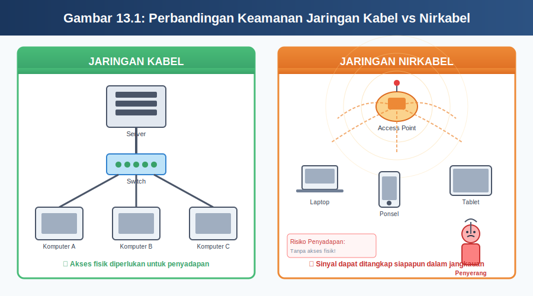
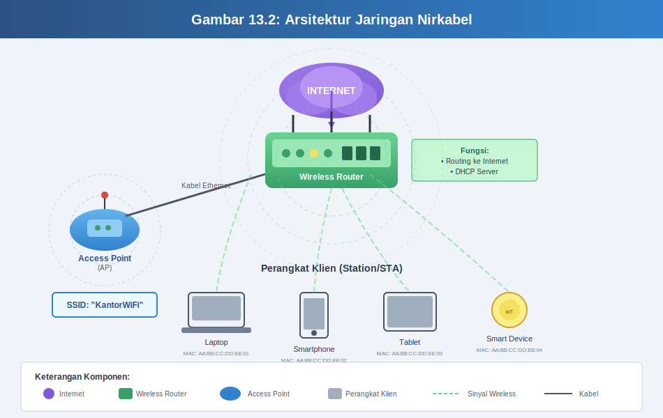
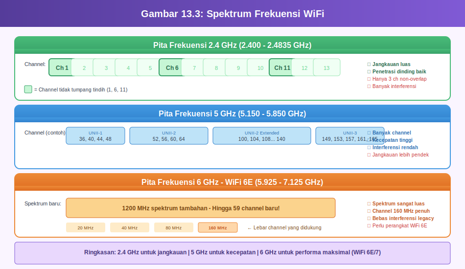
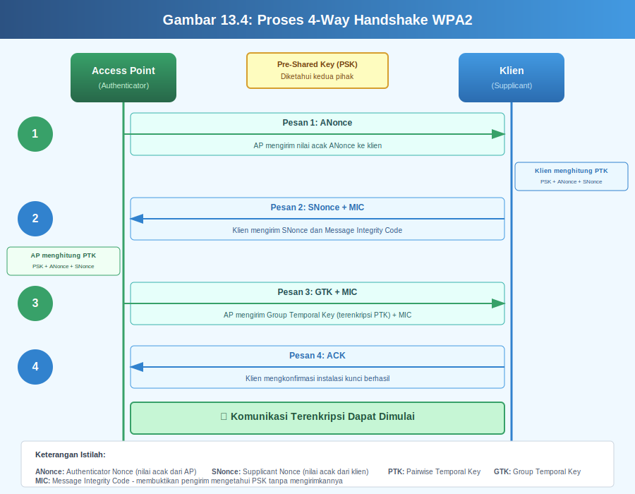
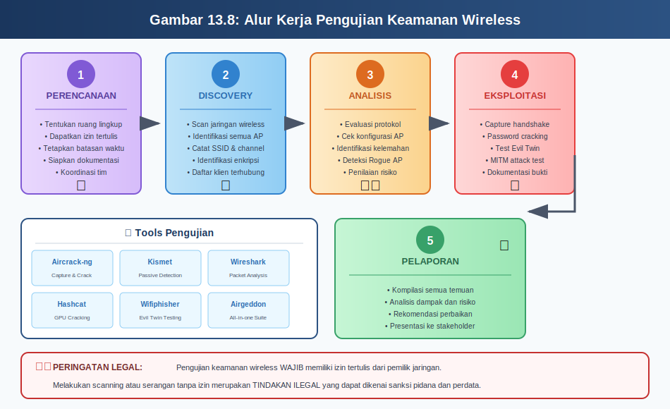
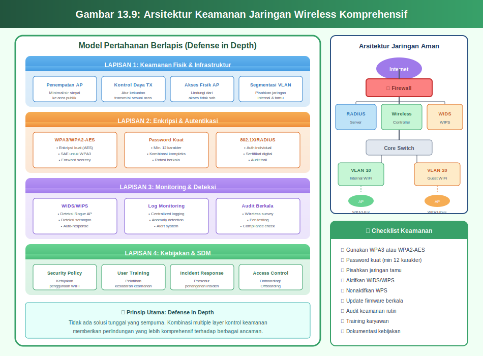

# MODUL 13: KEAMANAN JARINGAN NIRKABEL (WIRELESS NETWORK SECURITY)

## Informasi Modul

**Mata Kuliah:** Pengantar Keamanan Siber  
**Pertemuan:** 13  
**Topik:** Keamanan Jaringan Nirkabel (Wireless Network Security)  
**Durasi:** 3 x 50 menit  
**Referensi Utama:** CEH v13 Module 16: Hacking Wireless Networks

---

## Capaian Pembelajaran

### CPMK yang Dicapai
**CPMK 5:** Mahasiswa mampu menganalisis serangan umum pada sistem, jaringan, dan aplikasi web serta merumuskan strategi mitigasinya.

### Sub-CPMK Pertemuan Ini

**Sub-CPMK 5.19:** Mahasiswa mampu menjelaskan konsep keamanan jaringan nirkabel.

**Sub-CPMK 5.20:** Mahasiswa mampu mengidentifikasi kerentanan pada jaringan nirkabel.

**Sub-CPMK 5.21:** Mahasiswa mampu menjelaskan strategi pengamanan jaringan nirkabel.

### Tujuan Pembelajaran Khusus

Setelah mempelajari modul ini, mahasiswa diharapkan mampu memahami konsep keamanan jaringan nirkabel secara menyeluruh, mempelajari protokol enkripsi wireless seperti WEP, WPA, WPA2, dan WPA3, mengidentifikasi berbagai kerentanan yang ada pada jaringan nirkabel, serta memahami teknik pengamanan jaringan nirkabel yang efektif untuk melindungi infrastruktur komunikasi tanpa kabel.

---

## 13.1 Pengantar Jaringan Nirkabel

### 13.1.1 Apa Itu Jaringan Nirkabel?

Bayangkan Anda sedang duduk di sebuah kafe dan dapat mengakses internet melalui ponsel atau laptop tanpa perlu mencolokkan kabel apapun. Kemudahan ini dimungkinkan oleh teknologi jaringan nirkabel atau yang sering disebut dengan istilah WiFi. Jaringan nirkabel adalah sistem komunikasi data yang memungkinkan perangkat-perangkat elektronik untuk saling terhubung dan bertukar informasi tanpa menggunakan kabel fisik sebagai media penghantarnya.

Berbeda dengan jaringan kabel tradisional yang menggunakan kabel tembaga atau serat optik untuk mengirimkan data, jaringan nirkabel memanfaatkan gelombang radio sebagai media transmisi. Gelombang radio ini bekerja dengan cara yang mirip seperti siaran radio atau televisi, dimana informasi dikodekan ke dalam gelombang elektromagnetik yang kemudian dipancarkan melalui udara dan diterima oleh perangkat yang memiliki antena penerima yang sesuai.

Teknologi jaringan nirkabel telah mengalami perkembangan yang sangat pesat sejak pertama kali diperkenalkan pada tahun 1997. Pada awalnya, kecepatan transfer data yang dapat dicapai hanya sekitar 2 Mbps atau megabit per detik, yang terasa sangat lambat dibandingkan dengan standar saat ini. Namun seiring berjalannya waktu dan kemajuan teknologi, kecepatan jaringan nirkabel terus meningkat hingga saat ini dapat mencapai beberapa gigabit per detik dengan standar WiFi 6 dan WiFi 7.

### 13.1.2 Mengapa Keamanan Jaringan Nirkabel Penting?

Ketika Anda menggunakan kabel untuk menghubungkan komputer ke jaringan, seseorang yang ingin menyadap komunikasi Anda harus secara fisik mengakses kabel tersebut. Hal ini tentu saja lebih sulit dilakukan karena memerlukan akses langsung ke infrastruktur jaringan. Namun situasinya sangat berbeda dengan jaringan nirkabel.

Pada jaringan nirkabel, sinyal radio yang membawa data Anda dipancarkan ke segala arah dan dapat ditangkap oleh siapapun yang berada dalam jangkauan sinyal tersebut. Analoginya seperti berbicara dengan suara keras di tempat umum, dimana setiap orang di sekitar Anda dapat mendengar percakapan tersebut. Tanpa perlindungan yang memadai, informasi sensitif seperti kata sandi, nomor kartu kredit, atau dokumen rahasia dapat dengan mudah dicuri oleh pihak yang tidak berwenang.

Selain risiko penyadapan, jaringan nirkabel juga menghadapi ancaman berupa akses tidak sah. Seseorang yang berada di luar gedung kantor atau rumah Anda masih dapat mencoba untuk terhubung ke jaringan wireless Anda jika tidak diamankan dengan baik. Hal ini tidak hanya dapat memperlambat koneksi internet Anda, tetapi juga membuka pintu bagi berbagai aktivitas berbahaya seperti pencurian data, penyebaran malware, atau bahkan penggunaan jaringan Anda untuk melakukan kejahatan siber lainnya.

*Gambar 13.1: Perbandingan Keamanan Jaringan Kabel vs Nirkabel*

### 13.1.3 Komponen Utama Jaringan Nirkabel

Untuk memahami keamanan jaringan nirkabel dengan baik, kita perlu mengenal terlebih dahulu komponen-komponen utama yang membentuk infrastruktur jaringan wireless. Setiap komponen memiliki peran penting dan juga dapat menjadi titik kerentanan jika tidak dikonfigurasi dengan benar.

**Access Point (AP)** merupakan komponen sentral dalam jaringan nirkabel yang berfungsi sebagai jembatan antara perangkat wireless dan jaringan kabel. Access Point dapat dianalogikan sebagai stasiun pemancar radio yang menerima dan mengirimkan sinyal wireless ke semua perangkat dalam jangkauannya. Perangkat ini biasanya terhubung langsung ke router atau switch melalui kabel ethernet dan bertanggung jawab untuk mengatur lalu lintas data antara jaringan kabel dan nirkabel.

**Wireless Router** adalah perangkat yang menggabungkan fungsi Access Point dengan kemampuan routing. Di rumah atau kantor kecil, wireless router biasanya menjadi perangkat tunggal yang menangani seluruh kebutuhan jaringan, termasuk koneksi ke internet, distribusi alamat IP melalui DHCP, dan penyediaan koneksi wireless. Wireless router modern umumnya sudah dilengkapi dengan fitur keamanan bawaan seperti firewall dan dukungan untuk berbagai protokol enkripsi.

**Station (STA)** atau klien adalah istilah teknis untuk setiap perangkat yang terhubung ke jaringan wireless, seperti laptop, smartphone, tablet, atau perangkat Internet of Things (IoT) lainnya. Setiap station memiliki kartu jaringan wireless atau wireless network adapter yang memungkinkannya untuk mengirim dan menerima sinyal radio. Identitas unik dari setiap station ditandai dengan alamat MAC atau Media Access Control yang tertanam pada perangkat kerasnya.

**Service Set Identifier (SSID)** adalah nama yang diberikan kepada jaringan wireless untuk membedakannya dari jaringan lain di sekitarnya. Ketika Anda mencari jaringan WiFi yang tersedia pada smartphone atau laptop, daftar nama yang muncul adalah SSID dari berbagai Access Point yang berada dalam jangkauan. SSID dapat dikonfigurasi untuk terlihat atau disembunyikan sesuai kebijakan keamanan yang diterapkan.

*Gambar 13.2: Arsitektur Jaringan Nirkabel*

---

## 13.2 Standar dan Protokol Jaringan Nirkabel

### 13.2.1 Evolusi Standar IEEE 802.11

Institute of Electrical and Electronics Engineers atau IEEE adalah organisasi internasional yang bertanggung jawab untuk mengembangkan standar teknologi, termasuk standar untuk jaringan nirkabel. Semua standar jaringan wireless yang kita kenal saat ini berada di bawah payung IEEE 802.11, yang kemudian diberi tambahan huruf untuk menunjukkan versi atau revisi tertentu.

Standar pertama yang dirilis adalah **IEEE 802.11** pada tahun 1997 yang menawarkan kecepatan maksimum hanya 2 Mbps pada frekuensi 2.4 GHz. Meskipun lambat menurut standar saat ini, teknologi ini merupakan terobosan yang membuka jalan bagi perkembangan wireless selanjutnya.

**IEEE 802.11b** diperkenalkan pada tahun 1999 dan meningkatkan kecepatan menjadi 11 Mbps pada frekuensi 2.4 GHz. Standar ini menjadi sangat populer dan mulai diadopsi secara luas di kalangan bisnis dan konsumen. Namun frekuensi 2.4 GHz memiliki kelemahan karena juga digunakan oleh banyak perangkat lain seperti microwave, telepon cordless, dan perangkat Bluetooth, sehingga rentan terhadap interferensi.

Pada tahun yang sama, **IEEE 802.11a** juga dirilis dengan kemampuan yang lebih tinggi yaitu 54 Mbps, tetapi beroperasi pada frekuensi 5 GHz. Frekuensi yang lebih tinggi ini menawarkan lebih banyak channel yang tersedia dan interferensi yang lebih rendah, namun memiliki jangkauan yang lebih pendek dibandingkan dengan 2.4 GHz.

**IEEE 802.11g** yang muncul pada tahun 2003 menggabungkan keunggulan kedua pendahulunya dengan menawarkan kecepatan 54 Mbps pada frekuensi 2.4 GHz. Standar ini kompatibel mundur dengan 802.11b sehingga perangkat lama masih dapat terhubung meskipun dengan kecepatan yang lebih rendah.

Revolusi besar terjadi dengan diperkenalkannya **IEEE 802.11n** atau yang kemudian dikenal sebagai WiFi 4 pada tahun 2009. Standar ini memperkenalkan teknologi MIMO atau Multiple Input Multiple Output yang memungkinkan penggunaan beberapa antena secara bersamaan untuk meningkatkan throughput. Kecepatan maksimum yang dapat dicapai melonjak hingga 600 Mbps dengan kemampuan beroperasi pada frekuensi 2.4 GHz maupun 5 GHz.

**IEEE 802.11ac** atau WiFi 5 yang dirilis pada tahun 2013 membawa peningkatan signifikan dengan dukungan untuk channel yang lebih lebar dan teknologi MU-MIMO atau Multi-User MIMO. Kecepatan maksimum dapat mencapai 6.9 Gbps secara teoritis, meskipun dalam praktiknya kecepatan yang dicapai biasanya jauh di bawah angka tersebut.

Standar terbaru yang saat ini banyak diadopsi adalah **IEEE 802.11ax** atau WiFi 6 yang diperkenalkan pada tahun 2019. WiFi 6 membawa berbagai peningkatan termasuk OFDMA atau Orthogonal Frequency Division Multiple Access yang memungkinkan transmisi data ke beberapa perangkat secara bersamaan, serta peningkatan efisiensi spektrum yang signifikan. Kecepatan maksimum teoritis mencapai 9.6 Gbps dengan latensi yang lebih rendah dan konsumsi daya yang lebih efisien.

### 13.2.2 Frekuensi dan Channel

Jaringan wireless beroperasi pada pita frekuensi tertentu yang telah dialokasikan untuk penggunaan tanpa lisensi oleh regulator telekomunikasi di berbagai negara. Dua pita frekuensi utama yang digunakan adalah 2.4 GHz dan 5 GHz, masing-masing dengan karakteristik yang berbeda.

Pita frekuensi **2.4 GHz** memiliki rentang dari 2.400 GHz hingga 2.4835 GHz dan dibagi menjadi 14 channel, meskipun tidak semua channel tersedia di setiap negara. Di Indonesia, umumnya hanya channel 1 hingga 13 yang diizinkan untuk digunakan. Keunggulan utama frekuensi 2.4 GHz adalah jangkauannya yang lebih luas dan kemampuan menembus dinding atau penghalang fisik dengan lebih baik. Namun kelemahannya adalah jumlah channel yang tidak tumpang tindih hanya ada tiga yaitu channel 1, 6, dan 11, sehingga di area padat seperti apartemen atau perkantoran, interferensi antar jaringan menjadi masalah serius.

Pita frekuensi **5 GHz** menawarkan spektrum yang jauh lebih luas dengan lebih dari 20 channel yang tidak tumpang tindih. Hal ini membuat frekuensi 5 GHz ideal untuk lingkungan dengan banyak jaringan wireless yang berdekatan. Kecepatan yang dapat dicapai juga lebih tinggi karena tersedia bandwidth yang lebih besar. Namun sebagai kompensasi, sinyal pada frekuensi 5 GHz memiliki jangkauan yang lebih pendek dan lebih sulit menembus penghalang fisik seperti dinding beton.

WiFi 6E yang merupakan ekstensi dari WiFi 6 memperkenalkan pita frekuensi baru yaitu **6 GHz** yang menawarkan spektrum tambahan yang sangat luas. Dengan lebih dari 1200 MHz spektrum yang tersedia, WiFi 6E dapat menyediakan channel dengan lebar hingga 160 MHz tanpa tumpang tindih, membuka kemungkinan untuk kecepatan yang lebih tinggi dan latensi yang lebih rendah.

*Gambar 13.3: Spektrum Frekuensi WiFi*

---

## 13.3 Protokol Enkripsi Jaringan Nirkabel

### 13.3.1 Wired Equivalent Privacy (WEP)

Wired Equivalent Privacy atau WEP adalah protokol keamanan pertama yang dikembangkan untuk jaringan wireless dengan tujuan memberikan tingkat keamanan yang setara dengan jaringan kabel. Diperkenalkan bersamaan dengan standar 802.11 asli pada tahun 1997, WEP menggunakan algoritma enkripsi RC4 dengan kunci sepanjang 40 bit atau 104 bit ditambah dengan Initialization Vector (IV) sepanjang 24 bit.

Mekanisme kerja WEP dapat dianalogikan seperti mengunci pintu dengan gembok sederhana. Ketika data akan dikirimkan, WEP terlebih dahulu menghasilkan sebuah IV yang berbeda untuk setiap paket data. IV ini kemudian digabungkan dengan kunci enkripsi yang telah dikonfigurasi sebelumnya untuk menghasilkan keystream menggunakan algoritma RC4. Data asli atau plaintext kemudian di-XOR dengan keystream untuk menghasilkan ciphertext yang terenkripsi.

Sayangnya, WEP memiliki kelemahan fatal dalam desainnya. Pertama, panjang IV yang hanya 24 bit berarti hanya ada sekitar 16 juta kemungkinan kombinasi IV yang berbeda. Pada jaringan yang sibuk, IV yang sama dapat terulang dalam hitungan jam, menciptakan kondisi yang disebut IV collision. Kedua, IV dikirimkan dalam bentuk plaintext bersamaan dengan paket data terenkripsi, memungkinkan penyerang untuk mengumpulkan paket-paket dengan IV yang sama.

Kelemahan lain yang sangat serius adalah penggunaan checksum CRC-32 yang tidak kriptografis untuk menjamin integritas data. Penyerang yang memahami struktur paket dapat memodifikasi isi paket dan menghitung ulang checksum tanpa mengetahui kunci enkripsi. Kombinasi dari semua kelemahan ini membuat WEP dapat dipecahkan dalam hitungan menit menggunakan tools yang tersedia secara bebas seperti Aircrack-ng.

Meskipun sudah dinyatakan tidak aman dan tidak direkomendasikan untuk digunakan sejak tahun 2004, WEP masih dapat ditemukan pada beberapa perangkat lama atau jaringan yang tidak dikelola dengan baik. Menggunakan WEP saat ini sama saja dengan tidak menggunakan enkripsi sama sekali dari perspektif keamanan.

### 13.3.2 WiFi Protected Access (WPA)

WiFi Protected Access atau WPA dikembangkan sebagai solusi sementara untuk mengatasi kelemahan WEP sementara standar keamanan yang lebih komprehensif masih dalam tahap pengembangan. Diperkenalkan pada tahun 2003 oleh WiFi Alliance, WPA dirancang agar dapat diimplementasikan pada perangkat keras yang sudah ada melalui pembaruan firmware.

WPA memperkenalkan protokol enkripsi baru yang disebut Temporal Key Integrity Protocol atau TKIP. Berbeda dengan WEP yang menggunakan kunci statis, TKIP secara otomatis mengubah kunci enkripsi untuk setiap paket data yang dikirimkan. Proses ini disebut per-packet key mixing dan secara dramatis meningkatkan keamanan dibandingkan dengan pendekatan WEP.

Selain itu, WPA juga mengganti checksum CRC-32 yang lemah dengan Message Integrity Check atau MIC yang lebih kuat. MIC menggunakan algoritma yang disebut Michael yang dapat mendeteksi apakah paket data telah dimodifikasi selama transmisi. Jika serangan terdeteksi, WPA akan menonaktifkan koneksi wireless untuk sementara waktu sebagai mekanisme pertahanan.

WPA mendukung dua mode autentikasi yang berbeda. **WPA-Personal** atau WPA-PSK menggunakan Pre-Shared Key yaitu kata sandi yang sama dibagikan ke semua pengguna yang ingin terhubung ke jaringan. Mode ini cocok untuk penggunaan rumah atau kantor kecil dimana jumlah pengguna terbatas dan manajemen yang sederhana lebih diutamakan.

**WPA-Enterprise** menggunakan server RADIUS atau Remote Authentication Dial-In User Service untuk melakukan autentikasi individual. Setiap pengguna memiliki kredensial unik berupa username dan password, serta dapat diterapkan kebijakan akses yang berbeda untuk setiap pengguna atau kelompok pengguna. Mode ini lebih sesuai untuk organisasi besar yang memerlukan kontrol akses yang lebih granular dan audit trail yang komprehensif.

Meskipun jauh lebih aman dibandingkan WEP, WPA dengan TKIP masih memiliki beberapa kelemahan. Algoritma Michael yang digunakan untuk MIC relatif lemah dan dalam kondisi tertentu dapat di-bypass. Selain itu, TKIP masih berbasis pada RC4 yang merupakan algoritma yang semakin usang. Oleh karena itu, penggunaan WPA saat ini sudah tidak direkomendasikan dan sebaiknya diganti dengan WPA2 atau WPA3.

### 13.3.3 WiFi Protected Access 2 (WPA2)

WPA2 dirilis pada tahun 2004 sebagai implementasi penuh dari standar keamanan IEEE 802.11i. Perbedaan paling mendasar dengan WPA adalah penggantian total algoritma enkripsi dari RC4/TKIP menjadi AES atau Advanced Encryption Standard dengan mode operasi CCMP atau Counter Mode with Cipher Block Chaining Message Authentication Code Protocol.

AES adalah algoritma enkripsi simetris yang diadopsi oleh pemerintah Amerika Serikat untuk melindungi informasi rahasia dan saat ini dianggap sebagai standar enkripsi yang sangat kuat. AES menggunakan blok data berukuran 128 bit dan mendukung kunci dengan panjang 128, 192, atau 256 bit. Dalam implementasi WPA2, umumnya digunakan kunci 128 bit yang sudah memberikan tingkat keamanan yang sangat tinggi.

CCMP menggabungkan fungsi enkripsi dengan autentikasi pesan dalam satu mekanisme yang efisien. Counter Mode digunakan untuk enkripsi data dimana sebuah counter yang unik untuk setiap blok data di-enkripsi dan kemudian di-XOR dengan plaintext. CBC-MAC atau Cipher Block Chaining Message Authentication Code digunakan untuk menghasilkan tag autentikasi yang memastikan integritas dan keaslian data.

Sama seperti WPA, WPA2 juga tersedia dalam dua mode yaitu **WPA2-Personal** dan **WPA2-Enterprise**. WPA2-Personal menggunakan metode autentikasi yang disebut 4-way handshake untuk memverifikasi bahwa klien mengetahui Pre-Shared Key tanpa harus mengirimkan kunci tersebut melalui udara. Proses ini melibatkan pertukaran empat pesan antara Access Point dan klien untuk menghasilkan kunci sesi yang unik.

*Gambar 13.4: Proses 4-Way Handshake WPA2*

Meskipun WPA2 jauh lebih aman dibandingkan pendahulunya, protokol ini masih memiliki beberapa kerentanan yang perlu diperhatikan. Serangan brute force terhadap kata sandi yang lemah masih memungkinkan dilakukan dengan menangkap 4-way handshake dan kemudian mencoba berbagai kombinasi kata sandi secara offline. Selain itu, pada tahun 2017 ditemukan kerentanan serius yang disebut KRACK atau Key Reinstallation Attack yang memungkinkan penyerang untuk mendekripsi lalu lintas jaringan pada kondisi tertentu.

### 13.3.4 WiFi Protected Access 3 (WPA3)

WPA3 diperkenalkan pada tahun 2018 sebagai respons terhadap berbagai kelemahan yang ditemukan pada WPA2 dan untuk menghadapi ancaman keamanan modern yang semakin canggih. Standar ini membawa beberapa peningkatan signifikan dalam hal keamanan dan kemudahan penggunaan.

Perubahan paling penting dalam **WPA3-Personal** adalah penggantian Pre-Shared Key authentication dengan protokol baru yang disebut Simultaneous Authentication of Equals atau SAE. SAE didasarkan pada protokol Dragonfly key exchange yang memberikan perlindungan terhadap serangan dictionary attack bahkan jika kata sandi yang digunakan tergolong lemah.

Cara kerja SAE berbeda secara fundamental dengan 4-way handshake pada WPA2. Pada SAE, kedua belah pihak secara simultan membuktikan pengetahuan mereka tentang kata sandi tanpa pernah mengirimkan informasi yang dapat digunakan untuk menebak kata sandi tersebut. Bahkan jika penyerang berhasil menangkap seluruh pertukaran pesan SAE, mereka tidak dapat melakukan serangan brute force offline seperti yang mungkin dilakukan pada WPA2.

WPA3 juga memperkenalkan konsep **forward secrecy** yang berarti bahwa kunci sesi yang digunakan untuk setiap koneksi bersifat unik dan independen. Jika suatu saat di masa depan kata sandi jaringan berhasil dikompromikan, penyerang tidak dapat menggunakan informasi tersebut untuk mendekripsi lalu lintas yang telah direkam sebelumnya.

**WPA3-Enterprise** meningkatkan keamanan dengan mewajibkan penggunaan mode keamanan 192-bit yang setara dengan algoritma kriptografi yang digunakan untuk melindungi informasi rahasia pemerintah. Mode ini menggunakan suite kriptografi Commercial National Security Algorithm atau CNSA yang meliputi AES-256-GCM untuk enkripsi, SHA-384 untuk hashing, dan ECDHE dengan kurva P-384 untuk pertukaran kunci.

Fitur tambahan lain yang diperkenalkan WPA3 adalah **Enhanced Open** yang menggunakan protokol Opportunistic Wireless Encryption atau OWE. Fitur ini memberikan enkripsi pada jaringan terbuka yang tidak memerlukan kata sandi, seperti WiFi publik di bandara atau kafe. Meskipun tidak ada autentikasi, setidaknya lalu lintas data dienkripsi sehingga tidak dapat disadap dengan mudah oleh pengguna lain yang terhubung ke jaringan yang sama.

WPA3 juga menyertakan fitur **WiFi Easy Connect** yang menyederhanakan proses konfigurasi perangkat IoT yang tidak memiliki layar atau antarmuka input yang memadai. Dengan menggunakan kode QR, perangkat dapat dengan aman terhubung ke jaringan tanpa perlu memasukkan kata sandi secara manual.

*Gambar 13.5: Perbandingan Fitur Keamanan WEP, WPA, WPA2, dan WPA3*

---

## 13.4 Kerentanan Jaringan Nirkabel

### 13.4.1 Serangan Terhadap Infrastruktur

Infrastruktur jaringan nirkabel menghadapi berbagai jenis serangan yang dapat mengkompromikan keamanan dan ketersediaan layanan. Pemahaman tentang serangan-serangan ini sangat penting untuk dapat merancang pertahanan yang efektif.

**Rogue Access Point** adalah Access Point tidak resmi yang dipasang pada jaringan tanpa sepengetahuan atau izin dari administrator jaringan. Rogue AP dapat dipasang oleh karyawan yang tidak sadar akan risiko keamanan, misalnya untuk mendapatkan koneksi wireless yang lebih nyaman, atau dapat juga dipasang secara sengaja oleh penyerang yang telah mendapatkan akses fisik ke lingkungan target.

Bahaya dari Rogue AP adalah membuka pintu masuk ke jaringan internal yang biasanya dilindungi oleh firewall dan kontrol keamanan lainnya. Jika Rogue AP terhubung ke jaringan kabel internal dan tidak dilindungi dengan enkripsi yang memadai, penyerang dari luar dapat dengan mudah mendapatkan akses ke sumber daya internal. Selain itu, Rogue AP yang dikonfigurasi dengan SSID yang sama dengan jaringan resmi dapat menyebabkan kebingungan dan membuat beberapa perangkat terhubung ke AP yang salah.

**Evil Twin Attack** adalah bentuk serangan yang lebih canggih dimana penyerang membuat Access Point palsu yang meniru identitas Access Point yang sah. Penyerang mengkonfigurasi Evil Twin dengan SSID yang sama, dan sering kali dengan sinyal yang lebih kuat agar perangkat korban memilih untuk terhubung ke AP palsu tersebut.

Setelah korban terhubung ke Evil Twin, penyerang dapat melakukan berbagai aktivitas berbahaya. Semua lalu lintas internet korban akan melewati perangkat penyerang, memungkinkan penyadapan kredensial login, nomor kartu kredit, atau informasi sensitif lainnya. Penyerang juga dapat melakukan serangan man-in-the-middle untuk memodifikasi lalu lintas, menyuntikkan malware, atau mengarahkan korban ke situs web palsu.

*Gambar 13.6: Ilustrasi Evil Twin Attack*

**Wireless Denial of Service (DoS)** merupakan serangan yang bertujuan untuk mengganggu atau melumpuhkan ketersediaan jaringan wireless. Berbagai teknik dapat digunakan untuk melakukan serangan DoS pada jaringan nirkabel.

Deauthentication attack adalah salah satu teknik DoS yang paling efektif dan mudah dilakukan. Pada protokol 802.11, pesan deauthentication digunakan untuk memutuskan koneksi antara klien dan Access Point. Sayangnya, pesan ini tidak dilindungi oleh enkripsi dan dapat dipalsukan oleh siapapun. Penyerang dapat mengirimkan ratusan pesan deauthentication palsu per detik, menyebabkan semua perangkat yang terhubung terus-menerus terputus dan tidak dapat menggunakan jaringan.

Jamming atau pengacauan sinyal adalah teknik DoS yang bekerja pada level fisik dengan memancarkan noise pada frekuensi yang sama dengan jaringan wireless target. Tidak seperti deauthentication attack yang memerlukan pengetahuan teknis tentang protokol 802.11, jamming dapat dilakukan dengan perangkat pemancar radio sederhana. Namun penggunaan jammer adalah ilegal di sebagian besar negara karena dapat mengganggu komunikasi nirkabel lainnya.

### 13.4.2 Serangan Terhadap Klien

Perangkat klien yang terhubung ke jaringan wireless juga dapat menjadi target serangan langsung. Beberapa serangan bahkan dapat dilakukan tanpa perlu mengkompromikan Access Point atau infrastruktur jaringan.

**Caffe Latte Attack** adalah teknik yang memanfaatkan kelemahan dalam cara perangkat wireless menyimpan dan menggunakan profil jaringan. Ketika perangkat tidak terhubung ke jaringan apapun, perangkat tersebut akan secara periodik mengirimkan probe request untuk mencari jaringan-jaringan yang pernah tersimpan dalam daftar jaringan tersimpan.

Penyerang dapat menangkap probe request ini untuk mengetahui SSID jaringan yang dicari oleh perangkat korban. Jika jaringan tersebut menggunakan WEP, penyerang dapat membuat AP palsu dengan SSID yang sama dan memanipulasi lalu lintas untuk mengumpulkan paket-paket yang diperlukan untuk memecahkan kunci WEP, bahkan tanpa pernah terhubung ke jaringan asli.

**KARMA Attack** lebih agresif lagi dengan cara merespons semua probe request dari perangkat klien. Ketika perangkat mengirimkan probe request untuk "Jaringan_Kantor", misalnya, KARMA AP akan merespons dengan menyatakan bahwa dia adalah "Jaringan_Kantor". Perangkat korban yang tidak waspada akan terhubung ke AP penyerang dengan mengira sedang terhubung ke jaringan yang familiar.

### 13.4.3 Serangan Terhadap Protokol Enkripsi

Selain serangan terhadap infrastruktur dan klien, penyerang juga dapat menyasar kelemahan dalam protokol enkripsi yang digunakan untuk melindungi lalu lintas data.

**Serangan terhadap WEP** seperti yang telah dijelaskan sebelumnya merupakan yang paling mudah dilakukan karena kelemahan fundamental dalam desain protokol. Teknik seperti Chop-Chop attack, Fragmentation attack, dan PTW attack dapat memecahkan kunci WEP dalam hitungan menit dengan mengumpulkan cukup banyak paket data.

**Dictionary Attack terhadap WPA/WPA2** bekerja dengan menangkap 4-way handshake dan kemudian mencoba berbagai kombinasi kata sandi secara offline. Keberhasilan serangan ini sangat bergantung pada kekuatan kata sandi yang digunakan. Kata sandi yang pendek atau menggunakan kata-kata umum dapat dipecahkan dalam hitungan jam atau hari menggunakan perangkat keras modern dengan GPU yang powerful.

**KRACK (Key Reinstallation Attack)** ditemukan pada tahun 2017 dan memengaruhi hampir semua implementasi WPA2. Serangan ini memanfaatkan kelemahan dalam state machine dari 4-way handshake dimana penyerang dapat memaksa klien untuk menggunakan ulang kunci enkripsi yang seharusnya hanya digunakan sekali. Dengan memanipulasi dan memutar ulang pesan handshake, penyerang dapat mendekripsi paket data atau bahkan menyuntikkan paket palsu dalam kondisi tertentu.

**Dragonblood** adalah serangkaian kerentanan yang ditemukan pada implementasi WPA3-SAE pada tahun 2019. Meskipun protokol SAE secara teoritis lebih aman, implementasi yang tidak sempurna dapat membocorkan informasi tentang kata sandi melalui side-channel attack seperti timing attack. Kerentanan ini telah diperbaiki pada update firmware, menunjukkan pentingnya selalu memperbarui perangkat jaringan.

*Gambar 13.7: Alur Serangan Dictionary Attack pada WPA2*

---

## 13.5 Teknik Penetration Testing Jaringan Nirkabel

### 13.5.1 Metodologi Pengujian Keamanan Wireless

Pengujian keamanan atau penetration testing pada jaringan nirkabel harus dilakukan secara sistematis mengikuti metodologi yang terstruktur. Pendekatan yang metodis memastikan bahwa semua aspek keamanan dievaluasi secara komprehensif dan hasil pengujian dapat direproduksi serta dipertanggungjawabkan.

**Fase Perencanaan** merupakan tahap awal dimana ruang lingkup dan batasan pengujian ditentukan. Hal-hal yang perlu diklarifikasi termasuk jaringan mana saja yang boleh diuji, teknik apa yang diizinkan, jangka waktu pengujian, dan apa yang harus dilakukan jika ditemukan kerentanan kritis. Dokumentasi persetujuan tertulis dari pemilik jaringan sangat penting untuk menghindari masalah legal.

**Fase Discovery** fokus pada pengumpulan informasi tentang jaringan wireless yang ada di lingkungan target. Ini termasuk mengidentifikasi semua Access Point yang terdeteksi, protokol keamanan yang digunakan, channel yang digunakan, kekuatan sinyal, dan klien yang terhubung. Informasi ini akan menjadi dasar untuk tahap pengujian selanjutnya.

**Fase Analisis Kerentanan** melibatkan evaluasi terhadap informasi yang dikumpulkan untuk mengidentifikasi potensi kelemahan. Misalnya, jaringan yang masih menggunakan WEP jelas merupakan kerentanan serius, atau Access Point dengan konfigurasi default yang tidak diubah dapat menjadi celah masuk yang mudah.

**Fase Eksploitasi** adalah tahap dimana pentester mencoba untuk memanfaatkan kerentanan yang ditemukan. Ini dapat mencakup memecahkan kunci enkripsi, mendapatkan akses tidak sah ke jaringan, atau melakukan serangan man-in-the-middle. Semua aktivitas harus didokumentasikan dengan detail.

**Fase Pelaporan** mengkonsolidasikan semua temuan ke dalam laporan yang komprehensif yang mencakup deskripsi kerentanan, bukti eksploitasi, penilaian risiko, dan rekomendasi perbaikan. Laporan harus ditulis dengan bahasa yang dapat dipahami oleh audiens teknis maupun non-teknis.

### 13.5.2 Tools untuk Pengujian Keamanan Wireless

Berbagai tools tersedia untuk membantu dalam pengujian keamanan jaringan nirkabel. Sebagian besar tools ini tersedia secara gratis dan sudah termasuk dalam distribusi Linux khusus untuk keamanan seperti Kali Linux.

**Aircrack-ng Suite** adalah kumpulan tools yang paling komprehensif untuk pengujian keamanan wireless. Suite ini terdiri dari beberapa komponen utama yang masing-masing memiliki fungsi spesifik.

Airmon-ng digunakan untuk mengaktifkan mode monitor pada kartu jaringan wireless. Mode monitor memungkinkan kartu untuk menangkap semua paket wireless yang terdeteksi, bukan hanya paket yang ditujukan kepada perangkat tersebut. Ini adalah langkah pertama yang diperlukan sebelum melakukan analisis atau serangan apapun.

Airodump-ng adalah tool untuk menangkap dan menganalisis paket wireless. Tool ini menampilkan informasi detail tentang semua jaringan wireless yang terdeteksi termasuk BSSID, SSID, channel, enkripsi yang digunakan, dan klien yang terhubung. Airodump-ng juga dapat fokus pada jaringan tertentu dan menyimpan paket yang ditangkap untuk analisis lebih lanjut.

Aireplay-ng menyediakan berbagai teknik injeksi paket yang dapat digunakan untuk meningkatkan lalu lintas jaringan atau melakukan serangan tertentu. Fungsi yang paling sering digunakan adalah deauthentication attack untuk memaksa klien terhubung ulang, yang diperlukan untuk menangkap handshake pada jaringan WPA/WPA2.

Aircrack-ng adalah tool untuk memecahkan kunci enkripsi WEP dan kata sandi WPA/WPA2 dari paket yang telah ditangkap. Untuk WEP, Aircrack-ng menggunakan teknik statistik seperti PTW attack untuk menemukan kunci dari IV yang dikumpulkan. Untuk WPA/WPA2, Aircrack-ng melakukan dictionary attack terhadap 4-way handshake yang ditangkap.

**Kismet** adalah detektor jaringan wireless, sniffer, dan sistem deteksi intrusi yang bersifat pasif. Berbeda dengan tools lain yang aktif mengirimkan probe request, Kismet hanya mendengarkan dan menganalisis lalu lintas yang ada. Hal ini membuatnya lebih sulit untuk dideteksi dan cocok untuk reconnaissance awal.

**Wireshark** adalah penganalisis protokol jaringan yang dapat menangkap dan memeriksa paket data secara detail. Meskipun bukan tool khusus wireless, Wireshark sangat berguna untuk menganalisis lalu lintas jaringan yang ditangkap, mengidentifikasi protokol yang digunakan, dan menemukan informasi sensitif yang mungkin tidak terenkripsi.

**Hashcat** adalah tool pemecah kata sandi yang memanfaatkan kekuatan GPU untuk melakukan serangan brute force dengan kecepatan sangat tinggi. Hashcat dapat digunakan untuk mempercepat proses cracking handshake WPA/WPA2 yang telah ditangkap, terutama jika kata sandi yang digunakan tidak terlalu kompleks.

**Wifiphisher** adalah framework untuk melakukan serangan Evil Twin dan phishing pada jaringan wireless. Tool ini mengotomatisasi proses pembuatan AP palsu, memaksa klien untuk terputus dari jaringan asli, dan menampilkan halaman login palsu untuk mencuri kredensial.

*Gambar 13.8: Alur Kerja Pengujian Keamanan Wireless*

### 13.5.3 Pertimbangan Legal dan Etis

Pengujian keamanan jaringan wireless harus selalu dilakukan dengan memperhatikan aspek legal dan etis. Mengakses jaringan tanpa izin merupakan tindakan ilegal di hampir semua yurisdiksi dan dapat dikenakan sanksi pidana maupun perdata.

Sebelum melakukan pengujian apapun, pentester harus memiliki izin tertulis yang jelas dari pemilik jaringan. Izin ini harus mencakup ruang lingkup pengujian, teknik yang diizinkan, jangka waktu, dan prosedur penanganan jika ditemukan kerentanan atau terjadi insiden. Tanpa izin yang sah, bahkan scanning jaringan secara pasif dapat dianggap sebagai tindakan ilegal.

Pentester juga harus berhati-hati untuk tidak mengganggu jaringan atau pengguna lain yang tidak termasuk dalam ruang lingkup pengujian. Sinyal wireless tidak mengenal batas fisik, sehingga jaringan tetangga atau pengguna yang kebetulan lewat dapat terpengaruh oleh aktivitas pengujian. Serangan DoS harus dihindari atau dilakukan dengan sangat hati-hati untuk meminimalkan dampak pada operasional normal.

---

## 13.6 Strategi Pengamanan Jaringan Nirkabel

### 13.6.1 Keamanan pada Level Infrastruktur

Pengamanan jaringan wireless yang efektif memerlukan pendekatan berlapis yang dimulai dari infrastruktur jaringan itu sendiri. Konfigurasi yang tepat pada Access Point dan komponen jaringan lainnya merupakan fondasi dari keamanan wireless.

**Menggunakan enkripsi yang kuat** adalah langkah pertama dan paling penting. Jaringan harus dikonfigurasi untuk menggunakan WPA3 jika semua perangkat mendukungnya, atau minimal WPA2-AES. Penggunaan WEP atau WPA dengan TKIP harus dihindari karena sudah terbukti tidak aman. Jika ada perangkat lama yang tidak mendukung protokol keamanan modern, pertimbangkan untuk mengganti perangkat tersebut atau mengisolasinya dalam VLAN terpisah.

**Kata sandi yang kuat** sangat penting untuk jaringan yang menggunakan mode Personal. Kata sandi harus memiliki panjang minimal 12 karakter dan mengkombinasikan huruf besar, huruf kecil, angka, dan karakter khusus. Hindari menggunakan kata-kata yang ada dalam kamus, nama, tanggal, atau pola yang mudah ditebak. Kata sandi juga harus diganti secara berkala, terutama jika ada karyawan yang berhenti bekerja atau terjadi insiden keamanan.

**Menonaktifkan SSID broadcast** sering disarankan sebagai langkah keamanan, namun efektivitasnya sebenarnya terbatas. Meskipun SSID tidak disiarkan, jaringan masih dapat ditemukan dengan menangkap probe response atau traffic dari klien yang terhubung. Namun menonaktifkan broadcast dapat mengurangi visibilitas jaringan bagi penyerang kasual yang tidak menggunakan tools khusus.

**MAC address filtering** memungkinkan administrator untuk membatasi perangkat yang dapat terhubung berdasarkan alamat MAC perangkat keras. Namun perlindungan ini juga mudah di-bypass karena alamat MAC dapat dipalsukan dengan mudah. MAC filtering sebaiknya dianggap sebagai lapisan pertahanan tambahan, bukan sebagai mekanisme keamanan utama.

**Memisahkan jaringan tamu** dari jaringan internal adalah praktik yang sangat direkomendasikan. Tamu dan pengunjung sebaiknya diberikan akses ke jaringan tersendiri yang terisolasi dari jaringan internal perusahaan. Jaringan tamu dapat menggunakan captive portal untuk autentikasi dan dibatasi aksesnya hanya ke internet, tanpa kemampuan untuk mengakses sumber daya internal.

**Penempatan Access Point yang strategis** dapat mengurangi kebocoran sinyal ke area publik. AP sebaiknya ditempatkan di tengah area yang perlu dijangkau, bukan di dekat jendela atau dinding luar. Pengaturan daya transmisi juga dapat disesuaikan agar sinyal tidak menjangkau terlalu jauh dari area yang diperlukan.

### 13.6.2 Monitoring dan Deteksi Intrusi

Pengamanan jaringan wireless tidak berhenti pada konfigurasi awal, tetapi memerlukan pemantauan berkelanjutan untuk mendeteksi ancaman dan anomali yang mungkin terjadi.

**Wireless Intrusion Detection System (WIDS)** adalah sistem yang secara khusus dirancang untuk memantau dan menganalisis lalu lintas wireless untuk mendeteksi aktivitas mencurigakan. WIDS dapat mendeteksi berbagai jenis serangan termasuk Rogue Access Point, Evil Twin, serangan deauthentication, dan pola lalu lintas yang tidak normal.

**Wireless Intrusion Prevention System (WIPS)** mengambil langkah lebih jauh dengan tidak hanya mendeteksi tetapi juga secara aktif merespons ancaman yang terdeteksi. WIPS dapat secara otomatis memblokir perangkat yang mencurigakan, mengirimkan deauthentication untuk memutuskan koneksi dengan Rogue AP, atau mengkarantina klien yang terinfeksi.

**Audit dan scanning berkala** harus dilakukan untuk memastikan tidak ada Rogue AP yang terpasang dan semua konfigurasi keamanan tetap sesuai dengan kebijakan. Tools seperti Kismet atau solusi enterprise WIDS dapat digunakan untuk melakukan survey wireless secara berkala dan membandingkan hasilnya dengan baseline yang telah ditetapkan.

**Log analysis** dari Access Point dan controller wireless dapat memberikan wawasan berharga tentang pola penggunaan dan potensi insiden keamanan. Log harus dikumpulkan secara terpusat dan dianalisis untuk mendeteksi anomali seperti percobaan autentikasi yang gagal berulang kali, koneksi dari perangkat yang tidak dikenal, atau pola traffic yang tidak biasa.

### 13.6.3 Kebijakan dan Prosedur

Aspek manusia sering kali menjadi titik terlemah dalam keamanan jaringan wireless. Kebijakan dan prosedur yang jelas diperlukan untuk memastikan bahwa semua pengguna memahami dan mematuhi praktik keamanan yang telah ditetapkan.

**Kebijakan penggunaan wireless** harus mendefinisikan dengan jelas siapa yang boleh mengakses jaringan wireless, perangkat apa yang diizinkan, dan aktivitas apa yang boleh dan tidak boleh dilakukan. Kebijakan juga harus mencakup konsekuensi dari pelanggaran dan prosedur pelaporan insiden.

**Program kesadaran keamanan** harus mencakup topik-topik yang relevan dengan keamanan wireless seperti bahaya menghubungkan ke jaringan WiFi publik yang tidak terpercaya, pentingnya tidak membagikan kata sandi jaringan, dan cara mengenali serangan phishing melalui captive portal palsu.

**Prosedur onboarding dan offboarding** harus memastikan bahwa akses wireless diberikan dengan tepat kepada karyawan baru dan dicabut segera ketika karyawan meninggalkan organisasi. Untuk jaringan yang menggunakan mode Enterprise, akun pengguna harus dinonaktifkan. Untuk mode Personal, pertimbangkan untuk mengganti kata sandi jika karyawan yang keluar memiliki akses.

**Rencana respons insiden** harus mencakup prosedur khusus untuk menangani insiden keamanan wireless seperti penemuan Rogue AP, kebocoran kata sandi jaringan, atau serangan yang terdeteksi oleh WIDS. Tim harus tahu langkah-langkah apa yang harus diambil dan siapa yang harus dihubungi dalam berbagai skenario.

*Gambar 13.9: Arsitektur Keamanan Jaringan Wireless Komprehensif*

---

## 13.7 Studi Kasus dan Analisis

### 13.7.1 Studi Kasus: Serangan Evil Twin di Kafe

Sebuah kafe populer di pusat kota menyediakan WiFi gratis untuk pelanggannya dengan SSID "KafeCantik_Free" yang tidak memerlukan kata sandi. Seorang penyerang yang menjadi pelanggan reguler menyadari bahwa banyak pengunjung yang menggunakan jaringan ini untuk mengakses email, media sosial, dan bahkan melakukan transaksi perbankan online.

Penyerang membawa laptop dengan kartu wireless yang mendukung mode AP dan menjalankan serangan Evil Twin. Dia membuat Access Point palsu dengan SSID yang sama "KafeCantik_Free" tetapi dengan sinyal yang lebih kuat dari AP asli dengan menggunakan antena eksternal. Hasilnya, smartphone dan laptop pelanggan secara otomatis terhubung ke AP palsu karena sinyal yang lebih kuat.

Dengan posisi man-in-the-middle, penyerang dapat melihat semua lalu lintas yang tidak terenkripsi dan bahkan melakukan SSL stripping untuk mencuri kredensial dari situs yang tidak menerapkan HSTS dengan benar. Dalam beberapa jam, penyerang berhasil mengumpulkan puluhan password email dan beberapa kredensial perbankan online.

Kasus ini mengilustrasikan bahaya menggunakan jaringan WiFi publik yang tidak terenkripsi dan pentingnya selalu memverifikasi keaslian jaringan sebelum terhubung. Penggunaan VPN dapat memberikan lapisan perlindungan tambahan dalam situasi seperti ini.

### 13.7.2 Studi Kasus: Rogue Access Point di Perusahaan

Sebuah perusahaan menengah dengan sekitar 200 karyawan menerapkan kebijakan keamanan wireless yang ketat dengan WPA2-Enterprise dan sertifikat klien. Namun seorang karyawan di divisi marketing merasa bahwa proses autentikasi terlalu rumit dan mengganggu produktivitasnya.

Tanpa sepengetahuan tim IT, karyawan tersebut membeli router wireless murah dan menghubungkannya ke port ethernet di mejanya. Router dikonfigurasi dengan SSID "Marketing_WiFi" dan kata sandi sederhana agar mudah diingat. Beberapa rekan di divisi marketing mulai menggunakan jaringan ini karena lebih mudah diakses.

Masalah timbul ketika konsultan eksternal yang melakukan audit keamanan mendeteksi Rogue AP ini. Lebih buruk lagi, investigasi lebih lanjut menemukan bahwa komputer yang terinfeksi malware telah menggunakan jaringan ini untuk exfiltrasi data, melewati firewall dan kontrol keamanan perusahaan yang seharusnya memantau dan memfilter lalu lintas keluar.

Insiden ini menggarisbawahi pentingnya monitoring berkelanjutan, edukasi karyawan tentang risiko keamanan, dan enforcement kebijakan yang konsisten. Solusi teknis seperti WIDS dapat membantu mendeteksi Rogue AP, tetapi pada akhirnya budaya keamanan yang kuat di seluruh organisasi adalah pertahanan terbaik.

---

## 13.8 Ringkasan

Pertemuan ini telah membahas secara komprehensif berbagai aspek keamanan jaringan nirkabel yang sangat penting untuk dipahami dalam konteks keamanan siber modern. Berikut adalah poin-poin kunci yang telah dipelajari.

Jaringan nirkabel menggunakan gelombang radio untuk transmisi data, yang berarti sinyal dapat ditangkap oleh siapapun dalam jangkauan. Hal ini menciptakan tantangan keamanan yang unik dibandingkan dengan jaringan kabel tradisional dimana akses fisik ke media transmisi diperlukan untuk melakukan penyadapan.

Standar IEEE 802.11 telah berkembang dari kecepatan 2 Mbps pada tahun 1997 hingga beberapa gigabit per detik dengan WiFi 6 dan WiFi 6E saat ini. Setiap generasi membawa peningkatan tidak hanya dalam hal kecepatan tetapi juga fitur keamanan.

Protokol enkripsi wireless telah mengalami evolusi signifikan dari WEP yang sudah tidak aman, melalui WPA sebagai solusi transisi, WPA2 yang menjadi standar industri selama bertahun-tahun, hingga WPA3 yang menawarkan perlindungan terkuat saat ini. Pemahaman tentang kekuatan dan kelemahan masing-masing protokol sangat penting untuk membuat keputusan keamanan yang tepat.

Berbagai jenis serangan mengancam jaringan wireless termasuk Rogue AP, Evil Twin, serangan DoS melalui deauthentication, dan serangan terhadap protokol enkripsi seperti dictionary attack dan KRACK. Kesadaran akan ancaman-ancaman ini memungkinkan organisasi untuk menerapkan kontrol keamanan yang sesuai.

Pengujian keamanan wireless harus dilakukan secara metodis dengan tools seperti Aircrack-ng suite, Kismet, dan Wireshark. Namun yang tidak kalah penting adalah memastikan bahwa semua pengujian dilakukan dengan izin yang sah dan mematuhi regulasi yang berlaku.

Strategi pengamanan yang efektif memerlukan pendekatan berlapis yang mencakup konfigurasi infrastruktur yang aman, monitoring dan deteksi intrusi yang berkelanjutan, serta kebijakan dan prosedur yang didukung oleh program kesadaran keamanan untuk seluruh pengguna.

---

## Daftar Istilah

| Istilah | Definisi |
|---------|----------|
| Access Point (AP) | Perangkat yang berfungsi sebagai jembatan antara perangkat wireless dan jaringan kabel |
| AES (Advanced Encryption Standard) | Algoritma enkripsi simetris yang digunakan dalam WPA2 dan WPA3 |
| BSSID (Basic Service Set Identifier) | Alamat MAC dari Access Point |
| CCMP | Counter Mode with CBC-MAC Protocol, mode operasi yang digunakan dalam WPA2 |
| Deauthentication Attack | Serangan yang mengirimkan frame deautentikasi palsu untuk memutuskan koneksi klien |
| Evil Twin | Access Point palsu yang meniru identitas AP yang sah |
| IEEE 802.11 | Keluarga standar untuk jaringan nirkabel yang dikembangkan oleh IEEE |
| IV (Initialization Vector) | Nilai acak yang digunakan untuk memulai proses enkripsi |
| KRACK | Key Reinstallation Attack, kerentanan pada WPA2 yang ditemukan tahun 2017 |
| MAC Address | Media Access Control Address, identitas unik perangkat jaringan |
| MIC (Message Integrity Check) | Mekanisme untuk memverifikasi integritas data dalam WPA |
| MIMO | Multiple Input Multiple Output, teknologi yang menggunakan beberapa antena |
| PSK (Pre-Shared Key) | Kata sandi yang dibagikan untuk autentikasi pada mode Personal |
| RADIUS | Remote Authentication Dial-In User Service, protokol untuk autentikasi terpusat |
| Rogue Access Point | Access Point tidak resmi yang dipasang pada jaringan |
| SAE | Simultaneous Authentication of Equals, protokol autentikasi pada WPA3 |
| SSID (Service Set Identifier) | Nama jaringan wireless |
| TKIP | Temporal Key Integrity Protocol, protokol enkripsi dalam WPA |
| WEP | Wired Equivalent Privacy, protokol keamanan wireless pertama (tidak aman) |
| WIDS | Wireless Intrusion Detection System |
| WIPS | Wireless Intrusion Prevention System |
| WPA | WiFi Protected Access, protokol keamanan pengganti WEP |
| WPA2 | WiFi Protected Access 2, implementasi penuh standar 802.11i |
| WPA3 | WiFi Protected Access 3, standar keamanan wireless terbaru |

---

## Referensi dan Bacaan Lanjutan

1. EC-Council. (2024). *Certified Ethical Hacker (CEH) v13 - Module 16: Hacking Wireless Networks*. EC-Council Press.

2. Wright, J., & Cache, J. (2015). *Hacking Exposed Wireless: Wireless Security Secrets & Solutions* (3rd ed.). McGraw-Hill Education.

3. Vladimirov, A., Gavrilenko, K., & Mikhailovsky, A. (2010). *Wi-Foo: The Secrets of Wireless Hacking*. Addison-Wesley Professional.

4. IEEE Standards Association. (2021). *IEEE 802.11-2020 - IEEE Standard for Information Technology--Telecommunications and Information Exchange between Systems*. IEEE.

5. WiFi Alliance. (2023). *WiFi Security: WPA3 Specification*. https://www.wi-fi.org/discover-wi-fi/security

6. Vanhoef, M., & Piessens, F. (2017). *Key Reinstallation Attacks: Forcing Nonce Reuse in WPA2*. Proceedings of the 2017 ACM SIGSAC Conference on Computer and Communications Security.

7. National Institute of Standards and Technology. (2022). *Guide to Securing Legacy IEEE 802.11 Wireless Networks*. NIST Special Publication 800-153.

---

*Modul ini disusun untuk keperluan pembelajaran mata kuliah Pengantar Keamanan Siber di Universitas Pertahanan RI. Segala bentuk praktik yang dijelaskan dalam modul ini harus dilakukan hanya dalam lingkungan yang legal dan terkontrol dengan izin yang sah.*
