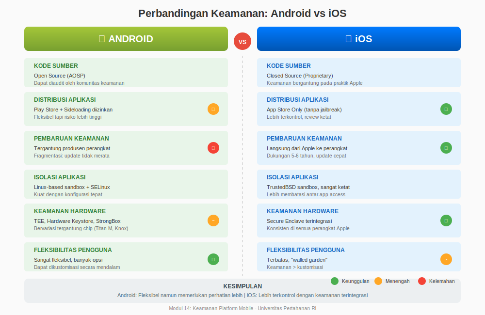
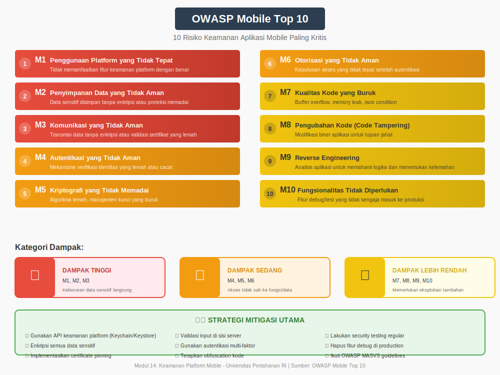
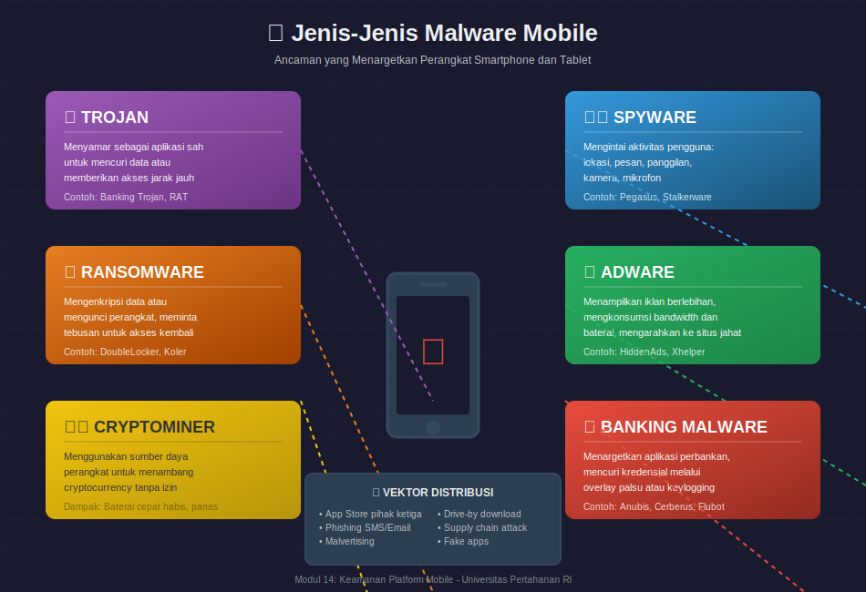
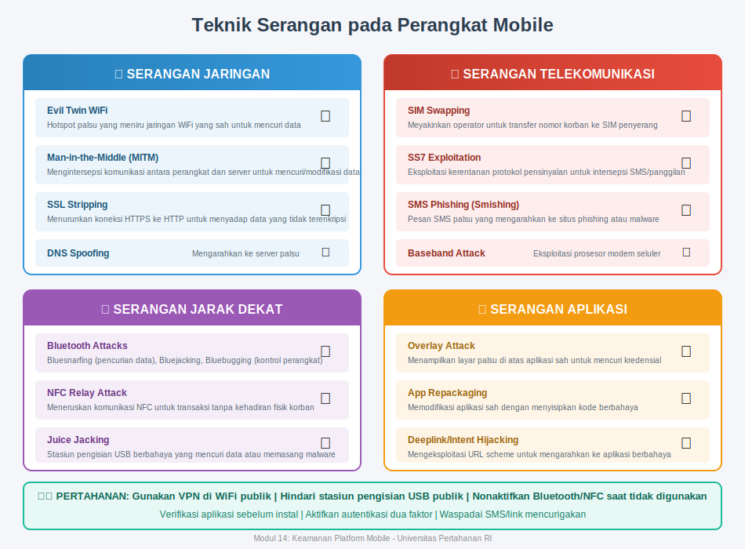
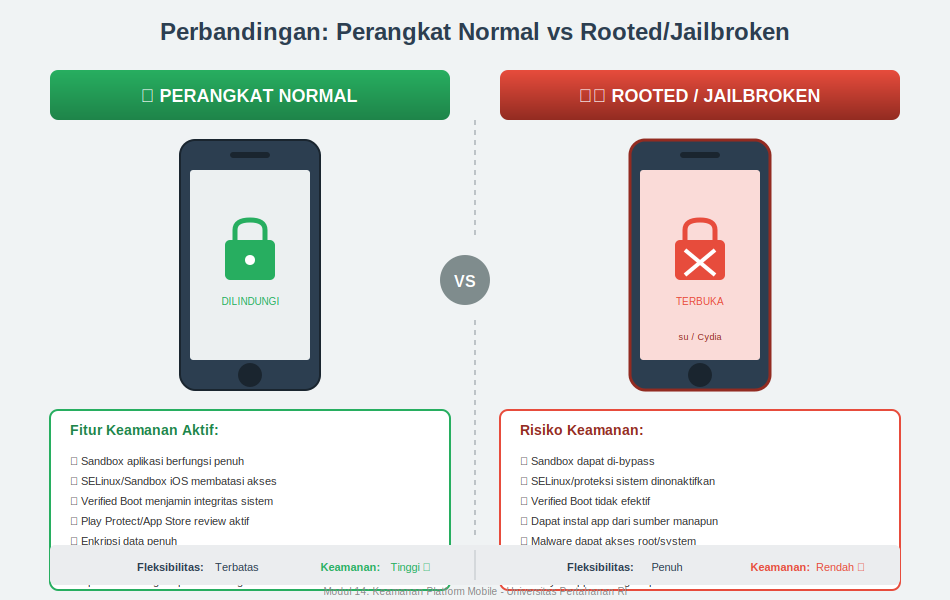

# MODUL 14: KEAMANAN PLATFORM MOBILE

## Pengantar Keamanan Siber
### Universitas Pertahanan Republik Indonesia
### Fakultas Sains dan Teknologi Pertahanan

---

## Informasi Modul

**Pertemuan**: 14 (Empat Belas)

**Topik**: Keamanan Platform Mobile (Mobile Platform Security)

**Durasi**: 2 x 50 menit (tatap muka) + praktikum

**Referensi Utama**: CEH v13 Module 17: Hacking Mobile Platforms

---

## Capaian Pembelajaran

### CPMK yang Dicapai

**CPMK 5**: Mahasiswa mampu menganalisis serangan umum pada sistem, jaringan, dan aplikasi web serta merumuskan strategi mitigasinya.

### Sub-CPMK

**Sub-CPMK 5.22**: Mahasiswa mampu mengidentifikasi kerentanan pada platform mobile.

**Sub-CPMK 5.23**: Mahasiswa mampu menjelaskan serangan umum pada perangkat mobile.

**Sub-CPMK 5.24**: Mahasiswa mampu menjelaskan strategi pengamanan perangkat mobile.

### Tujuan Pembelajaran

Setelah menyelesaikan modul ini, mahasiswa diharapkan mampu:

1. Memahami arsitektur keamanan platform mobile Android dan iOS
2. Mempelajari kerentanan yang umum ditemukan pada perangkat dan aplikasi mobile
3. Memahami berbagai jenis serangan yang menargetkan perangkat mobile
4. Menerapkan praktik terbaik dalam mengamankan perangkat mobile

---

## 14.1 Pendahuluan: Mengapa Keamanan Mobile Sangat Penting?

Bayangkan sebuah dompet digital yang berisi tidak hanya uang, tetapi juga identitas lengkap Anda, foto-foto pribadi, percakapan rahasia, informasi kesehatan, dan bahkan akses ke rekening bank. Itulah gambaran smartphone modern yang kita bawa setiap hari. Berbeda dengan komputer desktop yang biasanya tinggal di satu tempat dan memiliki pertahanan jaringan yang lebih kuat, smartphone selalu menemani kita ke mana saja, terhubung ke berbagai jaringan publik, dan menyimpan informasi yang sangat sensitif.

Pertumbuhan penggunaan perangkat mobile dalam beberapa tahun terakhir sangat luar biasa. Saat ini, lebih dari lima miliar orang di seluruh dunia menggunakan smartphone, dan angka ini terus bertambah setiap tahunnya. Di Indonesia sendiri, penetrasi smartphone sudah mencapai lebih dari 70% populasi, yang berarti mayoritas penduduk Indonesia membawa "komputer saku" yang berpotensi menjadi target serangan siber.

Yang membuat keamanan mobile menjadi sangat krusial adalah pergeseran aktivitas digital ke platform mobile. Kita tidak hanya menggunakan smartphone untuk menelepon dan mengirim pesan, tetapi juga untuk transaksi perbankan, belanja online, mengakses email kantor, menyimpan dokumen penting, dan bahkan untuk otentikasi dua faktor yang seharusnya menambah keamanan akun kita. Ketika satu perangkat menyimpan begitu banyak akses dan informasi sensitif, kompromi terhadap perangkat tersebut bisa berdampak sangat serius.

Tantangan unik dalam keamanan mobile juga datang dari ekosistem aplikasi yang sangat luas. Baik Google Play Store maupun Apple App Store menyediakan jutaan aplikasi yang dikembangkan oleh berbagai pihak dengan tingkat keamanan yang berbeda-beda. Pengguna sering kali mengunduh aplikasi tanpa benar-benar memahami izin apa saja yang diminta dan risiko apa yang mungkin timbul. Berbeda dengan software desktop yang biasanya berasal dari sumber yang lebih terbatas dan dikenal, aplikasi mobile bisa datang dari pengembang individual yang mungkin tidak memiliki pemahaman keamanan yang memadai, atau bahkan dari aktor jahat yang sengaja menyamarkan malware sebagai aplikasi berguna.

Dari perspektif pertahanan nasional, keamanan mobile menjadi semakin relevan karena banyak personel pertahanan dan pemerintahan menggunakan smartphone untuk komunikasi sehari-hari. Sebuah smartphone yang terkompromisi bisa menjadi alat pengintaian yang sangat efektif, mampu merekam percakapan, melacak lokasi, dan mengakses dokumen sensitif tanpa sepengetahuan pemiliknya. Oleh karena itu, pemahaman mendalam tentang keamanan platform mobile bukan hanya penting bagi profesional keamanan siber, tetapi juga bagi siapa saja yang bekerja dengan informasi sensitif.

---

## 14.2 Arsitektur Keamanan Platform Mobile

Untuk memahami bagaimana melindungi perangkat mobile, kita perlu terlebih dahulu memahami bagaimana sistem operasi mobile dirancang dari perspektif keamanan. Dua platform dominan saat ini adalah Android yang dikembangkan oleh Google dan iOS yang dikembangkan oleh Apple. Meskipun keduanya bertujuan melindungi pengguna, pendekatan mereka memiliki perbedaan filosofis yang signifikan.

### 14.2.1 Arsitektur Keamanan Android

Android dibangun di atas kernel Linux yang sudah teruji keamanannya selama puluhan tahun. Pemilihan Linux sebagai fondasi memberikan Android warisan mekanisme keamanan yang matang, termasuk sistem izin berbasis pengguna dan proses yang terisolasi. Namun, Google tidak berhenti di situ dan menambahkan lapisan-lapisan keamanan tambahan yang dirancang khusus untuk lingkungan mobile.

*Gambar 14.1: Arsitektur Keamanan Android dengan lapisan-lapisan perlindungan dari kernel hingga aplikasi*

Lapisan terbawah dari arsitektur Android adalah kernel Linux yang telah dimodifikasi. Kernel ini menangani fungsi-fungsi fundamental seperti manajemen memori, manajemen proses, dan komunikasi dengan hardware. Dari perspektif keamanan, kernel menyediakan fondasi untuk isolasi aplikasi menggunakan mekanisme yang disebut sandbox.

Di atas kernel, terdapat Hardware Abstraction Layer (HAL) yang menjembatani antara software dan komponen hardware seperti kamera, sensor, dan modul komunikasi. Keamanan di lapisan ini penting karena akses yang tidak tepat ke hardware bisa membahayakan privasi pengguna, misalnya jika sebuah aplikasi bisa mengaktifkan mikrofon tanpa sepengetahuan pengguna.

Lapisan berikutnya adalah Android Runtime (ART) yang menjalankan aplikasi dalam lingkungan terisolasi. Setiap aplikasi Android berjalan dalam proses Linux terpisah dengan user ID unik, yang berarti satu aplikasi tidak bisa begitu saja mengakses data atau memori aplikasi lain. Isolasi ini ibarat setiap aplikasi tinggal di rumah terpisah dengan pagar yang tidak bisa dilompati tetangga. Meskipun mereka berada di lingkungan yang sama, masing-masing memiliki ruang privat sendiri.

Komponen keamanan kunci dalam Android modern termasuk Verified Boot yang memastikan integritas sistem operasi sejak perangkat dinyalakan. Proses ini memverifikasi bahwa setiap komponen software yang dimuat belum dimodifikasi oleh pihak yang tidak berwenang. Jika terdeteksi perubahan yang mencurigakan, perangkat akan memberikan peringatan atau bahkan menolak untuk boot. Bayangkan ini seperti segel keamanan pada kemasan obat yang menunjukkan apakah kemasan pernah dibuka sebelumnya.

SELinux (Security-Enhanced Linux) merupakan lapisan keamanan tambahan yang menerapkan kontrol akses wajib (Mandatory Access Control). Berbeda dengan kontrol akses tradisional yang berbasis identitas pengguna, SELinux memberlakukan kebijakan ketat yang menentukan apa saja yang boleh dilakukan oleh setiap proses, terlepas dari hak akses pengguna yang menjalankannya. Ini mencegah kerusakan menyebar bahkan jika satu komponen berhasil dikompromikan.

Sistem izin Android mengharuskan aplikasi mendeklarasikan izin apa saja yang dibutuhkan, dan pengguna memiliki kesempatan untuk menyetujui atau menolak izin tersebut. Sejak Android versi terbaru, izin yang dianggap berbahaya seperti akses kamera, mikrofon, dan lokasi harus diminta secara eksplisit saat aplikasi akan menggunakannya, bukan hanya saat instalasi. Perubahan ini memberi pengguna kontrol yang lebih baik dan kesadaran yang lebih tinggi tentang apa yang dilakukan aplikasi.

Google Play Protect berfungsi sebagai sistem pertahanan yang terus menerus memindai aplikasi yang terinstal untuk mencari perilaku berbahaya. Sistem ini menggunakan pembelajaran mesin untuk mendeteksi pola yang mencurigakan, bahkan pada aplikasi yang sebelumnya lolos dari pemeriksaan awal. Jika ditemukan ancaman, Google Play Protect dapat memperingatkan pengguna atau bahkan menonaktifkan aplikasi berbahaya secara otomatis.

### 14.2.2 Arsitektur Keamanan iOS

Apple mengambil pendekatan yang berbeda dalam membangun iOS. Dengan kontrol penuh atas hardware dan software, Apple dapat mengintegrasikan keamanan dari level paling rendah hingga ke aplikasi pengguna dengan cara yang sangat erat. Filosofi Apple sering digambarkan sebagai "walled garden" atau taman bertembok, di mana pengguna mendapat keamanan tinggi dengan mengorbankan sebagian fleksibilitas.

*Gambar 14.2: Arsitektur Keamanan iOS dengan Secure Enclave dan Secure Boot Chain*

Rantai kepercayaan boot yang aman (Secure Boot Chain) pada iOS dimulai dari level hardware. Setiap perangkat Apple memiliki komponen hardware khusus yang disebut Secure Enclave yang menyimpan kunci kriptografi dan menangani operasi keamanan sensitif secara terisolasi dari proses utama. Bahkan jika sistem operasi utama berhasil dikompromikan, data di dalam Secure Enclave tetap terlindungi karena chip ini memiliki prosesor dan memori terpisah.

Proses boot iOS mengikuti rantai verifikasi yang ketat. Ketika perangkat dinyalakan, ROM Boot yang tidak dapat diubah memverifikasi Low-Level Bootloader (LLB). LLB kemudian memverifikasi iBoot, dan iBoot memverifikasi kernel iOS. Jika ada satu komponen yang gagal verifikasi, proses boot dihentikan dan perangkat masuk ke mode pemulihan. Rantai kepercayaan ini memastikan bahwa hanya kode yang ditandatangani oleh Apple yang dapat berjalan pada perangkat.

Enkripsi data pada iOS bersifat berlapis. Semua data di penyimpanan perangkat dienkripsi menggunakan kunci yang unik untuk setiap perangkat. Selain itu, beberapa jenis data dilindungi oleh kelas perlindungan data yang berbeda berdasarkan sensitivitasnya. Misalnya, data kesehatan dienkripsi dengan kunci yang hanya tersedia ketika perangkat dalam kondisi terbuka (unlocked), sementara data lain mungkin tersedia dalam kondisi terkunci untuk memungkinkan fitur tertentu berjalan.

App Sandbox di iOS sangat ketat. Setiap aplikasi berjalan dalam lingkungan terisolasi dengan akses terbatas ke sistem file dan sumber daya sistem. Aplikasi hanya dapat mengakses datanya sendiri dan tidak bisa melihat data aplikasi lain. Komunikasi antar aplikasi hanya dimungkinkan melalui mekanisme yang dikontrol ketat oleh sistem operasi, seperti URL schemes dan app extensions.

App Store Review Process merupakan garis pertahanan tambahan yang unik untuk iOS. Sebelum aplikasi dapat didistribusikan melalui App Store, Apple melakukan tinjauan baik secara otomatis maupun manual. Proses ini memeriksa aplikasi untuk malware, pelanggaran privasi, dan ketidakpatuhan terhadap pedoman Apple. Meskipun tidak sempurna, proses ini berhasil memblokir banyak aplikasi berbahaya sebelum mencapai pengguna.

Code Signing pada iOS mengharuskan semua kode yang berjalan pada perangkat harus ditandatangani secara digital. Pengembang harus mendaftar ke program pengembang Apple dan menggunakan sertifikat yang dikeluarkan Apple untuk menandatangani aplikasi mereka. Ini membuat distribusi malware menjadi jauh lebih sulit karena setiap aplikasi dapat dilacak kembali ke pengembangnya.

### 14.2.3 Perbandingan Model Keamanan Android dan iOS

Memahami perbedaan antara kedua platform membantu kita mengenali kekuatan dan kelemahan masing-masing. Filosofi dasar Android adalah keterbukaan dengan keamanan bertahap, sementara iOS menerapkan kontrol ketat dengan keamanan terintegrasi. Kedua pendekatan memiliki trade-off yang berbeda.

*Gambar 14.3: Perbandingan fitur keamanan antara platform Android dan iOS*

Dari sisi distribusi aplikasi, Android memungkinkan instalasi dari sumber di luar Play Store (sideloading), yang memberi fleksibilitas tetapi juga membuka celah bagi distribusi malware. iOS secara default hanya mengizinkan instalasi dari App Store, meskipun pengguna bisa melakukan jailbreak untuk melewati pembatasan ini.

Fragmentasi merupakan tantangan unik Android. Karena banyak produsen yang menggunakan Android dengan modifikasi masing-masing, pembaruan keamanan tidak selalu sampai ke semua perangkat dengan cepat. Beberapa perangkat Android mungkin tidak pernah menerima patch untuk kerentanan yang sudah diketahui karena produsennya tidak lagi menyediakan dukungan. Sebaliknya, Apple dapat mendistribusikan pembaruan keamanan secara langsung ke hampir semua perangkat iOS yang masih didukung.

Transparansi keamanan juga berbeda. Android sebagai proyek open source memungkinkan komunitas keamanan untuk memeriksa kode sumbernya dan menemukan kerentanan. iOS bersifat closed source, yang berarti keamanannya lebih bergantung pada praktik internal Apple dan program bug bounty mereka.

---

## 14.3 OWASP Mobile Top 10: Risiko Keamanan Utama

Open Web Application Security Project (OWASP) adalah organisasi nirlaba yang berfokus pada peningkatan keamanan software. Salah satu kontribusi penting mereka adalah OWASP Mobile Top 10, daftar sepuluh risiko keamanan paling kritis pada aplikasi mobile. Memahami daftar ini penting bagi pengembang dan profesional keamanan untuk memprioritaskan upaya pengamanan mereka.

*Gambar 14.4: OWASP Mobile Top 10 - Sepuluh risiko keamanan aplikasi mobile paling kritis*

### 14.3.1 M1: Penggunaan Platform yang Tidak Tepat (Improper Platform Usage)

Risiko pertama berkaitan dengan kesalahan dalam menggunakan fitur keamanan yang sudah disediakan platform. Setiap platform mobile menyediakan berbagai fitur keamanan seperti Keychain di iOS atau Android Keystore untuk menyimpan data sensitif secara aman. Masalah muncul ketika pengembang tidak memanfaatkan fitur-fitur ini dengan benar atau mengabaikannya sama sekali.

Contoh nyata dari risiko ini adalah aplikasi yang menyimpan kata sandi dalam format teks biasa di SharedPreferences Android atau UserDefaults iOS. Meskipun platform menyediakan fasilitas penyimpanan terenkripsi, pengembang yang kurang berpengalaman mungkin memilih cara yang lebih sederhana tanpa menyadari implikasi keamanannya. Ketika perangkat di-root atau di-jailbreak, data yang disimpan dengan cara tidak aman ini dapat diakses dengan mudah.

Kesalahan konfigurasi platform juga termasuk dalam kategori ini. Misalnya, mengizinkan backup data aplikasi tanpa enkripsi di Android bisa membuat data sensitif tersebar ke layanan cloud atau komputer yang digunakan untuk backup. Pengaturan Intent Filter yang terlalu permisif bisa membuat komponen aplikasi dapat dipanggil oleh aplikasi berbahaya.

Mitigasi untuk risiko ini mencakup pemahaman mendalam tentang fitur keamanan platform dan penggunaannya yang tepat. Pengembang harus menggunakan API keamanan yang disediakan untuk menyimpan data sensitif, mengkonfigurasi komponen aplikasi dengan prinsip hak akses minimal, dan mengikuti pedoman keamanan resmi dari Google dan Apple.

### 14.3.2 M2: Penyimpanan Data yang Tidak Aman (Insecure Data Storage)

Risiko kedua berfokus pada bagaimana data disimpan secara lokal pada perangkat. Aplikasi mobile sering menyimpan berbagai jenis data, mulai dari preferensi pengguna hingga token autentikasi dan informasi pribadi yang sensitif. Jika data ini tidak dilindungi dengan baik, penyerang yang mendapatkan akses ke perangkat dapat mengambilnya.

Data sensitif bisa bocor melalui berbagai lokasi penyimpanan. File database SQLite yang tidak terenkripsi dapat berisi informasi pengguna lengkap. Log aplikasi mungkin secara tidak sengaja mencatat data sensitif seperti token akses atau informasi pribadi. Cache gambar atau dokumen bisa menyimpan salinan dokumen rahasia yang diakses pengguna.

Kasus yang sering terjadi adalah aplikasi yang menyimpan kredensial login atau token sesi di lokasi yang mudah diakses. Ketika pengguna kehilangan perangkat atau menjual perangkat bekas tanpa melakukan factory reset yang benar, data sensitif ini bisa jatuh ke tangan orang lain. Pada perangkat yang di-root atau di-jailbreak, akses ke penyimpanan internal aplikasi menjadi trivial.

Strategi mitigasi meliputi enkripsi semua data sensitif yang disimpan secara lokal menggunakan algoritma yang kuat. Gunakan fasilitas penyimpanan aman seperti Android Keystore atau iOS Keychain untuk kredensial dan kunci enkripsi. Minimalisasi jumlah data sensitif yang disimpan di perangkat, dan terapkan kebijakan retensi data yang jelas. Pastikan juga untuk menghapus data sensitif dari cache dan log setelah tidak diperlukan.

### 14.3.3 M3: Komunikasi yang Tidak Aman (Insecure Communication)

Aplikasi mobile secara rutin berkomunikasi dengan server backend melalui jaringan. Jika komunikasi ini tidak diamankan dengan benar, penyerang yang berada di jaringan yang sama atau yang dapat melakukan intersepsi (man-in-the-middle) dapat menyadap dan memodifikasi data yang dikirim.

Penggunaan protokol HTTP tanpa enkripsi adalah kesalahan paling jelas dalam kategori ini. Data yang dikirim melalui HTTP dapat dibaca oleh siapa saja yang dapat menangkap lalu lintas jaringan. Namun, bahkan penggunaan HTTPS tidak menjamin keamanan jika implementasinya salah. Kesalahan umum termasuk tidak melakukan validasi sertifikat server, menerima sertifikat self-signed tanpa verifikasi, atau tidak mengimplementasikan certificate pinning.

Certificate pinning adalah teknik di mana aplikasi hanya menerima sertifikat tertentu yang sudah dikenal, bukan semua sertifikat yang ditandatangani oleh Certificate Authority terpercaya. Tanpa pinning, penyerang yang berhasil memperoleh sertifikat palsu dari CA yang dikompromikan dapat melakukan serangan man-in-the-middle meskipun koneksi menggunakan HTTPS.

Untuk mengamankan komunikasi, selalu gunakan HTTPS untuk semua transmisi data. Implementasikan certificate pinning untuk aplikasi yang menangani data sangat sensitif. Validasi sertifikat server dengan benar dan tolak koneksi jika validasi gagal. Gunakan protokol terbaru dan hindari cipher suite yang sudah diketahui lemah.

### 14.3.4 M4: Autentikasi yang Tidak Aman (Insecure Authentication)

Mekanisme autentikasi yang lemah memungkinkan penyerang menyamar sebagai pengguna sah. Risiko ini mencakup berbagai kelemahan dalam cara aplikasi memverifikasi identitas pengguna dan mempertahankan status login mereka.

Kelemahan umum termasuk memperbolehkan kata sandi yang lemah, tidak mengimplementasikan pembatasan percobaan login untuk mencegah brute force, dan menyimpan token autentikasi tanpa perlindungan yang memadai. Beberapa aplikasi juga melakukan validasi kredensial di sisi klien saja tanpa verifikasi di server, yang memungkinkan bypass dengan memodifikasi aplikasi.

Autentikasi biometrik seperti sidik jari atau pengenalan wajah juga perlu diimplementasikan dengan benar. Jika biometrik hanya digunakan untuk membuka kunci antarmuka pengguna tanpa ikatan ke kredensial sebenarnya, penyerang mungkin bisa melewatinya dengan memodifikasi aplikasi.

Mitigasi mencakup penerapan kebijakan kata sandi yang kuat, implementasi multi-factor authentication, penggunaan mekanisme anti-brute-force, dan penyimpanan token autentikasi dengan aman. Validasi autentikasi harus selalu dilakukan di sisi server, bukan hanya di klien. Gunakan juga mekanisme autentikasi yang sudah teruji seperti OAuth 2.0 dengan implementasi yang benar.

### 14.3.5 M5: Kriptografi yang Tidak Memadai (Insufficient Cryptography)

Meskipun pengembang mungkin menggunakan enkripsi untuk melindungi data, implementasi yang tidak tepat dapat membuat perlindungan tersebut tidak efektif. Kesalahan dalam kriptografi bisa sesederhana menggunakan algoritma yang sudah usang atau serumit kesalahan dalam manajemen kunci.

Algoritma kriptografi yang lemah seperti DES, MD5, atau SHA1 masih sering ditemukan dalam aplikasi modern. Meskipun algoritma-algoritma ini mungkin cukup di masa lalu, kemajuan dalam kekuatan komputasi membuat mereka tidak lagi aman. Penggunaan mode operasi yang salah, seperti ECB mode untuk enkripsi blok, juga dapat membocorkan informasi tentang data yang dienkripsi.

Kesalahan dalam manajemen kunci sama berbahayanya dengan tidak mengenkripsi sama sekali. Menyimpan kunci enkripsi bersama dengan data yang dienkripsi, menggunakan kunci yang sama untuk semua pengguna, atau menyematkan kunci secara hardcode dalam kode aplikasi adalah kesalahan fatal yang sering terjadi.

Praktik kriptografi yang baik meliputi penggunaan algoritma modern seperti AES-256 untuk enkripsi simetris dan RSA-2048 atau lebih tinggi untuk enkripsi asimetris. Gunakan library kriptografi yang sudah teruji daripada membuat implementasi sendiri. Simpan kunci enkripsi di fasilitas penyimpanan aman platform dan terapkan rotasi kunci secara berkala.

### 14.3.6 M6: Otorisasi yang Tidak Aman (Insecure Authorization)

Berbeda dengan autentikasi yang memverifikasi identitas pengguna, otorisasi menentukan apa yang boleh dilakukan pengguna setelah mereka terautentikasi. Kelemahan otorisasi memungkinkan pengguna mengakses fungsi atau data yang seharusnya tidak mereka miliki aksesnya.

Kesalahan umum termasuk mengandalkan informasi yang disediakan klien untuk keputusan otorisasi. Misalnya, jika API backend menerima parameter user_id dari aplikasi tanpa memverifikasi bahwa pengguna yang terautentikasi memang memiliki hak untuk mengakses data user tersebut, maka pengguna jahat bisa memodifikasi permintaan untuk mengakses data pengguna lain.

Implementasi role-based access control (RBAC) yang buruk juga termasuk dalam kategori ini. Jika logika otorisasi hanya diterapkan di antarmuka pengguna (menyembunyikan tombol atau menu) tanpa penegakan di sisi server, penyerang yang memahami struktur API dapat langsung memanggil endpoint yang seharusnya tidak mereka akses.

Untuk mengatasi risiko ini, selalu terapkan otorisasi di sisi server untuk setiap permintaan. Jangan percaya informasi yang berasal dari klien untuk keputusan keamanan. Implementasikan prinsip hak akses minimal dan lakukan audit terhadap keputusan otorisasi untuk mendeteksi anomali.

### 14.3.7 M7: Kualitas Kode yang Buruk (Poor Code Quality)

Kode yang buruk tidak hanya menyebabkan bug fungsional tetapi juga dapat menciptakan kerentanan keamanan. Buffer overflow, memory leak, dan kesalahan penanganan exception adalah contoh masalah kualitas kode yang bisa dieksploitasi oleh penyerang.

Dalam konteks mobile, bahasa seperti C/C++ yang digunakan untuk komponen native dapat mengandung kerentanan memory corruption jika tidak dikoding dengan hati-hati. Meskipun Java dan Swift/Objective-C memiliki manajemen memori otomatis yang mengurangi risiko ini, mereka tidak kebal terhadap semua jenis kerentanan terkait kode.

Format string vulnerability, integer overflow, dan race condition adalah contoh kelemahan yang bisa muncul dari praktik pemrograman yang ceroboh. Selain itu, kode yang tidak menangani error dengan baik mungkin membocorkan informasi sensitif melalui pesan error yang terlalu detail.

Peningkatan kualitas kode memerlukan penerapan praktik pengembangan yang aman (secure coding practices), penggunaan static analysis tools untuk mendeteksi kerentanan potensial, dan code review yang fokus pada aspek keamanan. Testing yang komprehensif termasuk security testing juga penting untuk menemukan kelemahan sebelum aplikasi didistribusikan.

### 14.3.8 M8: Pengubahan Kode (Code Tampering)

Aplikasi mobile dapat dimodifikasi setelah diunduh, memungkinkan penyerang mengubah perilaku aplikasi untuk tujuan jahat. Reverse engineering dan modifikasi kode adalah ancaman nyata karena file aplikasi (APK untuk Android, IPA untuk iOS) relatif mudah didekompilasi.

Penyerang dapat memodifikasi aplikasi untuk menonaktifkan pemeriksaan keamanan, mengubah logika bisnis, menyisipkan kode berbahaya, atau membuat versi palsu yang tampak asli tetapi mencuri data pengguna. Aplikasi perbankan dan e-commerce adalah target umum karena potensi keuntungan finansial langsung.

Teknik perlindungan terhadap tampering meliputi obfuscation untuk mempersulit reverse engineering, integrity checking untuk mendeteksi modifikasi, dan penggunaan fitur platform seperti Google Play Integrity API atau DeviceCheck di iOS. Root/jailbreak detection juga dapat membantu mendeteksi lingkungan yang dikompromikan, meskipun teknik ini bisa di-bypass oleh penyerang yang terampil.

### 14.3.9 M9: Reverse Engineering

Terkait erat dengan code tampering, reverse engineering adalah proses menganalisis aplikasi untuk memahami cara kerjanya. Meskipun tidak selalu berbahaya, reverse engineering sering menjadi langkah pertama sebelum serangan yang lebih serius.

Melalui reverse engineering, penyerang dapat menemukan API endpoint dan parameter yang tidak terdokumentasi, mengekstrak kunci atau kredensial yang disematkan dalam kode, memahami algoritma proprietary, dan menemukan kerentanan yang tidak terlihat dari luar.

Tools seperti jadx, apktool, dan Hopper Disassembler memudahkan proses dekompilasi aplikasi. Meskipun kode yang didekompilasi tidak selalu identik dengan kode sumber asli, biasanya cukup untuk memahami logika aplikasi.

Strategi pertahanan mencakup obfuscation menggunakan tools seperti ProGuard atau R8 untuk Android, penggunaan native code untuk logika sensitif, dan pemisahan logika bisnis kritis ke sisi server. Penting juga untuk tidak menyimpan rahasia dalam kode aplikasi karena asumsinya adalah semua yang ada di klien dapat diakses oleh penyerang.

### 14.3.10 M10: Fungsionalitas yang Tidak Diperlukan (Extraneous Functionality)

Risiko terakhir berkaitan dengan fitur yang dimaksudkan untuk pengembangan atau pengujian tetapi tidak sengaja ikut terdistribusi ke versi produksi. Fitur-fitur ini dapat memberikan akses tidak sah atau membocorkan informasi sensitif.

Contoh umum termasuk endpoint debug yang memungkinkan bypass autentikasi, log verbose yang mencatat informasi sensitif, akun pengujian dengan kredensial yang diketahui, dan fitur administratif yang dapat diakses melalui urutan input tertentu. Pengembang mungkin lupa menghapus kode ini atau menganggapnya tidak akan ditemukan.

Untuk menghindari risiko ini, terapkan proses build yang jelas membedakan antara versi development dan production. Lakukan code review untuk memastikan tidak ada fitur debug yang lolos ke produksi. Gunakan flag atau konfigurasi build untuk mengontrol fitur mana yang aktif di setiap environment.

---

## 14.4 Kerentanan Umum pada Aplikasi Mobile

Selain risiko yang tercakup dalam OWASP Top 10, terdapat berbagai kerentanan teknis spesifik yang sering ditemukan dalam aplikasi mobile. Memahami kerentanan-kerentanan ini membantu dalam proses pengembangan yang aman maupun pengujian keamanan.

### 14.4.1 Kerentanan Penyimpanan Lokal

Aplikasi mobile menyimpan data di berbagai lokasi pada sistem file perangkat. Pemahaman tentang lokasi-lokasi ini dan risiko yang terkait sangat penting untuk mengamankan data sensitif.

Di Android, setiap aplikasi memiliki direktori privat di /data/data/[nama.paket]/ yang secara default hanya dapat diakses oleh aplikasi itu sendiri dan root. Namun, beberapa kondisi dapat membuat data ini bocor. Jika atribut android:allowBackup disetel true, data aplikasi dapat di-backup ke komputer pengguna menggunakan ADB. Pada perangkat yang di-root, semua pembatasan akses file menjadi tidak berlaku.

SharedPreferences adalah mekanisme penyimpanan key-value yang populer di Android. Secara default, data disimpan dalam format XML teks biasa. Meskipun berada di direktori privat aplikasi, penggunaan SharedPreferences untuk data sensitif seperti token atau kredensial adalah praktik yang buruk. Android menyediakan EncryptedSharedPreferences sebagai alternatif yang lebih aman.

Database SQLite juga rentan jika tidak dienkripsi. Banyak aplikasi menyimpan data pengguna dalam database lokal yang dapat dengan mudah dibaca jika file database berhasil diekstrak. SQLCipher adalah library yang dapat digunakan untuk mengenkripsi database SQLite.

Di iOS, situasinya serupa meskipun dengan mekanisme yang berbeda. UserDefaults, setara dengan SharedPreferences, juga tidak cocok untuk data sensitif. Keychain menyediakan penyimpanan terenkripsi untuk kredensial dan harus digunakan untuk data sensitif. Core Data untuk penyimpanan objek juga perlu dipertimbangkan enkripsinya untuk data yang sensitif.

### 14.4.2 Kerentanan dalam Komunikasi Antar-Komponen

Baik Android maupun iOS memiliki mekanisme untuk komunikasi antar-aplikasi dan antar-komponen. Jika tidak dikonfigurasi dengan benar, mekanisme ini dapat dieksploitasi.

Di Android, Intent adalah objek pesan yang digunakan untuk meminta aksi dari komponen lain. Activity, Service, dan Broadcast Receiver yang di-export dapat menerima Intent dari aplikasi lain. Jika komponen yang sensitif di-export tanpa perlindungan yang memadai, aplikasi jahat dapat memanggil komponen tersebut. Content Provider yang di-export dapat membocorkan data aplikasi ke aplikasi lain jika tidak menerapkan permission yang tepat.

Intent Filter yang terlalu permisif juga berbahaya. Misalnya, Activity yang menangani URL scheme tertentu mungkin menerima data berbahaya dari website yang dibuka di browser. Aplikasi harus memvalidasi semua data yang diterima melalui Intent sebelum memprosesnya.

Di iOS, URL Scheme dan Universal Links memungkinkan aplikasi merespons URL tertentu. Seperti Intent di Android, data yang diterima melalui mekanisme ini harus divalidasi dengan hati-hati. App Extensions juga menciptakan permukaan serangan tambahan jika tidak dikonfigurasi dengan benar.

### 14.4.3 Kerentanan WebView

WebView adalah komponen yang memungkinkan aplikasi menampilkan konten web. Karena menjalankan JavaScript dan dapat berinteraksi dengan sistem melalui bridge, WebView adalah area risiko yang signifikan.

JavaScriptInterface di Android memungkinkan kode JavaScript memanggil method Java yang di-expose. Jika konten web yang tidak terpercaya dimuat dalam WebView dengan JavaScriptInterface aktif, kode JavaScript berbahaya dapat memanggil fungsi native. Sebelum Android 4.2, semua method publik dari objek yang di-inject otomatis dapat dipanggil, menciptakan kerentanan serius.

Konfigurasi WebView yang tidak aman seperti mengaktifkan akses file (setAllowFileAccess), mengizinkan content access, atau menonaktifkan safe browsing membuka peluang serangan. Aplikasi harus mengkonfigurasi WebView dengan prinsip keamanan minimal dan hanya mengaktifkan fitur yang benar-benar diperlukan.

Konten campuran (mixed content) di mana halaman HTTPS memuat resource melalui HTTP juga merupakan risiko. Pengguna mungkin memiliki ekspektasi keamanan karena melihat HTTPS, sementara sebagian data sebenarnya ditransmisikan tanpa enkripsi.

### 14.4.4 Kebocoran Data Melalui Logging dan Crash Reports

Pengembang sering menggunakan logging untuk debugging dan crash reporting untuk memahami masalah di production. Namun, jika tidak dikelola dengan hati-hati, mekanisme ini dapat membocorkan informasi sensitif.

Log yang ditulis menggunakan android.util.Log di Android dapat dibaca oleh aplikasi lain yang memiliki permission READ_LOGS (pada versi Android lama) atau tersedia melalui logcat saat perangkat terhubung ke komputer untuk debugging. Log yang berisi token autentikasi, informasi pribadi, atau detail teknis yang sensitif dapat dimanfaatkan penyerang.

Crash report yang dikirim ke layanan seperti Firebase Crashlytics, Sentry, atau serupa mungkin menyertakan stack trace yang berisi nilai variabel sensitif. Bahkan tanpa nilai eksplisit, struktur stack trace dapat mengungkap logika internal aplikasi.

Mitigasi mencakup penggunaan level log yang tepat (tidak menggunakan verbose atau debug di production), menghindari logging data sensitif dalam kondisi apapun, dan mengkonfigurasi crash reporting untuk menyunting informasi sensitif. Beberapa framework menyediakan opsi untuk secara otomatis menyembunyikan data tertentu.

---

## 14.5 Malware Mobile dan Teknik Serangan

Perangkat mobile menjadi target utama malware karena nilai data yang tersimpan dan kemampuan perangkat untuk digunakan dalam berbagai aktivitas jahat. Memahami jenis-jenis malware dan teknik serangan membantu dalam mengenali dan mencegah ancaman.

### 14.5.1 Jenis-Jenis Malware Mobile

*Gambar 14.5: Jenis-jenis malware yang menargetkan perangkat mobile*

Trojan merupakan jenis malware mobile yang paling umum. Seperti namanya yang diambil dari kisah Kuda Troya, trojan menyamar sebagai aplikasi yang sah atau berguna untuk mengelabui pengguna agar menginstalnya. Sekali terinstal, trojan dapat mencuri data, memata-matai pengguna, atau memberikan akses jarak jauh ke penyerang. Banking trojan yang secara khusus menargetkan aplikasi perbankan adalah varian yang sangat berbahaya. Trojan jenis ini dapat menampilkan overlay palsu di atas aplikasi perbankan asli untuk mencuri kredensial, atau bahkan memodifikasi transaksi sebelum dikonfirmasi.

Spyware berfokus pada pengumpulan informasi tanpa sepengetahuan pengguna. Kemampuan smartphone modern membuat spyware mobile sangat berbahaya karena dapat mengakses lokasi real-time, menyadap pesan dan panggilan, mengambil foto menggunakan kamera, merekam audio menggunakan mikrofon, dan mengakses kontak serta riwayat browsing. Spyware komersial seperti yang digunakan untuk memata-matai pasangan atau karyawan sering dijual secara terbuka, meskipun legalitasnya dipertanyakan.

Ransomware mengenkripsi data korban atau mengunci perangkat, kemudian meminta tebusan untuk mengembalikan akses. Di platform mobile, ransomware mungkin mengenkripsi foto, video, dan dokumen pengguna. Beberapa varian juga mengunci layar perangkat sepenuhnya, menampilkan pesan yang mengaku dari pihak berwenang dan menuduh korban melakukan tindakan ilegal.

Adware membanjiri perangkat dengan iklan yang mengganggu. Meskipun tidak seberbahaya jenis malware lain, adware mengkonsumsi bandwidth dan baterai, mengganggu pengalaman pengguna, dan dalam beberapa kasus dapat mengarahkan ke website berbahaya. Adware sering didistribusikan bersama aplikasi gratis yang tidak jelas sumbernya.

Cryptominer menggunakan sumber daya perangkat untuk menambang cryptocurrency tanpa izin pemilik. Karena smartphone memiliki daya komputasi terbatas dibanding komputer desktop, cryptominer mobile biasanya menargetkan perangkat dalam jumlah besar. Dampaknya termasuk penurunan kinerja drastis, konsumsi baterai yang tinggi, dan potensi kerusakan hardware akibat panas berlebih.

### 14.5.2 Vektor Distribusi Malware

Penyerang menggunakan berbagai cara untuk mendistribusikan malware ke perangkat mobile. Memahami vektor-vektor ini membantu pengguna menghindari jebakan.

App Store pihak ketiga merupakan sumber malware yang signifikan terutama di ekosistem Android. Karena Android memungkinkan instalasi dari sumber di luar Play Store, pengguna mungkin tergoda untuk mengunduh aplikasi berbayar secara "gratis" dari toko tidak resmi. Aplikasi-aplikasi ini sering telah dimodifikasi untuk menyertakan malware.

Phishing dan social engineering tetap menjadi metode efektif. Pesan SMS atau email yang mengaku dari bank atau layanan populer mengarahkan korban untuk mengunduh "pembaruan keamanan" yang sebenarnya adalah malware. Urgensi dan ketakutan yang diciptakan dalam pesan sering membuat korban tidak berpikir jernih.

Malvertising menggunakan iklan online untuk mendistribusikan malware. Iklan yang tampak sah di website atau bahkan dalam aplikasi dapat mengarahkan ke download malware atau mengeksploitasi kerentanan browser. Jaringan iklan yang kurang diawasi memungkinkan iklan berbahaya ini tersebar luas.

Drive-by download terjadi ketika mengunjungi website berbahaya yang mengeksploitasi kerentanan browser atau WebView untuk mengunduh dan menginstal malware tanpa interaksi pengguna. Kerentanan ini lebih jarang di platform mobile modern yang rajin diperbarui, tetapi perangkat dengan sistem operasi usang tetap rentan.

Supply chain attack menargetkan pengembang aplikasi atau SDK yang mereka gunakan. Jika SDK populer yang digunakan banyak aplikasi dikompromikan, malware dapat tersebar ke jutaan perangkat melalui aplikasi yang sah. Kasus seperti ini telah terjadi beberapa kali dalam skala besar.

### 14.5.3 Teknik Serangan Spesifik Mobile

*Gambar 14.6: Berbagai teknik serangan yang menargetkan perangkat mobile*

Serangan melalui WiFi berbahaya adalah ancaman signifikan karena pengguna mobile sering terhubung ke jaringan WiFi publik. Penyerang dapat membuat hotspot palsu dengan nama yang mirip hotspot sah (Evil Twin), atau melakukan ARP spoofing di jaringan yang sama untuk mengintersepsi lalu lintas. Tanpa certificate pinning, bahkan koneksi HTTPS bisa diintercept jika penyerang dapat memasukkan CA certificate mereka ke perangkat korban.

SIM Swapping adalah serangan di mana penyerang meyakinkan operator seluler untuk mentransfer nomor telepon korban ke SIM card yang dikontrol penyerang. Dengan kontrol atas nomor telepon, penyerang dapat menerima kode OTP yang dikirim via SMS, memungkinkan mereka mengambil alih akun yang menggunakan autentikasi SMS. Serangan ini sangat efektif melawan pengamanan dua faktor berbasis SMS.

SS7 exploitation memanfaatkan kerentanan dalam protokol pensinyalan yang digunakan jaringan seluler global. Meskipun memerlukan akses ke jaringan SS7 yang tidak mudah didapat, serangan ini memungkinkan intersepsi SMS dan panggilan, pelacakan lokasi, dan penolakan layanan. Penyerang yang disponsori negara diketahui memiliki kemampuan ini.

Bluetooth attack termasuk Bluejacking (mengirim pesan tidak diminta), Bluesnarfing (mencuri data), dan Bluebugging (mengambil kontrol perangkat). Meskipun jangkauannya terbatas, serangan Bluetooth dapat efektif di tempat-tempat ramai seperti bandara atau pusat perbelanjaan di mana banyak perangkat berdekatan.

NFC relay attack memanfaatkan komunikasi jarak dekat untuk meneruskan transaksi. Penyerang dengan peralatan khusus dapat meneruskan komunikasi NFC antara kartu pembayaran korban dan terminal pembayaran yang jauh, memungkinkan transaksi tanpa kehadiran fisik korban di lokasi tersebut.

---

## 14.6 Jailbreaking dan Rooting

Jailbreaking (istilah untuk iOS) dan rooting (istilah untuk Android) adalah proses yang menghapus pembatasan yang diterapkan oleh produsen dan sistem operasi. Meskipun memberikan kontrol lebih besar kepada pengguna, proses ini juga memiliki implikasi keamanan yang serius.

### 14.6.1 Memahami Rooting pada Android

Rooting pada Android memberikan akses tingkat administrator (root) ke sistem operasi. Pengguna root dapat memodifikasi file sistem, menghapus aplikasi bawaan, menginstal aplikasi yang memerlukan akses root, dan mengubah perilaku sistem dengan cara yang tidak mungkin dilakukan pada perangkat normal.

*Gambar 14.7: Perbandingan keamanan antara perangkat normal dan perangkat yang di-root/jailbreak*

Motivasi untuk melakukan rooting bervariasi. Beberapa pengguna ingin menginstal custom ROM untuk mendapatkan versi Android terbaru di perangkat yang sudah tidak didukung produsen. Yang lain ingin menggunakan aplikasi yang memerlukan root seperti Titanium Backup untuk backup lengkap atau aplikasi firewall yang dapat mengontrol akses jaringan per-aplikasi. Beberapa pengguna advanced ingin memodifikasi tampilan atau perilaku sistem di luar apa yang diizinkan pengaturan normal.

Proses rooting biasanya melibatkan eksploitasi kerentanan dalam bootloader atau sistem operasi untuk mendapatkan akses root, kemudian menginstal binary "su" yang memungkinkan aplikasi meminta hak akses root. Aplikasi seperti Magisk telah menjadi populer karena dapat menyembunyikan status root dari aplikasi tertentu (seperti aplikasi perbankan) yang menolak berjalan di perangkat rooted.

Risiko keamanan dari rooting sangat signifikan. Malware yang mendapatkan akses root memiliki kontrol penuh atas perangkat, dapat menyembunyikan keberadaannya, dan sangat sulit dihapus. Fitur keamanan seperti SELinux dan verified boot menjadi tidak efektif. Aplikasi yang sah juga dapat dimodifikasi, misalnya aplikasi berbayar dapat di-crack atau aplikasi iklan dapat dimodifikasi untuk menghilangkan iklan tanpa membayar pengembang.

Dari perspektif organisasi, perangkat rooted tidak boleh digunakan untuk mengakses sistem atau data sensitif. Mobile Device Management (MDM) sering menyertakan deteksi root dan dapat memblokir akses dari perangkat yang terkompromikan.

### 14.6.2 Memahami Jailbreaking pada iOS

Jailbreaking pada iOS bertujuan serupa dengan rooting yaitu menghapus pembatasan yang diterapkan Apple. Karena iOS memiliki kontrol yang lebih ketat, jailbreaking juga lebih kompleks dan risikonya lebih tinggi.

Sejarah jailbreaking iOS dimulai sejak iPhone pertama. Setiap rilis iOS baru biasanya menutup kerentanan yang digunakan untuk jailbreak sebelumnya, memulai siklus baru di mana komunitas mencari cara baru untuk melakukan jailbreak. Perlombaan antara Apple dan komunitas jailbreak ini telah berlangsung lebih dari satu dekade.

Motivasi jailbreaking termasuk menginstal aplikasi dari luar App Store, memodifikasi tampilan sistem (theme), menggunakan fitur yang diblokir di region tertentu, dan menjalankan software yang tidak disetujui Apple. Cydia, toko aplikasi alternatif untuk perangkat jailbroken, menyediakan ribuan aplikasi dan modifikasi yang tidak tersedia di App Store resmi.

Risiko keamanan jailbreaking sangat serius. Proses jailbreaking sendiri biasanya memanfaatkan kerentanan keamanan yang serius di iOS. Setelah jailbroken, perlindungan seperti code signing, app sandbox, dan secure boot tidak lagi efektif. Pengguna dapat menginstal software apapun, termasuk yang berbahaya. Banyak malware iOS secara khusus menargetkan perangkat jailbroken karena permukaan serangan yang jauh lebih luas.

Apple secara aktif mempersulit jailbreaking dan sering memperingatkan risiko keamanan yang terlibat. Garansi perangkat menjadi batal jika di-jailbreak, dan beberapa layanan Apple mungkin tidak berfungsi dengan benar.

### 14.6.3 Deteksi Root dan Jailbreak

Aplikasi yang menangani data sensitif sering ingin mendeteksi apakah berjalan di perangkat yang di-root atau di-jailbreak untuk mengambil tindakan pencegahan. Berbagai teknik deteksi tersedia dengan tingkat keandalan yang berbeda-beda.

Di Android, deteksi root dapat mencari keberadaan binary "su", memeriksa apakah aplikasi manajemen root seperti SuperSU atau Magisk terinstal, mencoba menjalankan perintah yang memerlukan root, atau memeriksa integritas partisi sistem. Google juga menyediakan SafetyNet (sekarang Play Integrity API) yang melakukan pemeriksaan di sisi server untuk mendeteksi perangkat yang dimodifikasi.

Di iOS, deteksi jailbreak dapat mencari file yang biasanya ada di perangkat jailbroken seperti Cydia.app, mencoba menulis ke lokasi yang seharusnya read-only, atau mencoba membuka URL scheme yang terkait dengan Cydia. Pemeriksaan integritas sandbox juga dapat mengindikasikan jailbreak.

Namun, perlu dipahami bahwa komunitas rooting dan jailbreaking juga mengembangkan metode untuk menyembunyikan status modifikasi dari aplikasi. Magisk Hide dan tools serupa dapat melewati banyak metode deteksi. Oleh karena itu, deteksi root/jailbreak sebaiknya dipandang sebagai salah satu lapisan pertahanan, bukan satu-satunya perlindungan.

---

## 14.7 Mobile Device Management (MDM)

Organisasi yang memungkinkan karyawan menggunakan perangkat mobile untuk pekerjaan menghadapi tantangan mengelola dan mengamankan perangkat-perangkat tersebut. Mobile Device Management menyediakan solusi untuk tantangan ini dengan memungkinkan kontrol terpusat atas perangkat mobile.

### 14.7.1 Konsep dan Fungsi MDM

MDM adalah software yang memungkinkan administrator IT mengelola, memantau, dan mengamankan perangkat mobile milik karyawan yang digunakan dalam organisasi. Dengan MDM, organisasi dapat menerapkan kebijakan keamanan, mendistribusikan aplikasi, dan mengambil tindakan jika perangkat hilang atau dicuri.

*Gambar 14.8: Arsitektur Mobile Device Management dengan model kepemilikan COPE, BYOD, dan COBO*

Komponen utama solusi MDM meliputi server manajemen yang menyimpan kebijakan dan data perangkat, console administratif untuk mengelola perangkat dan kebijakan, dan agen atau profil di perangkat yang menerima dan menerapkan kebijakan. Komunikasi antara server dan perangkat biasanya melalui internet menggunakan protokol yang aman.

Enrollment adalah proses mendaftarkan perangkat ke sistem MDM. Ini bisa dilakukan oleh administrator IT sebelum perangkat diberikan ke karyawan, atau oleh karyawan sendiri dengan mengikuti prosedur yang ditentukan. Setelah enrolled, perangkat tunduk pada kebijakan yang diterapkan organisasi.

### 14.7.2 Kemampuan MDM

MDM memberikan berbagai kemampuan untuk mengamankan dan mengelola perangkat:

Penerapan kebijakan keamanan memungkinkan organisasi memaksa penggunaan kata sandi yang kuat, mengatur timeout layar, memblokir penginstalan aplikasi dari sumber tidak resmi, dan mengharuskan enkripsi perangkat. Kebijakan dapat berbeda berdasarkan grup pengguna atau tingkat sensitivitas data yang diakses.

Distribusi aplikasi yang dikelola memungkinkan IT mendorong aplikasi yang diperlukan ke perangkat tanpa intervensi pengguna. Aplikasi juga dapat dikonfigurasi dengan pengaturan yang sudah ditentukan, menghilangkan kebutuhan konfigurasi manual oleh pengguna.

Remote wipe adalah kemampuan kritis jika perangkat hilang atau dicuri. Administrator dapat menghapus semua data dari perangkat dari jarak jauh, mencegah data sensitif jatuh ke tangan yang salah. Selective wipe dapat menghapus hanya data korporat tanpa menghapus data pribadi, penting untuk skenario BYOD (Bring Your Own Device).

Location tracking memungkinkan organisasi melacak lokasi perangkat, berguna untuk menemukan perangkat yang hilang atau memverifikasi kepatuhan terhadap kebijakan. Fitur ini harus digunakan dengan mempertimbangkan privasi karyawan dan regulasi yang berlaku.

Compliance monitoring memeriksa apakah perangkat mematuhi kebijakan yang diterapkan. Perangkat yang tidak patuh (misalnya karena di-root atau tidak menginstal pembaruan keamanan) dapat diblokir dari mengakses sumber daya korporat.

### 14.7.3 Model Kepemilikan Perangkat

Pendekatan organisasi terhadap perangkat mobile karyawan bervariasi, dan model MDM perlu menyesuaikan dengan pendekatan yang dipilih.

Corporate-Owned, Personally Enabled (COPE) adalah model di mana organisasi menyediakan perangkat tetapi mengizinkan penggunaan pribadi terbatas. Ini memberikan kontrol maksimal kepada IT sambil tetap memberikan fleksibilitas kepada karyawan. MDM dapat memberlakukan kebijakan ketat karena organisasi memiliki perangkat.

Bring Your Own Device (BYOD) adalah model di mana karyawan menggunakan perangkat pribadi mereka untuk pekerjaan. Model ini mengurangi biaya hardware bagi organisasi dan populer di kalangan karyawan yang ingin menggunakan perangkat pilihan mereka. Namun, mengelola keamanan lebih kompleks karena organisasi harus menyeimbangkan kontrol keamanan dengan penghormatan terhadap properti pribadi karyawan.

Containerization sering digunakan dalam skenario BYOD. Pendekatan ini memisahkan data dan aplikasi korporat dalam container terenkripsi yang terpisah dari data pribadi. IT dapat mengelola dan menghapus container tanpa menyentuh data pribadi. Contoh implementasi termasuk Samsung Knox, Microsoft Intune, dan VMware Workspace ONE.

Corporate-Owned, Business Only (COBO) adalah model paling ketat di mana perangkat hanya digunakan untuk keperluan bisnis. Ini memberikan kontrol penuh kepada IT tetapi kurang fleksibel bagi karyawan. Model ini cocok untuk lingkungan dengan kebutuhan keamanan sangat tinggi.

---

## 14.8 Praktik Terbaik Pengamanan Perangkat Mobile

Keamanan perangkat mobile adalah tanggung jawab bersama antara produsen, pengembang aplikasi, dan pengguna. Bagian ini membahas praktik terbaik dari perspektif berbagai pemangku kepentingan.

### 14.8.1 Untuk Pengguna Individu

Pengguna adalah garis pertahanan terakhir dan kebiasaan mereka sangat mempengaruhi keamanan perangkat.

Gunakan metode kunci layar yang kuat. Meskipun nyaman, pola gesek mudah ditebak dari bekas jari di layar. PIN enam digit lebih aman daripada empat digit, dan kata sandi alfanumerik lebih aman lagi. Biometrik seperti sidik jari atau pengenalan wajah menawarkan keseimbangan baik antara keamanan dan kenyamanan, selama didukung oleh PIN atau kata sandi yang kuat sebagai cadangan.

Selalu instal pembaruan sistem operasi dan aplikasi. Pembaruan sering menyertakan perbaikan untuk kerentanan keamanan yang sudah diketahui. Penundaan pembaruan memberi waktu bagi penyerang untuk mengeksploitasi kerentanan tersebut. Aktifkan pembaruan otomatis jika memungkinkan.

Unduh aplikasi hanya dari sumber resmi. Google Play Store dan Apple App Store memiliki proses review yang mengurangi risiko malware. Hindari menginstal APK dari sumber tidak dikenal atau mengunduh aplikasi dari website yang mencurigakan. Periksa ulasan dan rating sebelum menginstal aplikasi, dan waspadai aplikasi dengan sedikit unduhan atau ulasan.

Perhatikan izin yang diminta aplikasi. Aplikasi senter tidak memerlukan akses ke kontak atau lokasi. Jika aplikasi meminta izin yang tidak masuk akal untuk fungsinya, pertimbangkan untuk tidak menginstalnya. Di Android dan iOS modern, Anda dapat mencabut izin yang sudah diberikan melalui pengaturan.

Hindari jaringan WiFi publik untuk aktivitas sensitif. Jika harus menggunakan WiFi publik, gunakan VPN untuk mengenkripsi lalu lintas. Nonaktifkan koneksi otomatis ke jaringan WiFi dan Bluetooth yang tidak dikenal.

Aktifkan fitur Find My Device atau Find My iPhone. Fitur ini memungkinkan Anda melacak, mengunci, atau menghapus perangkat dari jarak jauh jika hilang atau dicuri. Pastikan fitur ini dikonfigurasi sebelum dibutuhkan.

Backup data secara teratur ke lokasi yang aman. Jika perangkat hilang atau rusak, Anda tidak kehilangan data penting. Gunakan backup terenkripsi untuk melindungi data yang dicadangkan.

### 14.8.2 Untuk Pengembang Aplikasi

Pengembang aplikasi mobile memiliki tanggung jawab besar dalam membangun aplikasi yang aman.

Ikuti prinsip keamanan sejak awal pengembangan (security by design). Pertimbangkan implikasi keamanan dari setiap keputusan arsitektur dan desain. Lebih mudah dan lebih murah untuk membangun keamanan dari awal daripada menambahkannya kemudian.

Minimalisasi data yang dikumpulkan dan disimpan. Kumpulkan hanya data yang benar-benar diperlukan untuk fungsi aplikasi. Semakin sedikit data sensitif yang disimpan, semakin kecil dampak jika terjadi pelanggaran.

Gunakan enkripsi untuk data sensitif baik saat disimpan maupun saat ditransmisikan. Manfaatkan fasilitas penyimpanan aman yang disediakan platform seperti Keychain atau Keystore. Gunakan library kriptografi yang sudah teruji dan ikuti praktik terbaik untuk implementasi.

Implementasikan autentikasi dan otorisasi yang kuat. Jangan pernah mempercayai input dari klien untuk keputusan keamanan. Selalu validasi di sisi server dan terapkan prinsip hak akses minimal.

Tangani kegagalan dengan aman. Jangan mengekspos informasi sensitif dalam pesan error. Implementasikan logging yang memadai untuk mendeteksi serangan, tetapi pastikan log tidak berisi data sensitif.

Lakukan pengujian keamanan secara teratur. Gunakan static analysis tools untuk mendeteksi kerentanan potensial dalam kode. Lakukan penetration testing untuk menemukan kelemahan yang mungkin tidak terdeteksi oleh analisis otomatis.

### 14.8.3 Untuk Organisasi

Organisasi perlu mengambil pendekatan holistik terhadap keamanan mobile.

Kembangkan kebijakan keamanan mobile yang komprehensif. Kebijakan harus mencakup persyaratan keamanan minimum untuk perangkat, prosedur untuk melaporkan perangkat hilang atau dicuri, aturan tentang penggunaan WiFi publik dan aplikasi tertentu, serta konsekuensi untuk pelanggaran kebijakan.

Implementasikan solusi MDM yang sesuai dengan kebutuhan organisasi. Evaluasi berbagai vendor berdasarkan fitur, harga, dan kemudahan penggunaan. Pastikan solusi yang dipilih mendukung berbagai platform yang digunakan di organisasi.

Edukasi karyawan tentang risiko keamanan mobile dan praktik terbaik. Program awareness harus berkelanjutan, bukan hanya satu kali. Gunakan berbagai metode seperti training, simulasi phishing, dan komunikasi regular.

Integrasikan keamanan mobile dengan keamanan endpoint keseluruhan. Perangkat mobile harus diperlakukan dengan tingkat perhatian yang sama dengan laptop dan desktop. Pastikan visibilitas terhadap perangkat mobile dalam sistem SIEM dan respons insiden.

Pertimbangkan penggunaan aplikasi container untuk memisahkan data korporat dari data pribadi, terutama dalam skenario BYOD. Ini memberikan fleksibilitas kepada karyawan sambil melindungi data organisasi.

---

## 14.9 Pengujian Keamanan Aplikasi Mobile

Pengujian keamanan adalah komponen penting dalam siklus pengembangan aplikasi mobile yang aman. Berbagai teknik dan tools tersedia untuk mengidentifikasi kerentanan sebelum aplikasi dirilis ke pengguna.

### 14.9.1 Analisis Statis (Static Analysis)

Analisis statis memeriksa kode aplikasi tanpa menjalankannya. Teknik ini dapat menemukan berbagai masalah keamanan yang terlihat dalam kode sumber atau kode yang didekompilasi.

Untuk Android, tools seperti jadx dapat mendekompilasi file APK menjadi kode Java yang dapat dibaca. MobSF (Mobile Security Framework) menyediakan analisis statis otomatis yang mencari berbagai kerentanan umum. Android Lint yang terintegrasi dengan Android Studio dapat mendeteksi beberapa masalah keamanan selama pengembangan.

Untuk iOS, tools seperti Hopper Disassembler dapat menganalisis binary aplikasi. MobSF juga mendukung analisis aplikasi iOS. Xcode menyertakan Clang Static Analyzer yang dapat mendeteksi beberapa kerentanan memory dan logic.

Yang dicari dalam analisis statis termasuk hardcoded credentials, konfigurasi keamanan yang tidak tepat, penggunaan kriptografi yang lemah, dan kerentanan injection. Analisis statis juga dapat memeriksa konfigurasi seperti AndroidManifest.xml atau Info.plist untuk pengaturan yang tidak aman.

### 14.9.2 Analisis Dinamis (Dynamic Analysis)

Analisis dinamis menjalankan aplikasi dan mengamati perilakunya. Ini dapat menemukan kerentanan yang tidak terlihat dalam kode statis, seperti masalah yang muncul dari interaksi dengan server atau kondisi race.

Pengujian dinamis sering menggunakan emulator atau perangkat fisik yang dikonfigurasi untuk debugging. Traffic interception menggunakan proxy seperti Burp Suite atau OWASP ZAP memungkinkan pengujian keamanan komunikasi jaringan. Frida adalah framework instrumentasi yang populer untuk mengubah perilaku aplikasi saat runtime untuk tujuan pengujian.

Aspek yang diuji secara dinamis termasuk validasi sertifikat SSL/TLS, penanganan session dan token autentikasi, respons terhadap input berbahaya, dan perilaku aplikasi ketika kondisi tidak normal terjadi.

### 14.9.3 Pengujian Penetrasi Mobile

Pengujian penetrasi (pentesting) mobile adalah evaluasi keamanan komprehensif yang menggabungkan berbagai teknik untuk menemukan kerentanan yang bisa dieksploitasi.

Metodologi pengujian penetrasi mobile biasanya mencakup pengumpulan informasi tentang aplikasi dan infrastrukturnya, analisis statis untuk memahami struktur dan logika aplikasi, analisis dinamis untuk mengamati perilaku runtime, pengujian API backend untuk kerentanan server-side, dan eksploitasi kerentanan yang ditemukan untuk memverifikasi dampaknya.

OWASP Mobile Testing Guide menyediakan panduan komprehensif untuk pengujian keamanan mobile. Dokumen ini mencakup metodologi pengujian untuk berbagai kategori kerentanan pada Android dan iOS.

---

## 14.10 Studi Kasus dan Insiden Keamanan Mobile

Mempelajari insiden keamanan nyata memberikan perspektif berharga tentang ancaman yang sebenarnya dihadapi dan konsekuensinya.

### 14.10.1 Pegasus Spyware

Pegasus adalah spyware canggih yang dikembangkan oleh NSO Group, sebuah perusahaan Israel. Spyware ini menargetkan smartphone iOS dan Android dan telah digunakan oleh berbagai pemerintah untuk memata-matai jurnalis, aktivis, politisi, dan pengusaha.

Yang membuat Pegasus sangat berbahaya adalah kemampuannya menginfeksi perangkat tanpa interaksi pengguna (zero-click exploit). Korban tidak perlu mengklik tautan atau mengunduh apapun karena Pegasus mengeksploitasi kerentanan dalam aplikasi seperti iMessage atau WhatsApp untuk menginfeksi perangkat secara diam-diam.

Setelah terinstal, Pegasus dapat mengakses hampir semua data di perangkat: pesan, email, foto, lokasi, dan bahkan dapat mengaktifkan mikrofon dan kamera untuk merekam secara real-time. Spyware ini juga dapat mengekstrak data dari aplikasi terenkripsi seperti Signal.

Kasus Pegasus menunjukkan bahwa bahkan perangkat yang dianggap aman seperti iPhone dapat dikompromikan oleh penyerang dengan sumber daya yang cukup. Ini juga menyoroti risiko dari pasar exploit dan surveillance tools komersial.

### 14.10.2 Malware Banking di Indonesia

Indonesia telah melihat berbagai kampanye malware banking yang menargetkan pengguna mobile banking. Malware seperti Anubis, Cerberus, dan variannya telah menginfeksi pengguna Indonesia melalui aplikasi palsu yang menyamar sebagai aplikasi populer atau utilitas sistem.

Modus operandi umumnya melibatkan distribusi aplikasi palsu melalui SMS phishing atau toko aplikasi pihak ketiga. Setelah terinstal, malware meminta izin Accessibility Service yang memungkinkannya membaca dan berinteraksi dengan aplikasi lain. Ketika pengguna membuka aplikasi banking asli, malware menampilkan overlay palsu untuk mencuri kredensial.

Pencegahan melibatkan edukasi pengguna untuk tidak menginstal aplikasi dari sumber tidak resmi, mengabaikan pesan yang meminta mengunduh aplikasi, dan waspada terhadap permintaan izin yang tidak wajar.

### 14.10.3 Kebocoran Data dari Aplikasi Populer

Berbagai aplikasi populer telah mengalami kebocoran data yang mempengaruhi jutaan pengguna. Kesalahan konfigurasi database, API yang tidak aman, dan kerentanan dalam kode adalah penyebab umum.

Contoh mencakup aplikasi kencan yang membocorkan data lokasi dan preferensi pribadi pengguna, aplikasi kesehatan yang mengekspos informasi medis sensitif, dan aplikasi anak-anak yang mengumpulkan data tanpa persetujuan orang tua yang tepat.

Kasus-kasus ini menekankan pentingnya pengembangan yang aman, pengujian keamanan reguler, dan kepatuhan terhadap regulasi perlindungan data seperti GDPR atau UU PDP Indonesia.

---

## Rangkuman

Keamanan platform mobile adalah aspek kritis dari keamanan siber modern mengingat peran sentral smartphone dalam kehidupan digital kita. Pemahaman tentang arsitektur keamanan Android dan iOS, risiko yang tercakup dalam OWASP Mobile Top 10, dan berbagai vektor serangan membekali kita untuk melindungi perangkat dan data dengan lebih baik.

Platform mobile modern menyediakan berbagai mekanisme keamanan mulai dari isolasi aplikasi hingga enkripsi data. Namun, keamanan ini dapat dikompromikan melalui kerentanan software, kesalahan pengguna, atau serangan yang canggih. Jailbreaking dan rooting secara signifikan melemahkan perlindungan ini.

Untuk organisasi, Mobile Device Management menyediakan kemampuan untuk mengelola dan mengamankan perangkat dalam skala besar. Pemilihan model kepemilikan yang tepat dan implementasi kebijakan yang efektif adalah kunci keberhasilan.

Pengamanan mobile adalah tanggung jawab bersama. Pengguna harus menerapkan kebiasaan aman, pengembang harus membangun aplikasi yang aman, dan organisasi harus mengelola risiko secara holistik. Dengan pendekatan berlapis yang mencakup semua pemangku kepentingan, risiko dapat diminimalkan meskipun tidak pernah dieliminasi sepenuhnya.

---

## Daftar Istilah

| Istilah | Definisi |
|---------|----------|
| APK | Android Package, format file untuk distribusi aplikasi Android |
| App Sandbox | Mekanisme isolasi yang membatasi akses aplikasi ke sumber daya sistem |
| Certificate Pinning | Teknik yang memvalidasi sertifikat server terhadap sertifikat yang sudah dikenal |
| Containerization | Pemisahan data korporat dalam container terenkripsi terpisah |
| Evil Twin | Hotspot WiFi palsu yang meniru hotspot yang sah |
| Jailbreaking | Proses menghapus pembatasan pada perangkat iOS |
| Keychain | Fasilitas penyimpanan aman di iOS untuk kredensial |
| Keystore | Fasilitas penyimpanan aman di Android untuk kunci kriptografi |
| MDM | Mobile Device Management, software untuk mengelola perangkat mobile |
| OWASP | Open Web Application Security Project |
| Remote Wipe | Kemampuan menghapus data perangkat dari jarak jauh |
| Rooting | Proses mendapatkan akses root pada perangkat Android |
| SELinux | Security-Enhanced Linux, sistem kontrol akses wajib |
| Secure Enclave | Chip khusus di perangkat Apple untuk operasi keamanan |
| SIM Swapping | Serangan yang mentransfer nomor telepon korban ke SIM penyerang |
| Sideloading | Menginstal aplikasi dari luar toko aplikasi resmi |
| Spyware | Malware yang mengumpulkan informasi tanpa sepengetahuan pengguna |
| Trojan | Malware yang menyamar sebagai aplikasi yang sah |
| WebView | Komponen untuk menampilkan konten web dalam aplikasi |
| Zero-click Exploit | Eksploitasi yang tidak memerlukan interaksi pengguna |

---

## Referensi

1. EC-Council. (2024). Certified Ethical Hacker (CEH) v13 Module 17: Hacking Mobile Platforms.

2. OWASP Foundation. (2024). OWASP Mobile Application Security Testing Guide (MASTG).

3. OWASP Foundation. (2024). OWASP Mobile Top 10.

4. Google. (2024). Android Security & Privacy Documentation.

5. Apple Inc. (2024). iOS Security Guide.

6. NIST. (2023). Guidelines for Managing the Security of Mobile Devices in the Enterprise (SP 800-124 Rev. 2).

---

*Modul ini disusun untuk keperluan pembelajaran mata kuliah Pengantar Keamanan Siber di Universitas Pertahanan Republik Indonesia.*
