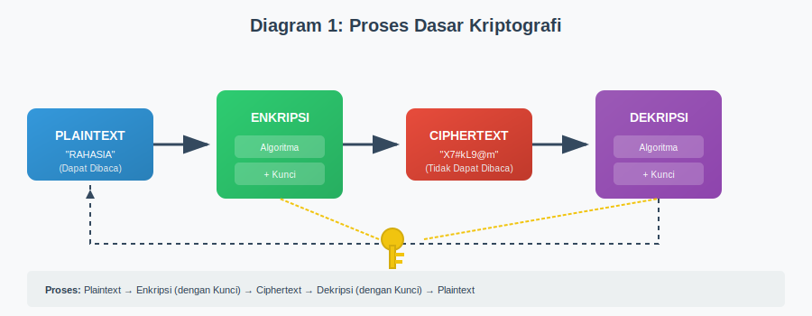
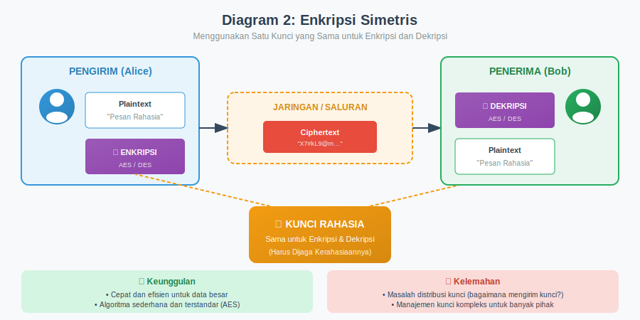
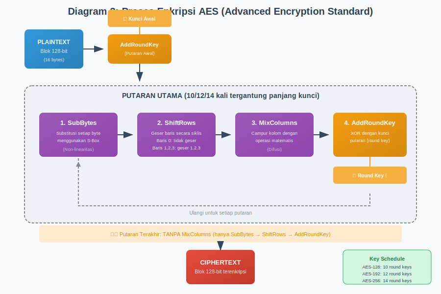
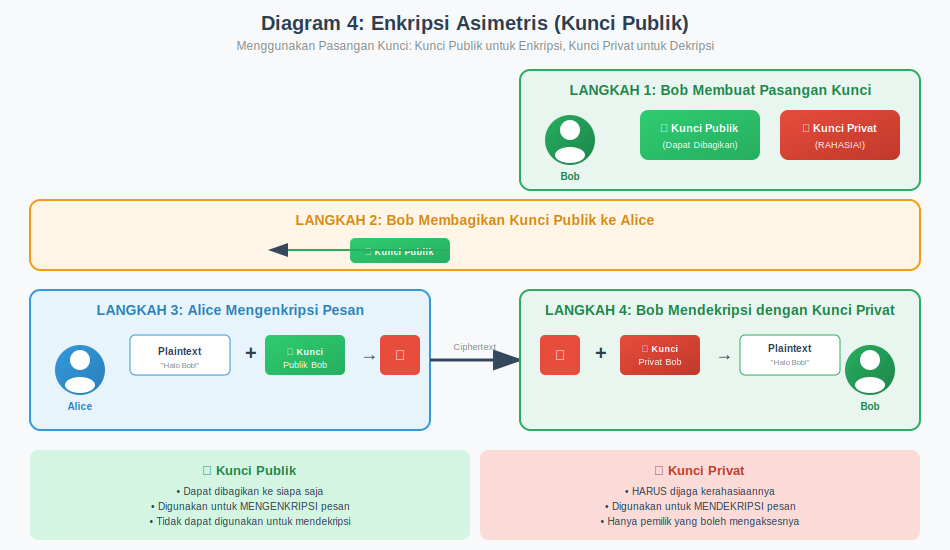
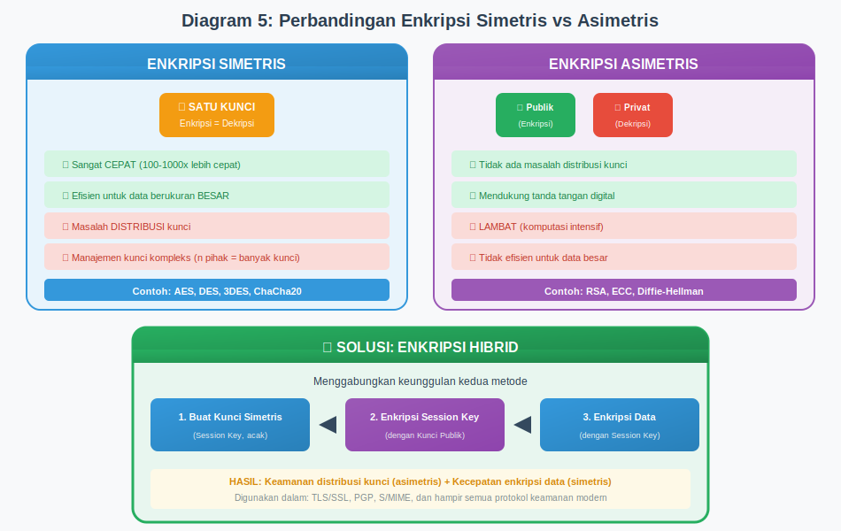
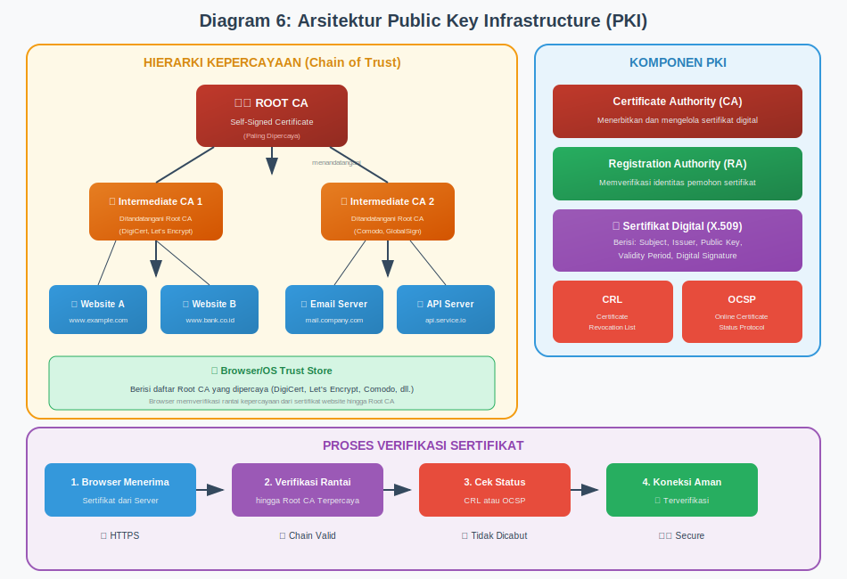
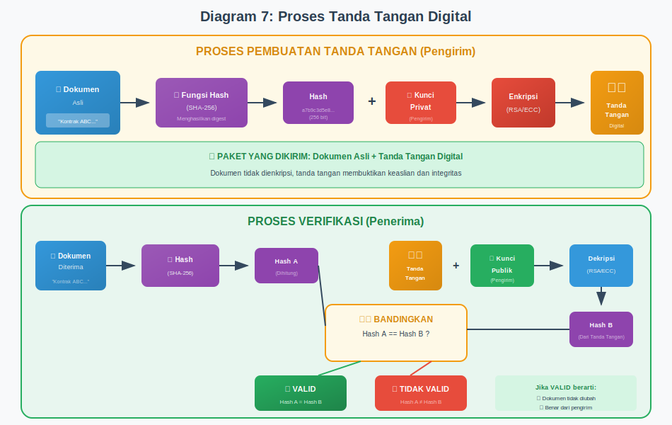
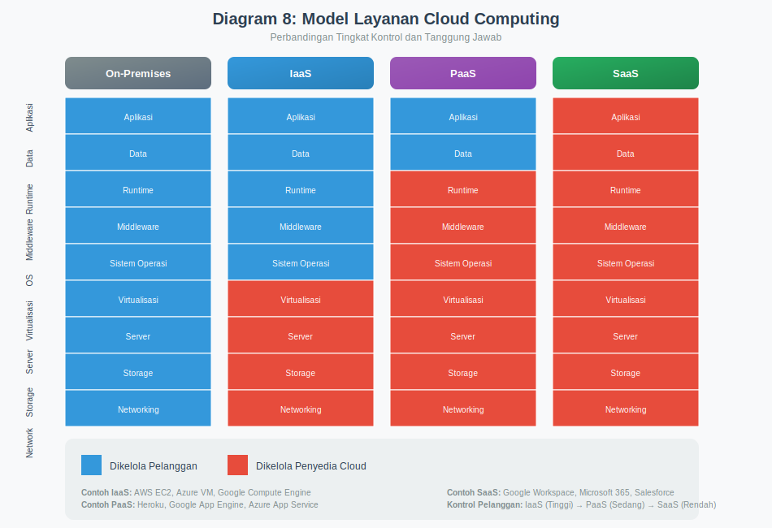
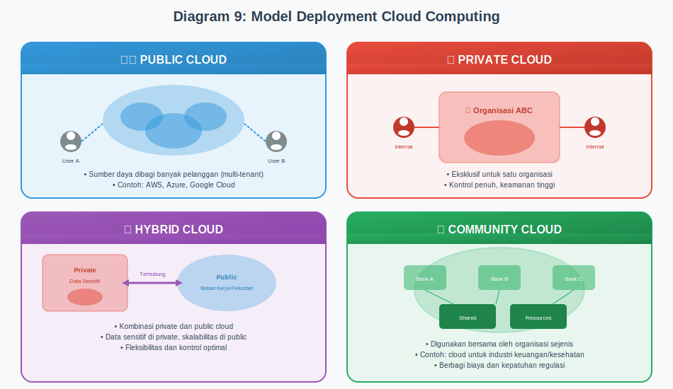
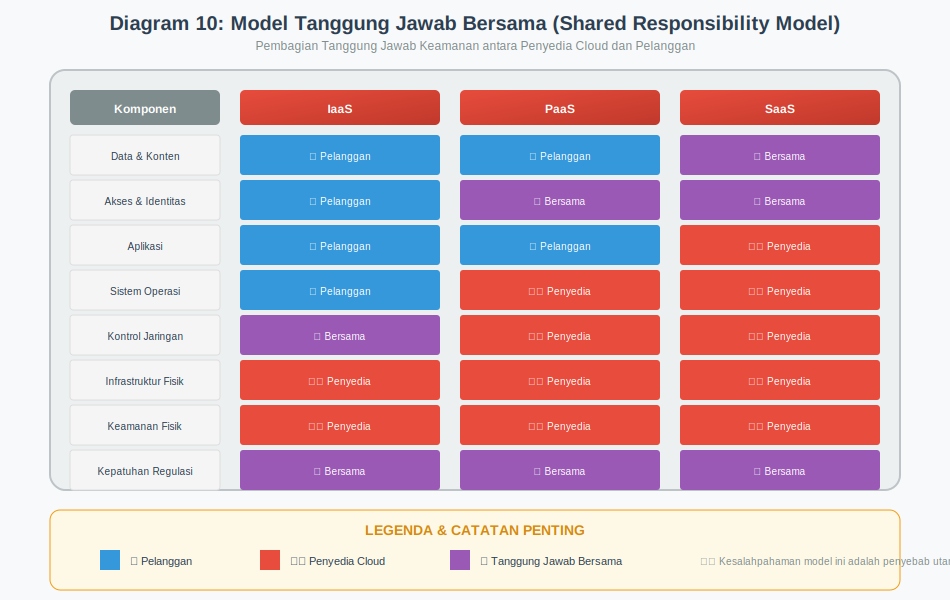

# MODUL 15: KRIPTOGRAFI DAN KEAMANAN CLOUD

## Pengantar Keamanan Siber
### Program Studi Pertahanan Siber
### Universitas Pertahanan Republik Indonesia

---

## Informasi Modul

**Pertemuan**: 15 (Lima Belas)

**Topik**: Kriptografi dan Keamanan Cloud

**Durasi**: 3 × 50 menit (150 menit)

**Prasyarat**: Mahasiswa telah mengikuti pertemuan 1-14 dan memahami konsep dasar keamanan informasi

---

[Slide untuk Pertemuan Ini](https://anindito.github.io/intro/15/)
## Capaian Pembelajaran

### CPMK 6
Mahasiswa mampu menerapkan konsep dasar kriptografi untuk keamanan informasi.

### Sub-CPMK

**Sub-CPMK 6.1**: Mahasiswa mampu menjelaskan konsep dasar kriptografi.

**Sub-CPMK 6.2**: Mahasiswa mampu membedakan algoritma enkripsi simetris dan asimetris.

**Sub-CPMK 6.3**: Mahasiswa mampu menjelaskan konsep keamanan cloud computing.

---

## Tujuan Pembelajaran

Setelah mengikuti pertemuan ini, mahasiswa diharapkan mampu:

1. Memahami konsep dasar kriptografi dan peranannya dalam keamanan informasi
2. Mempelajari dan membedakan algoritma enkripsi simetris dan asimetris
3. Memahami konsep Public Key Infrastructure (PKI) dan penerapannya
4. Mempelajari konsep keamanan cloud computing dan model layanannya
5. Mengidentifikasi risiko keamanan pada lingkungan cloud dan strategi mitigasinya

---

# BAGIAN 1: DASAR-DASAR KRIPTOGRAFI

## 1.1 Pengantar Kriptografi

Bayangkan Anda ingin mengirimkan pesan rahasia kepada teman Anda, tetapi Anda khawatir ada orang lain yang mungkin membaca pesan tersebut di tengah perjalanan. Apa yang akan Anda lakukan? Mungkin Anda akan menggunakan semacam kode rahasia yang hanya Anda dan teman Anda yang memahaminya. Inilah esensi dasar dari kriptografi.

Kriptografi berasal dari bahasa Yunani, yaitu "kryptos" yang berarti tersembunyi dan "graphein" yang berarti menulis. Secara harfiah, kriptografi adalah seni menulis pesan tersembunyi. Dalam konteks modern, kriptografi adalah ilmu dan seni untuk mengamankan informasi dengan cara mengubahnya menjadi bentuk yang tidak dapat dibaca oleh pihak yang tidak berwenang.

Kriptografi telah digunakan sejak ribuan tahun yang lalu. Salah satu contoh tertua adalah Caesar Cipher yang digunakan oleh Julius Caesar untuk mengirim pesan militer rahasia. Dalam Caesar Cipher, setiap huruf dalam pesan digeser beberapa posisi dalam alfabet. Misalnya, dengan pergeseran 3 posisi, huruf A menjadi D, huruf B menjadi E, dan seterusnya.

### 1.1.1 Terminologi Dasar Kriptografi

Sebelum kita melangkah lebih jauh, penting untuk memahami beberapa istilah kunci dalam kriptografi.

**Plaintext** adalah pesan asli yang dapat dibaca dengan normal. Ini adalah informasi dalam bentuk yang dapat dipahami langsung oleh siapa saja. Sebagai contoh, pesan "RAHASIA" adalah sebuah plaintext.

**Ciphertext** adalah hasil dari proses enkripsi terhadap plaintext. Ciphertext tampak seperti sekumpulan karakter acak yang tidak bermakna bagi siapa pun yang tidak memiliki kunci untuk membacanya. Misalnya, "UDKDVLD" bisa menjadi ciphertext dari "RAHASIA" jika kita menggunakan Caesar Cipher dengan pergeseran 3 posisi.

**Enkripsi** adalah proses mengubah plaintext menjadi ciphertext. Proses ini seperti mengunci pesan Anda dalam sebuah kotak yang hanya dapat dibuka dengan kunci tertentu.

**Dekripsi** adalah kebalikan dari enkripsi, yaitu proses mengubah ciphertext kembali menjadi plaintext. Ini seperti membuka kotak terkunci untuk membaca pesan di dalamnya.

**Kunci** (key) adalah parameter rahasia yang digunakan dalam proses enkripsi dan dekripsi. Kunci inilah yang membedakan satu enkripsi dengan enkripsi lainnya. Tanpa kunci yang benar, seseorang tidak akan dapat membaca pesan terenkripsi.

**Algoritma Kriptografi** adalah prosedur matematis yang digunakan untuk melakukan enkripsi dan dekripsi. Algoritma ini menentukan bagaimana plaintext diubah menjadi ciphertext dan sebaliknya.

*Gambar 1: Proses Dasar Kriptografi - Alur transformasi plaintext menjadi ciphertext dan sebaliknya*

### 1.1.2 Tujuan Kriptografi

Kriptografi modern tidak hanya bertujuan untuk menyembunyikan pesan. Ada empat tujuan utama yang ingin dicapai melalui kriptografi, yang sering disingkat sebagai CIAN (Confidentiality, Integrity, Authentication, Non-repudiation).

**Kerahasiaan** (Confidentiality) adalah tujuan paling mendasar dari kriptografi. Kerahasiaan memastikan bahwa informasi hanya dapat dibaca oleh pihak yang berwenang. Bayangkan Anda mengirim pesan melalui internet. Tanpa enkripsi, pesan tersebut dapat dibaca oleh siapa saja yang berhasil mencegat komunikasi Anda. Dengan enkripsi, meskipun seseorang berhasil mencegat pesan Anda, mereka hanya akan melihat sekumpulan karakter tidak bermakna.

**Integritas** (Integrity) memastikan bahwa informasi tidak diubah selama proses pengiriman atau penyimpanan. Kriptografi menyediakan mekanisme untuk mendeteksi apakah suatu pesan telah dimodifikasi. Ini sangat penting dalam berbagai konteks, seperti transaksi keuangan dimana perubahan sekecil apapun dapat berdampak serius.

**Autentikasi** (Authentication) adalah proses memverifikasi identitas pengirim atau penerima pesan. Dengan kriptografi, kita dapat memastikan bahwa pesan benar-benar berasal dari orang yang mengaku mengirimnya. Ini mencegah seseorang menyamar sebagai orang lain dalam komunikasi digital.

**Non-repudiasi** (Non-repudiation) memastikan bahwa pengirim tidak dapat menyangkal telah mengirim pesan tertentu. Ini seperti tanda tangan pada dokumen fisik yang membuktikan bahwa seseorang telah menyetujui isi dokumen tersebut. Dalam dunia digital, tanda tangan digital menyediakan fungsi yang sama.

### 1.1.3 Sejarah Singkat Kriptografi

Pemahaman sejarah kriptografi membantu kita menghargai bagaimana ilmu ini berkembang dan mengapa berbagai teknik diciptakan.

Kriptografi klasik dimulai sekitar 1900 SM di Mesir Kuno, dimana hieroglif yang tidak standar digunakan untuk menyembunyikan pesan. Namun, contoh kriptografi sistematis yang paling terkenal adalah Caesar Cipher yang telah disebutkan sebelumnya. Metode ini sederhana namun efektif pada masanya karena kebanyakan orang tidak dapat membaca.

Pada Abad Pertengahan, kriptografi berkembang dengan munculnya cipher substitusi yang lebih kompleks. Cipher Vigenère, yang ditemukan pada abad ke-16, dianggap tidak dapat dipecahkan selama hampir 300 tahun. Cipher ini menggunakan kunci berupa kata atau frasa, bukan hanya pergeseran sederhana.

Perang Dunia II menjadi titik balik dalam sejarah kriptografi. Mesin Enigma yang digunakan oleh Jerman Nazi untuk mengenkripsi komunikasi militer mendorong pengembangan teknik kriptanalisis modern. Upaya untuk memecahkan kode Enigma di Bletchley Park, Inggris, melibatkan ahli matematika brilian seperti Alan Turing dan menjadi cikal bakal komputer modern.

Era kriptografi modern dimulai pada tahun 1970-an dengan publikasi Data Encryption Standard (DES) dan penemuan kriptografi kunci publik oleh Whitfield Diffie dan Martin Hellman. Penemuan ini merevolusi cara kita berpikir tentang keamanan komunikasi digital.

---

## 1.2 Algoritma Enkripsi Simetris

Enkripsi simetris adalah metode enkripsi dimana kunci yang sama digunakan untuk mengenkripsi dan mendekripsi pesan. Analoginya seperti sebuah kotak dengan satu kunci: Anda menggunakan kunci tersebut untuk mengunci kotak (enkripsi) dan kunci yang sama untuk membukanya (dekripsi). Baik pengirim maupun penerima harus memiliki salinan kunci yang sama.

*Gambar 2: Enkripsi Simetris - Penggunaan satu kunci yang sama untuk enkripsi dan dekripsi*

### 1.2.1 Karakteristik Enkripsi Simetris

Enkripsi simetris memiliki beberapa karakteristik penting yang perlu dipahami.

Pertama, kecepatan adalah keunggulan utama enkripsi simetris. Algoritma simetris umumnya jauh lebih cepat dibandingkan algoritma asimetris, sehingga cocok untuk mengenkripsi data dalam jumlah besar. Inilah mengapa enkripsi simetris banyak digunakan untuk mengenkripsi file, database, dan komunikasi real-time.

Kedua, masalah distribusi kunci menjadi tantangan utama. Bagaimana caranya mengirimkan kunci rahasia kepada penerima tanpa ada risiko kunci tersebut dicuri di tengah jalan? Jika Anda mengirim kunci melalui saluran yang tidak aman, maka seluruh sistem keamanan Anda menjadi rentan.

Ketiga, manajemen kunci menjadi semakin kompleks seiring bertambahnya jumlah pihak yang berkomunikasi. Jika ada n orang yang ingin berkomunikasi secara aman satu sama lain, diperlukan n(n-1)/2 kunci yang berbeda. Untuk 100 orang, artinya diperlukan 4.950 kunci unik.

### 1.2.2 Data Encryption Standard (DES)

DES adalah algoritma enkripsi simetris yang dikembangkan oleh IBM pada tahun 1970-an dan diadopsi sebagai standar federal AS pada tahun 1977. DES bekerja dengan memproses data dalam blok 64-bit menggunakan kunci 56-bit.

Proses DES melibatkan 16 putaran (rounds) transformasi yang disebut jaringan Feistel. Pada setiap putaran, blok data dibagi menjadi dua bagian, kemudian diproses melalui serangkaian operasi substitusi dan permutasi yang kompleks. Hasil dari satu putaran menjadi input untuk putaran berikutnya.

Namun, seiring dengan kemajuan teknologi komputasi, DES menjadi tidak lagi aman. Panjang kunci 56-bit yang dahulu dianggap cukup, kini dapat dipecahkan dalam hitungan jam menggunakan komputer modern. Pada tahun 1999, sebuah komputer khusus berhasil memecahkan enkripsi DES dalam waktu kurang dari 24 jam.

Untuk mengatasi kelemahan ini, dikembangkan Triple DES (3DES) yang menerapkan algoritma DES tiga kali berturut-turut dengan dua atau tiga kunci berbeda. Meskipun lebih aman, 3DES menjadi tiga kali lebih lambat dari DES asli.

### 1.2.3 Advanced Encryption Standard (AES)

AES adalah penerus DES yang diadopsi sebagai standar enkripsi federal AS pada tahun 2001. AES dikembangkan oleh dua kriptografer Belgia, Joan Daemen dan Vincent Rijmen, dan awalnya dikenal sebagai algoritma Rijndael.

AES bekerja dengan blok data 128-bit dan mendukung tiga ukuran kunci: 128-bit, 192-bit, dan 256-bit. Semakin panjang kunci yang digunakan, semakin kuat enkripsinya namun juga semakin lambat prosesnya. Untuk sebagian besar aplikasi, AES-128 sudah memberikan keamanan yang sangat memadai.

Proses enkripsi AES terdiri dari beberapa tahap yang diulang dalam beberapa putaran. Jumlah putaran tergantung pada panjang kunci: 10 putaran untuk kunci 128-bit, 12 putaran untuk kunci 192-bit, dan 14 putaran untuk kunci 256-bit.

*Gambar 3: Proses Enkripsi AES - Tahapan SubBytes, ShiftRows, MixColumns, dan AddRoundKey*

Setiap putaran AES terdiri dari empat transformasi:

**SubBytes** adalah tahap substitusi dimana setiap byte dalam blok data diganti dengan nilai lain berdasarkan tabel substitusi yang disebut S-box. Ini memberikan properti non-linearitas yang penting untuk keamanan.

**ShiftRows** adalah tahap dimana baris-baris dalam blok data digeser secara siklis. Baris pertama tidak digeser, baris kedua digeser satu posisi ke kiri, baris ketiga digeser dua posisi, dan baris keempat digeser tiga posisi.

**MixColumns** adalah tahap dimana kolom-kolom dalam blok data dicampur melalui operasi matematika dalam Galois Field. Tahap ini menyebarkan pengaruh setiap byte input ke seluruh kolom.

**AddRoundKey** adalah tahap dimana blok data di-XOR dengan kunci putaran (round key) yang diturunkan dari kunci utama.

AES hingga saat ini dianggap sangat aman dan tidak ada serangan praktis yang diketahui dapat memecahkannya dalam waktu yang wajar. AES digunakan secara luas dalam berbagai aplikasi, mulai dari enkripsi WiFi (WPA2), enkripsi disk, hingga komunikasi SSL/TLS.

### 1.2.4 Mode Operasi Cipher Blok

Algoritma seperti AES dan DES disebut cipher blok karena mereka mengenkripsi data dalam blok berukuran tetap. Namun, bagaimana jika data yang akan dienkripsi lebih besar dari satu blok? Disinilah mode operasi berperan.

**Electronic Codebook (ECB)** adalah mode paling sederhana dimana setiap blok dienkripsi secara independen dengan kunci yang sama. Meskipun sederhana, ECB memiliki kelemahan serius: blok plaintext yang sama akan menghasilkan ciphertext yang sama. Ini membocorkan pola dalam data dan tidak direkomendasikan untuk sebagian besar aplikasi.

**Cipher Block Chaining (CBC)** mengatasi kelemahan ECB dengan cara meng-XOR setiap blok plaintext dengan ciphertext blok sebelumnya sebelum enkripsi. Blok pertama di-XOR dengan nilai acak yang disebut Initialization Vector (IV). Ini memastikan bahwa blok plaintext yang sama akan menghasilkan ciphertext berbeda jika posisinya berbeda atau IV-nya berbeda.

**Counter (CTR)** adalah mode yang mengubah cipher blok menjadi cipher stream. Dalam mode ini, sebuah counter dienkripsi untuk menghasilkan keystream yang kemudian di-XOR dengan plaintext. CTR memungkinkan enkripsi paralel dan akses acak ke data terenkripsi.

**Galois/Counter Mode (GCM)** menggabungkan mode CTR dengan autentikasi. GCM tidak hanya mengenkripsi data tetapi juga menghasilkan tag autentikasi yang dapat digunakan untuk memverifikasi integritas dan keaslian data. GCM sangat populer dalam protokol modern seperti TLS 1.3.

---

## 1.3 Algoritma Enkripsi Asimetris

Enkripsi asimetris, juga dikenal sebagai kriptografi kunci publik, adalah terobosan revolusioner dalam dunia kriptografi. Berbeda dengan enkripsi simetris yang menggunakan satu kunci, enkripsi asimetris menggunakan sepasang kunci yang berbeda namun secara matematis terkait: kunci publik dan kunci privat.

Bayangkan sebuah kotak surat di depan rumah Anda. Siapa pun dapat memasukkan surat ke dalam kotak tersebut melalui lubang yang tersedia (menggunakan kunci publik untuk mengenkripsi), tetapi hanya Anda yang memiliki kunci untuk membuka kotak dan mengambil surat di dalamnya (menggunakan kunci privat untuk mendekripsi).

*Gambar 4: Enkripsi Asimetris - Penggunaan pasangan kunci publik dan kunci privat*

### 1.3.1 Karakteristik Enkripsi Asimetris

Enkripsi asimetris memiliki karakteristik yang berbeda dari enkripsi simetris.

Kunci publik dapat dibagikan secara bebas kepada siapa saja. Tidak ada risiko keamanan dalam mempublikasikan kunci publik Anda karena kunci ini hanya dapat digunakan untuk mengenkripsi pesan, bukan untuk mendekripsinya.

Kunci privat harus dijaga kerahasiaannya secara mutlak. Kunci privat adalah satu-satunya cara untuk mendekripsi pesan yang dienkripsi dengan kunci publik yang bersesuaian. Jika kunci privat bocor, seluruh keamanan sistem akan runtuh.

Hubungan matematis antara kunci publik dan kunci privat bersifat satu arah. Meskipun kunci publik diturunkan dari kunci privat, sangat sulit (secara komputasi tidak layak) untuk menghitung kunci privat dari kunci publik.

Keunggulan utama enkripsi asimetris adalah memecahkan masalah distribusi kunci. Anda tidak perlu lagi mengirim kunci rahasia melalui saluran yang tidak aman. Cukup publikasikan kunci publik Anda, dan siapa pun dapat mengirim pesan terenkripsi kepada Anda.

Namun, enkripsi asimetris jauh lebih lambat dibandingkan enkripsi simetris. Oleh karena itu, dalam praktiknya, enkripsi asimetris sering digunakan hanya untuk mengenkripsi kunci simetris (yang ukurannya kecil), kemudian kunci simetris tersebut digunakan untuk mengenkripsi data yang sebenarnya. Pendekatan ini disebut enkripsi hibrid.

### 1.3.2 RSA (Rivest-Shamir-Adleman)

RSA adalah algoritma enkripsi asimetris yang paling banyak digunakan. Algoritma ini dikembangkan pada tahun 1977 oleh Ron Rivest, Adi Shamir, dan Leonard Adleman di MIT. Keamanan RSA didasarkan pada kesulitan memfaktorkan bilangan bulat besar menjadi faktor primanya.

Proses pembangkitan kunci RSA dimulai dengan memilih dua bilangan prima besar, misalnya p dan q. Kedua bilangan ini harus benar-benar acak dan rahasia. Kemudian, dihitung n = p × q. Nilai n ini menjadi modulus yang digunakan dalam enkripsi dan dekripsi.

Selanjutnya, dihitung φ(n) = (p-1) × (q-1), yang disebut fungsi totient Euler. Kemudian dipilih sebuah bilangan e yang relatif prima dengan φ(n). Nilai e yang umum digunakan adalah 65537 karena memiliki representasi biner yang efisien.

Akhirnya, dihitung d yang merupakan invers modular dari e modulo φ(n), artinya (d × e) mod φ(n) = 1. Kunci publik adalah pasangan (n, e), sedangkan kunci privat adalah d (beserta n).

Untuk mengenkripsi pesan m, pengirim menghitung ciphertext c = m^e mod n. Untuk mendekripsi, penerima menghitung plaintext m = c^d mod n.

Keamanan RSA bergantung pada kesulitan memfaktorkan n menjadi p dan q. Jika seseorang dapat memfaktorkan n, mereka dapat menghitung φ(n) dan kemudian d, sehingga dapat membaca semua pesan terenkripsi. Oleh karena itu, ukuran kunci RSA harus cukup besar. Saat ini, panjang kunci RSA yang direkomendasikan adalah minimal 2048-bit, dengan 4096-bit untuk keamanan jangka panjang.

### 1.3.3 Elliptic Curve Cryptography (ECC)

Elliptic Curve Cryptography adalah pendekatan alternatif untuk kriptografi kunci publik yang menggunakan kurva eliptik atas bidang hingga. ECC menawarkan tingkat keamanan yang setara dengan RSA tetapi dengan kunci yang jauh lebih pendek.

Sebagai perbandingan, kunci ECC 256-bit memberikan keamanan yang setara dengan kunci RSA 3072-bit. Ukuran kunci yang lebih kecil ini berarti operasi yang lebih cepat, penggunaan bandwidth yang lebih rendah, dan kebutuhan penyimpanan yang lebih sedikit. Hal ini sangat menguntungkan untuk perangkat dengan sumber daya terbatas seperti smartphone dan perangkat IoT.

Keamanan ECC didasarkan pada kesulitan masalah logaritma diskrit pada kurva eliptik, yaitu: diberikan dua titik P dan Q pada kurva dimana Q = kP untuk suatu bilangan bulat k, sangat sulit untuk menemukan nilai k.

ECC semakin populer dan banyak digunakan dalam protokol modern seperti TLS 1.3 dan Bitcoin.

### 1.3.4 Perbandingan Enkripsi Simetris dan Asimetris

Memahami kapan menggunakan enkripsi simetris dan kapan menggunakan enkripsi asimetris sangat penting dalam merancang sistem keamanan.

Enkripsi simetris unggul dalam hal kecepatan dan efisiensi. Algoritma simetris dapat mengenkripsi data ratusan kali lebih cepat dibandingkan algoritma asimetris. Oleh karena itu, enkripsi simetris ideal untuk mengenkripsi data dalam jumlah besar seperti file, database, atau komunikasi real-time.

Enkripsi asimetris unggul dalam hal distribusi kunci dan autentikasi. Karena kunci publik dapat dibagikan secara bebas, tidak ada masalah dalam mendistribusikan kunci kepada pihak-pihak yang ingin berkomunikasi. Selain itu, enkripsi asimetris memungkinkan tanda tangan digital yang memberikan autentikasi dan non-repudiasi.

Dalam praktiknya, kedua jenis enkripsi ini sering digunakan bersama-sama dalam sistem enkripsi hibrid. Enkripsi asimetris digunakan untuk bertukar kunci simetris secara aman, kemudian kunci simetris tersebut digunakan untuk mengenkripsi data yang sebenarnya. Pendekatan ini menggabungkan keunggulan kedua metode: keamanan distribusi kunci dari enkripsi asimetris dan kecepatan dari enkripsi simetris.

*Gambar 5: Perbandingan Enkripsi Simetris vs Asimetris - Karakteristik, keunggulan, dan kelemahan masing-masing metode*

---

## 1.4 Fungsi Hash Kriptografi

Fungsi hash kriptografi adalah fungsi matematika yang mengubah input dengan panjang sembarang menjadi output dengan panjang tetap. Output ini sering disebut hash, digest, atau sidik jari digital dari data.

Bayangkan fungsi hash seperti mesin penggiling daging. Anda dapat memasukkan berbagai jenis dan ukuran daging, dan mesin akan menghasilkan daging giling dengan tekstur yang konsisten. Sama seperti Anda tidak dapat mengembalikan daging giling menjadi potongan daging asli, Anda tidak dapat mengembalikan hash menjadi data aslinya.

### 1.4.1 Properti Fungsi Hash Kriptografi

Sebuah fungsi hash kriptografi yang baik harus memenuhi beberapa properti penting.

**Deterministik** berarti input yang sama akan selalu menghasilkan hash yang sama. Jika Anda menghash kata "rahasia" berkali-kali, hasilnya akan selalu identik.

**Efisien** berarti proses komputasi hash harus cepat. Menghitung hash dari file berukuran gigabyte seharusnya tidak memakan waktu berjam-jam.

**Preimage Resistance** (ketahanan terhadap preimage) berarti diberikan sebuah hash h, sangat sulit untuk menemukan pesan m sehingga hash(m) = h. Dengan kata lain, Anda tidak dapat menemukan input asli hanya dari nilai hash-nya.

**Second Preimage Resistance** (ketahanan terhadap preimage kedua) berarti diberikan sebuah pesan m1, sangat sulit untuk menemukan pesan lain m2 (m2 ≠ m1) yang memiliki hash yang sama dengan m1.

**Collision Resistance** (ketahanan terhadap tabrakan) berarti sangat sulit untuk menemukan dua pesan berbeda yang memiliki hash yang sama. Meskipun secara teoritis tabrakan pasti ada (karena ruang input tidak terbatas sedangkan ruang output terbatas), menemukan tabrakan seharusnya membutuhkan upaya komputasi yang sangat besar.

**Avalanche Effect** (efek longsoran) berarti perubahan kecil pada input akan menghasilkan perubahan drastis pada hash. Mengubah satu bit dalam input seharusnya mengubah sekitar setengah bit dalam output.

### 1.4.2 MD5 (Message Digest 5)

MD5 dikembangkan oleh Ronald Rivest pada tahun 1991 sebagai penerus MD4. MD5 menghasilkan hash 128-bit (16 byte) yang biasanya direpresentasikan sebagai 32 karakter heksadesimal.

Contoh hash MD5:
- Input: "Hello"
- Hash: 8b1a9953c4611296a827abf8c47804d7

MD5 dahulu banyak digunakan untuk verifikasi integritas file dan penyimpanan password. Namun, pada tahun 2004, peneliti menemukan metode untuk menghasilkan tabrakan MD5, dan pada tahun 2008, metode tersebut disempurnakan hingga dapat menghasilkan tabrakan dalam hitungan detik.

Karena kelemahan ini, MD5 tidak lagi direkomendasikan untuk aplikasi keamanan. Meskipun demikian, MD5 masih dapat digunakan untuk tujuan non-keamanan seperti checksum untuk mendeteksi kesalahan transmisi data yang tidak disengaja.

### 1.4.3 SHA (Secure Hash Algorithm)

SHA adalah keluarga fungsi hash yang dikembangkan oleh NSA (National Security Agency) dan dipublikasikan oleh NIST.

**SHA-1** menghasilkan hash 160-bit. Meskipun lebih kuat dari MD5, SHA-1 juga telah terbukti rentan terhadap serangan tabrakan. Pada tahun 2017, Google berhasil mendemonstrasikan tabrakan SHA-1 praktis pertama. SHA-1 sekarang dianggap usang untuk aplikasi keamanan.

**SHA-2** adalah keluarga yang mencakup SHA-224, SHA-256, SHA-384, dan SHA-512. Angka tersebut menunjukkan panjang hash dalam bit. SHA-256, yang menghasilkan hash 256-bit, adalah yang paling banyak digunakan. SHA-2 hingga saat ini dianggap aman dan banyak digunakan dalam berbagai protokol keamanan termasuk TLS, Bitcoin, dan verifikasi integritas software.

**SHA-3** adalah standar terbaru yang diadopsi pada tahun 2015. SHA-3 menggunakan desain internal yang berbeda dari SHA-2 (disebut konstruksi sponge) sehingga memberikan diversitas kriptografi. Jika suatu hari kelemahan ditemukan dalam SHA-2, SHA-3 dapat menjadi pengganti tanpa perlu mengembangkan algoritma baru dari awal.

### 1.4.4 Aplikasi Fungsi Hash

Fungsi hash memiliki berbagai aplikasi penting dalam keamanan informasi.

**Verifikasi Integritas Data** adalah aplikasi paling dasar. Ketika Anda mengunduh file dari internet, sering kali disertakan nilai hash-nya. Setelah mengunduh, Anda dapat menghitung hash file yang diunduh dan membandingkannya dengan hash yang dipublikasikan. Jika sama, file tidak rusak atau dimodifikasi selama pengiriman.

**Penyimpanan Password** adalah aplikasi kritis lainnya. Menyimpan password dalam bentuk plaintext sangat berbahaya. Jika database bocor, semua password pengguna akan terekspos. Solusinya adalah menyimpan hash dari password. Ketika pengguna login, sistem menghash password yang dimasukkan dan membandingkannya dengan hash yang tersimpan.

Namun, hashing sederhana tidak cukup untuk password. Penyerang dapat menggunakan rainbow table (tabel yang berisi hash dari jutaan password umum) untuk membalik hash. Untuk mengatasi ini, digunakan teknik salting dimana nilai acak (salt) ditambahkan ke password sebelum di-hash. Setiap akun memiliki salt yang berbeda, sehingga dua pengguna dengan password yang sama akan memiliki hash yang berbeda.

**Tanda Tangan Digital** menggunakan hash untuk efisiensi. Daripada menandatangani seluruh dokumen (yang bisa sangat besar), sistem menghash dokumen terlebih dahulu, kemudian menandatangani hash tersebut. Ini jauh lebih cepat karena hash memiliki ukuran tetap yang kecil.

**Blockchain dan Cryptocurrency** memanfaatkan fungsi hash secara ekstensif. Setiap blok dalam blockchain berisi hash dari blok sebelumnya, menciptakan rantai yang tidak dapat dimanipulasi. Bitcoin menggunakan SHA-256 dalam proses mining dan verifikasi transaksi.

---

## 1.5 Public Key Infrastructure (PKI)

Public Key Infrastructure adalah kerangka kerja yang memungkinkan penggunaan kriptografi kunci publik secara aman dan terukur. PKI mengatasi masalah fundamental: bagaimana Anda bisa yakin bahwa kunci publik yang Anda terima benar-benar milik orang yang mengaku memilikinya?

*Gambar 6: Arsitektur PKI - Hierarki kepercayaan dan komponen Public Key Infrastructure*

### 1.5.1 Komponen PKI

**Certificate Authority (CA)** adalah entitas terpercaya yang menerbitkan sertifikat digital. CA bertindak seperti notaris di dunia digital: mereka memverifikasi identitas pemohon sertifikat dan menjamin bahwa kunci publik tertentu benar-benar milik entitas tersebut. Contoh CA yang terkenal termasuk DigiCert, Let's Encrypt, dan Comodo.

**Registration Authority (RA)** adalah entitas yang membantu CA dalam proses verifikasi identitas. RA menerima permintaan sertifikat, memverifikasi identitas pemohon, dan meneruskan permintaan yang valid ke CA untuk penerbitan sertifikat.

**Sertifikat Digital** adalah dokumen elektronik yang mengikat identitas dengan kunci publik. Sertifikat berisi informasi seperti nama pemilik, kunci publik, nama CA penerbit, periode validitas, dan tanda tangan digital dari CA.

**Certificate Revocation List (CRL)** adalah daftar sertifikat yang telah dicabut sebelum masa berlakunya berakhir. Sertifikat dapat dicabut karena berbagai alasan seperti kunci privat yang bocor, perubahan afiliasi, atau informasi yang salah dalam sertifikat.

**Online Certificate Status Protocol (OCSP)** adalah alternatif yang lebih efisien dari CRL untuk memeriksa status sertifikat. Alih-alih mengunduh daftar lengkap sertifikat yang dicabut, klien dapat mengirim kueri untuk sertifikat tertentu dan mendapatkan respons langsung.

### 1.5.2 Sertifikat X.509

X.509 adalah standar yang mendefinisikan format sertifikat digital. Hampir semua sertifikat yang digunakan di internet saat ini mengikuti standar X.509 versi 3.

Sertifikat X.509 berisi beberapa bidang penting. **Subject** mengidentifikasi pemilik sertifikat, biasanya berupa Distinguished Name (DN) yang mencakup nama umum (Common Name), organisasi, dan lokasi. **Issuer** mengidentifikasi CA yang menerbitkan sertifikat. **Serial Number** adalah nomor unik yang diberikan oleh CA untuk mengidentifikasi sertifikat. **Validity Period** menentukan kapan sertifikat mulai dan berhenti berlaku. **Public Key** adalah kunci publik pemilik sertifikat. **Extensions** menyediakan informasi tambahan seperti penggunaan kunci yang diizinkan dan titik distribusi CRL. **Digital Signature** adalah tanda tangan CA yang menjamin keaslian sertifikat.

### 1.5.3 Rantai Kepercayaan

PKI beroperasi berdasarkan model kepercayaan hierarkis. Di puncak hierarki terdapat Root CA yang sertifikatnya ditandatangani sendiri (self-signed). Sistem operasi dan browser dilengkapi dengan daftar sertifikat Root CA yang dipercaya.

Root CA dapat menerbitkan sertifikat untuk Intermediate CA, yang kemudian dapat menerbitkan sertifikat untuk entitas akhir (end entity) seperti website. Struktur ini menciptakan rantai kepercayaan (chain of trust).

Ketika browser mengunjungi website HTTPS, server mengirimkan sertifikatnya beserta sertifikat intermediate yang diperlukan. Browser memverifikasi rantai ini dengan menelusuri dari sertifikat server, melalui intermediate CA, hingga Root CA yang dipercaya. Jika rantai valid dan tidak terputus, browser menerima koneksi sebagai aman.

### 1.5.4 Tanda Tangan Digital

Tanda tangan digital adalah mekanisme kriptografi yang memberikan autentikasi, integritas, dan non-repudiasi untuk dokumen atau pesan elektronik.

*Gambar 7: Proses Tanda Tangan Digital - Pembuatan dan verifikasi tanda tangan digital*

Proses pembuatan tanda tangan digital dimulai dengan menghitung hash dari dokumen yang akan ditandatangani. Hash ini kemudian dienkripsi menggunakan kunci privat penandatangan. Hasil enkripsi inilah yang menjadi tanda tangan digital. Tanda tangan ini dilampirkan pada dokumen asli.

Proses verifikasi tanda tangan melibatkan dua langkah. Pertama, penerima mendekripsi tanda tangan menggunakan kunci publik penandatangan untuk mendapatkan hash asli. Kedua, penerima menghitung hash dari dokumen yang diterima. Jika kedua hash cocok, tanda tangan valid, yang berarti dokumen tidak dimodifikasi dan memang berasal dari pemilik kunci privat tersebut.

Tanda tangan digital berbeda dari tanda tangan elektronik biasa. Tanda tangan elektronik bisa sesederhana gambar tanda tangan tangan yang dipindai, sedangkan tanda tangan digital menggunakan kriptografi dan memberikan jaminan keamanan yang jauh lebih kuat.

---

# BAGIAN 2: KEAMANAN CLOUD COMPUTING

## 2.1 Pengantar Cloud Computing

Cloud computing telah mengubah cara organisasi mengelola infrastruktur teknologi informasi mereka. Alih-alih membeli dan memelihara server fisik sendiri, organisasi dapat menyewa sumber daya komputasi dari penyedia layanan cloud dan membayar hanya untuk apa yang mereka gunakan.

Bayangkan perbedaan antara memiliki pembangkit listrik sendiri versus menggunakan listrik dari PLN. Dengan memiliki pembangkit sendiri, Anda harus membeli peralatan, memeliharanya, dan mengoperasikannya meskipun Anda tidak menggunakan semua kapasitasnya. Dengan menggunakan listrik PLN, Anda hanya membayar listrik yang Anda konsumsi. Cloud computing menerapkan model serupa untuk sumber daya komputasi.

### 2.1.1 Karakteristik Cloud Computing

NIST (National Institute of Standards and Technology) mendefinisikan lima karakteristik esensial cloud computing.

**On-demand Self-service** memungkinkan pengguna untuk menyediakan sumber daya komputasi seperti waktu server dan penyimpanan sesuai kebutuhan secara otomatis, tanpa memerlukan interaksi manusia dengan penyedia layanan.

**Broad Network Access** berarti kemampuan tersedia melalui jaringan dan diakses melalui mekanisme standar yang mendorong penggunaan oleh berbagai platform klien yang heterogen, termasuk smartphone, tablet, laptop, dan workstation.

**Resource Pooling** adalah kondisi dimana sumber daya komputasi penyedia dikumpulkan untuk melayani banyak konsumen menggunakan model multi-tenant, dengan sumber daya fisik dan virtual yang berbeda ditetapkan dan ditetapkan ulang secara dinamis sesuai permintaan konsumen.

**Rapid Elasticity** memungkinkan kemampuan dapat disediakan dan dirilis secara elastis, dalam beberapa kasus secara otomatis, untuk melakukan penskalaan keluar dan masuk sesuai dengan permintaan. Bagi konsumen, kemampuan yang tersedia sering tampak tidak terbatas dan dapat disesuaikan dalam jumlah berapa pun kapan saja.

**Measured Service** adalah kondisi dimana sistem cloud secara otomatis mengontrol dan mengoptimalkan penggunaan sumber daya dengan memanfaatkan kemampuan pengukuran pada tingkat abstraksi yang sesuai dengan jenis layanan. Penggunaan sumber daya dapat dipantau, dikendalikan, dan dilaporkan, memberikan transparansi bagi penyedia maupun konsumen.

### 2.1.2 Model Layanan Cloud

Cloud computing menawarkan berbagai tingkat layanan yang dapat dikategorikan menjadi tiga model utama.

*Gambar 8: Model Layanan Cloud - Perbandingan tingkat kontrol IaaS, PaaS, dan SaaS*

**Infrastructure as a Service (IaaS)** menyediakan infrastruktur komputasi dasar seperti mesin virtual, penyimpanan, dan jaringan. Pengguna memiliki kontrol penuh atas sistem operasi, middleware, dan aplikasi. Penyedia bertanggung jawab untuk perangkat keras fisik, virtualisasi, dan jaringan dasar. Contoh IaaS termasuk Amazon EC2, Google Compute Engine, dan Microsoft Azure Virtual Machines.

Dengan IaaS, organisasi dapat dengan cepat menyediakan server tanpa harus membeli perangkat keras fisik. Misalnya, sebuah startup dapat meluncurkan puluhan server dalam hitungan menit untuk menghadapi lonjakan lalu lintas, kemudian menguranginya kembali ketika permintaan menurun. Fleksibilitas ini tidak mungkin dicapai dengan infrastruktur tradisional.

**Platform as a Service (PaaS)** menyediakan platform untuk mengembangkan, menjalankan, dan mengelola aplikasi tanpa kompleksitas membangun dan memelihara infrastruktur. Penyedia mengelola server, jaringan, penyimpanan, sistem operasi, middleware, dan runtime. Pengguna fokus pada pengembangan dan pengelolaan aplikasi mereka. Contoh PaaS termasuk Heroku, Google App Engine, dan Microsoft Azure App Service.

PaaS sangat berguna bagi pengembang yang ingin fokus pada kode aplikasi mereka tanpa khawatir tentang konfigurasi server, patch keamanan, atau skalabilitas. Misalnya, seorang pengembang dapat men-deploy aplikasi web hanya dengan mengunggah kodenya, dan platform akan menangani sisanya.

**Software as a Service (SaaS)** menyediakan aplikasi lengkap yang dihosting dan dikelola oleh penyedia layanan. Pengguna mengakses aplikasi melalui browser web atau API tanpa perlu menginstal atau memelihara software. Contoh SaaS termasuk Google Workspace, Microsoft 365, Salesforce, dan Zoom.

SaaS adalah model yang paling mudah bagi pengguna akhir karena mereka tidak perlu khawatir tentang infrastruktur, platform, atau bahkan instalasi software. Mereka cukup membuat akun dan mulai menggunakan layanan.

### 2.1.3 Model Deployment Cloud

Selain model layanan, cloud computing juga memiliki berbagai model deployment yang menentukan bagaimana infrastruktur cloud dikelola dan siapa yang dapat mengaksesnya.

**Public Cloud** adalah infrastruktur cloud yang tersedia untuk masyarakat umum dan dimiliki oleh penyedia layanan cloud. Sumber daya dibagikan di antara banyak pelanggan (multi-tenancy) meskipun masing-masing pelanggan tidak dapat melihat data pelanggan lain. Contohnya termasuk AWS, Google Cloud, dan Microsoft Azure.

**Private Cloud** adalah infrastruktur cloud yang disediakan untuk penggunaan eksklusif oleh satu organisasi. Cloud ini dapat dikelola oleh organisasi itu sendiri atau pihak ketiga, dan dapat berlokasi di dalam atau di luar premis organisasi. Private cloud memberikan kontrol lebih besar atas keamanan dan kepatuhan.

**Hybrid Cloud** adalah kombinasi dari dua atau lebih infrastruktur cloud yang berbeda (private atau public) yang tetap merupakan entitas unik tetapi terikat bersama oleh teknologi standar atau proprietary yang memungkinkan portabilitas data dan aplikasi. Banyak organisasi menggunakan hybrid cloud untuk menjaga data sensitif di private cloud sambil memanfaatkan skalabilitas public cloud untuk beban kerja lainnya.

**Community Cloud** adalah infrastruktur cloud yang disediakan untuk penggunaan eksklusif oleh komunitas konsumen tertentu dari organisasi yang memiliki kepentingan bersama. Cloud ini dapat dikelola oleh satu atau lebih organisasi dalam komunitas, pihak ketiga, atau kombinasi keduanya.

*Gambar 9: Model Deployment Cloud - Public, Private, Hybrid, dan Community Cloud*

---

## 2.2 Tantangan Keamanan Cloud

Perpindahan ke cloud computing membawa berbagai tantangan keamanan unik yang perlu dipahami dan diatasi.

### 2.2.1 Model Tanggung Jawab Bersama

Salah satu konsep fundamental dalam keamanan cloud adalah model tanggung jawab bersama (shared responsibility model). Dalam model ini, keamanan adalah tanggung jawab bersama antara penyedia cloud dan pelanggan.

*Gambar 10: Model Tanggung Jawab Bersama - Pembagian tanggung jawab keamanan antara penyedia cloud dan pelanggan*

Penyedia cloud bertanggung jawab untuk keamanan infrastruktur dasar yang mencakup fasilitas fisik, perangkat keras, jaringan, dan lapisan virtualisasi. Pelanggan bertanggung jawab untuk keamanan di atas infrastruktur tersebut, yang dapat mencakup sistem operasi, aplikasi, data, dan manajemen akses.

Pembagian tanggung jawab ini bervariasi tergantung model layanan. Dalam IaaS, pelanggan memiliki tanggung jawab terbesar karena mereka mengelola hampir segalanya di atas lapisan virtualisasi. Dalam SaaS, penyedia mengelola hampir segalanya dan pelanggan hanya bertanggung jawab untuk data dan manajemen akses pengguna.

Kesalahpahaman tentang model tanggung jawab bersama adalah penyebab utama banyak insiden keamanan cloud. Organisasi sering berasumsi bahwa penyedia cloud menangani semua aspek keamanan, padahal banyak aspek yang tetap menjadi tanggung jawab pelanggan.

### 2.2.2 Ancaman Keamanan Cloud

Cloud computing menghadapi berbagai ancaman keamanan yang perlu dipahami.

**Data Breach** atau kebocoran data adalah risiko utama dalam cloud computing. Data sensitif yang disimpan di cloud dapat terekspos karena kesalahan konfigurasi, kerentanan software, atau serangan siber. Dampak kebocoran data dapat sangat serius, termasuk kerugian finansial, kerusakan reputasi, dan sanksi regulasi.

**Kesalahan Konfigurasi** adalah penyebab paling umum dari insiden keamanan cloud. Contohnya termasuk bucket penyimpanan yang dibuat publik secara tidak sengaja, firewall yang terlalu permisif, atau izin akses yang berlebihan. Kesalahan ini sering terjadi karena kompleksitas lingkungan cloud dan kurangnya pemahaman tentang pengaturan keamanan default.

**Serangan terhadap API** merupakan ancaman signifikan karena cloud computing sangat bergantung pada API untuk manajemen dan akses. API yang tidak aman dapat dieksploitasi untuk mendapatkan akses tidak sah ke sumber daya cloud atau data sensitif.

**Account Hijacking** atau pembajakan akun terjadi ketika penyerang mendapatkan akses ke kredensial pengguna cloud. Dengan kredensial yang valid, penyerang dapat mengakses sumber daya cloud, mencuri data, atau menyalahgunakan layanan untuk aktivitas berbahaya seperti cryptocurrency mining.

**Insider Threats** atau ancaman dari dalam tetap menjadi perhatian di lingkungan cloud. Karyawan atau kontraktor yang tidak puas atau ceroboh dapat menyebabkan kebocoran data atau kerusakan sistem.

**Denial of Service** terhadap layanan cloud dapat mengganggu ketersediaan aplikasi dan data. Meskipun penyedia cloud besar memiliki kapasitas untuk menyerap serangan besar, serangan yang ditargetkan masih dapat memengaruhi ketersediaan layanan tertentu.

**Shared Technology Vulnerabilities** muncul karena cloud computing berbagi infrastruktur di antara banyak pelanggan. Kerentanan dalam hypervisor atau komponen bersama lainnya dapat berpotensi dieksploitasi untuk mengakses data pelanggan lain.

### 2.2.3 Risiko Kehilangan Data

Selain kebocoran data, organisasi juga menghadapi risiko kehilangan data di cloud yang dapat disebabkan oleh berbagai faktor.

**Penghapusan Tidak Sengaja** dapat terjadi ketika administrator atau pengguna menghapus data penting tanpa disadari. Di lingkungan cloud, penghapusan sering bersifat permanen dan sulit dikembalikan.

**Kerusakan Data** dapat terjadi karena bug software, kesalahan transmisi, atau masalah pada media penyimpanan. Meskipun penyedia cloud memiliki mekanisme redundansi, kerusakan data masih mungkin terjadi.

**Kegagalan Penyedia** meskipun jarang, dapat menyebabkan kehilangan data jika penyedia cloud mengalami kebangkrutan atau menghentikan layanan tanpa memberikan waktu yang cukup untuk migrasi data.

**Ransomware** semakin menargetkan lingkungan cloud. Penyerang dapat mengenkripsi data yang disimpan di cloud dan menuntut tebusan untuk kunci dekripsi.

---

## 2.3 Kontrol Keamanan Cloud

Untuk mengatasi tantangan keamanan cloud, berbagai kontrol keamanan perlu diimplementasikan.

### 2.3.1 Manajemen Identitas dan Akses

Identity and Access Management (IAM) adalah fondasi keamanan cloud yang mengontrol siapa dapat mengakses apa di lingkungan cloud.

**Prinsip Privilege Minimum** (Principle of Least Privilege) mengharuskan setiap pengguna, aplikasi, atau sistem hanya diberikan izin minimum yang diperlukan untuk menjalankan tugasnya. Jika seorang developer hanya perlu membaca data dari database, mereka tidak seharusnya diberikan izin untuk menghapus data.

**Multi-Factor Authentication (MFA)** menambahkan lapisan keamanan dengan mengharuskan pengguna membuktikan identitas mereka melalui lebih dari satu metode. Selain password, pengguna mungkin perlu memasukkan kode dari aplikasi authenticator atau menyentuh kunci keamanan fisik.

**Role-Based Access Control (RBAC)** menyederhanakan manajemen akses dengan mengelompokkan izin ke dalam peran. Alih-alih memberikan izin individual kepada setiap pengguna, administrator menetapkan peran kepada pengguna dan peran tersebut membawa set izin yang telah ditentukan.

**Service Account Management** mengharuskan pengelolaan yang cermat terhadap akun layanan yang digunakan oleh aplikasi dan sistem otomatis. Akun layanan sering memiliki izin yang luas dan dapat menjadi target menarik bagi penyerang.

### 2.3.2 Enkripsi Data

Enkripsi adalah kontrol keamanan fundamental yang melindungi data dari akses tidak sah.

**Enkripsi Data at Rest** melindungi data yang disimpan di disk, database, atau media penyimpanan lainnya. Sebagian besar penyedia cloud menawarkan enkripsi otomatis untuk data yang disimpan, tetapi pelanggan harus memastikan fitur ini diaktifkan dan kunci enkripsi dikelola dengan benar.

**Enkripsi Data in Transit** melindungi data saat dikirimkan melalui jaringan. TLS/SSL digunakan untuk mengenkripsi komunikasi antara klien dan layanan cloud, serta antara layanan cloud yang berbeda.

**Client-side Encryption** mengenkripsi data sebelum dikirim ke cloud, sehingga penyedia cloud tidak pernah melihat data dalam bentuk plaintext. Pendekatan ini memberikan kontrol penuh atas kunci enkripsi kepada pelanggan.

**Key Management** adalah aspek kritis dari enkripsi. Kunci enkripsi harus disimpan dengan aman, dirotasi secara berkala, dan hanya dapat diakses oleh pihak yang berwenang. Banyak penyedia cloud menawarkan layanan manajemen kunci terkelola seperti AWS KMS, Azure Key Vault, dan Google Cloud KMS.

### 2.3.3 Keamanan Jaringan Cloud

Meskipun infrastruktur jaringan fisik dikelola oleh penyedia cloud, pelanggan tetap bertanggung jawab untuk mengkonfigurasi keamanan jaringan virtual mereka.

**Virtual Private Cloud (VPC)** memungkinkan pelanggan untuk membuat jaringan virtual yang terisolasi di dalam cloud. VPC menyediakan kontrol penuh atas rentang alamat IP, pembuatan subnet, dan konfigurasi tabel routing.

**Security Groups** dan **Network ACLs** berfungsi sebagai firewall virtual yang mengontrol lalu lintas masuk dan keluar dari sumber daya cloud. Security groups umumnya bersifat stateful dan diterapkan pada tingkat instance, sedangkan Network ACLs bersifat stateless dan diterapkan pada tingkat subnet.

**Private Endpoints** memungkinkan akses ke layanan cloud melalui alamat IP privat, menghilangkan kebutuhan untuk mengakses layanan melalui internet publik. Ini mengurangi permukaan serangan dan menjaga lalu lintas dalam jaringan privat.

**Web Application Firewall (WAF)** melindungi aplikasi web dari serangan umum seperti SQL injection dan cross-site scripting. WAF menganalisis lalu lintas HTTP/HTTPS dan memblokir permintaan yang cocok dengan pola serangan yang diketahui.

### 2.3.4 Logging dan Monitoring

Visibilitas adalah kunci untuk mendeteksi dan merespons insiden keamanan di lingkungan cloud.

**Cloud Logging** mengumpulkan log dari berbagai sumber termasuk aktivitas API, akses data, perubahan konfigurasi, dan kejadian sistem. Log ini sangat berharga untuk investigasi keamanan dan audit kepatuhan.

**Security Information and Event Management (SIEM)** mengumpulkan dan menganalisis log dari seluruh lingkungan untuk mendeteksi pola yang mencurigakan. SIEM modern menggunakan machine learning untuk mengidentifikasi anomali yang mungkin mengindikasikan serangan.

**Cloud Security Posture Management (CSPM)** secara otomatis menilai konfigurasi cloud terhadap best practices dan standar kepatuhan. CSPM dapat mendeteksi kesalahan konfigurasi seperti bucket penyimpanan publik atau security groups yang terlalu permisif.

**Threat Detection Services** yang ditawarkan oleh penyedia cloud dapat mengidentifikasi aktivitas mencurigakan seperti cryptocurrency mining tidak sah, komunikasi dengan server command-and-control, atau akses data yang tidak biasa.

---

## 2.4 Best Practices Keamanan Cloud

### 2.4.1 Strategi Keamanan Cloud

Mengamankan lingkungan cloud memerlukan pendekatan komprehensif yang mencakup berbagai aspek.

**Pahami Model Tanggung Jawab Bersama** dengan jelas untuk mengetahui aspek keamanan mana yang menjadi tanggung jawab Anda. Dokumentasikan pembagian tanggung jawab ini dan pastikan semua pemangku kepentingan memahaminya.

**Terapkan Prinsip Defense in Depth** dengan mengimplementasikan multiple layers of security. Jangan bergantung pada satu kontrol keamanan saja. Kombinasikan kontrol preventif (mencegah serangan), detektif (mendeteksi serangan), dan korektif (merespons serangan).

**Automatisasi Keamanan** sebanyak mungkin. Gunakan infrastructure as code untuk memastikan konfigurasi keamanan yang konsisten. Implementasikan automated compliance checking untuk mendeteksi penyimpangan dari standar keamanan.

**Lakukan Penilaian Keamanan Berkala** untuk mengidentifikasi kerentanan dan kesalahan konfigurasi. Ini dapat mencakup vulnerability scanning, penetration testing, dan cloud security assessments.

### 2.4.2 Keamanan Data di Cloud

Perlindungan data harus menjadi prioritas utama dalam strategi keamanan cloud.

**Klasifikasikan Data** berdasarkan sensitivitasnya. Tidak semua data memerlukan tingkat perlindungan yang sama. Dengan mengklasifikasikan data, Anda dapat menerapkan kontrol keamanan yang sesuai dan mengoptimalkan biaya.

**Enkripsi Data Sensitif** baik saat disimpan maupun saat dikirimkan. Pertimbangkan untuk menggunakan client-side encryption untuk data yang sangat sensitif sehingga penyedia cloud tidak pernah melihat data dalam bentuk plaintext.

**Implementasikan Data Loss Prevention (DLP)** untuk mencegah kebocoran data sensitif. DLP dapat mengidentifikasi dan memblokir transfer data sensitif ke lokasi yang tidak diotorisasi.

**Backup Data Secara Teratur** dan uji proses recovery untuk memastikan data dapat dipulihkan jika terjadi insiden. Pertimbangkan untuk menyimpan backup di lokasi geografis yang berbeda atau bahkan di penyedia cloud yang berbeda.

### 2.4.3 Keamanan Akses

Mengelola akses ke sumber daya cloud dengan benar adalah fundamental untuk keamanan.

**Terapkan MFA untuk Semua Akun** terutama untuk akun dengan hak istimewa. MFA secara signifikan mengurangi risiko pembajakan akun bahkan jika password bocor.

**Hindari Penggunaan Akun Root/Admin** untuk operasi sehari-hari. Buat akun terpisah dengan izin yang sesuai untuk berbagai tugas administratif.

**Audit Izin Secara Berkala** untuk memastikan prinsip privilege minimum tetap terjaga. Hapus izin yang tidak lagi diperlukan dan nonaktifkan akun yang tidak digunakan.

**Rotasi Kredensial Secara Teratur** termasuk password, kunci API, dan kunci enkripsi. Automatisasi rotasi kredensial jika memungkinkan untuk mengurangi risiko kredensial yang bocor digunakan.

### 2.4.4 Compliance dan Governance

Kepatuhan terhadap regulasi dan standar adalah aspek penting dari keamanan cloud.

**Pahami Persyaratan Kepatuhan** yang berlaku untuk organisasi Anda. Ini dapat mencakup regulasi seperti GDPR untuk data pribadi warga Eropa, PCI DSS untuk data kartu pembayaran, atau HIPAA untuk data kesehatan.

**Pilih Region Cloud yang Tepat** berdasarkan persyaratan residensi data. Beberapa regulasi mengharuskan data disimpan di lokasi geografis tertentu.

**Dokumentasikan Kebijakan Keamanan** dan prosedur untuk lingkungan cloud. Dokumentasi ini penting untuk audit kepatuhan dan untuk memastikan praktik keamanan yang konsisten.

**Lakukan Audit Keamanan Berkala** baik internal maupun eksternal untuk memvalidasi postur keamanan dan kepatuhan. Audit membantu mengidentifikasi kesenjangan dan area yang perlu ditingkatkan.

---

## 2.5 Studi Kasus Keamanan Cloud

### 2.5.1 Kasus Capital One (2019)

Pada Juli 2019, Capital One mengumumkan bahwa data lebih dari 100 juta pelanggan di Amerika Serikat dan Kanada telah diakses secara tidak sah. Penyerang mengeksploitasi kesalahan konfigurasi firewall pada web application firewall di lingkungan AWS Capital One.

Penyerang dapat melakukan Server Side Request Forgery (SSRF) untuk mengakses metadata instance EC2. Dari metadata ini, penyerang memperoleh kredensial sementara yang memiliki izin berlebihan untuk mengakses bucket S3 yang berisi data pelanggan.

Pelajaran dari insiden ini sangat penting. Pertama, konfigurasi firewall harus di-review secara cermat untuk mencegah serangan SSRF. Kedua, izin IAM harus mengikuti prinsip privilege minimum. Ketiga, deteksi anomali dapat membantu mengidentifikasi aktivitas mencurigakan lebih awal.

### 2.5.2 Kasus Misconfigured S3 Buckets

Kesalahan konfigurasi bucket S3 yang dibuat publik telah menyebabkan banyak kebocoran data berskala besar. Contoh terkenal termasuk kebocoran data dari Verizon, Pentagon, dan berbagai perusahaan lainnya.

Masalah ini umumnya terjadi karena ketidaktahuan tentang pengaturan default dan implikasi keamanannya. Bucket S3 yang dibuat dengan izin publik dapat diakses oleh siapa saja di internet jika mereka mengetahui nama bucket tersebut.

Langkah pencegahan meliputi menggunakan S3 Block Public Access untuk mencegah bucket dibuat publik secara tidak sengaja, melakukan audit rutin terhadap izin bucket, menggunakan CSPM untuk mendeteksi kesalahan konfigurasi secara otomatis, dan mengenkripsi semua data sensitif yang disimpan di S3.

---

## Ringkasan

Pertemuan ini telah membahas dua topik fundamental dalam keamanan siber modern: kriptografi dan keamanan cloud computing.

Dalam pembahasan kriptografi, kita telah mempelajari bahwa kriptografi adalah fondasi keamanan informasi digital yang menyediakan kerahasiaan, integritas, autentikasi, dan non-repudiasi. Enkripsi simetris seperti AES sangat efisien untuk mengenkripsi data dalam jumlah besar, sementara enkripsi asimetris seperti RSA memecahkan masalah distribusi kunci dan memungkinkan tanda tangan digital. Fungsi hash seperti SHA-256 menyediakan integritas data dan merupakan komponen penting dalam berbagai aplikasi keamanan. Public Key Infrastructure (PKI) menyediakan kerangka kerja untuk mengelola sertifikat digital dan membangun kepercayaan di internet.

Dalam pembahasan keamanan cloud, kita telah memahami bahwa cloud computing menawarkan berbagai keuntungan tetapi juga membawa tantangan keamanan unik. Model tanggung jawab bersama mengharuskan pemahaman yang jelas tentang pembagian tanggung jawab keamanan antara penyedia dan pelanggan. Ancaman keamanan cloud termasuk kebocoran data, kesalahan konfigurasi, serangan API, dan pembajakan akun. Kontrol keamanan cloud mencakup IAM, enkripsi, keamanan jaringan, dan monitoring. Best practices keamanan cloud menekankan defense in depth, automatisasi, dan kepatuhan terhadap regulasi.

Pemahaman mendalam tentang kriptografi dan keamanan cloud sangat penting bagi profesional keamanan siber modern. Hampir semua aplikasi dan layanan digital saat ini bergantung pada kriptografi untuk melindungi data, dan semakin banyak organisasi yang memindahkan infrastruktur mereka ke cloud. Dengan pengetahuan yang solid tentang kedua topik ini, Anda akan lebih siap untuk menghadapi tantangan keamanan di dunia digital yang terus berkembang.

---

## Referensi

1. CEH v13 Module 19: Cloud Computing
2. CEH v13 Module 20: Cryptography
3. NIST Special Publication 800-175B: Guideline for Using Cryptographic Standards in the Federal Government
4. NIST Special Publication 800-144: Guidelines on Security and Privacy in Public Cloud Computing
5. Cloud Security Alliance: Security Guidance for Critical Areas of Focus in Cloud Computing
6. Stallings, W. (2017). Cryptography and Network Security: Principles and Practice (7th Edition)
7. AWS Well-Architected Framework: Security Pillar
8. Microsoft Azure Security Documentation
9. Google Cloud Security Best Practices

---

## Daftar Istilah

| Istilah | Definisi |
|---------|----------|
| AES | Advanced Encryption Standard - Algoritma enkripsi simetris standar |
| Algoritma | Prosedur matematis untuk enkripsi atau dekripsi |
| Asimetris | Enkripsi menggunakan pasangan kunci publik dan privat |
| CA | Certificate Authority - Otoritas yang menerbitkan sertifikat digital |
| CBC | Cipher Block Chaining - Mode operasi cipher blok |
| Ciphertext | Hasil enkripsi, pesan yang tidak dapat dibaca |
| Cloud Computing | Penyediaan sumber daya komputasi melalui internet |
| CRL | Certificate Revocation List - Daftar sertifikat yang dicabut |
| Dekripsi | Proses mengubah ciphertext menjadi plaintext |
| DES | Data Encryption Standard - Algoritma enkripsi simetris lama |
| ECC | Elliptic Curve Cryptography - Kriptografi kurva eliptik |
| Enkripsi | Proses mengubah plaintext menjadi ciphertext |
| Hash | Output fungsi hash, sidik jari digital data |
| Hybrid Cloud | Kombinasi private dan public cloud |
| IaaS | Infrastructure as a Service |
| IAM | Identity and Access Management |
| Kunci | Parameter rahasia untuk enkripsi/dekripsi |
| MFA | Multi-Factor Authentication |
| OCSP | Online Certificate Status Protocol |
| PaaS | Platform as a Service |
| Plaintext | Pesan asli yang dapat dibaca |
| PKI | Public Key Infrastructure |
| Private Cloud | Cloud eksklusif untuk satu organisasi |
| Public Cloud | Cloud untuk masyarakat umum |
| RSA | Algoritma enkripsi asimetris (Rivest-Shamir-Adleman) |
| SaaS | Software as a Service |
| SHA | Secure Hash Algorithm |
| Simetris | Enkripsi menggunakan satu kunci yang sama |
| Tanda Tangan Digital | Mekanisme kriptografi untuk autentikasi dokumen |
| VPC | Virtual Private Cloud |

---

*Modul ini disusun untuk mendukung pembelajaran mata kuliah Pengantar Keamanan Siber di Program Studi Pertahanan Siber, Universitas Pertahanan Republik Indonesia.*
